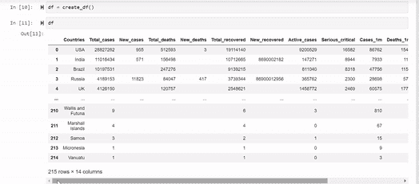
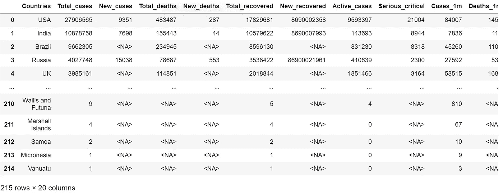

# 初学者友好的刮削与美丽的 Soup

> 原文：<https://medium.com/analytics-vidhya/beginner-friendly-scraping-with-beautifulsoup-8e0642cbf3ec?source=collection_archive---------28----------------------->

## 新冠肺炎数据的列表抓取—使用 worldometer 作为源

Web 抓取是数据科学最有趣的方面之一。能够对任何网站的数据进行自己的分析和预测使得这个领域更加令人兴奋！通过这个被称为网络搜集的过程从网站收集数据的范围是无限的。然而，这并不像在 word 文档中复制粘贴那么简单。但是多亏了 python 社区中的天才和大量的库，如 Scrapy、Selenium 和 BeautifulSoup，这个过程并不太乏味。在本文中，我们将探讨如何使用 BeautifulSoup 从 worldometer 中抓取新冠肺炎数据。


来源: [FoodieFactor](https://pixabay.com/users/foodiefactor-5992183/) ，via [pixabay](https://pixabay.com/) (Pixabay 许可)

在过去的一年里，新冠肺炎吸引了全世界的注意力。关于这种给世界带来巨大灾难的病毒，还有许多问题没有得到解答。因此，实际上任何一种分析都可以为我们自己和潜在的社会带来更好的理解和有用的见解。因此，我选择 worldometer 作为本指南的参考。

# 所以让我们开始吧！

让我们从导入必要的库开始。

```
import pandas as pd
import numpy as np
from bs4 import BeautifulSoup
import requests
import html
```

取表有两种方法，其中一种简单得多，并且只对少数人有效，但对我无效。 ***read_html()*** 方法用于直接从网站获取表格，不需要太多额外的工作。这对于维基百科的表格来说很容易。如果你的目标是转向分析，而不是把精力花在学习如何刮擦上，这是值得一试的。如果您想跳过前面的步骤并快速获取数据，请向下滚动到备选项 2。请注意，本文的目标是用 BeautifulSoup 探索传统的刮擦方式，我将它称为“替代方案 1”。

让我们首先将我们的网站保存到一个变量中，比如 url。

```
url = '[http://www.worldometers.info/coronavirus/'](http://www.worldometers.info/coronavirus/')
```

我们将通过使用请求礼貌地从 worldometer 获取 Html 内容。 ***请求*** 用于从网站获取原始数据。

```
r = requests.get(url)
```

## 备选方案 1

汤来了！使用下面的代码，我们将从保存在变量“r”中的响应中获取内容。***beautiful soup****简而言之，帮助分离有用的信息，如链接、文本、标题等。从 Html 标签，然后可以用于进一步的分析。 ***lxml*** 特性是用来解释 Html 代码的解析器。*

```
*soup = BeautifulSoup(r.text,'lxml')*
```

*如果你试着调用变量 soup，你会看到大量的信息。我们的目标是通过执行下面的代码，只从中获取相关的表格信息。*

```
*lst_crucial = [str(i) for i in list(soup.find_all('table')[0].find_all('td'))]*
```

*现在，我们这里有什么？上面的代码通过使用一个稍微复杂的列表理解，将我们的汤缩小到只包含数据帧所需的信息。可以尝试执行每个 **soup.find_all('table')** 然后**soup . find _ all(' table ')【0】**然后**(soup . find _ all(' table ')【0】。分别查找 _all('td')** 以准确了解我们在这里做了什么。*

***soup.find_all('table'):** 给出了网页上的所有表格，我们只关心第一个表格，这将我们带到*

***soup . find _ all(' table ')[0]:**现在我们已经获得了所需的与表相关的所有信息，我们可以进一步将范围缩小到数据。我们不需要关于表格的样式等信息。所以我们将做如下*

***(soup.find_all('table')[0]。find _ all(' TD '):**“TD”是表数据，这是我们从整个 soup 中需要的唯一信息。注意，使用这段代码消除了“tr”和“th”标签？*

*剩下的代码只是将相关数据的每个元素保存到一个我称之为“lst _ crucial”的列表中(因为这个列表构成了我们其余代码的基础)——以字符串的形式。当然，这也可以在 for 循环中完成，但是我发现列表理解更加有效和优雅。*

*好吧！我们已经得到了我们需要的，让我们把列表转换成表格吧！为此，让我们从导入 **re** 开始，然后创建一个空数据帧。 ***Re*** 是一个库，它使我们能够使用 regex 从字符串中找到必要的元素。*

```
*import re
df = pd.DataFrame()*
```

*现在让我们开始创建列，并将列表中的相关数据添加到每个列中。*

```
*df['Countries'] = [''.join([re.findall('>(.*?)<', lst_crucial[i-13:i+1][0])[1]]) for i,v in enumerate(lst_crucial) if 'world-population' in v]*
```

*事实上，另一个列表理解，我们将在每一栏中增加 12 个，但都与这个非常相似。上面的代码是做什么的？如果你观察我们的 lst _ crucial，你会注意到数据是一行一行写上去的，每一行都以国家的“总人口”结尾，每个国家都有一个以“世界人口”开头的 href 引用。我们的目标是通过提供此范围来导出列表中在此项目之前的 13 个项目，并包含此项目—**“I-13:I+1”**(“I”是第 13 个项目的索引，包含“世界人口”)。我们不希望我们的国家列列表的所有元素，而只是国家。于是有了**re . find all(>(。*?)<'，lst _ critical[I-13:I+1][0])[1]])**，我们实际上是在提取> <标签之间的所有元素，因为这是国家所在的位置，我们只从每行 13 个项目中的第一个项目进行提取，因此是 **[0]** ，从> <之间的三组 regex 元素中提取，我们想要第二组，即国家，因此是 **[1] 【T25***

*对于所有其他列，代码遵循类似的结构。下面的代码是为下一个专栏编写的。*

```
*df['Total_cases'] = [''.join([k for s in lst_crucial[i-13:i+1][1] for k in s if k.isdigit()]) for i,v in enumerate(lst_crucial) if 'world-population' in v]*
```

*在这段代码中，我们只是从组成一行的 13 个项目中的第二个项目中取出数字元素，因此是 **[1]** —回想一下，我们对 countries 列做了同样的事情，但是使用了[0]作为第一个元素。 ***。join*** “本质上是将每个数字连接成一个字符串，形成所需的数字。我们将继续对所有其他列进行同样的操作，因为它们都是数字。下面是最终的代码:*

*按作者嵌入*

**

*作者 GIF*

*瞧啊！我们从 worldometer 获得了今天的完整数据框架，准备进行进一步的分析。*

## *备选方案 2*

*除了上面的选择，我们可以尝试这个捷径，也许可行，也许不可行。我们将对之前保存在“ **r** ”中的 url 内容调用 pandas **read_html()** 方法。让我们将它保存为“dfs ”,因为内容中有多个数据帧。最后，调用 **dfs[0]** 给我们第一个表，这个表对我们来说是相关的。*

```
*r = requests.get(url)
dfs = pd.read_html(r.text, attrs = {'id':'main_table_countries_today'})
dfs[0]*
```

*以下是输出的一个片段。*

**

*作者照片*

*这就是目前的全部内容，请继续关注关于 covid 数据分析的另一篇文章*