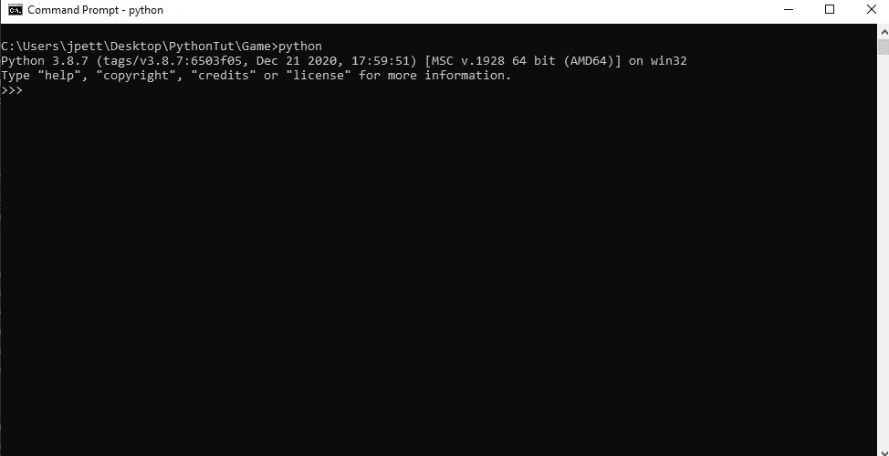

# Python 初学者教程:石头、布、剪刀

> 原文：<https://medium.com/analytics-vidhya/beginner-python-tutorial-rock-paper-scissors-9b693505394c?source=collection_archive---------16----------------------->

通过制作一个熟悉的游戏，快速学习编程概念。


[unsplash.com](https://unsplash.com/@nosoylasonia)@[胡安·戈麦斯](https://unsplash.com/)

Python 是世界上最流行的计算机编程语言之一。它被认为比 C++和 Java 等其他流行语言更容易学习。这是 Python 迅速成为初学计算机科学的学生的热门选择的原因之一。

在本课中，我们将通过创建一个简单的游戏来讲述使用 Python 的一些基础知识。每个人都知道布，石头，剪刀。

使用 Python，我们可以和电脑对战。在这个过程中，我们将介绍运行 Python 代码的一些基本特性。

## **设置**

如果你的电脑上还没有安装 Python 语言，你需要访问[python.org](https://www.python.org/)下载它。如果您在 Windows 机器上，一定要告诉安装向导将 Python 添加到您的环境变量 PATH 中(它会在安装过程中提示您这样做)。

Mac 和 Linux 用户可能需要升级到 Python 3 才能跟上，因为本课使用的是 Python 3 的最新版本。

通过打开命令提示符或终端并键入“python”，您将知道 Python 已安装:



您应该会看到一条消息，其中包含系统上安装的 Python 版本。

一旦安装，Python 可以直接从终端运行脚本。要运行 Python 文件，首先使用终端或命令提示符导航到包含该文件的文件夹，具体取决于您的操作系统。


找到包含该文件的目录后，键入“python ”,后跟您想要执行的文件的名称。(这里假设 Python 被[添加到环境变量路径](https://datatofish.com/add-python-to-windows-path/))。

**制作游戏**

对于这样的项目，我们需要两个主要元素:一个循环和用户输入。有了 Python，我们可以使用 while 循环来构造一个永无止境的游戏循环，用来控制游戏的流程。

在每次循环中，程序都会暂停，要求用户输入，然后评估输入的有效性。还需要有一种方法来摆脱循环，这样玩家就可以离开游戏。

这将是我们的 while 循环:

```
new_input = ""while new_input != 'quit':
    print("Please choose paper, rock, or scissors. Or type 'quit' to quit the game.")
    new_input = input("What is your choice?") player_choice = "scissors" is_valid = True if new_input == "paper":
        player_choice = "paper"
    elif new_input == "rock":
        player_choice = "rock"
    elif new_input == "scissors":
        # the choice is set to scissors by default
        pass
    else:
        print("That's not a valid choice.")
        is_valid = False # only do the game logic if the choice was valid
    if is_valid:
        pass
```

用户的输入存储为字符串，然后使用条件语句进行验证。如果输入无效，则跳过游戏逻辑。

为了完成这个游戏，我们需要一些游戏逻辑。首先，计算机需要轮流，每次随机选择。然后，我们必须将电脑的选择与玩家的选择进行匹配，并确定获胜者。

对于这些任务，我们需要两个函数，一个处理计算机的回合，另一个决定谁赢得了比赛。

为了让计算机做出选择，Python 需要访问随机库。将以下代码添加到程序文件的顶部。

```
import random
```

computer_turn()函数将从 0 到 2 之间选择一个随机整数，包括 0 和 2。然后，我们将每个数字与一个选项匹配，要么是“石头”、“布”，要么是“剪刀”

```
def computer_turn():
    r = random.randint(0,2) computer_choice = "scissors"
    if r == 0:
        computer_choice = "rock"
    elif r == 1:
        computer_choice = "paper" return computer_choice
```

一旦计算机做出选择，就可以通过比较字符串来确定获胜者。第二个函数 determine_winner()处理游戏逻辑的这一部分。

在这个练习中，我写下了电脑和玩家之间的每一个可能的场景。

```
def determine_winner(player_choice, computer_choice):
    if computer_choice == player_choice:
        print("It's a tie.") # computer victory scenarios.
    elif computer_choice == "rock" and player_choice == "scissors":
        print("Rock beats paper. Computer wins.")
    elif computer_choice == "paper" and player_choice == "rock":
        print("Paper beats rock. You lose.")
    elif computer_choice == "scissors" and player_choice == "paper":
        print("Scissors cuts paper. Computer wins.") # player victory scenarios
    elif computer_choice == "rock" and player_choice == "paper":
        print("Paper beats rock. You win!")
    elif computer_choice == "paper" and player_choice == "scissors":
        print("Scissors beats paper. You win.")
    elif computer_choice == "scissors" and player_choice == "rock":
        print("Rock crushes scissors. You win.")
```

最后，我们需要在 while 循环中调用 computer_turn()和 determine_winner()函数。有了这些电话，游戏就完成了。

游戏在终端中进行。


## **结论**

仅此而已。石头剪子布程序只有大约六十行代码。我在下面包含了完整的程序，但是如果你是 Python 编程的新手，我强烈建议你自己打出来。

感谢跟随。我希望你喜欢这篇教程，并且学到了一些关于 Python 和计算机编程的知识。如果您对本次练习有任何反馈或问题，请在下方评论。

```
import randomdef computer_turn():
    r = random.randint(0,2) computer_choice = "scissors"
    if r == 0:
        computer_choice = "rock"
    elif r == 1:
        computer_choice = "paper" return computer_choicedef determine_winner(player_choice, computer_choice):
    if computer_choice == player_choice:
        print("It's a tie.") # computer victory scenarios.
    elif computer_choice == "rock" and player_choice == "scissors":
        print("Rock beats paper. Computer wins.")
    elif computer_choice == "paper" and player_choice == "rock":
        print("Paper beats rock. You lose.")
    elif computer_choice == "scissors" and player_choice == "paper":
        print("Scissors cuts paper. Computer wins.") # player victory scenarios
    elif computer_choice == "rock" and player_choice == "paper":
        print("Paper beats rock. You win!")
    elif computer_choice == "paper" and player_choice == "scissors":
        print("Scissors beats paper. You win.")
    elif computer_choice == "scissors" and player_choice == "rock":
        print("Rock crushes scissors. You win.")new_input = ""while new_input != 'quit':
    print("Please choose paper, rock, or scissors. Or type 'quit' to quit the game.")
    new_input = input("What is your choice?") player_choice = "scissors" is_valid = True if new_input == "paper":
        player_choice = "paper"
    elif new_input == "rock":
        player_choice = "rock"
    elif new_input == "scissors":
        # the choice is set to scissors by default
        pass
    else:
        print("That's not a valid choice.")
        is_valid = False # only do the game logic if the choice was valid
    if is_valid: print("You chose {}.".format(player_choice))
        computer_choice = computer_turn() print("Computer chose {}.".format(computer_choice)) determine_winner(player_choice, computer_choice)
        print("\n")
```

如果你喜欢我的作品，并愿意支持我和媒体上的其他作家，使用[这个链接](https://harold-j-petty.medium.com/membership)成为会员。你的会员费直接支持我和你看的其他作家。你也可以在媒体上看到所有的故事。