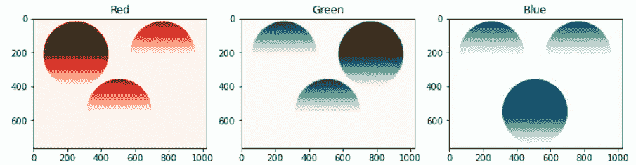
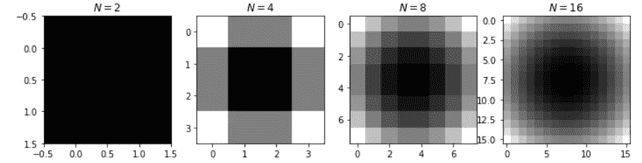

# Python 图像初学者指南

> 原文：<https://medium.com/analytics-vidhya/beginners-guide-for-images-in-python-9a8b07bfb0a5?source=collection_archive---------27----------------------->


在 [Unsplash](https://unsplash.com?utm_source=medium&utm_medium=referral) 上由 [russn_fckr](https://unsplash.com/@russn_fckr?utm_source=medium&utm_medium=referral) 拍摄的照片

Python 是目前最流行的编程语言，而 images 是 web 中最常见的数据类型之一。在我的图像处理导论选修课教授 Benjur Emmanuel Borja 的帮助下，我探索了如何使用 Python 在计算机中表示图像。

首先，对于这个博客，我们将使用 numpy 和 scikit-image 来处理 Python 中的图像。还有其他像 OpenCV (cv2)这样的库，它在图像处理方面非常流行。我们还将使用 matplotlib 进行绘图。

```
import numpy as np
from skimage.io import imshow, imread
```

**数字图像只是用代表特定像素强度的数字矩阵来表示**。在这种情况下，图像的范围从 0 到 255(最暗到最亮)，但是在一些图像表示中，强度值的范围从 0 到 1。为了简单起见，让我们只有一个通道，这意味着我们只有强度值，因此你可以在下面看到我们的图像是灰度。

```
array = np.array([[0, 70], 
                 [200, 255]])
print("Matrix Representation:")
print(array)plt.imshow(array, cmap='gray')
plt.title("Image Representation of Array");
```


矩阵表示与图像表示

## 色彩空间

彩色图像怎么样？那么，让我们加载一个图像文件，并展示它们是如何表示的。您可以在 [RGB 样本图像—粘贴板上的图像](https://pasteboard.co/JLwVzey.png)下载该图像。

```
rgb = imread('rgb.png')
imshow(rgb);
```


样本 RGB 图像

上面的示例图像有三个矩阵堆叠在一起。这些矩阵中的一个表示一个特定通道中的强度值。在这种情况下，对于该图像，每个矩阵分别表示红色、绿色和蓝色通道，如下所示。

```
fig, ax = plt.subplots(1, 3, figsize=(12,4))
ax[0].imshow(rgb[:,:,0], cmap='Reds')
ax[0].set_title('Red')
ax[1].imshow(rgb[:,:,1], cmap='Greens')
ax[1].set_title('Green')
ax[2].imshow(rgb[:,:,2], cmap='Blues')
ax[2].set_title('Blue');
```



样本图像的 RGB 通道

RGB 被称为**颜色空间**。图像中的色彩空间表示每个通道将如何表示图像的哪个属性。还有另一种颜色空间，称为 HSV 或色调、饱和度和值。让我们把上面的图像转换成它的 HSV 表示。

```
from skimage.color import rgb2hsv
rgb_hsv = rgb2hsv(rgb)
```

那么下面我们来看看 HSV 的各个渠道。**注意:我们将其他频道减半，只关注下面的其他频道。**

```
fig, ax = plt.subplots(1, 3, figsize=(12,4))
rgb_hsv = rgb2hsv(rgb)
rgb_hsv[:,:,1] = 0.5
rgb_hsv[:,:,2] = 0.5
ax[0].imshow(rgb_hsv, cmap='hsv')
ax[0].set_title('Hue')rgb_hsv = rgb2hsv(rgb)
rgb_hsv[:,:,0] = 0.5
rgb_hsv[:,:,2] = 0.5
ax[1].imshow(rgb_hsv, cmap='hsv')
ax[1].set_title('Saturation')rgb_hsv = rgb2hsv(rgb)
rgb_hsv[:,:,0] = 0.5
rgb_hsv[:,:,1] = 0.5
ax[2].imshow(rgb_hsv, cmap='hsv')
ax[2].set_title('Value');
```


样本图像的 HSV 通道

您可以使用代码轻松转换图像的 HSV 表示

```
from skimage.color import hsv2rgb
rgb = hsv2rgb(rgb_hsv)
```

为什么要改变图像的色彩空间表示？有时，在一个或另一个颜色空间中操作它们更容易。例如，在 HSV 中，很容易获得它们的值来查看图像中的明亮区域。

## **图像类型**

上面，我们展示了不同种类的色彩空间。现在，让我们看看不同类型的图像。有时候，你只想得到一个通道作为图像的强度。这就是为什么下面，我们得到了图像的灰度版本。

```
from skimage.color import rgb2gray
rgb_gray = rgb2gray(rgb)
imshow(rgb_gray);
```


样本图像的灰度

让我们确认一下灰度图像和 RGB 图像中有多少通道。

```
print("RGB Number of Channels:", rgb.shape[2])
print("Grayscale Number of Channels:", rgb.shape[2])
```


我们还可以通过设置阈值将灰度图像转换为二进制或单色图像，阈值以下的所有图像都是黑色(值为 0)，以上的所有图像都是白色(值为 1.0 或 255)。

```
from skimage import img_as_uint
# for this demo, set threshold to average value
rgb_binary = img_as_uint(rgb_gray > rgb_gray.mean())
imshow(rgb_binary);
```


样本的二进制图像

## **采样**

现在我们来谈谈图像的分辨率。采样包括以规则的空间间隔获取图像的值或强度。基本上就分辨率而言，我们想知道我们希望纵向或横向有多少像素。例如下面，让我们说 **N** 为图像每边的像素数。让我们看看不同数量的 **N** 或**的不同分辨率将如何表示一个圆的图像。**

```
def circle_image(x, y):
    X, Y = np.meshgrid(x, y)
    return X**2 + Y**2Ns = 2**np.arange(1, 5)
fig, ax = plt.subplots(1, len(Ns), figsize=(12, 4))
for i, N in enumerate(Ns):
    image = circle_image(np.linspace(-1, 1, num=N), np.linspace(-1, 1, num=N))
    ax[i].imshow(image,cmap='gray')
    ax[i].set_title(r'$N = %d$' % N)
```



具有不同采样间隔的圆

## 量化

现在，让我们来讨论图像可以表现多少种颜色。正如我们之前所说，图像颜色强度可以从 0 到 255 来表示。对于一个简单的 8 位图像，假设 2⁸ = 256，从 0 到 255(包括 0)有 256 个值。但是仍然可能有不同的量化或**位深度。**结果如下。比特数为 **k** 表示有多少个值代表一个通道的不同强度。下面，你可以看到，当 **k=2** 时，只有两个颜色值，因此图像不是彩色的。二进制图像就是这种情况。对于彩色 8 位图像，量化或 **k** 将等于 256。

```
def circle_image(x, y):
    X, Y = np.meshgrid(x, y)
    return X**2 + Y**2ks = 2**np.arange(1, 5)
circ_image = circle_image(np.linspace(0, 1, num=4), 
                          np.linspace(0, 1, num=4))
fig, ax = plt.subplots(1, len(ks), figsize=(12, 4))
for i, k in enumerate(ks):
    bins = np.linspace(0, circ_image.max(), k)
    image = np.digitize(circ_image, bins)
    image = np.vectorize(bins.tolist().__getitem__)(image-1)
    ax[i].imshow(image)
    ax[i].set_title(r'$k = %d$' % k)
```


具有不同量化间隔的圆

## 结论

正如我们已经展示的，图像是如何基于它的颜色空间、分辨率和量化来表现的。我们还了解了如何使用 scikit-image 在 Python 中加载图像和修改图像。