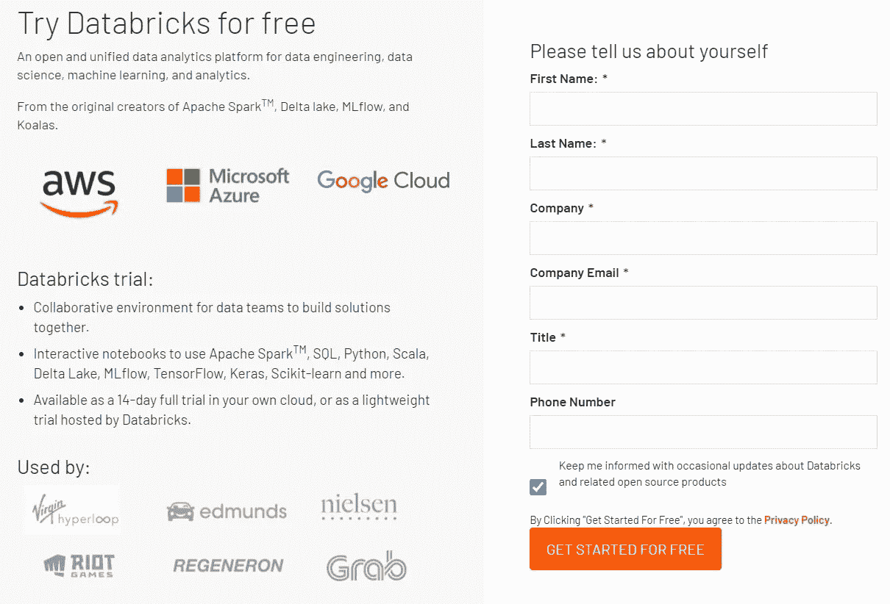
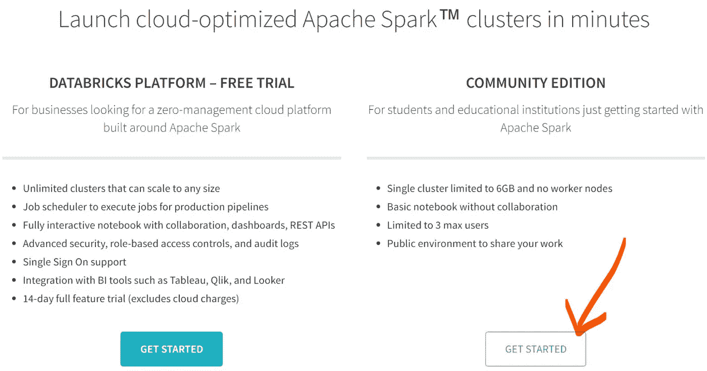
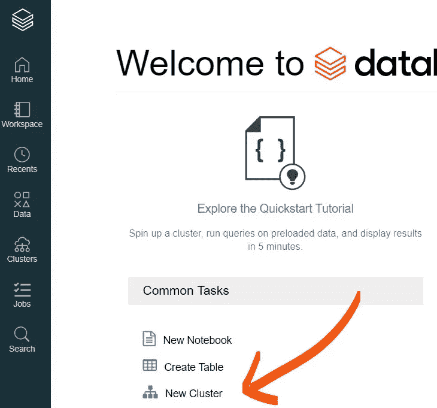
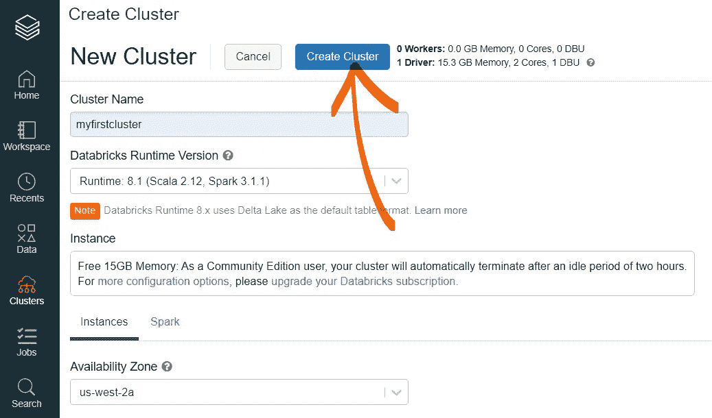
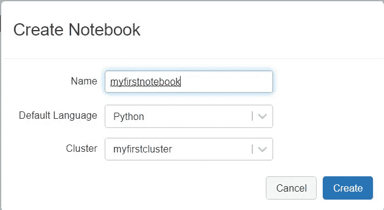
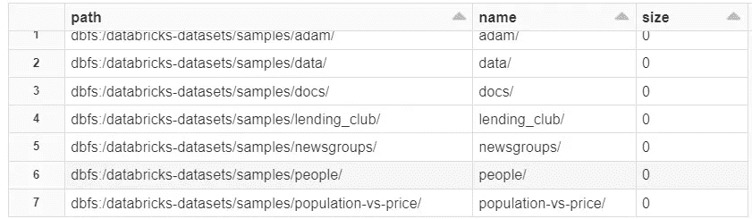
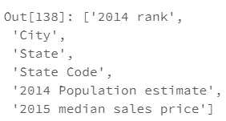
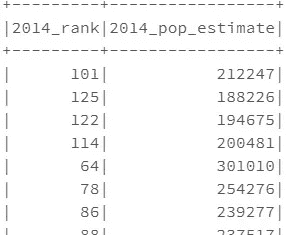
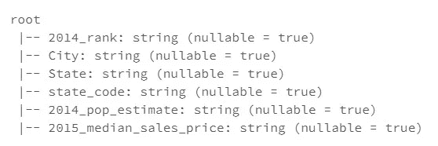
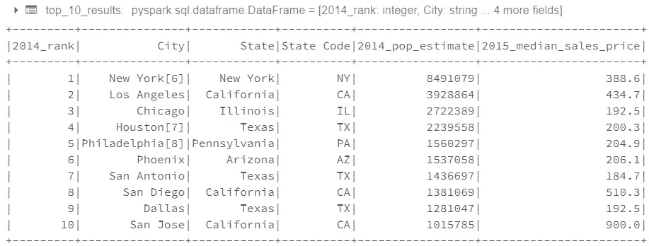

# Databricks 初学者指南:使用 Python 和 PySpark 的 Spark

> 原文：<https://medium.com/analytics-vidhya/beginners-guide-on-databricks-spark-using-python-pyspark-de74d92e4885?source=collection_archive---------0----------------------->


在这篇博客中，我们将回顾 Apache Spark 和 Databricks 的一般概念，它们之间的关系，以及如何使用这些工具来分析和模拟大数据。

# 什么是火花？


[**Apache Spark**](https://spark.apache.org/) 是一个开源的分布式通用集群计算框架。如果将所有数据放在 RAM 上没有意义，并且将所有数据放在本地机器上也没有意义，那么您应该使用 Spark。从高层次来说，它是一个用于大数据处理的统一分析引擎，内置了用于流、SQL、机器学习和图形处理的模块。Spark 是用于快速轻松处理大数据的最新技术之一，可以与 Scala、Python 和 r 等语言外壳进行交互。

# 什么是数据块？


[**Databricks**](https://databricks.com/) 是一款行业领先的基于云的数据工程工具，用于处理、探索和转换大数据，并将数据用于机器学习模型。它是一个工具，提供了一种快速简单的方法来设置和使用集群来分析和模拟大数据。简而言之，这个平台将允许我们使用 py Spark(Apache Spark 和 Python 的合作)来处理大数据。我们将在这个博客中使用的版本将是社区版(完全免费使用)。事不宜迟…

# 我们开始吧！

1.  使用 Databricks 我们必须做的第一步是:创建一个帐户。您可以访问[https://databricks.com/try-databricks](https://databricks.com/try-databricks)，或者点击[此链接](https://databricks.com/try-databricks)创建一个帐户——如果您已经有了一个帐户，那么可以跳过这一步！



创建帐户

一旦您输入了您的信息，它将要求您选择您想要使用的 Databricks 版本以及电子邮件地址验证。我强烈推荐使用社区版，因为 Databricks 社区版是免费的。您无需为平台付费，也不会产生 AWS 成本。



免费试用与社区版选择

一旦我们成功创建了一个帐户并选择了平台的首选版本，下一步就是创建一个集群。

# 创建集群

Databricks 集群是一组计算资源和配置，您可以在其上运行数据工程、数据科学和数据分析工作负载，如生产 ETL 管道、流分析、即席分析和机器学习。

要创建我们的第一个集群，请单击“新建集群”按钮:



常见任务列表下的“新集群”选项

这将把我们带到一个新的页面，在这里我们定义新的集群。您可以随意命名这个集群，我将把这个新集群命名为“myfirstcluster”。我将保留其余选项，并单击“create cluster”按钮:



定义和创建我们的集群

请注意，创建集群可能需要几秒钟的时间，因此请耐心等待。如果集群实例化失败，您可以尝试在下面的选项中更改可用性区域。如果您使用的是 Community Edition，群集将在 120 分钟不活动后终止，并且一旦终止，您将无法重新启动群集。避免这个问题的一个方法是每次创建一个终止集群的克隆，或者您也可以创建一个新的集群。在我看来，为 Databricks 的免费版付出的代价很小。

# 创建新笔记本

一旦我们的集群启动并运行，我们现在就可以创建一个新的笔记本了！只需点击左上方的数据块图标，然后点击“常见任务”列表下方的“新笔记本”:


要实例化笔记本，我们需要做的就是给它起一个名字(我给我的名字是“myfirstnotebook”)，选择语言(我选择 Python)，然后选择我们创建的活动集群。现在，我们需要做的就是点击“创建”按钮:



创建新笔记本

# 选择样本数据集

现在，我们的笔记本已经创建并成功连接到我们的集群，我们终于可以开始玩了！在这个笔记本中，我们要做的第一件事是导入必要的库。所以让我们从导入 PySpark 开始:

```
import pyspark
from pyspark.sql.functions import col
from pyspark.sql.types import IntegerType, FloatType
```

对于本笔记本，我们不会将任何数据集上传到笔记本中。相反，我们将选择一个 Databricks 提供给我们的样本数据集进行研究。我们可以通过键入以下内容来查看不同的样本数据集:

```
# A list of folders containing sample datasets we can use
display(dbutils.fs.ls(“/databricks-datasets/samples/")
```



数据块提供了一个样本数据集列表

# 探索数据

在这篇博客中，我们将在“人口与价格/”样本数据集中做一些基本的探索。因此，让我们继续定义一个名为“df”的变量，它将引用我们笔记本中的数据帧。

```
# Loading in a sample table into the dataframe
df = spark.read.csv(“/databricks-datasets/samples/population-vs-price/data_geo.csv”, header=True)
```

我们将调用 df.show()来查看 dataframe，而不是调用 df.head()来查看前 5 行。默认情况下。show()方法显示数据帧的前 20 行。

```
# To view the first 20 rows of the df
df.show()# OR we can add an integer into the parentheses to view a specific 
# number of rows
df.show(5)
```

要查看数据帧中的列名，我们可以调用“*df . columns*”—这将返回数据帧中的列名列表:

```
# Viewing the column names
df.columns
```



列名的列表

请注意，许多列名包含空格；如果我们想要实现 SQL 来从这个数据帧创建查询，这对于我们来说并不理想。要更改列名，我们可以实现*。withColumnRenamed()* "方法:

```
df.withColumnRenamed(‘2014 rank’, ‘2014_rank’)
```

请注意，我们必须创建一个新变量(df2)来在新的数据帧中保存这些更改。如果我们只是简单地“ *df.withColumnRenamed…* ”,(就像我们上面做的那样)这将只是一个暂时的改变——没有“ *inplace=True* ”参数。我们还可以为我们想要更改的每个列名一次链接所有这些:

```
df2 = df.withColumnRenamed(‘2014 rank’, ‘2014_rank’)\
.withColumnRenamed(‘State Code’, ‘state_code’)\
.withColumnRenamed(‘2014 Population estimate’, ‘2014_pop_estimate’)\
.withColumnRenamed(‘2015 median sales price’, ‘2015_median_sales_price’)
```

太好了！如果我们想在 df2 中查看选定的列，我们可以说:

```
df2.select([‘2014_rank’, ‘2014_pop_estimate’]).show()
```



这将只显示所选列的前 20 行的值。现在让我们来看看每一列中值的类型。我们可以这样做的一个方法是使用“T4”。printSchema() "在我们的 df2 变量上。

```
# Printing out the schema of the dataframe
df2.printSchema()
```



查看 df2 的模式

哦，不，我们注意到我们所有的列都包含字符串值——甚至是应该包含数值的列！我们可以手动调整列中值的类型，这有点类似于我们处理调整列名的方式:使用"*。withColumn()* 方法并在“*上链接。*“法投()”。在我们一次在多个列上开始之前，让我们分解一个例子:

```
df2.withColumn(“2014_rank”, col(“2014_rank”).cast(IntegerType()))
```

**在上面的例子中，我们说:**

*   使用此选定列:“2014_rank”
*   创建一个名为“2014_rank”的新列(替换旧列)
*   这个新列将包含旧列的值，但是我们将把它们重新转换为整数类型

就像我们以前使用的方法一样。withColumnRenamed”，除非我们创建一个新变量来保存更改后的数据帧，否则更改只是暂时的。就像前面的方法一样，我们可以一次链接多个列(在下面的代码块中看起来有点乱):

```
df3 = df2.withColumn(“2014_rank”,col(“2014_rank”).cast(IntegerType()))\
 .withColumn(“2014_pop_estimate”, col(“2014_pop_estimate”).cast(IntegerType()))\
 .withColumn(‘2015_median_sales_price’, col(‘2015_median_sales_price’).cast(FloatType()))
```

# 使用 SQL 语法

在我们结束本教程之前，让我们最后在我们的数据帧上运行一些 SQL 查询！为了让 SQL 正常工作，我们需要确保 df3 有一个表名。为此，我们简单地说:

```
# Giving our df3 the table name 'pop_price'
df3.createOrReplaceTempView(‘pop_price’)
```

现在我们终于可以运行 SQL 查询了！在 PySpark 中运行 SQL 查询非常简单。让我们运行一个基本查询来看看它是如何工作的:

```
# Viewing the top 10 cities based on the '2014_rank' column
top_10_results = spark.sql("""SELECT * FROM pop_price 
                              WHERE 2014_rank <= 10
                              SORT BY 2014_rank ASC""")top_10_results.show()
```



2014 年十大排名

当我们使用" *spark.sql()* "从数据帧中查询时，它会在查询条件内返回一个新的数据帧。我们只需保存查询的结果，然后使用“*查看这些结果。*显示()"方法。如果你想看我写这篇博客用的笔记本，你可以点击下面的链接(从这篇文章发表之日起 6 个月内有效):

 [## myfirstnotebook -数据块

databricks-prod-cloudfront.cloud.databricks.com](https://databricks-prod-cloudfront.cloud.databricks.com/public/4027ec902e239c93eaaa8714f173bcfc/2970399034525015/114269276412404/3853367662178032/latest.html) 

感谢您的阅读——如果您对设置有任何疑问，请随时联系我！