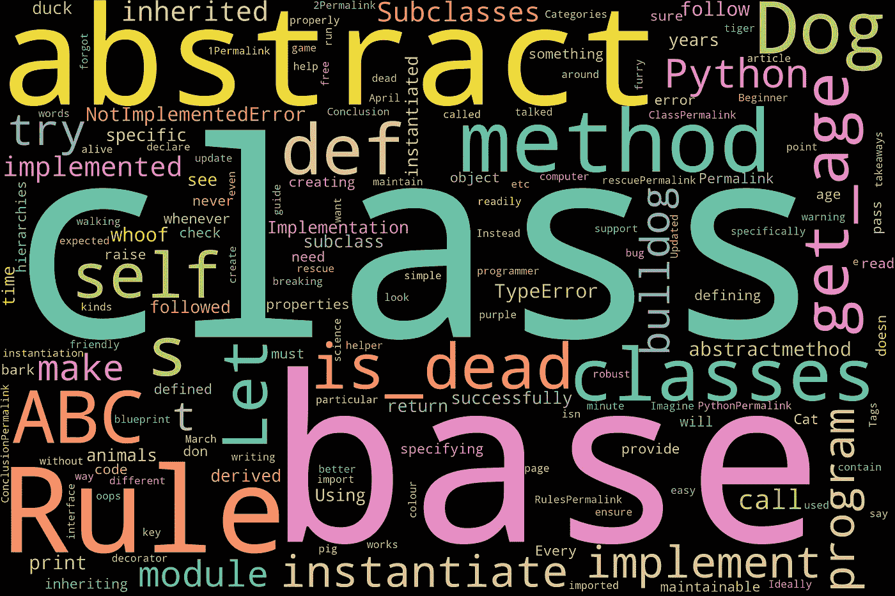

# Python 抽象基类入门指南

> 原文：<https://medium.com/analytics-vidhya/beginners-guide-to-abstract-base-class-in-python-d256e535016f?source=collection_archive---------11----------------------->



# 介绍

在本文中，您将了解 Python 中抽象基类的好处，以及如何在 Python 的内置`abc`模块中使用它们

# 什么是抽象基类？

简而言之，抽象基类为其他类提供了蓝图。抽象基类不包含实现。相反，它们提供一个接口并确保派生类被正确实现。

# 为什么我们需要抽象基类？

想象你正在创建一个游戏，在这个游戏中你有不同的动物。为了定义动物，你可以有一个叫做`Animal`的基类。狗/猫/鸭都是从基类`Animal`派生出来的类。

# 动物基础类

```
class Animal:
    def get_age():
        ## return age of the animal

    def is_dead():
        ## return the colour of the animal
```

*   每种动物都有这两种方法。因此，每当我们从`Animal`类继承一个动物(狗/猫等)类时，我们希望每个动物都实现这些方法。我们不能让动物不支持这些方法。[第一条规则]
*   每当我们看到一种动物，我们就叫它狗/猫/鸭/老虎。这些都是各种**动物**。也就是说，你永远不会看着紫色毛茸茸的东西说“那是一种动物，没有更具体的方式来定义它”。关键是，你永远看不到一种动物四处走动，它不是更具体的其他东西(鸭子、猪等)。)[第二条规则]

# 规则

通过使用这两条规则，我们可以使我们的代码更易维护，对程序员更友好

# 规则 1

从特定基类继承的子类必须实现抽象基类中定义的所有方法和属性。

# 规则 2

抽象基类不能被实例化。它们由其他子类继承。

# 用 Python 实现

让我们试着用 Python 实现这些动物类，使用我们讨论过的规则。

在上面的程序中，我们创建了一个从`Animal`类继承所有方法的`Dog`类。让我们看看规则 1 是否被遵守。概括一下:

**规则 1:从特定基类继承的子类必须实现抽象基类中定义的所有方法和属性。**

让我们创建一个`Dog`类的对象

```
bulldog = Dog()

bulldog.get_age() # 5 years

bulldog.is_dead() # NotImplementedError
```

子类`Dog`没有实现基类`Animal`的`is_dead`方法，当我们试图从 bulldog 对象调用这个方法时，我们得到一个异常。所以这和预期的一样。**但是如果我们不调用这个方法，甚至没有违反这个规则的警告，我们可以成功地运行程序**。理想情况下，基类的所有方法都应该由子类实现。

**以上程序不遵循规则 1。**

**规则 2:抽象基类不能实例化。它们由其他子类继承。让我们检查是否遵循了规则 2。**

让我们试着实例化基类。

```
animal = Animal()
animal.get_age() # NotImplementedError
```

如果我们试图调用基类的方法，就会得到错误。但是，我们可以实例化基类。**所以，上面的程序不遵循规则 2**

# `abc`救援模块

有了 Python 的`abc`模块，我们可以做得更好，并确保两个规则都得到遵守。让我们更新上面的程序

在上面的程序中，我们从模块`abc`中导入了助手类`ABC`，通过它我们实现了基类。此外，我们对基类中的所有方法都使用了装饰器`@abstractmethod`。

让我们试着实例化我们的子类:`Dog`

```
bulldog = Dog()TypeError: Can't instantiate abstract class Dog with abstract methods is_dead
```

这一次我们得到一个`TypeError`,指定抽象方法没有被实现。

**这成功地遵循了规则 1。**

让我们试着实例化我们的基类:`Animal`

```
animal = Animal()TypeError: Can't instantiate abstract class Animal with abstract methods get_age, is_dead
```

这一次我们得到了一个`TypeError`,指定抽象类不能被实例化。

**这成功地遵循了规则 2。**

# 结论

在您的代码中使用 ABC 将使您的类层次结构更健壮，更易于维护。本文中的一些要点是:

*   抽象 e 类(ABCs)确保派生类在实例化时实现基类的特定方法。
*   使用 ABC 有助于编写易于阅读和维护的无错误的类层次结构。

*原载于 2021 年 3 月 24 日 https://dollardhingra.com**的* [*。*](https://dollardhingra.com/blog/python-abstract-base-class/)