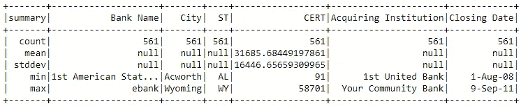
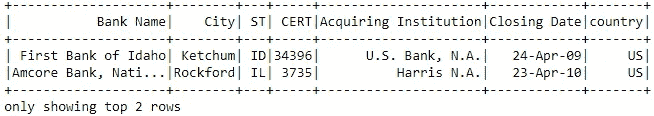
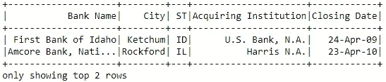

# Apache Spark 数据分析初学者指南—第 2 部分

> 原文：<https://medium.com/analytics-vidhya/beginners-guide-to-apache-spark-for-data-analytics-part-2-f0cf7307fa49?source=collection_archive---------14----------------------->

## 学习数据分析中使用的 spark 函数的基本语法

在前面的章节中，我们看到了创建数据帧的不同方法。如果没有，请参考下面的链接。本文包含关于 a)初始化 spark & b)在 spark 中创建数据帧的 [python 笔记本](/@akash865/learn-basics-in-spark-for-data-analytics-11cee514ac30)

[](/@akash865/learn-basics-in-spark-for-data-analytics-11cee514ac30) [## Apache Spark 数据分析初学者指南—第 1 部分

### 学习数据分析中常用的基本 spark 语法

medium.com](/@akash865/learn-basics-in-spark-for-data-analytics-11cee514ac30) 

既然我们已经创建了包含我们的数据的数据框架，那么是时候看看在分析中经常使用的数据操作了。

> 我们将研究不同的方法和函数来`select`特定的字段/列、`drop, rename`和其他类似的表达式。我们将研究对“剪切和切片”使用过滤操作。


在我们开始这一部分之前，让我们从导入现有数据开始。然后我们将使用一些基本的函数/语法。这些数据已经在 github 上共享了，所以您可以使用相同的数据继续。


以上导入时的输出

## 在 spark 中使用 SQL

SQL 是 RDD 表数据操作最常用的语言。虽然 spark 提供了我们在 SQL 中使用的几乎所有函数，但由于 SQL 的熟悉性，它通常更容易使用。请注意，最好避免在列名中使用空格(在下面的例子中)。我们还将学习 spark 函数/方法，这将有助于我们的工作。我们可以从模式细节开始。


## 1.描述数据框架

Describe 是一个在所有列上执行`count`、`mean`、`stddev`、`min`和`max`的有用方法。我们可以通过在`describe`中传递列名来限制变量。

```
df.describe().show()
```



```
df.describe('City', 'ST').show()
```


## 2.计数、列和模式

在进行数据处理之前，必须查看`counts`、`columns`和`data types`。这在下面很容易做到。我们可以使用`dtypes`查看字符串和数字列。

```
print('df.count		:', df.count())
print('df.columns	:', df.columns)
print('df dtypes	:', df.dtypes)
print('df schema 1:', df.schema)
```


```
print('df schema 1:')
df.printSchema()
```


## 3.删除重复项

当处理来自其他来源的数据时，通常需要在进一步处理之前清理它们。`dropDuplicates`删除重复行的所有实例。请注意,“完整的”重复行被删除，并且不考虑重复 id。删除重复 id 需要使用`window`函数，我们将在后面介绍。该数据帧没有副本，因此新的数据帧具有相同的计数。


## 4.选择特定列

可以使用`select`语句将特定的列存储在 dataframe 中。它接受 list 作为特定列/字段列表的参数。


## 5.选择多列

如果我们有一个需要删除的列列表，或者我们可以从 dataframe 中删除多个列。因此，我们使用 python 中的列表操作来获取变量列表子集。然后使用`select`方法创建一个具有特定列的 dataframe。


## 6.重命名列

我们将在下面的例子中重命名多个列。我发现在字段名中看到空格很烦人。所以让我们从使用`withColumnRenamed`移除列中的空格开始。第一个参数是现有列，第二个参数是新列名。


## 7.使用循环重命名列

对于重命名多个列，我们可以使用循环来帮助我们执行类似的操作，如大小写改变、替换字符。在下面的例子中，我们用`_`替换所有的空格。


## 8.添加列

在下面的例子中，我们将使用`col`函数复制列状态。PySpark SQL 库包含许多函数，我们将通过。注意`col`就是这样一个返回列值的函数。

```
df2 = df.withColumn('state', col('ST'))
df2.show(2)
```


## 9.添加常量列

如果我们想添加一个具有相同值的列。假设在这种情况下，我们想要添加 country—‘US’作为新列。`lit`帮助我们将该值“线性转换”到数据帧中的所有行。

```
df2 = df.withColumn('country', lit('US'))
df2.show(2)
```



## 10.删除列

除了选择特定的列，我们还可以选择分析不需要的`drop`列。

```
df2 = df.drop('CERT')
df2.show(2)
```



## 11.删除多列

与`select`一样，删除 multipl 列也很简单。我们所要做的就是传递一个列列表，使用`*`来移除。下面有两种方法可以做到这一点。

```
df2 = df.drop(*['CERT','ST'])
df2.show(2)
```


```
df2 = reduce(DataFrame.drop, ['CERT','ST'], df)
df2.show(2)
```

## 12.过滤数据

在查看数据表时，我们需要“切割和切片”来获得洞察力。下面是使用`>`、`<`、`==`、`between`和`isin`过滤数据的例子


```
*# Equal to values*
df2 = df.where(df['ST'] == 'NE')

print('**\n**df2 sample below')
df2.show(2)
```


## 13.使用逻辑运算符过滤数据

如果我们需要使用多个条件进行过滤，我们可以使用逻辑运算符。请注意这里的逻辑运算符，`AND` : `&`，`OR` : `|`，`NOT` : `!`。在给定的数据框架中，我们在“东北”州和“埃里克森”市只有一家倒闭银行。

```
df2 = df.where((df['ST'] == 'NE') & (df['City'] == 'Ericson'))
df2.show(3)
```


## 14.强制转换数据类型

通常我们需要改变特定变量的数据类型。当我们使用文本文件创建数据帧时，由于数据中的一些错误/缺失，可能会出现数据类型不匹配的情况。我们可以根据需要将其转换为不同的数据类型。我们稍后将处理日期类型。请注意下面将数据类型转换为字符串的两种方法。我们也可以在转换后的变量中使用相同的变量名。


## 15.联合

`Coalesce`是我在学习 SQL 之后开始频繁使用的一个词。在某些情况下，我们需要用一个常数或者同一数据中的另一列来替换一些包含空值的列。我们可以使用`CASE`语句来优先替换空值，或者使用`coalesce`派上用场。


## 16.替换数据帧中的值

替换数据帧中的所有值


## 17.排序值

数据帧中的排序


这部分就这些了。我将上传另一节关于日期格式，串联，跨表和空值处理。请留下您的评论/反馈。

下面是包含完整笔记本的 colab 笔记本和 github 资源库的链接。

[](https://github.com/akash865/spark_101/blob/master/Spark_101_DataManipulation.ipynb) [## akash865/spark_101

### 火花基本代码。在 GitHub 上创建一个帐户，为 akash865/spark_101 开发做出贡献。

github.com](https://github.com/akash865/spark_101/blob/master/Spark_101_DataManipulation.ipynb) [](https://colab.research.google.com/drive/1yJof33vdHqzFejqX_e8_gm0jRw-sfk6j?usp=sharing) [## 谷歌联合实验室

### 编辑描述

colab.research.google.com](https://colab.research.google.com/drive/1yJof33vdHqzFejqX_e8_gm0jRw-sfk6j?usp=sharing) 

## 参考资料:

1.  Spark SQL 函数库[[https://spark . Apache . org/docs/latest/API/Java/org/Apache/spark/SQL/functions . html](https://spark.apache.org/docs/latest/api/java/org/apache/spark/sql/functions.html)