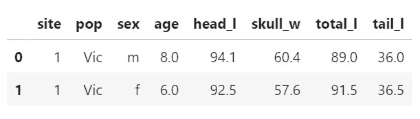

# K-最近邻和管道分类初学者指南

> 原文：<https://medium.com/analytics-vidhya/beginners-guide-to-k-nearest-neighbors-pipelines-in-classification-704b87f534e2?source=collection_archive---------4----------------------->


pixabay.com 免费提供商业用途。

**K-最近邻(KNN)** 是一种基本的机器学习算法，用于分类和回归问题。KNN 是机器学习的监督学习领域的一部分，它努力寻找模式，以根据已知的基本事实准确地将输入映射到输出。KNN 是一种非参数算法，这意味着我们不对数据的分布做出假设。这种假设的一个例子，在线性回归算法中经常见到，是假设我们的数据的分布近似正态。继续，因为我今天已经达到了说“假设”这个词的限额。

K-最近邻算法使用距离度量来尝试分离空间中的观察聚类。这些独立的集群根据它们携带的特征被分类为不同的组。

KNN 通常使用**欧几里德**或**曼哈顿**距离作为距离度量，但也使用其他距离度量(例如**闵可夫斯基**)。如果你还记得**勾股定理**，用来计算两点间距离的定理，这是实际用来计算欧几里德距离的方程！啊啊，高中几何来了个满圈。

让我们将所有这些概念应用到一个实际的数据集 possum.csv 中。我从 openintro.org 的以下链接中获得了这个数据集:[https://www.openintro.org/data/index.php?data=possum](https://www.openintro.org/data/index.php?data=possum.)。

在这个数据集中，我们给出了澳大利亚两个不同的山刷尾负鼠( *Trichosurus cunninghami* )种群的 7 个特征。我要问你的问题是:我们能使用物理特征和 K-最近邻算法准确地分类一只山刷尾负鼠是来自维多利亚种群还是新南威尔士/昆士兰种群吗？让我们来了解一下！

在阅读了。csv 文件到我们的 jupyter 笔记本我们准备开始编码我们的 KNN 模型！这里是我们正在处理的数据的快速浏览。



possum.csv 数据帧的前两行

如您所见，我们有几个栏目/功能:

*   **地点** —捕获负鼠的地点编号。
*   **pop** —人口，维克(维多利亚)或其他(新南威尔士州或昆士兰州)。目标特征！
*   **性别** —性别，m(男)或 f(女)。
*   **年龄** —年龄。包含 2 个空值。
*   **头部 _l** —头部长度，单位为毫米
*   **skull_w** —颅骨宽度，单位为毫米
*   **总长度** —总长度，单位为厘米。
*   **tail_l** —尾部长度，单位为厘米。

我们想把我们的负鼠分为来自维多利亚种群或“其他”(新南威尔士或昆士兰)种群。因此，pop 列将是我们的目标变量，而其他特征(除了站点)将是我们的预测变量。在这种情况下，由于我们试图仅根据形态差异对两个负鼠种群进行分类，我们不希望在模型中使用捕获负鼠的位置。因此，在设置 X(预测变量)对象时，我们将删除 site 和 pop 列。y 对象是我们的目标变量，它由 pop 列的两个类(Victoria 和‘other’)组成。

```
#set up the X and y variables for modeling
X = possum.drop(columns=['pop','site'])
y = possum['pop']
```

设置好 X 和 y 变量后，我们将对数据进行训练/测试分割。训练/测试分割将为我们提供一个用于模型创建的训练集，以及一个用于对我们的模型进行评分的维持集或测试集。

```
#by default 75% of the observations will be in the training set
#by default 25% of the observations will be in the testing set
X_train, X_test, y_train, y_test = train_test_split(X,y)
```

接下来，我们希望转换我们的训练数据，以便为建模做好准备。我们想要使用的转换器是 **OneHotEncoding** 分类变量、**simple inputing**任何空值，以及 **StandardScaling** 。使用 K-最近邻算法时，对数据进行标准缩放非常重要，因为您正在使用距离度量进行建模。如果某个特征的比例比其他特征大，那么在建模时，它将决定该特征的重要性。因此，您希望所有预测要素都具有相同的数值比例。

因为我们想要对数据集中的列子集进行转换，所以我们将把特定 dtypes 的特性传递给 **make_column_transformer** 函数。下面，我们抓取要传递给不同转换器的列。null_col 变量获取 possum 数据中唯一包含空值的列——年龄列。我们将把 null_col 传递给**简单估算器**。cat_cols 变量包含我们的数据中唯一的分类变量—负鼠的性别。我们将把 cat_cols 传递给 **OneHotEncoder** ，因为我们只想把数值传递给 KNN 算法。

```
#grab columns of different dtypes for our different transformers
null_col = ['age']
cat_cols = ['sex']
```

接下来，我们将把这些变量传递给 **make_column_transformer。**在使用**make _ column _ transformer**时，如果我们不指定参数**remainder = ' pass through '**，那么我们没有转换的所有列都将从输出中删除。显然，这并不理想。我们希望我们所有的预测器特性都在管道末端的 KNN 算法中使用。

```
#column transformer with null_col and cat_cols passed as argumentspossum_col_transformer = make_column_transformer((OneHotEncoder(), cat_cols),(SimpleImputer(strategy='mean'), null_col), remainder='passthrough')
```

在这里，我们将创建我们的管道。流水线是一种自动化机器学习工作流的方式，它允许数据的预处理和估计器的实例化发生在一段代码中。我们可以使用 sklearn 的 **make_pipeline** 函数在 Python 中轻松创建管道。

```
#pipeline with preprocessing transformers first & estimator last
possum_pipeline = make_pipeline(possum_col_transformer,
                               StandardScaler(),
                               KNeighborsClassifier())
```

一旦构建了管道，我们将使我们的训练数据适合管道，以便训练我们的机器学习算法！在我们的 possum_pipeline 中，我们将使用我们的训练数据 X_train 和 y_train 来训练 sklearn 的 **KNeighborsClassifier** (一种用于分类问题的 KNN 算法)。为了训练 KNN 算法，我们将在管道上调用**拟合**方法。

```
#fit the pipeline to the training data
possum_pipeline.fit(X_train,y_train)
```

在训练数据适合算法之后，我们将得到一个机器学习模型作为输出！你们这些家伙！我们做了一件很酷的事！我们有自己的机器学习模型！

但真正的问题是:我们的 KNN 分类器会有多好的表现？我们的 KNN 模型能够准确区分维多利亚州的负鼠种群和新南威尔士/昆士兰州的负鼠种群吗？让我们来了解一下！

为了查看我们的模型的预测能力和准确性，我们将在它从未见过的数据上测试它—测试集— X_test 和 y_test。如果你还记得，我们在调用 **train_test_split** 函数前几行代码时创建了 X_test 和 y_test。

```
#score the knn model on the testing data
possum_pipeline.score(X_test,y_test)0.7307692307692307
```

看看那个分数！我们默认的 KNN 模型仅使用形态特征就能以 73%的准确率预测负鼠来自哪个种群！看看我们。学习并能够准确地对澳大利亚的负鼠种群进行分类。对第一个模特来说还不错吧。你认为我们能把模型做得更好吗？