# 熊猫图书馆

> 原文：<https://medium.com/analytics-vidhya/beginners-guide-to-pandas-library-e51f748dc69c?source=collection_archive---------16----------------------->

Pandas 是最流行的 python 库之一，用于处理所有类型的数据。它由韦斯·麦金尼于 2008 年 1 月首次发布。熊猫图书馆是开源的，有一个庞大的社区支持它。它是用 C 和 Cython 编写的，这使得它非常快，并针对性能进行了优化，具有更简单的语法等高级语言的特性。

## 为什么是熊猫？

pandas 主要提供了两个特性，对于任何开发人员来说，学习这两个特性都是非常有吸引力的。其特点如下:它允许读取和处理各种文件格式的数据，如 CSV、JSON、HTML、XML、MS Excel、SQL、HDF5 等。因为它是一个拥有庞大社区的开源库，所以它提供了许多数据过滤、操作、合并、分组和可视化的方法。熊猫也有很多做统计分析的方法。

## 安装熊猫

我们可以像安装任何其他 python 库一样安装 pandas 库。使用以下任何命令来安装 pandas:


Anaconda 用户可以使用以下命令:

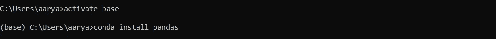

## 进口熊猫

安装熊猫后，我们要做的第一件事就是导入。可以使用以下命令:

```
import pandas as pd
```

熊猫可以作为任何东西进口，但最常见的是作为“pd”进口。

## 熊猫提供的数据结构

要掌握 pandas 库的基础知识，首先你需要熟悉它提供的两种数据结构。

*   系列
*   数据帧

## 系列

系列基本上是存储数据序列的一维数组。存储在 panda 系列中的数据与称为索引的数据标签相关联。

让我们从定义我们自己的熊猫系列开始

```
my_series = pd.Series([-2, 0, 2,4,6,8,10])
my_series0    -2
1     0
2     2
3     4
4     6
5     8
6    10
dtype: int64
```

让我们检查一下数据类型

```
type(my_series)pandas.core.series.Seriesprint("Data values: ", my_series.values, "and data index: ", my_series.index)Data values:  [-2  0  2  4  6  8 10] and data index:  RangeIndex(start=0, stop=7, step=1)
```

由于我们没有为这个系列提供任何索引，pandas 默认分配了从 0 到 N-1 的索引，其中 N 是数据的长度。

我们可以将索引明确定义如下:

```
my_series2 = pd.Series([0,1,2,3,4,5,6], index=['a','b','c', True, True, 2, 3])
```

系列的索引可以是任何数据类型。

```
print("Data values: ", my_series2.values, "and data index: ", my_series2.index)Data values:  [0 1 2 3 4 5 6] and data index:  Index(['a', 'b', 'c', True, True, 2, 3], dtype='object')
```

索引可用于从系列中选择一个或一组数据。

```
my_series2['a']0my_series2[True]True    3
True    4
dtype: int64
```

选择一组值时，必须提供索引列表

```
my_series2[['b', True, 3]]b       1
True    3
True    4
3       6
dtype: int64
```

## 熊猫系列手术

```
numbers = pd.Series(range(10,20))
numbers0    10
1    11
2    12
3    13
4    14
5    15
6    16
7    17
8    18
9    19
dtype: int64
```

## 数据过滤

```
numbers[numbers % 2 == 0]0    10
2    12
4    14
6    16
8    18
dtype: int64
```

## 标量操作

```
numbers + 1, numbers *2(0    11
 1    12
 2    13
 3    14
 4    15
 5    16
 6    17
 7    18
 8    19
 9    20
 dtype: int64,
 0    20
 1    22
 2    24
 3    26
 4    28
 5    30
 6    32
 7    34
 8    36
 9    38
 dtype: int64)
```

## 数学和自定义函数

熊猫支持 NumPy 库提供的许多方法

```
import numpy as np   
np.sin(numbers)0   -0.544021
1   -0.999990
2   -0.536573
3    0.420167
4    0.990607
5    0.650288
6   -0.287903
7   -0.961397
8   -0.750987
9    0.149877
dtype: float64
```

我们可以定义自己的函数并使用。pandas 提供的“应用”方法来使用我们在 pandas 系列上的自定义功能

```
def power2(ds):
    return ds * dsnumbers.apply(power2)0    100
1    121
2    144
3    169
4    196
5    225
6    256
7    289
8    324
9    361
dtype: int64
```

## 一些其他有用的功能

```
numbers['null'] = None  # Adding None value and index null to the existing series
```

熊猫功能。isnull()和 notnull()可用于查找序列中缺失的数据。

这是熊猫图书馆的另一个重要特征。熊猫使得处理缺失数据变得非常容易。

```
numbers.isnull()0       False
1       False
2       False
3       False
4       False
5       False
6       False
7       False
8       False
9       False
null     True
dtype: boolpd.notnull(numbers)0        True
1        True
2        True
3        True
4        True
5        True
6        True
7        True
8        True
9        True
null    False
dtype: bool
```

合并 2 个系列

```
alphabets = pd.Series(['a','b','c','d','e'])
alphabets0    a
1    b
2    c
3    d
4    e
dtype: objectjoined = alphabets.append(numbers)
joined0          a
1          b
2          c
3          d
4          e
0         10
1         11
2         12
3         13
4         14
5         15
6         16
7         17
8         18
9         19
null    None
dtype: objectjoined2 = pd.concat([alphabets, numbers], axis = 0)  # axis = 0 is defined by default so not need to write it againjoined20          a
1          b
2          c
3          d
4          e
0         10
1         11
2         12
3         13
4         14
5         15
6         16
7         17
8         18
9         19
null    None
dtype: object
```

我们可以通过以上任何一种方法合并两个现有的数据序列来创建新的熊猫序列

```
joined3 = pd.concat([alphabets, numbers], axis = 1)joined3
```

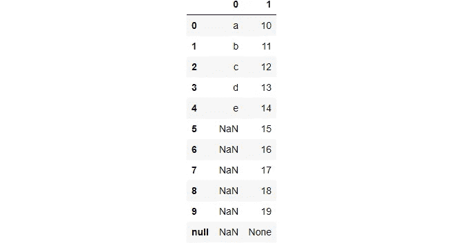

请注意，使用 axis = 1 组合数据系列会产生与上述两种方法不同的结果。

这让我们想到了熊猫提供的另一种数据结构 DataFrame

## 数据帧

DataFrame 是表格中数据的矩形排列。

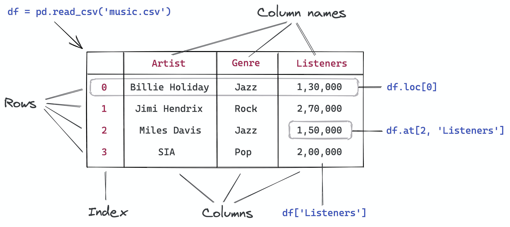

来源:https://jovian.ai/aakashns/python-pandas-data-analysis

考虑数据框的另一种方式是将它视为一个 python 字典，其中有多个值与一个键相关联。存储在数据框中的数据可以是任何类型，如整数、字符串、布尔值等。

让我们从创建数据框开始

```
df = pd.DataFrame({'country':['Nepal', 'Canada', 'Australia', 'India', 'USA'],
                  'capital': ['Kathmandu', 'Ottawa','Canberra', 'New Delhi', 'Washington'],
                  'population (in million)': [28.09, 37.09, 24.99, 1353, 328.2],
                  'area (in sqkm)': [147516, 9.985*1e6, 7.692*1e6, 3.287*1e6, 9.834*1e6]})   # 1e6 is scientific notation for writing a million

df
```

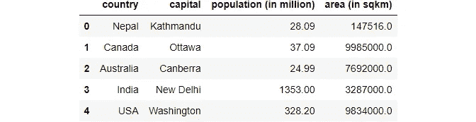

。info()方法帮助我们获得关于数据帧的一些基本信息。

```
df.info()<class 'pandas.core.frame.DataFrame'>
RangeIndex: 5 entries, 0 to 4
Data columns (total 4 columns):
 #   Column                   Non-Null Count  Dtype  
---  ------                   --------------  -----  
 0   country                  5 non-null      object 
 1   capital                  5 non-null      object 
 2   population (in million)  5 non-null      float64
 3   area (in sqkm)           5 non-null      float64
dtypes: float64(2), object(2)
memory usage: 288.0+ bytes
```

。describe()方法提供关于数据帧的统计信息。

```
df.describe()
```

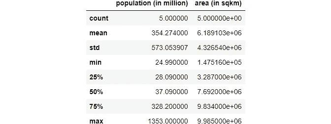

计数:总和标准:标准偏差

## 从数据帧中检索数据

这是您将使用熊猫处理的数据集的一个简单示例

我们可以使用这样的方法。头()和。tail()来分别从顶部和底部选择数据帧的 5 个元素。

```
df.head()
```


我们可以提供一个参数 n，其中 n 是要选择的行数。

```
df.tail(3)
```


df.columns 可用于获取数据帧的列。

```
df.columnsIndex(['country', 'capital', 'population (in million)', 'area (in sqkm)'], dtype='object')
```

我们可以使用下面的两种方法从 dataframe 中检索一个或多个列。

```
df['country']0        Nepal
1       Canada
2    Australia
3        India
4          USA
Name: country, dtype: objectdf.country0        Nepal
1       Canada
2    Australia
3        India
4          USA
Name: country, dtype: object
```

数据框的一列是一个系列。

```
type(df.country)pandas.core.series.Series
```

我们需要以 python 列表的形式提供列名来检索多个列。

```
df[['country', 'capital']]
```


```
type(df[['country', 'capital']])pandas.core.frame.DataFrame
```

。shape 方法返回表格/数据帧的大小/形状。

```
df.shape(5, 4)
```

。sample()方法可用于从 dataframe 中检索数据的随机样本。

```
df.sample(3)
```


。at 方法可用于直接从特定的行和列中检索元素。

```
df.at[3, 'capital']'New Delhi'df.at[4, 'population (in million)']328.2
```

。loc 方法可用于从数据帧中检索特定的行。

```
df.loc[3]country                        India
capital                    New Delhi
population (in million)         1353
area (in sqkm)             3.287e+06
Name: 3, dtype: objectdf.loc[0]country                        Nepal
capital                    Kathmandu
population (in million)        28.09
area (in sqkm)                147516
Name: 0, dtype: object
```

访问多行；

```
df.loc[1:3]
```


```
df.at[0, 'capital']'Kathmandu'new_df = dfnew_df
```


```
new_df.at[0, 'capital']'Kathmandu'new_df.at[0, 'capital'] = 'Paris'df.at[0, 'capital'], new_df.at[0, 'capital']('Paris', 'Paris')
```

更改 new_df 数据框的元素会更改 df 数据框的元素。这是因为 df 和 new_df 都访问计算机内存中的相同数据。我们可以通过使用。copy()方法。这将在不同的内存地址中创建一个新的数据帧。因此，更改一个数据框中的值不会更改不同数据框中的值。

```
df = new_df.copy()df.at[0, 'capital'] = "Kathmandu"df.at[0, 'capital'], new_df.at[0, 'capital']('Kathmandu', 'Paris')
```

## 对数据进行基本分析

。sum()方法计算特定列中所有数据的总和。

```
df['population (in million)'].sum()1771.3700000000001df.sum()country                                  NepalCanadaAustraliaIndiaUSA
capital                    KathmanduOttawaCanberraNew DelhiWashington
population (in million)                                       1771.37
area (in sqkm)                                            3.09455e+07
dtype: object
```

计算所有国家的总人口密度。

```
pop_dens = df['population (in million)'].sum()*1e6/df['area (in sqkm)'].sum()
print("Population Density: " + str(round(pop_dens, 1)) + " per sqkm.")Population Density: 57.2 per sqkm.
```

在原始数据框中创建一个名为“人口密度”的新列。

```
df['population_density'] = df['population (in million)']*1e6/df['area (in sqkm)']df
```

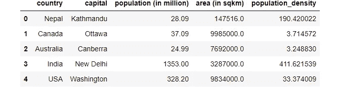

获取人口密度大于每平方公里 100 的国家。

```
high_dens = df.population_density > 100
high_dens0     True
1    False
2    False
3     True
4    False
Name: population_density, dtype: bool
```

布尔值可用于选择数据帧中的行。

```
df[high_dens]
```

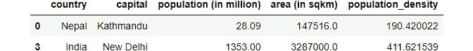

人口密度让我们更好地了解这个国家，而不是人口。所以我们可以去掉人口一栏。

要从数据框中永久删除列，inplace 需要为 True。

```
df.drop(columns=['population (in million)'], inplace=True)df
```

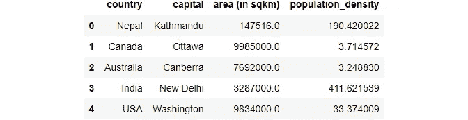

## 整理

。sort_values()方法可用于对数据帧中的值进行排序。

```
df.sort_values('population_density', ascending=False)
```

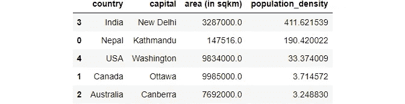

## 合并多个数据帧

```
city_df = pd.DataFrame({
    'country':['Nepal', 'Canada', 'Australia', 'India', 'USA'],
    'city': ['Pokhara', 'Toronto', 'Sydney', 'Mumbai', 'Los Angeles']
})
city_df
```


要合并两个数据框，它们必须至少有一个公共列。“on”是连接两个数据框的列。在这种情况下，两个数据框都有一个共同的国家列。

```
merged_df = df.merge(city_df, on='country')
merged_df
```

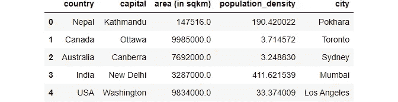

```
df = merged_df
df
```


## 数据聚合和分组

```
continent_df = pd.DataFrame({
    'country':['Nepal', 'Canada', 'Australia', 'India', 'USA'],
    'continent': ['Asia', 'North America', 'Australia', 'Asia', 'North America']
})
continent_df
```


```
df = df.merge(continent_df, on='country')
df
```

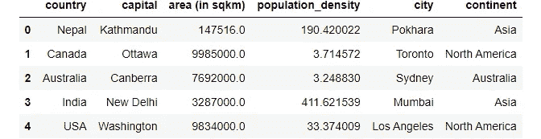

我们可以使用 groupby 函数为每个洲创建一个组，选择我们希望聚合的列，并使用。sum()方法。

```
df.groupby('continent').sum()
```


## 熊猫中的数据可视化

Pandas 提供了一个. plot()方法来绘制不同类型的图形，如线条、条形图、饼图、历史图、散点图、面积图等，这可以非常方便地绘制简单的图形，而无需导入任何其他库。

```
df.population_density.plot()<AxesSubplot:>
```

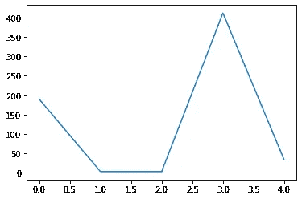

```
df['area (in sqkm)'].plot(kind='pie', )<AxesSubplot:ylabel='area (in sqkm)'>
```

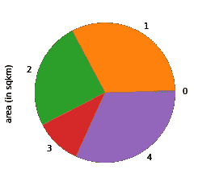

```
df.population_density.plot(kind='bar')<AxesSubplot:>
```

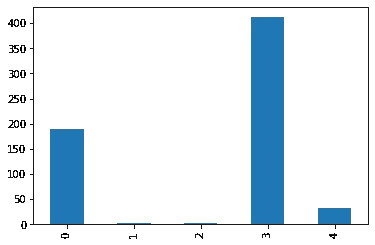

## 在 pandas 中读写不同的文件格式

通过使用 pandas 定义的方法，我们可以在 pandas 中读写不同的文件格式。read_csv('filepath ')和。to_csv('filepath ')。

示例:

my_csv_file = pd.read_csv('../my _ file . CSV’)

## 在 windows 中使用文件路径格式时，在引号开始前写“r”(小写 r)。

my _ CSV _ file = PD . read _ CSV(r ' d:\ Users \ aarya \ files \ my _ file . CSV ')

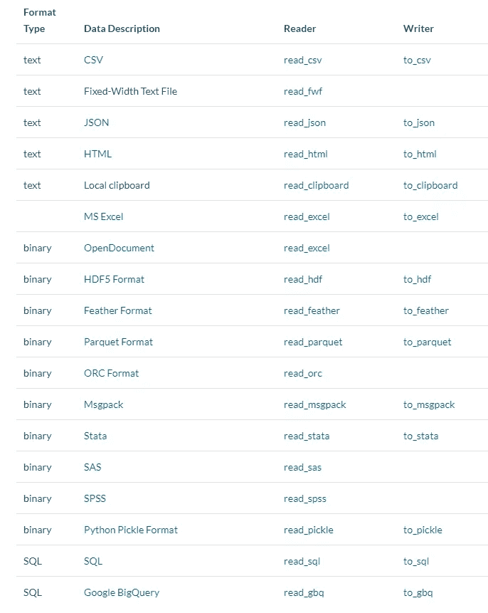