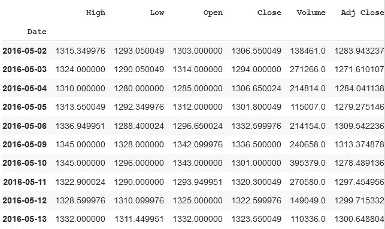
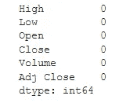
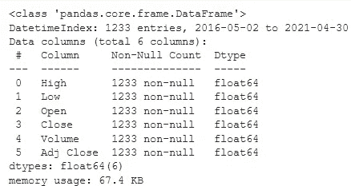
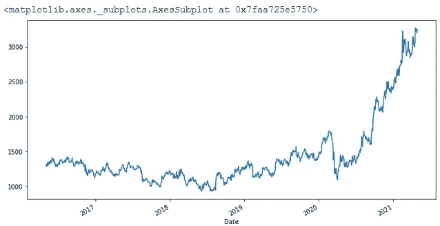
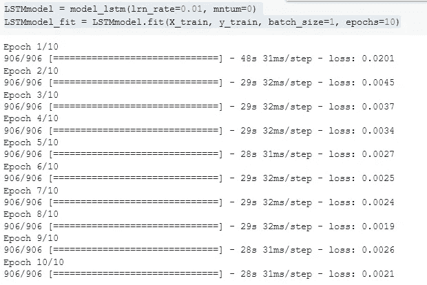
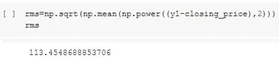

# 使用 LSTM 预测股票的初学者指南。

> 原文：<https://medium.com/analytics-vidhya/beginners-guide-to-stock-prediction-using-lstm-7010bf8b8c21?source=collection_archive---------3----------------------->

近年来，由于大量干净和结构化的历史数据的可用性，人工智能在金融中的重要性变得相当明显。因此，多家领先的银行和金融公司正在部署 ML 和 DL 技术，以简化其流程、构建交易策略、定价和风险管理。

> “金融领域的人工智能正在改变我们与金钱互动的方式”

下面简单介绍一下金融领域目前和未来的一些人工智能应用:

算法交易:算法交易利用复杂的量化策略以及人类的洞察力来进行交易。机器学习可以通过提供更多获得市场运动特殊洞察力的途径，帮助将算法交易推向新的水平。

**风险检测和管理**:由于高计算能力、频繁的互联网使用以及越来越多的公司数据存储在网上，金融公司面临着持续的数据安全风险。ML 模型能够从正常行为模式中学习。他们能快速适应正常行为的变化，并能快速识别欺诈交易的模式。高效的欺诈检测反过来有助于提出风险管理技术。

**:投资组合管理是指以股票、债券、现金、共同基金等形式管理投资者的资本。以便在给定的时间范围内赚取最大的利润。引入人工智能将有助于这些资产管理公司提出改善投资决策和利用各种历史数据的解决方案。**

****衍生产品定价**:衍生产品是一种金融合约，其价格来源于一项或多项基础资产。在这里，资产可以是任何持有价值的东西，如债券、商品、房地产等。当资产的价格根据市场条件不断变化时，金融合同就形成了，其中对资产在未来的设定价格进行了推测。**

****情绪分析**:金融世界中机器学习用于情绪分析最常见的是对财经新闻的分析。那就是，预测客户对市场发展的情绪，而不仅仅局限于预测股票价格和交易。**

**金融部门的公司通常分为买方和卖方。买方公司是那些主要业务是咨询和投资的公司。这包括私募股权、共同基金、人寿保险公司、对冲基金等资产管理公司。而卖方指的是向资产管理公司和对冲基金出售投资和服务的银行和经纪交易商。现在，这些买方公司要么做出一些关于资产战略配置的长期决策。例如，在一段时间内对股票、债券、房地产等资产投资多少，或者关于购买或做空哪些资产的一些临时决定。这些决定是根据市场的整体走势做出的。所以基本上，这些资产管理公司的交易员、投资组合经理、开发人员和研究人员都在朝着同一个目标努力。其目标是无论市场整体走势如何，都要创造正回报。**

**深入研究股票市场交易的短期决策，我们认识到市场是不稳定的。而且，在试图用市场资产创造回报时，有许多方面需要考虑。交易者通常寻找市场行为和低效率，这将为他们的交易资本产生高风险调整回报。拟合一个模型来分析市场的整体趋势需要实施一些定量方法。这些包括回归、预测模型、一些执行策略，这些策略可以分析和发现市场中某一特定资产的隐藏模式和重复行为。基本上，我们需要一个预测模型来预测股票的未来价值。**

**当过去的数字数据可用时，可以使用股票预测模型，并且可以合理地假设数据中的一些模式预计会持续到未来。这可能是基于单个或多个解释变量的简单回归问题。或者它可以是一个时间序列，其中我们使用特定时间范围内实际股票价格的函数来预测未来价格。**

**我将预测一家著名的印度医疗保健公司股票的未来价值。时间序列预测将使用 LSTM 模型来完成，该模型是一种用于深度学习的递归神经网络，可以依次学习项目之间的依赖顺序。他们有能力学习在时间序列问题中进行预测所需的上下文，而不是事先指定这个问题。**

**选择的数据是从 2016 年 5 月到 2021 年 5 月，因为印度的医疗保健公司在过去 5 年里经历了巨大的繁荣。加强覆盖面，服务，增加支出的公共和私人球员和最近的疫情，使这些股票显示出相当的势头。实施的程序是非常基本的，无论如何不能用来赚取任何可观的利润，但是它会给你一个关于市场预测如何工作的公平的想法。**

**我将从导入该模型所需的库开始。**

**然后在熊猫 datareader 的帮助下从雅虎财经中提取数据。它要求我们输入股票代码，在这里是“APOLLOHOSP”。NS。我们还需要提到来源(雅虎财经)和我们的预测所需要的数据的起止日期。**

****

**医疗保健公司股票数据的前 10 行**

**数据集有不同的变量，即:高、低、开盘价、收盘价、成交量和调整收盘价。此外，我们将日期设置为索引，这在任何时间序列问题中都非常重要。**

**开盘和收盘变量显示了股票在某一天交易的起始和最终价格。**

**变量 High、Low 代表当天股票的最高价和最低价。**

**成交量是一天中买卖的股票数量。**

**而 Adj Close 是股票调整后的收盘价。在考虑了任何公司行为后，它会改变股票的收盘价。这会让我们更好地了解股票的整体价值，并帮助我们做出更好的决策。**

**然后，我们继续进行基本检查。我们将查看数据集是否有任何空值。如果存在，我们尝试使用列平均值来填充它。此外，我们需要注意变量的数据类型。在任何变化的情况下，我们将使它们具有相同的数据类型。**

****

**检查空值**

****

**可变数据类型和内存使用**

**最后，我们绘制了从 2016 年 5 月到 2021 年 5 月股票调整后收盘价的增长，正如所预测的那样。显而易见，我们看到股价在 2016 年至 2019 年一直在 1000 卢比至 1500 卢比的范围内波动，继疫情之后，由于政府对医疗保健的强烈关注，股价在 2020 年突然上涨。卫生和家庭福利部在 2020-2021 年的预算估计显示了相当令人满意的 3.75%的增长。此外，对卫生研究部的拨款增加了 10%。所有这些因素导致医疗保健公司的股价上涨。**

****

**过去 5 年的收盘价。**

**在这里，由于我们将预测股票价格，我们需要将我们的数据一分为二。在处理时间序列问题时，我们不能随机分割训练集和测试集中的数据，因为这将妨碍时间成分。我们需要决定需要多少数据来进行训练。由于预测依赖于之前的数据点，因此需要针对日期做出该决定。让我们用需要训练的 80%的数据，因为股价的高峰只会在 2020 年出现。训练 2020 年的一些数据来做出成功的预测是必要的。剩下的 20%需要测试。**

**当训练像长短期记忆这样的递归神经网络时，我们的时间序列问题的数据需要缩放，因为 LSTMs 对数据的缩放极其敏感。当一个网络适合具有高范围值(如我们的股票价格)的未缩放数据时，大量输入可能会减缓网络的学习和收敛，在某些情况下会阻止网络有效地学习您的问题。我将按照“feature_range”中的指定，在 0 到 1 的范围内缩放这些数据。**

**因此，LSTM 背后的基本逻辑是，前一天的数据用来预测第二天的数据。现在，1 天的时间窗口再次用于预测第二天，以此类推。这种迭代分批在整个数据集上进行。关键是时间越长越好。您为预测考虑的数据点越多，预测就越准确。下面显示的代码将创建一个数据集，其中 X_train 和 X_test 是特定时间 *(t)* 的自变量集合，Y_train 和 Y_test 是下一时间 *(t+1)* 的目标变量。如图所示，我取了*时间步长=80。*同样，X_test 和 y_test 可以在测试数据集的帮助下以类似的方式创建。**

**既然我们已经完成了预处理，是时候应用 LSTM 模型了。然而，在应用 LSTM 模型之前，我们需要重塑我们的数据。为什么要重塑？因为 LSTM 网络期望输入是样本数量、时间步长数量和特征数量形式的三维输入。现在，我们的 X-train 和 y-train 数据集是 2D 的。如下所述，样本数是 X_train 中的行数，时间戳数是 80，特征数是 1。**

**LSTM 的建筑很容易理解。首先，我们将读入序列数据，并将其分配给模型。然后将数据输入神经网络，并通过分配随机偏差和权重进行预测训练。在第一层，我们放入 X_train，它进入 50 个隐藏单元，然后被转换成股票回报值的单一输出。添加退出正则化是为了减少神经网络中的过拟合。最后，我们有输出*密集*层，因为我们只需要输出，单位必须是 1。我已经创建了一个功能来建立和适应一个 LSTM 网络，使它没有麻烦。**

****

**拟合 LSTM 模型**

**如果你想更深入地了解 LSTM 的运作，请参考下面的博客。**

 **[## 了解 LSTM 网络

### 2015 年 8 月 27 日发布人类不是每秒钟都从零开始思考。当你读这篇文章时，你…

colah.github.io](https://colah.github.io/posts/2015-08-Understanding-LSTMs/)** 

**然后，我们使用基于 X_test 的模型来预测股票价格。使用逆变换会以原始格式恢复预测值。**

**我将使用 RMSE 来计算误差值。113.45 分已经很不错了。比我对我们模型的预期要好！**

****

**RMSE 分数**

**LSTM 模型可以针对各种参数进行进一步调整，例如增加历元数、更改 LSTM 层数或添加下降值。尽管 LSTM 的预测不足以单独确定股票价格是上涨还是下跌。市场也在很大程度上受到有关该公司的消息和其他情绪的影响。我对详细探索时间序列问题非常感兴趣，并计划尝试融入与我们的目标相关并有助于预测的有用新闻数据。**

**尽管通过这次演练已经描述了一组最少的功能，但我真诚地希望它能提供足够的洞察力。下面是我提到的一些资源，你可能会觉得有用！**

** [## 如何在 Python -机器学习掌握中扩展长短期记忆网络的数据

### 在训练神经网络(如神经网络)时，可能需要对序列预测问题的数据进行缩放

machinelearningmastery.com](https://machinelearningmastery.com/how-to-scale-data-for-long-short-term-memory-networks-in-python/)  [## 股票价格预测-Python-data flaer 中的机器学习项目

### 股票价格预测-初学者的机器学习项目。了解如何开发股票价格预测模型…

数据-天赋.培训](https://data-flair.training/blogs/stock-price-prediction-machine-learning-project-in-python/)  [## 算法交易系统的机器学习框架

### 当我将机器学习应用到现实生活中时，我学到了什么

towardsdatascience.com](https://towardsdatascience.com/https-medium-com-skuttruf-machine-learning-in-finance-algorithmic-trading-on-energy-markets-cb68f7471475)**