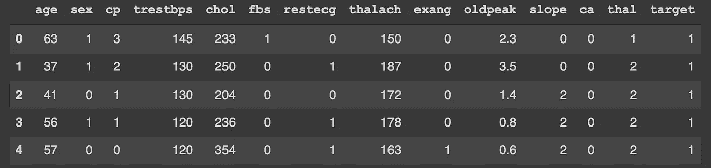
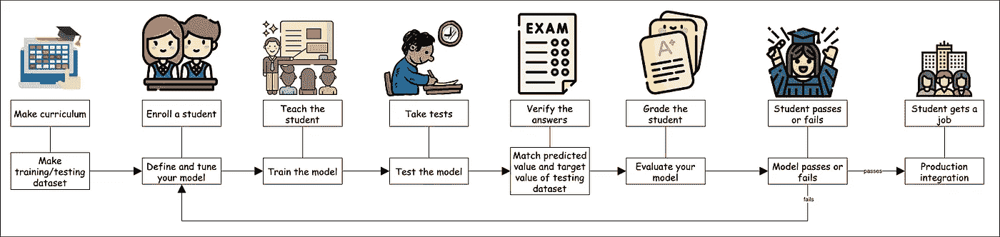

# 初学者的机器学习之旅

> 原文：<https://medium.com/analytics-vidhya/beginners-journey-to-machine-learning-cab614ad6ba9?source=collection_archive---------4----------------------->


你好，数据科学猫回来了。

在凯蒂通过机器学习([https://dev.to/orthymarjan/data-science-for-cats-1d7k](https://dev.to/orthymarjan/data-science-for-cats-1d7k))成功做出决策后，许多胡曼的朋友一直在问他这样的问题

*   我了解基本知识，但是我从哪里开始编码呢？
*   从网上看懂了代码，但是怎么开始自己写代码呢？
*   我如何组织我的项目？
*   我如何想象一个现实生活问题的解决方案？

凯蒂现在试图用现实生活中的例子来解释答案。

首先，想到‘学习’这个词。Kitty 希望你记住你们都是如何开始正式学习的，以及后来你是如何在现实世界中实施你的知识的。想象自己是一所学校的老师。一个新学生来了，并且注册了一个班级。你为班级准备一门课程，并相应地开始教学。你参加一些课堂测试来评估孩子们的表现。在年末，你要根据一年来所学的知识准备一次期末考试。你把试卷分发给孩子们，他们回答问题，你验证答案，看看他们学得有多好。如果他们的答案高于一定水平，他们就通过了。否则他们会失败。后来通过的人获得工作，并利用他们在学校学到的知识完成任务。例如，如果你是一名英语教师，你教孩子们语法和文学，在以后的现实生活中，他们可能不必写诗或用正确的动词形式填空，但他们会运用英语语言知识来写报告或产品文档。


记住机器学习也是一个学习的过程。现在我们来对比一下一个学校的程序和机器学习。在我们的例子中，我们将处理一个非常小的数据集(【https://www.kaggle.com/ronitf/heart-disease-uci】T2)，其中机器学习模型将尝试根据 python 的一些测试报告来预测患者是否有心脏病的高风险。你也可以在 R 中进行类似的工作。

```
import pandas as pd
df = pd.read_csv('Heart Disease Dataset.csv')
df.head()
```



**制定课程:**
首先，你要决定全年你想教学生哪些话题。你必须决定你的学生必须理解哪些主题(在这种情况下，专栏或专题)，以便学习你试图教给他的任何东西(在这种情况下，如果病人有心脏病的高风险)。你还要决定你要教他多少数据，以及你在课程的后面如何考试。您将从实际数据集中定义全年教学的“训练数据”和考试的“测试数据”。

```
from sklearn.model_selection import train_test_split

feature_cols = ['age',  'sex',  'cp', 'trestbps', 'chol', 'fbs',  'restecg',  'thalach',  'exang',  'oldpeak',  'slope',  'ca', 'thal']
X = df[feature_cols]
y = df['target']

X_train, X_test, y_train, y_test = train_test_split(X, y, test_size=0.10)
```

这里，在 X_train 中有训练特征，在 X_test 中有测试集的特征，在 y_train 中有训练集的目标，在 y_test 中有测试集的目标。这里的训考比是 90%-10%。

**学生报名:**
机器学习过程中的学生就是你的模型。起初，它什么都不知道。你的工作是为它制定一个合适的学习程序，以便它以后能在现实世界中表演。假设在这种情况下，我们的教学程序是 SVM 模式。我们声明一个名为 svm 的变量，并调整它的参数(就像我们采用一个线性核一样，在文档中还可以找到更多)。

```
from sklearn.svm import SVC #SVM classifier
svm = SVC(kernel="linear")
```

**教学:**
在我们的例子中，教学就是将数据‘拟合’到模型中。当您将训练集与模型相匹配时，它会“学习”。

```
svm.fit(X_train, y_train)
```

**考试:**
在考试的情况下，我们的试卷是 X_test。你手里已经有 y_test 这份试卷的正确答案了。学生将把他的答案写在另一个变量中，比如说 y_pred。

```
y_pred = svm.predict(X_test)
```

**评价试卷:**
你已经可以理解为，可以通过比较 y_test 和 y_pred 来验证一个学生的答案，决定他是通过还是不及格。

```
from sklearn import metrics
print("Accuracy:",metrics.accuracy_score(y_test, y_pred))
```

课堂测试的重要性:如果你发现你的学生期末考试没有考好，可能会发生两件事。这个学生可能一整年都没有好好学习，或者可能他学得很好，但由于某种原因，他在期末考试中表现不好。参加班级考试的重要性来了。如果这个学生一整年都没有好好学习，他的班级考试成绩就不会令人满意。如果他在课堂测试中表现良好，期末考试失败将表明其他一些问题。如果我们的准确性不令人满意，让我们使用 k-fold 交叉验证来检查他们的类测试性能(这有点像从训练集中抽取一些测试)。

```
from sklearn import model_selection

kfold = model_selection.KFold(n_splits=10, random_state=31)
model =  SVC(kernel="linear")

results = model_selection.cross_val_score(model, X_train, y_train, cv=kfold)
results
```

如果交叉验证结果也很差，这意味着我们“拟合不足”，意味着我们无法为我们的模型提供足够的数据来进行研究(这在我们的案例中发生了，因为我们的准确性相当一般，交叉验证结果也不是那么好)。如果不是，可能的原因是“过度拟合”，这意味着模型学习数据有点太好了(包括噪音和坏东西)。这里有一个链接，告诉你在这种情况下你可以做什么(比如改变参数什么的):[https://adityarohilla . com/2018/11/02/a-brief-introduction-to-support-vector-machine/](https://adityarohilla.com/2018/11/02/a-brief-introduction-to-support-vector-machine/)。
你也可以测试同一个 python 库中的其他模型，如决策树、随机森林或朴素贝叶斯，看看哪一个最适合你。
**在工作中运用这些知识:**
你的学生在学校生活中学到的东西，他也将能够在工作中表现出来。为了让他记住他的训练，我们可以将这个训练过的模型导出到某种文件中，然后将该文件加载到系统中进行预测。通过导入模型文件，您可以轻松地将您的模型集成到使用 python 框架(如 Flask)构建的系统中。
导出、

```
from joblib import dump

# dump the pipeline model
dump(svm, filename="classification.joblib")
```

要导入，

```
from joblib import load

# load the pipeline model
pipeline = load("classification.joblib")
pipeline.predict([[35,  0,  2,  115,  245,  0,  0,  147,  0,  0.4,  2,  0,  2]])
```

这里你可以看到我们的模型预测了一个新患者的心脏病风险，这个新患者不是我们训练集的一部分，预测是[1]。以下是如何将此类文件与 Flask 集成的示例:[https://www . analyticsvidhya . com/blog/2020/04/how-to-deploy-machine-learning-model-Flask/](https://www.analyticsvidhya.com/blog/2020/04/how-to-deploy-machine-learning-model-flask/)



在这里，我将按顺序重写代码，这样，如果你是新手，它会变得更加清晰。

```
from sklearn.model_selection import train_test_split
from sklearn.svm import SVC #SVM classifier
from sklearn import metrics

feature_cols = ['age',  'sex',  'cp', 'trestbps', 'chol', 'fbs',  'restecg',  'thalach',  'exang',  'oldpeak',  'slope',  'ca', 'thal']
X = df[feature_cols]
y = df['target']

X_train, X_test, y_train, y_test = train_test_split(X, y, test_size=0.10)
svm = SVC(kernel="linear")
svm.fit(X_train, y_train)
y_pred = svm.predict(X_test)
print("Accuracy:",metrics.accuracy_score(y_test, y_pred))
```

*原载于 2021 年 11 月 8 日*[*https://dev . to*](https://dev.to/orthymarjan/beginners-journey-in-machine-learning-3ei9)*。*