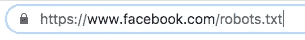

# 用 Python 进行网络抓取，将新鲜农产品价格与泰语 talaad(ตลาดไท)进行比较

> 原文：<https://medium.com/analytics-vidhya/benchmarking-fresh-produce-prices-against-talaad-thai-%E0%B8%95%E0%B8%A5%E0%B8%B2%E0%B8%94%E0%B9%84%E0%B8%97-with-web-scraping-in-python-4b53208ff4c5?source=collection_archive---------34----------------------->

成本管理是经营每一项业务的关键，尤其是经营一家餐馆。成本的急剧上升将转化为利润率的下降，最终导致餐厅管理的螺旋式下降。新鲜农产品被认为是一种商品，它确实可以根据市场上当前的需求和供应而波动。因此，有一个可靠的价格来源来衡量每个供应商的报价是至关重要的。

在本文中，我将展示如何从 Talaad Thai (ตลาดไท)获取新鲜农产品的价格，然后将其存储在一个现成的 excel 中，以便与我们的实际成本价进行比较。

# 为什么是泰语？

在深入研究编码之前，让我们先讨论一下 Talaad Thai 如何成为一个可靠的基准，以及它在泰国农产品市场中的作用。

位于泰国巴吞他尼，占地超过 214 英亩，是亚洲最大的农产品批发市场，Talaad Thai。该市场旨在成为国内和进口产品的集散地。根据泰国塔拉德官方[网站](https://talaadthai.com/)的数据，通过泰国塔拉德的商品每年价值超过 60 亿美元(汇率为 1 美元兑换 30 泰铢)。这种巨大的市场规模和多种多样的产品加速了价格发现过程，从而创造了一个可靠和可获得的基准价格。

# 编码

对于那些不熟悉网页抓取的人，请查看下面的链接。

[](https://towardsdatascience.com/everything-you-need-to-know-about-web-scraping-6541b241f27e) [## 关于网络抓取，你需要知道的一切

### 每个人都应该知道的神奇工具！

towardsdatascience.com](https://towardsdatascience.com/everything-you-need-to-know-about-web-scraping-6541b241f27e) 

有时候，网络抓取可能会引发关于数据使用的[道德问题](https://towardsdatascience.com/ethics-in-web-scraping-b96b18136f01)。检查网站所有者的网页抓取权限的一个好方法是在网站 url 后添加 ***\robots.txt*** 。


原始 URL



正在检查抓取权限 URL


Facebook.com 允许机器人

*备注:对于 Talaad Thai 网站，作者以上述方式检查了机器人权限，但无法找到允许/不允许站点抓取的信息。本文旨在教育读者，并介绍数据科学如何在管理传统业务中发挥作用。作者无意将这篇文章或从网上获取的数据货币化。*

首先，导入库并挂载 Google drive。

```
import jsonimport requestsimport pandas as pdfrom bs4 import BeautifulSoupimport urllib3from google.colab import driveurllib3.disable_warnings() #to turn off warningsdrive.mount('/content/drive') #mount Google driveheaders = {'User-Agent': 'Mozilla/5.0 (Windows NT 10.0; Win64; x64) AppleWebKit/537.36 (KHTML, like Gecko) Chrome/81.0.4044.138 Safari/537.36'}
```

假设我想取消猪肉价格，我会先去网站的[链接](https://talaadthai.com/product/10-05-17-ground-pork)。然后复制链接，使用 BeautifulSoup 通过下面的代码把 ***html*** 变成***text****。*

```
*r_test = requests.get("https://talaadthai.com/product/10-05-17-ground-pork", headers=headers,verify=False)soup = BeautifulSoup(r_test.content,'html.parser')data = soup.text*
```

*打印数据，你会得到这个:*

**

*来自碎猪肉页面的文本*

*之后，我会找到一个链接，该网站使用上传每日价格。注意，这个过程相当繁琐。*

**

*用于查询每日价格的主链接*

*黄色框中的链接是我们的主要链接，我们将使用它来查询每日价格。此外，我注意到红色圆圈中的数字是产品 ID。因此，我们可以更改产品 ID 来查询除碎猪肉以外的其他价格。但是，您需要重复上述过程来获得这样的产品 ID。比如，“ *9578* ”是鸡胸肉，“ *9533* ”是肉末，“ *9570* ”是咸鸭蛋。*

*现在，让我们使用上面的链接创建价格抓取代码。*

*将数据放入数据框*

*如果我们将 *data_df* 导出到 excel，就会是这样的。*

**

*excel 格式的 data_df*

*在上图中，我们想要的价格在*‘最近价格’*行和*‘ACF’*列中。然后，我们可以通过以下代码提取价格。*

```
*test_rm_df = pd.DataFrame(data=data_df.loc['recent_price']['acf'],index=['Raw_Mat_Price'])number = data_df['id'].drop_duplicates()test_rm_df['Product_ID'] = number[0]test_rm_df['Product_Name'] = 'Ground Pork'test_rm_df*
```

*结果如下所示。*

**

*根据上面的示例，如果我们有一个如下所示的产品 ID 和产品名称列表，我们可以如下循环价格查询:*

**

*每日结果数据框架*

*从上面的代码中，我们可以每天运行代码将价格存储在 excel 文件中。*

*运行代码一段时间后，我们可以创建图表来比较价格和实际成本，如下所示。我感谢 Tansita W .给我实际成本数据，以便与 Talaad Thai 价格进行比较。*

**

*泰国塔拉德的碎猪肉价格与实际成本的比较*

*最后，我想指出的是，我们不应该过于频繁地查询价格，只获取必要的信息，因为每次查询都会耗费网站资源。*

# *进一步的用途*

*收集数据是所有分析的第一步。从上面的数据集，我们可以无止境地扩展用途。例如，我们可以通过产品之间的相关性分析来分析价格变动。此外，我们可以从农产品价格跟踪通货膨胀，因为它反映了零售企业所依赖的实际成本。最后，如果有足够的数据集，我们也许能够建模和预测价格。*