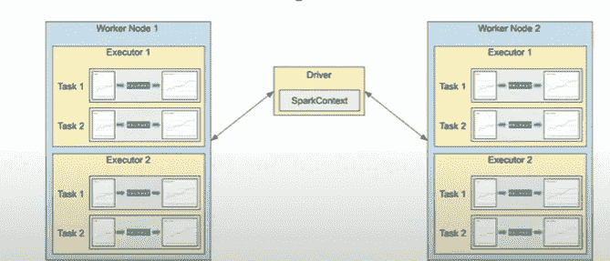
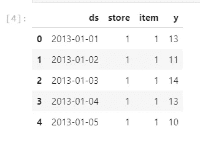
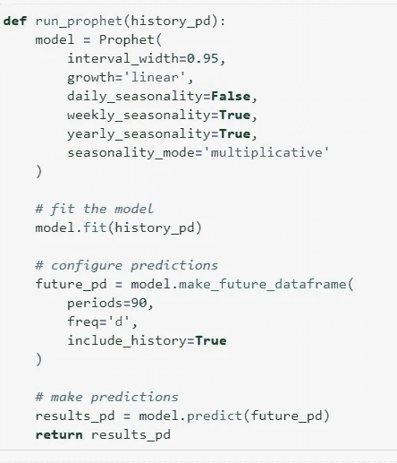
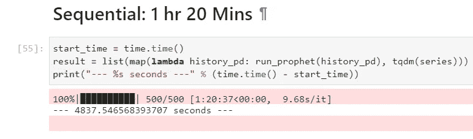
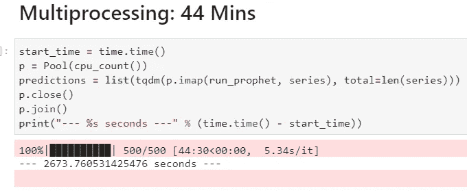
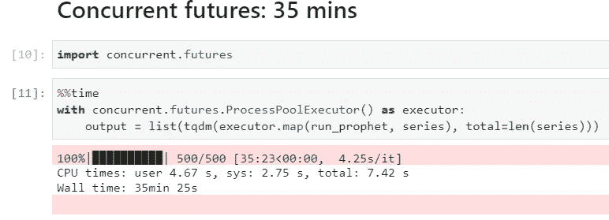
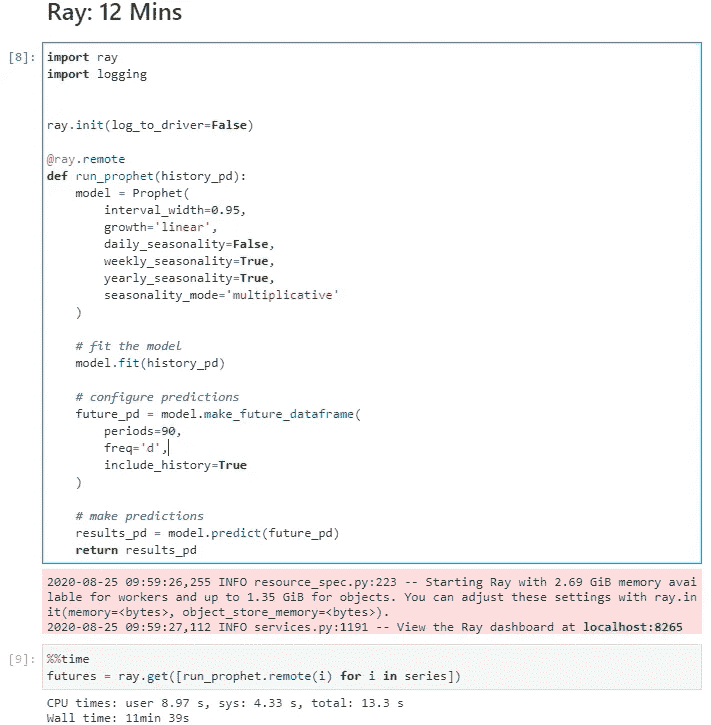
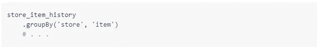
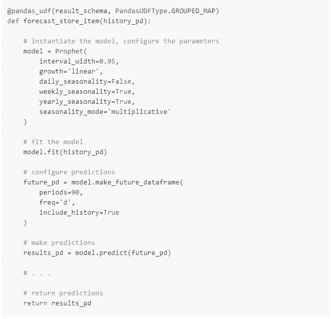
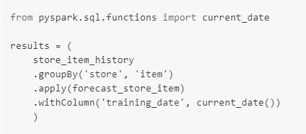

# 利用 Ray、Spark、多处理和并发未来对时间序列预测的性能和规模进行基准测试

> 原文：<https://medium.com/analytics-vidhya/benchmarking-performances-and-scaling-of-time-series-forecast-with-multiprocessing-concurrent-68a8c552afd6?source=collection_archive---------8----------------------->

本文介绍了不同的方法来衡量时间序列预测模型和基准他们的表现

来源:https://www.youtube.com/watch?v=fegS34ItKcI

**背景**

在我之前作为数据科学家的工作中，我的任务是构建一个时间序列预测模型来预测 1000 家商店的客流量。就像任何实验开始时一样，我采取了构建时间序列模型的天真方法:一个接一个地顺序循环，花了大约 7 个小时来训练和预测。这让我开始研究大规模预测这个话题。从我的研究中，我发现了多种方法来并行化训练和预测时间序列模型的任务，从使用具有多个核心的单个机器到使用多个机器。在试验了这些方法之后，我觉得有必要对它们进行基准测试，并找到最佳方法。对这些方法进行基准测试的灵感来自于马蒂亚斯·阿拉维娜·甘博亚撰写的媒体文章[使用并行预言家](/spikelab/forecasting-multiples-time-series-using-prophet-in-parallel-2515abd1a245)预测多个时间序列。除了在上面的文章中提到的使用多重处理来扩展 Prophet 时间序列预测之外，我还介绍了使用并发期货的新方法，Spark 和 Ray，它们的性能明显优于多重处理。

**不同的扩展方法**

对于基准测试，我对不同的方法使用了相同的数据集、机器规格、预测程序和超参数。

**数据集:**[https://www . ka ggle . com/c/demand-forecasting-kernels-only/data](https://www.kaggle.com/c/demand-forecasting-kernels-only/data)

该数据集包含 10 家商店的历史每日销售数据，每家商店包含 2013 年至 2017 年过去 5 年中的 50 件单品。任务是预测每个商店商品组合未来 90 天的销售额，这需要对 500 个不同的时间序列进行训练和预测。

**机器规格:**

为了对多处理、并发未来和 Ray 进行基准测试，我使用了我的个人机器 **(MSI GL62MVR、I7、16GB RAM、8 核设置)**

为了在 Spark 上进行分发，我提供了一个集群，其中有两个工作节点 **(n1-standard-4** ) 4 个内核，每个内核都使用 **GCP Dataproc。**

**预测程序:** FBProphet

FBProphet 是一个预测时间序列的程序。这只是作为一个例子，但是该函数可以直接替换为任何预测模型并进行缩放。使用这个过程的原因之一是它使用 stan 的高效实现。在扩展这些过程时，确保它们是性能优化的非常重要。当使用云中的资源进行扩展时，这有助于降低每次预测的成本。

为了将 FBProphet 分发到不同的内核，我创建了一个名为 **run_prophet** 的函数。对于所有商店商品组合，函数中的参数是固定的，并且它返回带有预测的结果数据框架。

**方法一:** **顺序式**

作为基线，prophet 时间序列程序被依次训练和预测。整个过程花费了大约 **1 小时 20 分钟**来预测 500 种商店商品组合的销售。

**方法 2:** **多重处理**

多重处理是一个支持多进程生成的包。代码中的**池**对象有助于并行执行 **run_prophet** 函数。 **imap()** 对可迭代**系列**中的每个数据帧异步运行 **run_prophet** 函数，并阻塞直到结果准备好。 **Join()** 方法等待工作进程退出。

**方法三:同时期货**

ProcessPoolExecutor 是运行多个进程的一种更简单有效的方式，它可以在 **concurrent.futures** 模块中获得，最好与上下文管理器一起使用。 **map()** 方法为可迭代**系列中的每个数据帧异步运行 **run_prophet** 函数。**

**方法 4:射线**

Ray 为构建分布式系统提供了一个简单通用的 API。它支持并行处理单个机器代码，代码变化为零。从例子中可以看出，可以使用 **ray.init()** 方法启动 Ray。然后，Ray 将使您能够利用机器上的所有内核。通过添加 **@ray.remote** 装饰器， **run_prophet** 函数变成了一个远程函数，可以作为一个工作进程上的任务异步执行。函数的结果可以用 **ray.get()** 方法检索。

**方法 5:火花**

**Apache Spark** 是一个数据处理引擎，它也有助于分布大量模型的训练，它的处理数量只受可以提供的节点数量的限制。对于这个基准测试，我使用 **GCP Dataproc** 和 **2 个工作节点(每个 4 个内核)**提供了一个托管 spark 集群。

由于 Spark 中的每个工人都需要有一个数据子集，在下面的代码片段中，我按照每个商店商品组合的销售数据进行分组。

来源:[https://databricks . com/blog/2020/01/27/time-series-forecasting-prophet-spark . html](https://databricks.com/blog/2020/01/27/time-series-forecasting-prophet-spark.html)

使用装饰器 **@pandas_udf** 声明的 **pandas UDF** 的功能，可以为分组数据框中可用的每个数据子集训练模型。除此之外，UDF 还将数据收集到单个结果数据帧中。这项工作持续了大约 12 分钟。

来源:**[**https://databricks . com/blog/2020/01/27/time-series-forecasting-prophet-spark . html**](https://databricks.com/blog/2020/01/27/time-series-forecasting-prophet-spark.html)**

****

**来源:[https://databricks . com/blog/2020/01/27/time-series-forecasting-prophet-spark . html](https://databricks.com/blog/2020/01/27/time-series-forecasting-prophet-spark.html)**

****运行基准测试****

**这些基准测试的结果可以使用 [Jupyter 笔记本](https://github.com/amrishan/scaling-prophet-timeseries)重现。**

**在运行笔记本之前，激活 conda 环境。**

**代码在我的个人笔记本电脑上运行( **MSI GL62MVR，I7，16GB RAM，8 核设置)。****

**对于 spark，使用 GCPs free credits 创建一个包含 2 个 worker 节点的 DataProc 集群。基准的 spark 代码可在处找到[。](https://databricks.com/blog/2020/01/27/time-series-forecasting-prophet-spark.html)**

****结论****

**从基准测试中，我们可以看到 **Ray** 和 **Spark** 框架花费的时间**比模块**多处理**和**并发期货**花费的时间**少一半。**

**这主要是因为，Ray **能够高效地处理数字数据**而**能够在任务**之间共享变量。类似地，Spark 凭借其分布式处理和可伸缩性做了同样令人印象深刻的工作。**

**我个人喜欢 Ray，因为它的**几乎不需要修改代码**就可以在一台机器上扩展时间序列预测模型。即使有大量模型需要训练，Ray 也可以通过增加内核数量来配置更大的实例，从而毫不费力地进行扩展。除此之外，Ray 工作负载可以**自动从机器和进程故障中恢复。****

**在一些基准测试中**

**" *Ray 比串行 Python 快****10–30x****，****5–25x****比多处理快，****5–15x****比大型机器上的这两个*快。"**

**关于这个基准测试的更多信息可以在这里找到[10 倍更快的并行 python 无 python 多处理](https://towardsdatascience.com/10x-faster-parallel-python-without-python-multiprocessing-e5017c93cce1)作者 [Robert Nishihara](/@robertnishihara?source=post_page-----e5017c93cce1--------------------------------)**

****Spark** 和在训练和预测方面做得同样出色。使用 Spark 的主要优势是它能够从 1000 个模型扩展到数百万个模型，这仅受集群大小的限制。因此，根据不同的用例, **Spark** 或 **Ray** 在扩展时间序列预测模型方面做得非常出色。**

****参考****

** [## 没有 Python 多重处理，并行 Python 速度快 10 倍

### 虽然 Python 的多重处理库已经被成功地用于广泛的应用中，但是在这篇博文中…

towardsdatascience.com](https://towardsdatascience.com/10x-faster-parallel-python-without-python-multiprocessing-e5017c93cce1)  [## 用 Prophet & Spark 进行时间序列预测

### 试试 Databricks 中的时间序列预测笔记本时间序列预测的进步使零售商能够…

databricks.com](https://databricks.com/blog/2020/01/27/time-series-forecasting-prophet-spark.html)  [## 并行使用 Prophet 预测多重时间序列

### 一个关于多重处理的小故事

medium.com](/spikelab/forecasting-multiples-time-series-using-prophet-in-parallel-2515abd1a245) 

多处理和并发未来模块简介【https://www.youtube.com/results? search _ query = corey+shafer+多重处理**