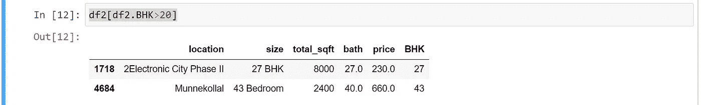

# 孟加拉鲁鲁房价预测

> 原文：<https://medium.com/analytics-vidhya/bengaluru-house-price-prediction-c0fe091b4d09?source=collection_archive---------2----------------------->

## 数据科学回归项目:预测孟加拉国的房价。


**所有需要的库导入**

导入熊猫作为 pd
导入 numpy 作为 np
导入 matplotlib.pyplot 作为 plt

## 数据加载:将孟加拉国房价加载到数据框中。

df = PD . read _ CSV(" Bengal uru _ House _ data . CSV ")
df . head()

df.shape

```
(13320, 9)
```

df . group by(" area _ type ")[' area _ type ']。agg('计数')

```
area_type
Built-up  Area          2418
Carpet  Area              87
Plot  Area              2025
Super built-up  Area    8790
Name: area_type, dtype: int64
```

删除不必要的列，以便更好地理解数据。

df1=df.drop(['availability '，' society '，' area_type '，'阳台']，axis='columns')
df1.head()


df1.isnull()。总和()

```
location       1
size          16
total_sqft     0
bath          73
price          0
dtype: int64
```

df2=df1.dropna()
df2.isnull()。总和()

```
location      0
size          0
total_sqft    0
bath          0
price         0
dtype: int64
```

df2['大小']。唯一()

```
array(['2 BHK', '4 Bedroom', '3 BHK', '4 BHK', '6 Bedroom', '3 Bedroom',
       '1 BHK', '1 RK', '1 Bedroom', '8 Bedroom', '2 Bedroom',
       '7 Bedroom', '5 BHK', '7 BHK', '6 BHK', '5 Bedroom', '11 BHK',
       '9 BHK', '9 Bedroom', '27 BHK', '10 Bedroom', '11 Bedroom',
       '10 BHK', '19 BHK', '16 BHK', '43 Bedroom', '14 BHK', '8 BHK',
       '12 Bedroom', '13 BHK', '18 Bedroom'], dtype=object)
```

df2['BHK']=df2['大小']。apply(lambda x:int(x . split(')[0]))

df2.head()


df2['BHK']。唯一()

```
array([ 2,  4,  3,  6,  1,  8,  7,  5, 11,  9, 27, 10, 19, 16, 43, 14, 12,
       13, 18], dtype=int64) 
```

df2[df2。BHK>20]



# 检查 total_sqft 中的唯一值

df2.total_sqft.unique()

```
array(['1056', '2600', '1440', ..., '1133 - 1384', '774', '4689'],
      dtype=object)
```

def is _ float(x):
try:
float(x)

除:
返回 False
返回 True

df2[~df2['total_sqft']。apply(is_float)]。头部()


**现在将 total_sqft 的所有值转换为浮点值**

def convert _ sqft _ to _ num(x):
tokens = x . split("—"
if len(tokens)= = 2:
return(float(tokens[0])+float(tokens[1]))/2
try:
return float(x)
except:
return None

convert _ sqft _ to _ num(" 2100–2850 ")

```
2475.0
```

df3 = df2 . copy()
df3[' total _ sqft ']= df3[' total _ sqft ']。apply(convert _ sqft _ to _ num)
df3 . head()


df3.loc[30]

```
location      Yelahanka
size              4 BHK
total_sqft         2475
bath                  4
price               186
BHK                   4
Name: 30, dtype: object
```

# 用于异常检测降维的特征工程

df4 = df3 . copy()
df4[' price _ per _ sqft ']= df4[' price ']* 100000/df4[' total _ sqft ']
df4 . head()


len(df4['位置']。唯一())

```
1304
```

df4 . location = df4 . location . apply(lambda x:x . strip())

location _ stats = df4 . group by(' location ')[' location ']。agg('count ')。sort_values(升序=False)
location_stats

```
location
Whitefield           535
Sarjapur  Road       392
Electronic City      304
Kanakpura Road       266
Thanisandra          236
                    ... 
LIC Colony             1
Kuvempu Layout         1
Kumbhena Agrahara      1
Kudlu Village,         1
1 Annasandrapalya      1
Name: location, Length: 1293, dtype: int64
```

location _ stats _ less _ then _ 10 = location _ stats[location _ stats<=10]
location _ stats _ less _ then _ 10

```
location
BTM 1st Stage          10
Basapura               10
Sector 1 HSR Layout    10
Naganathapura          10
Kalkere                10
                       ..
LIC Colony              1
Kuvempu Layout          1
Kumbhena Agrahara       1
Kudlu Village,          1
1 Annasandrapalya       1
Name: location, Length: 1052, dtype: int64
```

df4 . location = df4 . location . apply(lambda x:' other ' if x in location _ stats _ less _ then _ 10 else x)
len(df4 . location . unique())

```
242
```

**异常值检测和去除**

df4.head()


df4[df4.total_sqft/df4。BHK❤00].头部()


df5=df4[~(df4.total_sqft/df4。bhk❤00)】
df5 . head()

df5.price_per_sqft.describe()

```
count     12456.000000
mean       6308.502826
std        4168.127339
min         267.829813
25%        4210.526316
50%        5294.117647
75%        6916.666667
max      176470.588235
Name: price_per_sqft, dtype: float64
```

def remove _ PPS _ outliers(df):
df _ out = PD。DataFrame()
for key，df . group by(' location '):
m = NP . mean(subdf . price _ per _ sqft)
ST = NP . STD(subdf . price _ per _ sqft)
reduced _ df = subdf[(subdf . price _ per _ sqft>(m-ST))&(subdf . price _ per _ sqft<=(m+ST))]
df _ df

df6 =移除 _ pps _ 离群值(df5)
df6.shape

```
(10241, 7)
```

从 matplotlib 导入 py plot as PLT
% matplotlib inline
导入 matplotlib
matplotlib . RC params[' figure . figsize ']=(20，10)

def plot_scatter_chart(df，location):
bhk 2 = df[(df . location = = location)&(df。BHK = = 2)]
bhk 3 = df[(df . location = = location)&(df。BHK = = 3)】
matplotlib . rcparams[' figure . figsize ']=(15，10)
PLT . scatter(bhk 2 . Total _ sqft，BHK2.price，color= '蓝色'，label='2 BHK '，s = 50)
PLT . scatter(bhk 3 . Total _ sqft，BHK3.price，marker='+'，color= '绿色'，label='3 BHK '，s=50)
plt.xlabel("总平方英尺面积")【关键词


def plot_scatter_chart(df，location):
bhk 2 = df[(df . location = = location)&(df。BHK = = 2)]
bhk 3 = df[(df . location = = location)&(df。BHK = = 3)]
matplotlib . RC params[' figure . figsize ']=(15，10)
PLT . scatter(bhk 2 . Total _ sqft，BHK2.price，color= '蓝色'，label='2 BHK '，s = 50)
PLT . scatter(bhk 3 . Total _ sqft，BHK3.price，marker='+'，color= '绿色'，label='3 BHK '，s=50)
plt.xlabel("总平方


> 我们还应该删除相同位置的房产，例如，三居室公寓的价格低于两居室公寓(面积相同)。我们要做的是为一个给定的位置，我们将建立一个字典的统计每 bhk，即。
> 
> { '1' : { 'mean': 4000，' std: 2000，' count': 34 }，' 2' : { 'mean': 4300，' std: 2300，' count': 22 }，
> }

# 现在，我们可以移除每平方英尺价格低于 1 套 BHK 公寓平均每平方英尺价格的 2 套 BHK 公寓

def remove _ BHK _ 离群值(df):
exclude _ indexes = NP . array([])
for location，location _ df in df . group by(' location '):
BHK _ stats = { }
for BHK，BHK _ df in location _ df . group by(' BHK '):
BHK _ stats[BHK]= {
' mean ':NP . mean(BHK _ df . price _ per _ sqft)，
' STD ':NP . STD(BHK _ STD

```
(7329, 7)
```

plot_scatter_chart(df7，“Rajaji Nagar”)


导入 matplotlib
matplotlib . RC params[" figure . figsize "]=(20，10)
PLT . hist(df7 . Price _ Per _ sqft，rwidth=0.8)
plt.xlabel("每平方英尺价格")
plt.ylabel("计数")


**使用浴室功能去除异常值**

df7.bath.unique()

```
array([ 4.,  3.,  2.,  5.,  8.,  1.,  6.,  7.,  9., 12., 16., 13.])
```

plt.hist(df7.bath，rwidth=0.8)
plt.xlabel("浴室数量")
plt.ylabel("计数")


df7[df7.bath>10]

在一个家庭里，浴室的数量比卧室的数量多是不寻常的

浴室。BHK+2]

df8 = df7.drop(['size '，' price_per_sqft']，axis='columns')
df8.head(3)

# 构建 ML 模型

对位置使用一个热编码

dummies = PD . get _ dummies(df8 . location)
dummies . head(10)


df9=pd.concat([df8，dummies.drop('other '，axis='columns')]，axis='columns')
df9.head()

df10 = df9.drop('location '，axis='columns')
df10.head(2)

df10 .形状

**现在就建立一个模型…**

X = df10.drop('price '，axis='columns')
X.head()

y=df10.price
y.head()

```
0    428.0
1    194.0
2    235.0
3    130.0
4    148.0
Name: price, dtype: float64
```

# 线性回归模型

从 sklearn.model_selection 导入 train_test_split
X_train，X_test，y_train，y_test=train_test_split(X，y，test_size=0.2，random_state=10)

从 sklearn.linear_model 导入 linear regression
lr _ clf = linear regression()
lr _ clf . fit(X _ train，y _ train)
lr _ clf . score(X _ test，y_test)

```
0.8909987705740237
```

# 使用 K 倍交叉验证来衡量我们的线性回归模型的准确性

从 sklearn.model_selection 导入 shuffles split
从 sklearn.model_selection 导入 cross_val_score

cv = shuffles split(n _ splits = 5，test_size=0.2，random_state=0)

cross _ val _ score(linear regression()，X，y，cv=cv)

```
array([0.81924325, 0.86698523, 0.86457433, 0.8857566 , 0.86309462])
```

> 我们可以看到，在 5 次迭代中，我们总是得到 80%以上的分数。这很好，但是我们想测试一些其他的回归算法，看看我们是否能得到更好的分数。为此，我们将使用 GridSearchCV

# 使用 GridSearchCV 查找最佳模型

从 sklearn.model_selection 导入 GridSearchCV

从 sklearn.linear_model 导入套索
从 sklearn.tree 导入决策树回归器

def find _ best _ model _ using _ gridsearchcv(X，y):
algos = {
' linear _ regression ':{
' model ':linear regression()，
' params ':{
' normalize ':[True，False]
}
}，
' Lasso ':{
' model ':Lasso()，
'params': {
'alpha': [1，2]，【T23 algos . items():
GS = GridSearchCV(config[' model ']，config['params']，cv=cv，return _ train _ score = False)
GS . fit(X，y)
scores . append({
' model ':algo _ name，
' best _ score ':GS . best _ score _，
' best _ params ':GS . best _ params _
})

返回 pd。DataFrame(scores，columns=['model '，' best_score '，' best_params'])

find _ best _ model _ using _ gridsearchcv(X，y)


> 基于以上结果，我们可以说线性回归给出了最好的分数。因此我们将使用它。

# 测试模型的几个属性

def predict_price(location，sqft，bath，BHK):
loc _ index = NP . where(x . columns = = location)[0][0]

x = NP . zeros(len(x . columns))
x[0]= sqft
x[1]= bath
x[2]= BHK
if loc _ index>= 0:
x[loc _ index]= 1

return lr_clf.predict([x])[0]

predict_price('第一阶段 JP Nagar '，1000，3，2)

```
87.84474705681308
```

predict_price('第一阶段 JP Nagar '，10000，3，3)

```
845.3478190683652
```

predict_price('Indira Nagar '，1000，3，2)

```
157.35447180909193
```

predict_price('Indira Nagar '，10000，3，3)

```
914.8575438206441 
```

# 将测试过的模型导出到 pickle 文件中

用 open(' banglare _ home _ prices _ model . pickle '，' wb ')作为 f:
pickle.dump(lr_clf，f)导入 pickle

# 将位置和列信息导出到一个文件中，这将在我们的预测应用程序中有用

导入 JSON
columns = {
' data _ columns ':[col . lower()for col in x . columns]
}
with open(" columns . JSON "，" w ")as f:
f . write(JSON . dumps(columns))

整个程序可在 [Github](https://github.com/HarshalPatil20/DS_Project/blob/main/Bengaluru_Houses_rate.ipynb) 上获得。

谢了。