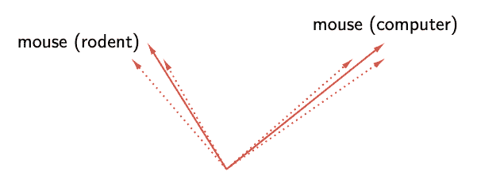
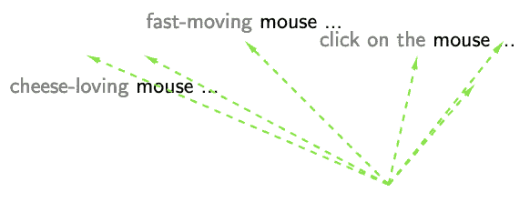
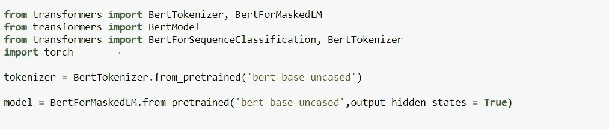
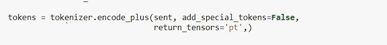
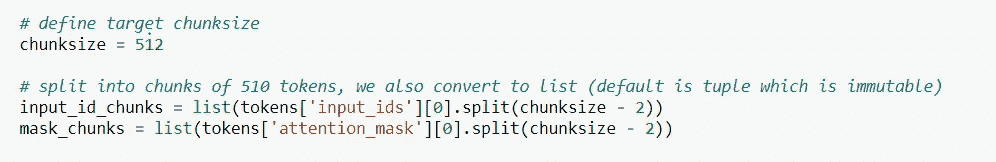
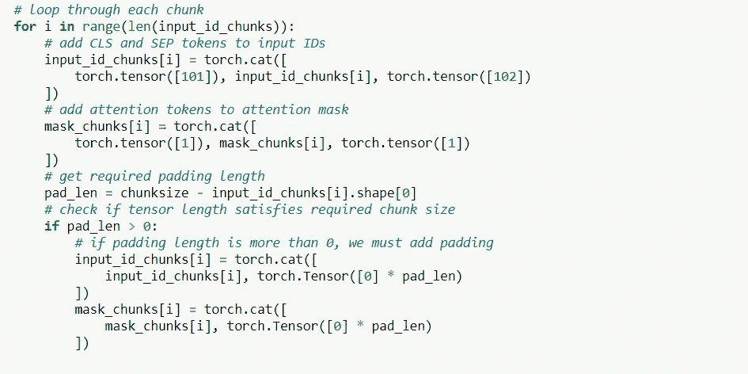
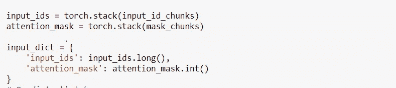
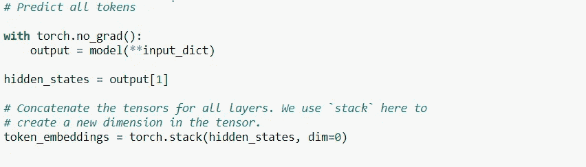
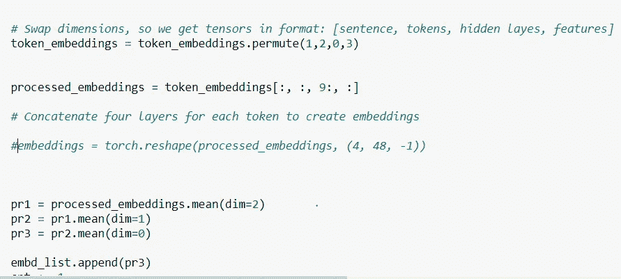
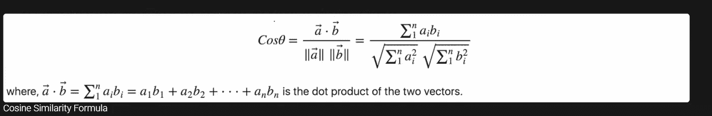

# 用于分类的 BERT 嵌入

> 原文：<https://medium.com/analytics-vidhya/bert-embedding-for-classification-7c51aead26d9?source=collection_archive---------0----------------------->

机器学习的最新进展和不断增长的可用数据对自然语言处理领域产生了巨大影响。它们促进了新的神经架构的发展，并导致许多 NLP 任务的强大改进，如机器翻译或文本分类。一个特别重要的进步是建立高质量的、机器可读的词义表示模型的发展。这些表示通常被称为单词嵌入，是可以在处理文本数据的神经模型中用作特征的向量。

**嵌入类型**

1.静态单词嵌入:

顾名思义，这些单词嵌入在本质上是静态的。这些包含了预先训练的单词值，我们可以在训练模型时使用这些值。

例如， **Glove 和 word2vec** 就是静态单词嵌入的最好例子。这些嵌入大多我们可以使用预训练一次。但是在某些情况下，我们也可以训练这些嵌入。但它将包含高计算能力的 GPU 和大量的时间来从头训练这些嵌入。

2.上下文嵌入:

**上下文嵌入**(例如 ELMo，BERT)，旨在为文档中的每个单词学习一个**连续(向量)表示**。连续表示可以用于下游的机器学习任务。

但是这些情境化的表现有多情境化呢？

考虑一下“鼠标”这个词。它有多个词义，一个指啮齿动物，另一个指一种装置。伯特是否有效地为每个词义创造了一个“鼠标”的表征(左图)？或者伯特创造了无限多的“鼠标”的表现形式，每一个都高度特定于它的上下文(右)？

首先，传统的嵌入只代表两种鼠标之间的区别，而从 BERT 中，我们也可以获得实时上下文。如图所示，喜欢奶酪显示了与啮齿动物的相似性，而对于另一个“点击”显示了相似性。

**我们如何使用嵌入进行分类？**

如果我们没有太多的分类数据，在这种情况下，我们可以使用嵌入的方法，就像我们在暹罗网络中进行面部识别一样。

这种方法基本上称为单次学习或零次学习，我们没有太多的数据来建立任何分类器。在这种情况下，我们可以计算现有标记数据的嵌入，然后根据其嵌入与其他嵌入的接近程度对新数据点进行分类。谁更接近，我们就把它归入那个特定的类别。为了嵌入的紧密性，我们使用余弦相似度函数。

在这个任务中，我将使用拥抱面部库。([https://huggingface.co/transformers/](https://huggingface.co/transformers/)

在下面的用例中，我将展示长句(超过 512 个标记)的嵌入创建。因为我们已经知道使用超过 512 个令牌的 Bert 内存限制。

为了解决这个问题，我在这里使用了滑动窗口技术，这样我们可以一次提取整个语料库的嵌入内容。

加载库

我们使用的是“bert-base-uncased”模型。总是设置**output _ hidden _ States**= True，否则在初始化模型时，模型不会吐出隐藏状态。

在记号赋予器库的帮助下创建文本的记号。在设置 **add_special_tokens= False** 时，特殊令牌(‘CLS’或‘SEP’)不包含在令牌本身中。

为了克服 512 个令牌限制的问题，我们将使用滑动窗口技术。因此，我们将分割输入 id 和注意屏蔽 id，使它们的总长度不超过 512。

将令牌分割成 510 个长度的块。剩下的两个是 CLS 和 SEP 代币

现在，我们可以迭代每一个块，并通过我们的模型传递它们，生成它们中每一个的嵌入。

这里 torch.tensor([101])和([102])表示“CLS 和 SEP”记号。在将这些标记添加到输入块之后，我们还需要检查填充。大多数情况下，在最后一次迭代中，我们的输入长度会小于 510。

在我们的例子中，只在最后一次迭代中需要填充。下面我们准备输入标识和掩码标识，然后将它们传递到模型中。

在传递到模型之前转换为长张量和短张量

该模型将以元组格式显示输出和隐藏状态。Bert total 将发送 13 层(也包括输入嵌入)。但是根据研究人员的说法，嵌入的最后一层包含了关于语料库上下文的大部分信息。这就是为什么我们只取最后 9 层来为我们的语料库创建嵌入。

下面的代码只得到 4 层隐藏状态，并取出它们的平均值。

隐藏层形状=[句子数量或批量大小、总标记、隐藏层数量、特征数量]

取 9 层的平均值。

toek_embedding[:，:，9:，:] →给出最后 4 个隐藏层以获得更好的上下文。

这不是我们文档的最终嵌入，因为我们已经将文档分成了 510 个令牌的块。因此，我们将迭代每个块，并获得其最后 4 层嵌入的平均值。最后，我们也可以取所有标记嵌入的平均值，以得到文档的最终嵌入。

一旦我们有了文档的最终嵌入，我们就可以很容易地借助余弦相似度找到它与其他文档的相似度。

**什么是余弦相似度？**

***余弦相似度是一种度量标准，用于衡量文档无论大小有多相似。在数学上，它测量的是在多维空间中投影的两个向量之间的角度余弦。余弦相似性是有利的，因为即使两个相似的文档相距欧几里德距离很远(由于文档的大小)，它们仍有可能更靠近在一起。角度越小，余弦相似度越高。***

或者我们可以使用 PyTorch 的内置功能

cos = torch . nn . cosine similarity(dim = 0，eps=1e-6)

相似度= cos(sent1 嵌入，sent2 嵌入)

感谢阅读！！

参考资料:

 [## 伯特、埃尔莫和 GPT-2:语境化的单词表征有多语境化？

### 将上下文结合到单词嵌入中——如伯特、埃尔莫和 GPT-2 所举的例子——已被证明是一个分水岭

ai.stanford.edu](http://ai.stanford.edu/blog/contextual/)