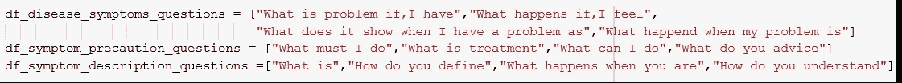
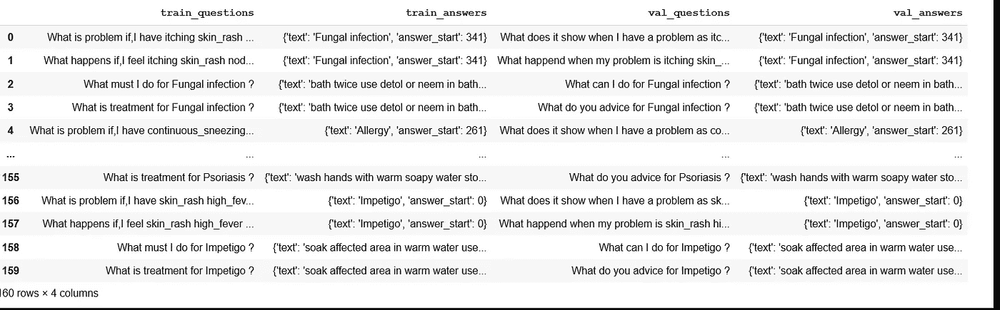
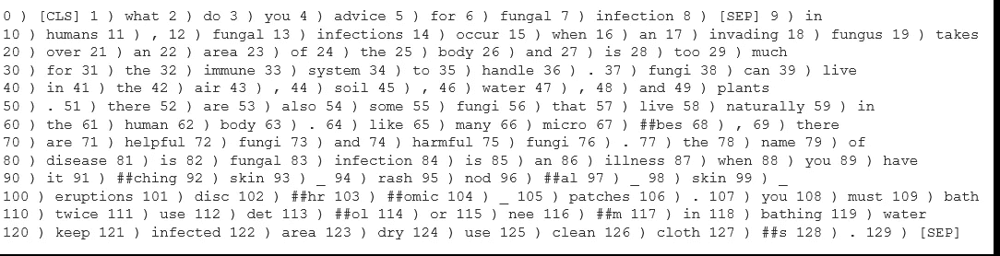

# 伯特微调问题回答

> 原文：<https://medium.com/analytics-vidhya/bert-fine-tune-for-question-answering-75718d94f8b3?source=collection_archive---------7----------------------->

在上一篇文章中，我展示了 Bert 在回答问题时的基本用法。现在，我将尝试展示我们如何针对 QA 对 Bert 进行微调。

代码在 github : [链接](https://github.com/mcelikkaya/medium_articles2/blob/main/bert_qa_tune.ipynb)
可以在 nbviewer 查看:[链接](https://nbviewer.jupyter.org/github/mcelikkaya/medium_articles2/blob/main/bert_qa_tune.ipynb)

我发现了一个用于生成数据的开放健康集。生成数据集的代码变得有点复杂。我的意图是将疾病描述、症状和预防措施结合到一个上下文中，并为所有疾病生成问题。最后，数据集生成部分变得如此漫长。你不必担心去理解那部分。只需检查代码中的问题和答案。

下面是“真菌感染”的一个例子。

```
In humans, fungal infections occur when an invading fungus takes over an area of the body and is too much for the immune system to handle. Fungi can live in the air, soil, water, and plants. There are also some fungi that live naturally in the human body. Like many microbes, there are helpful fungi and harmful fungi.The name of disease is Fungal infection is an illness when you have itching  skin_rash  nodal_skin_eruptions  dischromic _patches . You must bath twice use detol or neem in bathing water keep infected area dry use clean cloths .
```

然后我们生成一个如下的问题映射。文本是问题的答案，答案的开始和结束标志着答案的部分。检查代码，看看我是如何生成这些的。459–544 是序列开始和结束时字符串的 indexof char 的跨度。(非令牌索引)

```
**Context**: What is Fungal infection
{'text': 'In humans, fungal infections occur when an invading fungus takes over an area of the body and is too much for the immune system to handle. Fungi can live in the air, soil, water, and plants. There are also some fungi that live naturally in the human body. Like many microbes, there are helpful fungi and harmful fungi.The name of disease is Fungal infection is an illness when you have itching  skin_rash  nodal_skin_eruptions  dischromic _patches . You must bath twice use detol or neem in bathing water keep infected area dry use clean cloths', 
**Question** : What is treatment for Fungal infection
**Answer :** {'**text**': 'bath twice use detol or neem in bathing water keep infected area dry use clean cloths', '**answer_start**': 459, '**answer_end**': 544}
```

其他一些示例问题如下:

```
**What** must I do for GERD ? 
**What** is treatment for GERD ? 
**What** is problem if,I have itching  vomiting  yellowish_skin  nausea  loss_of_appetite  abdominal_pain  yellowing_of_eyes ? 
**What** happens if,I feel itching  vomiting  yellowish_skin  nausea  loss_of_appetite  abdominal_pain  yellowing_of_eyes ? 
**What** must I do for Chronic cholestasis ? 
**What** is treatment for Chronic cholestasis ?
```

从这种背景下，我试着提出以下三种问题。(我对第三种问题类型进行了评论，因为它适用于很长的答案。如果愿意，您可以启用并尝试。这样就变得更简单了)
我用 1，2 个问题生成培训问题，用 3，4 个问题生成验证问题。我试着使用相似的语义，这样一旦训练完毕，我们的模型就能理解对方。我的意思是，在训练时，我带着“我必须做什么”、“治疗是什么”的问题进行训练，同时确认“我能做什么”、“你有什么建议”。我希望 model 能够捕捉到这些句子之间的一些语义相似性，并捕捉到答案。虽然我改变了问题的词汇，但我希望 Bert QA 能够理解。



**问题模板**

这个数据集设计得不是很好。但是演示如何微调已经足够好了。在下面，我放了一个熊猫问答的数据框。在行中，您可以看到针对训练集和验证集的相同问题。



**样本训练和配对验证对**

现在我们有了数据集，我们将像训练其他 Pytorch 网络一样训练它。下面是我们模型的火车模型代码。正如您从第 9 行看到的，我们从 trainloader 获得[ **输入 _ ids，注意 _ 屏蔽，开始 _ 位置，结束 _ 位置** ]。我们将这些参数提供给模型，并接收输出。

在第 14 行上面，你可以看到我们直接从模型中得到输出损失。事实上，它返回所有必要的东西，所以我们不需要定义一个损失函数和计算损失。[ **'loss '，' start_logits '，' end_logits'** ]
只需向后做损耗和优化器步骤就够了。(第 15 行和第 16 行)

```
 QuestionAnsweringModelOutput([
('**loss**',tensor(1.0271, device='cuda:0', grad_fn=<DivBackward0>)),
('**start_logits**',tensor([[-3.5199,  3.2519, -1.5817,  ..., -4.4916, -4.5127, -4.6273],...[-3.3697,  3.4824, -0.0218,  ..., -4.3845, -4.6916, -4.6110]],device='cuda:0', grad_fn=<SqueezeBackward1>)),
('**end_logits**',tensor([[-3.3699,  0.0322, -1.5576,  ..., -4.3366, -4.2556, -4.5339],[-2.7250,  0.7888,  3.1131,  ..., -3.8722, -4.4364, -3.5741]], device='cuda:0', grad_fn=<SqueezeBackward1>))])
```

你也可以检查 eval_loader 方法，我们在那里计算精度。在下面的第 15 行，你可以看到我们用与 train 相同的参数调用这个模型。我们正在检查答案是否与我们的验证答案相同。此外，如果您想知道在早期阶段学习了哪些问题，您可以使用 dump_equal True 调用方法，并查看以何种顺序学习了哪些验证问题。

还要记住，这些包不做分词。他们正在削减一些后修复和附加一些特殊字符。我们这里使用的记号赋予器有如下定义。

```
PreTrainedTokenizerFast(name_or_path='distilbert-base-uncased', vocab_size=30522, model_max_len=512, is_fast=True, padding_side='right', special_tokens={'unk_token': '[UNK]', 'sep_token': '[SEP]', 'pad_token': '[PAD]', 'cls_token': '[CLS]', 'mask_token': '[MASK]'})
```

下面显示了一个示例问题上下文对编码。

**“你对真菌感染有什么建议”** 令牌如下，如你所见
【CLS】+question+[SEP]+context



经过 5 个时期，我可以看到模型达到了%89 的精确度。虽然数据集不太好，但 Bert QA 学会了与我的数据集保持一致。在下一篇文章中，我将可视化微调过程。