# 伯特微调可视化

> 原文：<https://medium.com/analytics-vidhya/bert-fine-tune-visualization-5b405991c84d?source=collection_archive---------12----------------------->

在之前的文章([链接](/@celikkam/understanding-bert-usage-31af2042be9e))中，我展示了 Bert 的基本用法。现在是时候对它进行微调和可视化了。在之前的帖子中，我们看到了 Bert 如何在没有任何训练的情况下为我们生成单词和句子的编码。大多数时候，这对我们的问题来说已经足够了。但我想看看伯特训练后的嵌入变化。

代码在 github [链接](https://github.com/mcelikkaya/medium_articles/blob/main/bert_usage_and_finetune.ipynb)
用 nbviewer 看颜色更好。[链接](https://nbviewer.jupyter.org/github/mcelikkaya/medium_articles/blob/main/bert_usage_and_finetune.ipynb)

我有一个非常简单的英语句子数据集。我可以根据动词(3 个目标类，吃喝和阅读)或根据对象(6 个目标类苹果，面包，水，啤酒，书，报纸)来做分类任务。从之前的帖子中，我知道了句子的分布，没有任何微调。微调后，我的期望是我的班级有更好的集群。(相似的物品分组在一起，离其他物品较远)。我建议你打开两篇文章，对比一下“未训练”和“训练后”的图片。

**数据集中的句子**

我正在定义一个非常简单的网络。网络从 Bert 得到嵌入，应用 RELU 和线性层做分类。我运行了 6 个时期的训练(因为我的问题很小，像数据这样的单元测试，6 个时期就足够了)

现在微调已经完成。如果我根据动词检查句子的分布(下图)，我可以看到相似的项目形成了集群。我们的网络学会了将相似的物品组合在一起，并将其他物品推得远远的。

我们在这里做的是把一个额外的层添加到 Bert 的末尾。你可能会想，是**只有**我们的网络知道，还是**伯特也知道。既然我们将 Bert 置于“训练”模式，我们也期望 Bert 改变它的权重，生成不同于它之前创建的初始向量的向量。我们也来看看伯特会创造什么。**

**句子嵌入在训练后有什么变化？在之前的文章中，我使用了伯特这个名字。(看图)。现在你可以看到向量是根据我们的目标排列的(它们以更好的方式形成了动词群)。所以训练过程创造了我们想要的句子向量。**

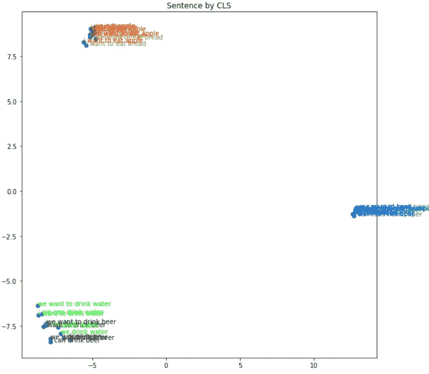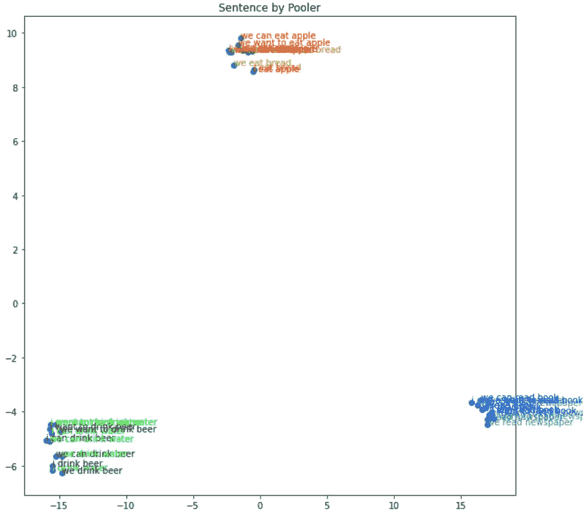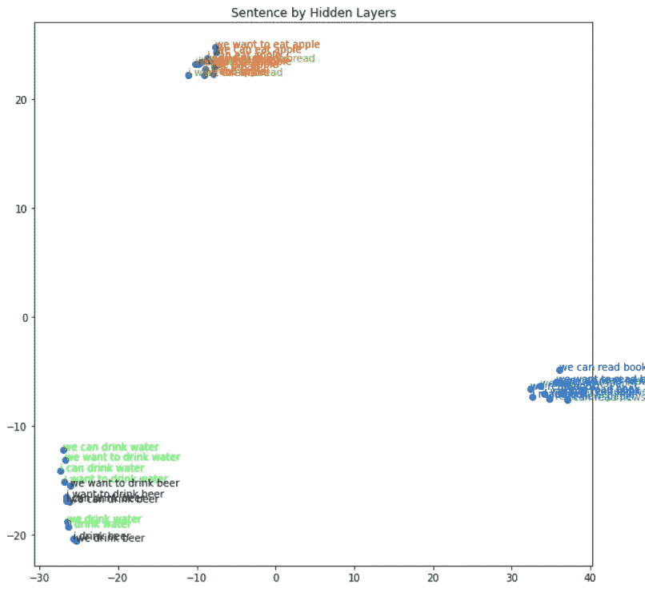

**训练后隐藏层嵌入如何变化？**

伯特有 12 个变形层。我想把这些层形象化，看看他们学到了什么。在最初的 Bert 编码中，他们被训练处理不同的问题，最后一层根据这些问题进行分配。现在我希望最后一层有一个根据我的分类问题的分布。在以前的文章中，矢量分散在最后几层，现在你可以看到所有的矢量都是所有层中的簇。还要检查最后一层，动词有非常密集的簇，它们以一种完美的方式与我们的最终目标保持一致。

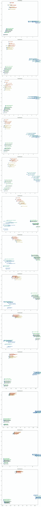

**单词嵌入在训练后有什么变化？** 在之前的帖子中，我们嵌入了单词“吃”并检查了它的分布。在这里，你可以看到它们也随着更好的分布而得到了改进。由于单词向量有更好的分离，我们可以说网络是为我们的目标而训练的。同样检查这些向量的余弦表，你可以看到我们有 0.97 和 0.98 的相似度，比以前更高，这意味着我们的向量比以前更接近了。你明白为什么训练后面包和苹果会分开吗？因为我们的目标是按动词分组，但按宾语分组意味着同样的事情。(面包和苹果- >群吃，水和啤酒- >群喝，书和报纸- >群读)。所以里面吃的东西，物体也分开了。

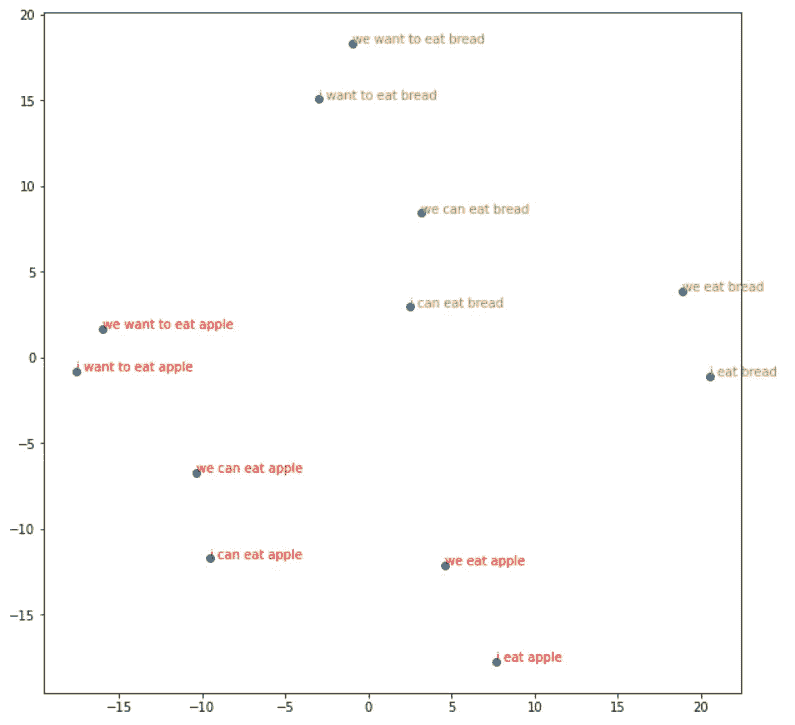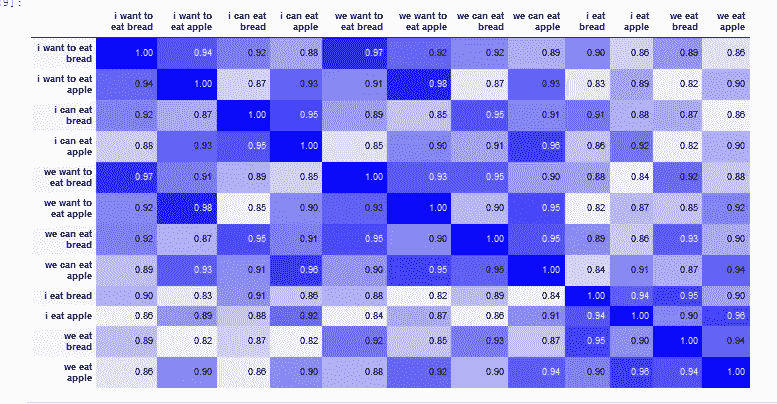

**“吃”矢量的余弦值**

现在我们展示了根据我们的问题训练 Bert 后的变化。您看到了单词和句子的嵌入是如何变得更好的。也尝试将隐藏层与之前的层进行比较，以了解学习情况。

**按对象训练网络**

我们可以为另一个目标训练网络。这次让我们按句子的宾语来训练。让我们创建 6 个目标类(面包、苹果、水、啤酒、书、报纸)。这一次，我希望向量根据对象更好地对齐。如果您想尝试这些事情，请在源代码中找到带有“取消注释”的行，并尝试这样做。

在下面的图片中，你可以看到一些“物体群”是如此的密集。这意味着网络学得很好。(它为同一组生成了非常相似的向量)

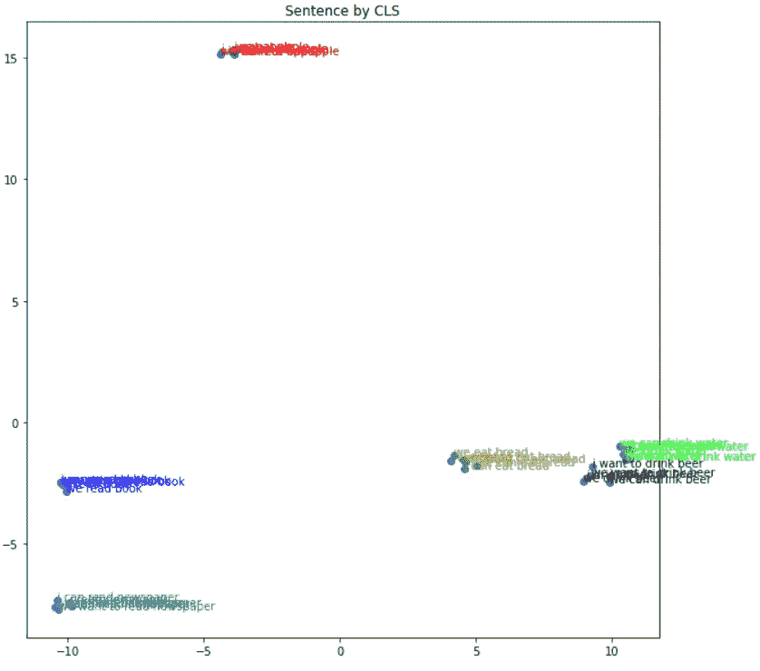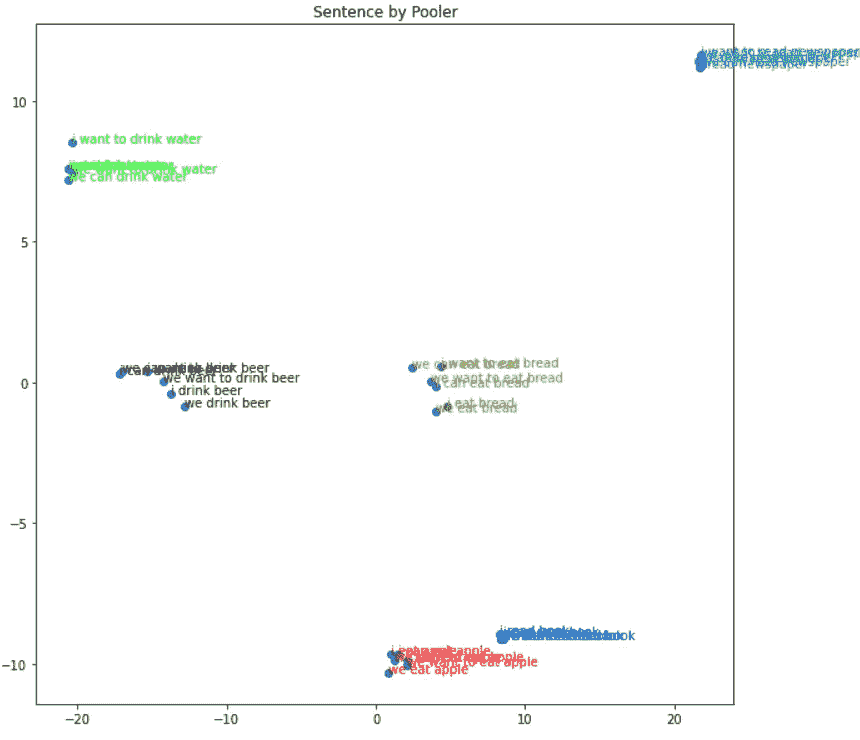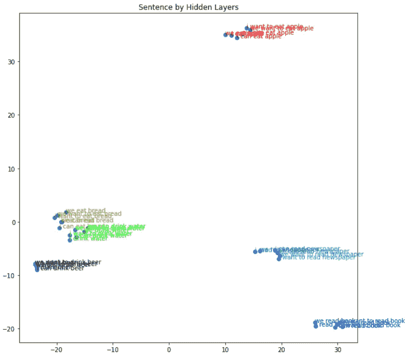

我们还可以再次检查 eat 的嵌入。下面我们看到“吃”嵌入的 12 个句子。如你所见“**面包**”和“**苹果**”彼此分离得如此之好。所以我们的网络做得很好。将此与以前的培训或未培训的(在以前的文章中)进行比较。你可以清楚地看到变化。另外，如果您查看下表，您可以看到余弦分数现在更加分散。这也很好，因为我们的网络知道“吃苹果”和“吃面包”非常不同

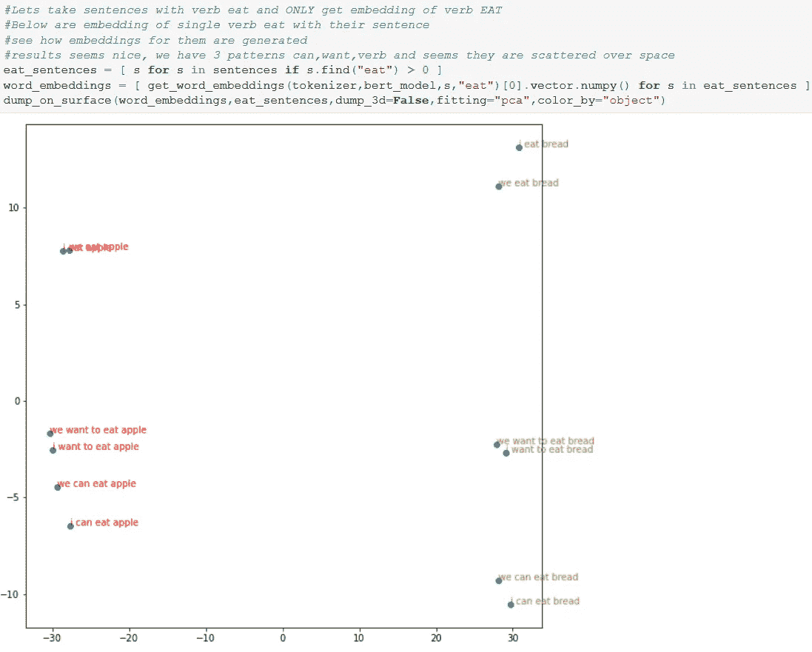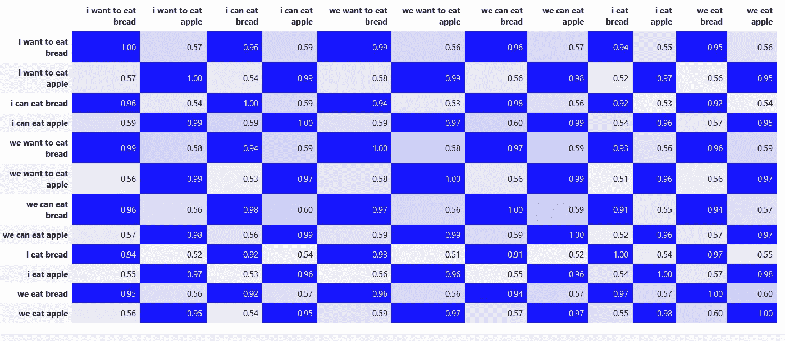

**按科目划分的培训网络**

如果我们用两个班训练，我们会有有趣的结果。(“我”和“我们”)。如果您想尝试这些事情，请在源代码中找到带有“取消注释”的行，并尝试这样做。在下面的图片中,“我们”和“我”句子是如何相互远离的。

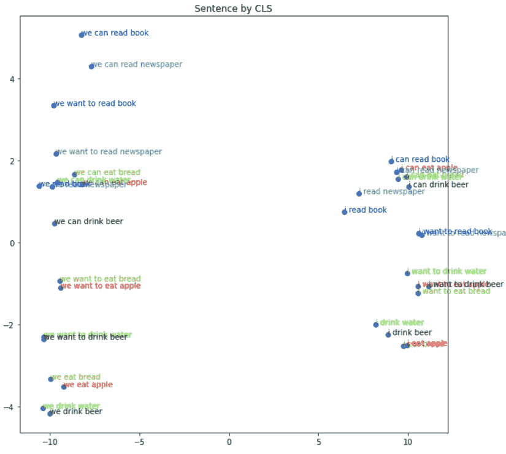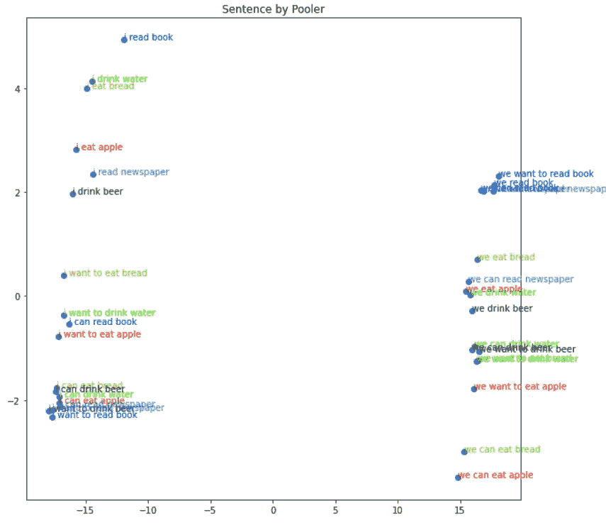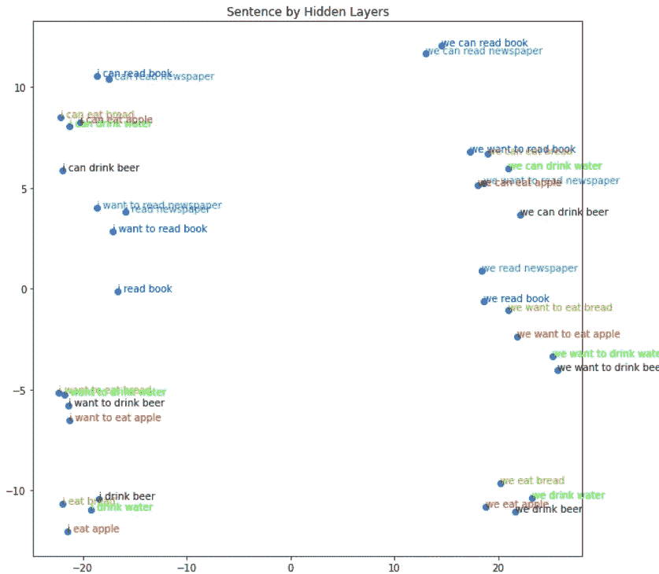

我们还可以再次检查 eat 的嵌入。下面我们看到“**吃**”嵌入的 12 个句子。正如你看到的“**面包**”和“**苹果**”根据主题彼此分开。所以我们的网络做得很好。将此与之前的培训或未培训的培训(在之前的文章中)进行比较。你可以清楚地看到变化。

另外，如果您查看下表，您可以看到余弦分数现在更加分散。这也很好，因为我们的网络知道“吃我”和“吃我们”是非常不同的

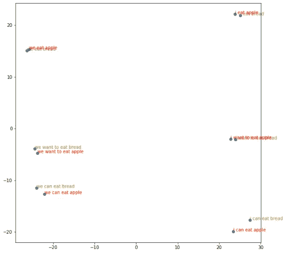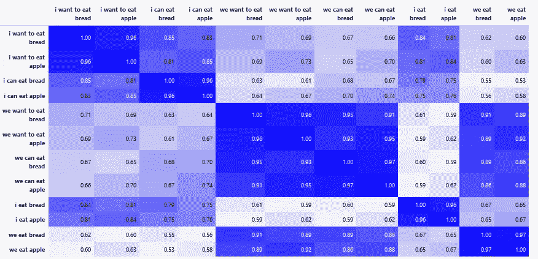

在本文中，我们针对不同的目标训练了多个网络。我们看到了根据训练目标，对于**单词**、**句子**或**隐藏层**，Bert 嵌入是如何变化的。我们证明了通过训练，根据我们的下游任务，Bert 为我们生成了更好的向量。通过本文中的方法，您可以了解 Bert 对于您的特定问题是否取得了进展。