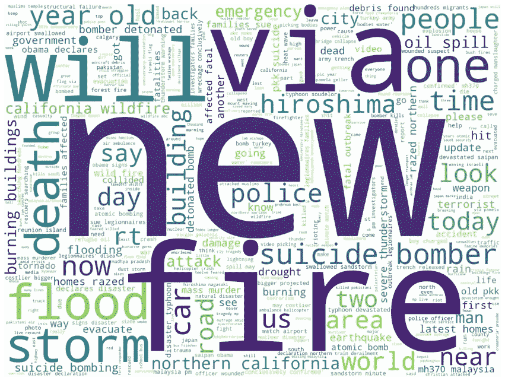
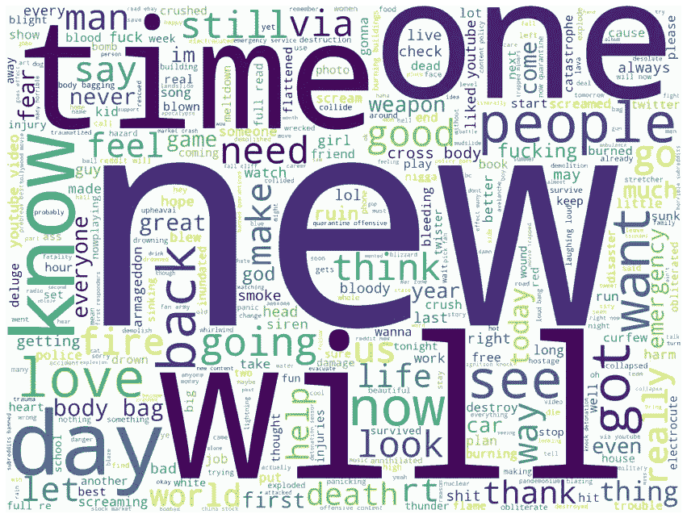
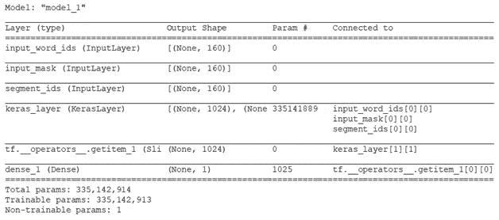
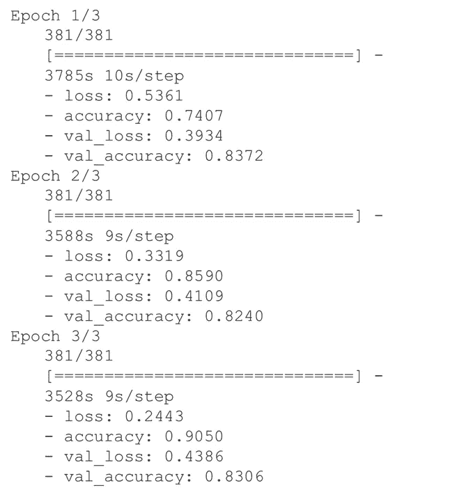
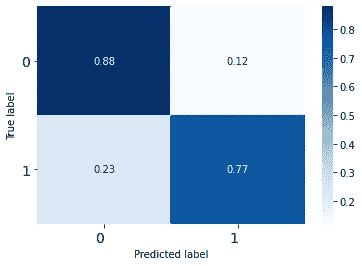
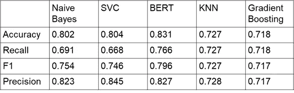

# 伯特从推特上识别灾难

> 原文：<https://medium.com/analytics-vidhya/bert-for-identifying-disasters-from-tweets-50eeb6844302?source=collection_archive---------6----------------------->

詹妮弗·波切内克、约瑟夫·拉森、姚世波和杨一凡

利用 Kaggle 竞赛的数据([自然语言处理灾难推文](https://www.kaggle.com/c/nlp-getting-started/overview))，我们的团队使用 BERT 模型来预测推文是否包含真实的或非真实的灾难。

想想真实和非真实灾难之间的区别，比如“主街上的房子着火了，一家三口都死了”和“我的家人围在火堆旁真好”，或者“瓦斯爆炸造成数千人损失，没有人受伤”和“不要错过比特币爆炸！”作为人类，我们可以很容易地解读每一句话背后的情绪和意图，并识别出哪些是真正的灾难，哪些不是，但计算机在这方面不太熟练。

虽然我们在检查这个数据集的过程中创建了许多新的变量(这是将来另一篇媒体文章的主题)，但选择的 BERT 模型只使用了干净的 tweet 文本。下面提供的文字云显示了真实和非真实灾难中经过清理的推文文本。



图一。真实灾难的文本(仅限训练集)

两个词云(顶部和底部)使用相同的种子制作，因此相似频率的词将以相同的位置、大小和颜色显示，以方便两者之间的比较。正如我们在顶部看到的，最常见的词是“新”，在底部的图像中也是如此。此后结果出现分歧。这些差异是任何使用的机器学习或深度学习都需要挑选和识别的部分。



图二。非真实灾难推文

BERT 是如何工作的，为什么它在 NLP 中如此出色，这可以通过专门的文章得到最好的解释(参见 [Horev](https://towardsdatascience.com/bert-explained-state-of-the-art-language-model-for-nlp-f8b21a9b6270) 、 [Wei](https://towardsdatascience.com/bert-why-its-been-revolutionizing-nlp-5d1bcae76a13) 或 [Rizvi](https://www.analyticsvidhya.com/blog/2019/09/demystifying-bert-groundbreaking-nlp-framework/) 中一些精彩的解释，我们也参考这些解释来更好地理解和编程我们的 BERT 模型)。我们选择使用 BERT uncased 英语模型，该模型位于:[https://tfhub . dev/tensor flow/BERT _ en _ un cased _ L-24 _ H-1024 _ A-16/1](https://tfhub.dev/tensorflow/bert_en_uncased_L-24_H-1024_A-16/1)

自从使用它以来，模型已经更新，但是我们将继续使用链接中的那个来匹配我们的初始结果。该模型使用 24 个隐藏层，隐藏大小为 1024，有 16 个注意头。这个模型是在维基百科和图书语料库上为英语预先训练的。输入类型是不区分大小写的，这意味着在标记化之前文本必须被设置为小写，并且任何重音符号都必须被去除，以便正确地利用这个模型。如果您的输入混合了大写和小写，或者如果重音符号很重要，那么还有其他预先训练好的 BERT 模型可供您使用。

虽然我们也使用 NLTK 对文本进行了标记化，但我们选择对未标记的文本使用 BERT 的标记化器，以更好地匹配预训练模型中的语言。这里有 tokenizer:[https://raw . githubusercontent . com/tensor flow/models/master/official/NLP/Bert/tokenization . py](https://raw.githubusercontent.com/tensorflow/models/master/official/nlp/bert/tokenization.py)

其中一个步骤是构建我们的助手函数:

```
def bert_encode(texts, tokenizer, max_len=512):
  all_tokens = [] 
  all_masks = []
  all_segments = []
  for text in texts:
     text = tokenizer.tokenize(text)
     text = text[:max_len-2]
     input_sequence = ["[CLS]"] + text + ["[SEP]"]
     pad_len = max_len - len(input_sequence)
     tokens = tokenizer.convert_tokens_to_ids(input_sequence)
     tokens += [0] * pad_len
     pad_masks = [1] * len(input_sequence) + [0] * pad_len
     segment_ids = [0] * max_len
     all_tokens.append(tokens)
     all_masks.append(pad_masks)
     all_segments.append(segment_ids)
  return np.array(all_tokens), np.array(all_masks), np.array(all_segments)def build_model(bert_layer, max_len=512):
  input_word_ids = Input(shape=(max_len,), dtype=tf.int32, name="input_word_ids")
   input_mask = Input(shape=(max_len,), dtype=tf.int32, name="input_mask")
   segment_ids = Input(shape=(max_len,), dtype=tf.int32, name="segment_ids")
   _, sequence_output = bert_layer([input_word_ids, input_mask, segment_ids])
   clf_output = sequence_output[:, 0, :]
   out = Dense(1, activation='sigmoid')(clf_output)
   model = Model(inputs=[input_word_ids, input_mask, segment_ids], outputs=out)
   model.compile(Adam(lr=2e-6), loss='binary_crossentropy', metrics=['accuracy'])
   return model
```

现在我们需要设置我们的层:

```
module_url = "https://tfhub.dev/tensorflow/bert_en_uncased_L-24_H-1024_A-16/1"
bert_layer = hub.KerasLayer(module_url, trainable=True)
vocab_file = bert_layer.resolved_object.vocab_file.asset_path.numpy()
do_lower_case = bert_layer.resolved_object.do_lower_case.numpy()
tokenizer = tokenization.FullTokenizer(vocab_file, do_lower_case)
```

最后建立模型:

```
model = build_model(bert_layer, max_len=160)
model.summary()
```

请参见下面的模型摘要。这是一个相当简单的 BERT 设置。



图 3。模型摘要

Colab TPU 的总训练时间为 3 小时，我们确定 3 个时期是合适的，因为超过 3 个时期会导致模型过度适应训练集(验证集的性能下降)。



图 4。伯特的训练成绩

我们的最终模型性能如下:

*   精确度:0.831
*   召回率:0.766
*   F1: 0.796
*   精度:0.827

标准化的混淆矩阵如下。



图 5。归一化混淆矩阵。

虽然该模型在预测非灾害方面比实际灾害更好，但它的表现优于在同一数据集上使用的其他模型。总的来说，我们使用了多项式朴素贝叶斯、支持向量机、K 近邻、梯度推进和 BERT。其中，伯特在预测一条推文是否涉及真实或非真实的灾难方面表现最佳。



表 1。结果我们的 ML 方法，伯特是最好的