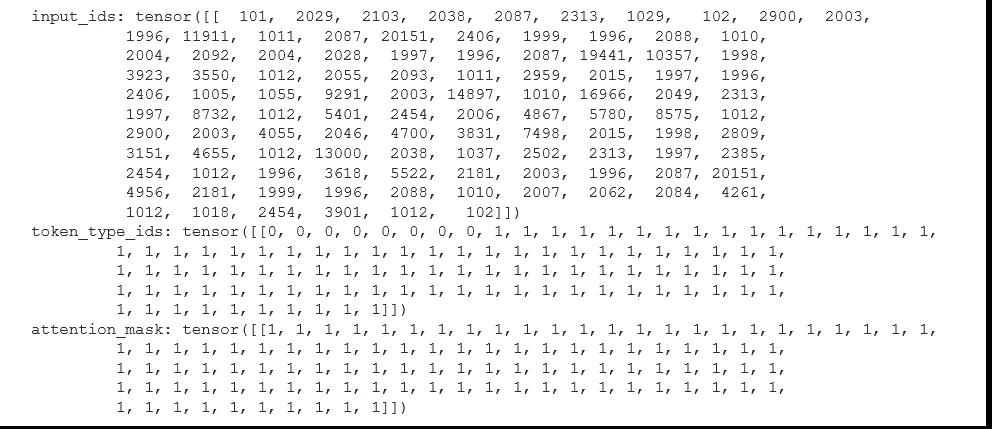
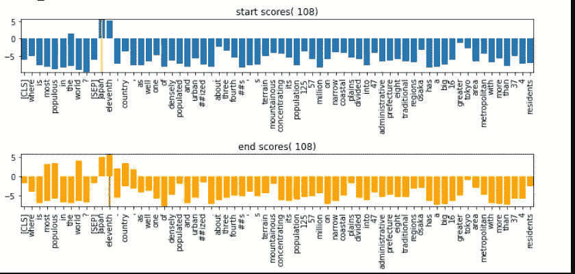

# 用于问答的 Bert

> 原文：<https://medium.com/analytics-vidhya/bert-for-question-answering-cd00741d1dab?source=collection_archive---------6----------------------->

在这篇文章中，我将展示“Bert 问答”( **Bert QA** )的基本用法，在接下来的文章中，我将展示如何微调。
github 代码:[链接](https://github.com/mcelikkaya/medium_articles2/blob/main/bert_question_answer.ipynb)

像所有的变压器一样，用法非常简单。我们给出两个参数上下文和问题。上下文是你的段落，问答将在其中搜索你的答案。

在第 10 行，你可以看到我们正在对上下文和问题进行编码。“inputs _ ids”是文本的标记化 id。在下图中你可以看到结果。Tokenizer 为我们返回 3 个张量。Bert QA 在上下文前附加问题。如果你的上下文太长，你可以把它分成几部分，然后把问题附加到所有这些部分上。**标记类型** 0 用于问题部分，1 用于上下文。



**encode _ plus 方法的输出**

如果您解码这些 id，输出将如下所示。
**CLS +问句+ SEP +语境**

```
tokenizer.decode( answer_map[“input_ids”] )[CLS] where is most populous in the world? [SEP] japan is the eleventh - most populous country in the world, as well as one of the most densely populated and urbanized. about three - fourths of the country's terrain is mountainous, concentrating its population of 125\. 57 million on narrow coastal plains. japan is divided into 47 administrative prefectures and eight traditional regions. osaka has a big population of 16 million. the greater tokyo area is the most populous metropolitan area in the world, with more than 37\. 4 million residents. [SEP]
```

我们将这一信息输入到模型中。(第 14 行)
输出是上述编码输入中每个位置的多个分数的张量。" **start_logits** "和" **end_logits** "确定答案的开始和结束。因为这些是分数，所以它们在顺序中是可能的。(还要注意，文档说所有逻辑输出对都是候选答案。逻辑的意思是开始索引小于结束索引，并且开始索引不是 0，也不是问题或 CLS 的开始)

模型将返回一个分数为所有令牌给我们，这有可能是正确的答案。我可以想象出如下的答案。如你所见，算法关注于回答开始的早期标记。同样，对于这个问题，第一个答案是日本，因此结束令牌仅在开始令牌之后 1 个令牌。你可以在橙色柱状图中看到。



现在让我们检查一些输入和输出对，以理解 Bert 在为我们做什么。我这里用的模型是**“Bert-large-uncase-whole-word-masking-fine tuned-squad”**。因此，问题和回答风格必须类似于班数据集，以获得更好的结果。测试时不要忘记这一点。

```
**Question: Most populous city ?**
**Answers:**
1  )  greater tokyo
2  )  osaka
4  )  the greater tokyo area is the most populous metropolitan area in the world, with more than 37\. 4 million residents.
5  )  japan is the eleventh - most populous country in the world, as well as one of the most densely populated and urbanized. about three - fourths of the country's terrain is mountainous, concentrating its population of 125\. 57 million on narrow coastal plains. japan is divided into 47 administrative prefectures and eight traditional regions. osaka has a big population of 16 million. the greater tokyo area is the most populous metropolitan area in the world
**Question: Most populous city**
**Answers:**
1  )  japan is the eleventh - most populous country in the world
2  )  greater tokyo
3  )  eleventh - most populous country in the world, as well as one of the most densely populated and urbanized.
4  )  the greater tokyo area is the most populous metropolitan area in the world, with more than 37\. 4 million residents.
```

上面你可以看到两个问题和它们可能的答案。例如，在第一个问题中，缺少第三个答案。这意味着答案的结束索引小于其开始索引，因此不是有效答案。你可以看到问题只有问号不同，但答案不同。所以我们可以理解 BERT QA 对标点符号比较敏感。

把更多的样品放在上面。你可以自己玩代码，写更好的问题，上下文并试图更好地理解。你可以看到前一个答案更有意义，第四个答案后，它们似乎有点不相关。

```
**Question: Where is the most populous metropolitan area in the world ?**
**Answers**:
1  )  greater tokyo area
2  )  the greater tokyo
3  )  tokyo area is the most populous metropolitan area in the world, with more than 37\. 4 million residents.
4  )  japan is the eleventh - most populous country in the world, as well as one of the most densely populated and urbanized. about three - fourths of the country's terrain is mountainous, concentrating its population of 125\. 57 million on narrow coastal plains. japan is divided into 47 administrative prefectures and eight traditional regions. osaka has a big population of 16 million. the greater tokyo area is the most populous metropolitan area in the world
5  )  japan is divided into 47 administrative prefectures and eight traditional regions. osaka has a big population of 16 million. the greater tokyo area is the most populous metropolitan area in the world,
**Question: Where is the most populous city ?**
**Answers**:
1  )  osaka
2  )  greater tokyo
4  )  japan
5  )  the greater tokyo area
**Question: What is the most populous city ?**
**Answers**:
1  )  osaka has a big population of 16 million. the greater tokyo
5  )  japan is the eleventh - most populous country in the world, as well as one of the most densely populated and urbanized. about three - fourths of the country's terrain is mountainous, concentrating its population of 125\. 57 million on narrow coastal plains. japan is divided into 47 administrative prefectures and eight traditional regions. osaka has a big population of 16 million. the greater tokyo area
**Question: Where is most populous in the world ?**
**Answers**:
1  )  japan is the eleventh
3  )  the eleventh - most populous country in the world
**Question: Where is most populous?**
**Answers**:
1  )  eleventh - most populous country in the world
2  )  japan is the eleventh
**Question: What is Population of Tokyo ?**
**Answers**:
1  )  37\. 4 million
2  )  more than 37\. 4 million residents
3  )  the greater tokyo area is the most populous metropolitan area in the world, with more than 37\. 4 million residents.
4  )  tokyo area is the most populous metropolitan area in the world, with more than 37\. 4
5  )  greater tokyo area is the most populous metropolitan area in the world, with more than 37
Question: Which city is most crowded in the world ?
Answers:
1  )  japan
2  )  tokyo
3  )  osaka
5  )  the greater tokyo area is the most populous metropolitan area in the world, with more than 37\. 4 million residents.
**Question: Which city has biggest population ?**
**Answers**:
1  )  osaka
2  )  16 million
4  )  japan is the eleventh - most populous country in the world, as well as one of the most densely populated and urbanized. about three - fourths of the country's terrain is mountainous, concentrating its population of 125\. 57 million on narrow coastal plains. japan is divided into 47 administrative prefectures and eight traditional regions. osaka has a big population of 16 million. the greater tokyo
**Question: Which city has most population ?**
**Answers**:
1  )  osaka
2  )  japan is the eleventh - most populous country in the world, as well as one of the most densely populated and urbanized. about three - fourths of the country's terrain is mountainous, concentrating its population of 125\. 57 million on narrow coastal plains. japan is divided into 47 administrative prefectures and eight traditional regions. osaka has a big population of 16 million.
4  )  greater tokyo
```

在这篇文章中，我试图展示**伯特问题回答**的基本用法。在第二篇文章中，我会试着展示微调，然后我会试着想象伯特在学什么。您可以玩代码，生成更有意义的问题，并尝试您的测试用例。由于这是使用班数据集，上下文，问题和答案必须类似于班风格，以获得良好的结果。