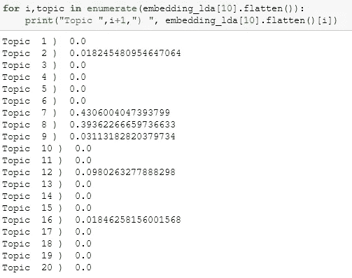
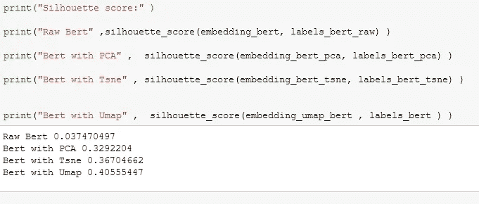

# 用于主题建模的 Bert(Bert vs LDA)

> 原文：<https://medium.com/analytics-vidhya/bert-for-topic-modeling-bert-vs-lda-8076e72c602b?source=collection_archive---------1----------------------->

在这篇文章中，我将使用 LDA ( **潜在的狄利克雷分配**，它是为这个目的而设计的)和单词嵌入来进行主题建模。我将尝试对不同降维算法组合(TF-IDF、LDA 和 Bert)应用主题建模(PCA、TSNE、UMAP)。

代码在 github。([链接](https://github.com/mcelikkaya/medium_articles2/blob/main/bertlda_topic_modeling.ipynb)

我要用的数据集是，sk learn“fetch _ 20 news groups”。我将下载所有组并用作数据。我做一些非常基本的清洁工作。我的最终数据集有 11300 个条目。详情请查看方法“ **build_data** ”。

**话题建模**的本质是一种利用频率项矩阵的问题。如果一些单词在一些文档中出现得更多，这意味着它们有相似的主题。如果咖啡和茶在文档中出现得太多，我们可以推断它与饮料有关。

我们将从我们的文档中创建嵌入。首先，我们将尝试简单的 **TF-IDF** ，这意味着我们依赖于文档中的词频。然后，我们将尝试使用预训练方法( **Bert** )生成嵌入是否会比上述方法更好。

此外，我将尝试 **LDA** 方法，这是一种使用概率方法的高级主题建模技术。 **LDA** 简单假设，文档是主题的混合体，一些单词在一些主题中出现的概率比其他的更大。因此 **LDA** 为属于一个主题的每个文档给出一个概率向量。

使用单词、句子嵌入时， **NLP** 问题遭遇高维。文档矩阵的宽度等于所有词汇中的字数。这个维度太高，无法应用大多数算法。因此，我们必须对嵌入向量进行降维才能使用它们。我将尝试使用其中的 3 个

**PCA :** 线性降维
**T-SNE :** 非线性降维，保留数据中的局部结构。
**Umap :** 非线性降维，保留局部和大部分全局结构

代码中的主要方法如下。事实上，所有的方法都需要嵌入。方法"**predict _ topics _ with _ k means**"将 **Kmeans** 应用于嵌入和返回标签。
方法“ **reduce_umap** ”、“ **reduce_tsne** ”和“ **reduce_pca** ”简单地在一个缩减的空间内进行嵌入和返回嵌入。

# **TF-IDF**

使用 **Tf-idf** 我们创建了一个非常高维度和稀疏的向量。为了应用聚类，我们最好缩减维度。我将尝试两种方法 **T-Sne** 和 **Umap** 。当我将 **Tf-idf** 应用于项目时，我得到一个向量(11314，70990)

```
11300 : Number of items in dataset
70990 : No of items in vocabulary
```

这个维度很高。我用 **T-sne** 和 **Umap** 应用 **Kmeans** 进行聚类。以下是两者的可视化。当维数减少时， **Tf-idf** 似乎提供了良好的嵌入。


两个情节似乎都不错。如果我们检查 Silhoutte 分数，我们可以看到 Umap 和 T-sne 有相似的结果。原始嵌入得分很低，因为嵌入维数很高。

*** **剪影得分**是一个对象与它自己的聚类相比与其他聚类相似程度的度量。
最佳值为 1，最差值为-1。接近 0 的值表示重叠的簇。
负值通常表示样本被分配到错误的聚类，因为不同的聚类更相似。


# **LDA**

如何申请 LDA 我就不赘述了。可以查看其他非常好的教程或者我的代码简单使用。在应用 **LDA** 之后，我们得到[ **数量 _ 主题 x 概率**的列表，该列表显示了文档所属的可能主题分数。例如，下面我们可以看到，对于 10 处的矢量嵌入，文档 10 属于的概率。概率总和为 1。从下面我们可以说对于索引 10 处的文档，最可能的主题是 7 和 8。



现在我们可以用它作为每个文档的向量，并应用之前的方法。下面你可以看到降维方法表现不佳，因为 **LDA** 向量的维数很低，应用这些方法没有太大意义。事实上，没有什么作为 **LDA** 向量，它只是给出属于一个主题的概率，我用它作为向量，正如所料，它没有给出任何好的结果。


# 伯特

我们将如何处置伯特很简单。从这些文档中创建一个嵌入，并将该嵌入用作其他聚类算法的源。下面你可以看到用 **SentenceTransformer** 嵌入文档是多么容易。生成的向量维数为 768。


如果我们检查分数，我们可以看到乌玛普和 T2 的表现非常好。这意味着， **Bert** 做得很好，创建了丰富的嵌入， **T-sne** 和 **Umap** 在减少这些方面做得很好。Raw **Bert** 嵌入由于维数过高而表现不佳。



如果你想看到所有的可视化效果，请查看 github 代码。


在这篇文章中，我尝试了 3 种主题建模的方法。LDA 是主题建模的默认方法。如果需要更简单而非黑盒的模型，可以使用 **TF-IDF** 或那种风格的单词嵌入。如果你认为你的文档有上下文，你想利用句子嵌入，你可以尝试 **Bert** 来获得更好的结果。