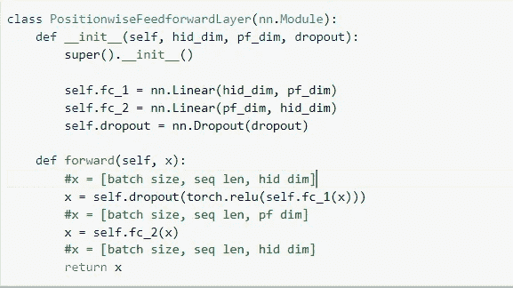

# 变压器实施(注意所有你需要的)

> 原文：<https://medium.com/analytics-vidhya/bert-implementation-multi-head-attention-4a10142636fe?source=collection_archive---------10----------------------->

一个变压器的架构纯粹是基于自我关注，不管 RNN 序列模型。自我注意的目标是通过关联序列的不同位置来捕捉每个序列的表征。使用这个基础，BERT 打破了早期文本分析和表示模型中固有的熟悉的从左到右的灌输。

在本文中，我将解释本文中提到的转换器的编码部分([注意，你所需要的一切](https://arxiv.org/pdf/1706.03762.pdf))，并且也尝试涵盖本文的一些重要理论方面。


伯特建筑

以上是变形金刚的架构图。基本上，它包含多层编码器和解码器。我敢肯定，几乎我们所有人都多次见过这种架构。所以让我们把它分成多个部分，并试着理解它的每一部分。

**模型建筑**

*   嵌入
*   位置编码
*   编码器
*   解码器
*   多头注意力
*   位置式前馈网络
*   标准化图层
*   Softmax

**嵌入**


变压器嵌入

在 transformers 中，输入嵌入在发送进行进一步处理之前与位置编码连接在一起。

什么是位置编码？

由于变压器不使用任何顺序网络，因此不存在递归，所有输入令牌都一次性传递给模型。因此，在这种情况下，transformer 需要一些关于序列顺序的信息。因此，为了获得关于输入标记排序的信息，作者使用了位置编码概念。

位置编码与嵌入具有相同的维数 d_model，因此两者可以相加。

在这项工作中，作者使用不同频率的正弦和余弦函数:

PE(pos，2i)=sin(pos/10000**2i/dmodel) →偶数位置

PE(pos，2i+1)= cos(pos/10000 * * 2i+1/d model)→对于奇数位置

```
**class** **Embeddings**(nn.Module):
    *"""*
 *Implements embeddings of the words and adds their positional encodings.* 
 *"""*
    **def** __init__(self, vocab_size, d_model, max_len = 50):
        super(Embeddings, self).__init__()
        self.d_model = d_model
        self.dropout = nn.Dropout(0.1)
        self.embed = nn.Embedding(vocab_size, d_model)
        self.pe = self.create_positinal_encoding(max_len, self.d_model)
        self.dropout = nn.Dropout(0.1)

    **def** create_positinal_encoding(self, max_len, d_model):
        pe = torch.zeros(max_len, d_model).to(device)
        **for** pos **in** range(max_len):   *# for each position of the word*
            **for** i **in** range(0, d_model, 2):   *# for each dimension of the each position*
                pe[pos, i] = math.sin(pos / (10000 ** ((2 * i)/d_model)))
                pe[pos, i + 1] = math.cos(pos / (10000 ** ((2 * (i + 1))/d_model)))
        pe = pe.unsqueeze(0)   *# include the batch size*
        **return** pe

    **def** forward(self, encoded_words):
        **embedding = self.embed(encoded_words) * math.sqrt(self.d_model)**
        **embedding += self.pe[:, :embedding.size(1)]   *# pe will automatically be expanded with the same batch size as encoded_words*** embedding = self.dropout(embedding)
        return embedding
```

reference→[https://github . com/fawazsammani/chatbot-transformer/blob/master/transformer % 20 chatbot . ipynb](https://github.com/fawazsammani/chatbot-transformer/blob/master/transformer%20chatbot.ipynb)

这里 d_model 是模型维度。在 create_positional _encoding 函数中，我们初始化了位置编码值。而在 forward 函数中，会在每次迭代后动态地将嵌入与位置编码连接起来。

请参考下面的文章，以获得位置编码背后的深刻见解。

[](/swlh/elegant-intuitions-behind-positional-encodings-dc48b4a4a5d1) [## 位置编码背后优雅的直觉

### 我们如何捕捉位置信息？

medium.com](/swlh/elegant-intuitions-behind-positional-encodings-dc48b4a4a5d1) 

**编码器和编码器层**


编码器变压器

如上图所示，在发送到解码器部分之前，有 3 个不同的任务正在进行。这里 Nx 表示编号 id 编码层。

1.  **多头关注**

注意力功能可以描述为将查询和一组键-值对映射到输出，其中查询、键、值和输出都是向量。输出被计算为值的加权和，其中分配给每个值的权重由查询与相应键的兼容性函数来计算。我们称这种特殊的注意力为“成比例的点积注意力”。


[“标量点积注意”](http://nlp.seas.harvard.edu/2018/04/03/attention.html)

而在变形金刚中的多注意力或者我们称之为自我注意力，输入令牌被分成多个块(默认为 12 个)。现在，自我关注独立地作用于所有这些分离的标记。

下面是多头注意力层的实现。n_heads 表示我们在处理时需要的头数。在我们的例子中，它是 8。


多头注意力

2 **位置前馈层**

除了注意子层之外，编码器和解码器中的每一层都包含一个完全连接的前馈网络，该网络被单独且相同地应用于每个位置。这由两个线性转换组成，中间有一个 ReLU 激活。

虽然不同位置的线性变换是相同的，但是它们在层与层之间使用不同的参数。另一种描述方式是两个内核大小为 1 的卷积。为了从数据中获得更多的见解，首先，他们对较高数量神经元的数据进行卷积，然后回到线性层中相似数量的神经元



位置式前馈网络

3 **编码器堆栈层**

在变压器中，输入令牌通过多个编码器层，以获得自我关注层的最大好处。默认情况下，作者使用 6 个编码器和解码器层。

这里值得注意的一点是，在将输入传递到下一层之前，我们也将原始输入标记连接到它。使得下一层将利用上一个编码器层的输出以及从原始源输入中获得洞察力。这类似于“重新发送跳过连接”。


编码器层

最后，我们需要通过我们的源输入令牌从我们的编码器类调用所有这些功能。

ModuleList →在列表中保存子模块。

`[ModuleList](https://pytorch.org/docs/stable/generated/torch.nn.ModuleList.html#torch.nn.ModuleList)`可以像普通的 Python 列表一样被索引，但是它包含的模块被正确注册，并且对所有的`[Module](https://pytorch.org/docs/stable/generated/torch.nn.Module.html#torch.nn.Module)`方法可见。

ModuleList 类似于顺序列表，但略有不同。([https://discuse . py torch . org/t/when-should-I-use-nn-module list-and-when-should-I-use-nn-sequential/5463](https://discuss.pytorch.org/t/when-should-i-use-nn-modulelist-and-when-should-i-use-nn-sequential/5463))


**解码器架构**


解码器架构

解码器的功能与编码器几乎相同。有一些细微的变化，比如屏蔽输出。

为什么要掩蔽？

需要屏蔽来防止解码器查看下一个令牌。以便模型仅在先前标记的帮助下预测下一个。为了执行三角遮罩，我们使用了 torch API 的" **torch.tril，torch.trio** "

与编码器层类似，解码器层也使用多头注意力和位置式前馈网络。

**解码层**


解码器层

**解码器**

出于可视化的目的，我们将注意力作为一种输出。


解码器

最后，我们需要从另一个类调用解码器和编码器。下面是我的 Github 链接的完整代码。

[https://github . com/Deepak 121993/END/blob/main/Transformer _ from _ scratch . ipynb](https://github.com/deepak121993/END/blob/main/Transformer_from_Scratch.ipynb)

下一篇文章将讨论 Bert 的实现及其上下文嵌入对句子相似性的使用。

特别感谢 Rohan 和团队关于深度学习 NLP 的精彩讲座。

##继续学习

参考资料:

[](http://nlp.seas.harvard.edu/2018/04/03/attention.html) [## 带注释的变压器

### “你所需要的只是关注”的转变在过去的一年里一直萦绕在许多人的脑海中。此外…

nlp.seas.harvard.edu](http://nlp.seas.harvard.edu/2018/04/03/attention.html) 

[https://github.com/fawazsammani/chatbot-transformer/](https://github.com/fawazsammani/chatbot-transformer/)