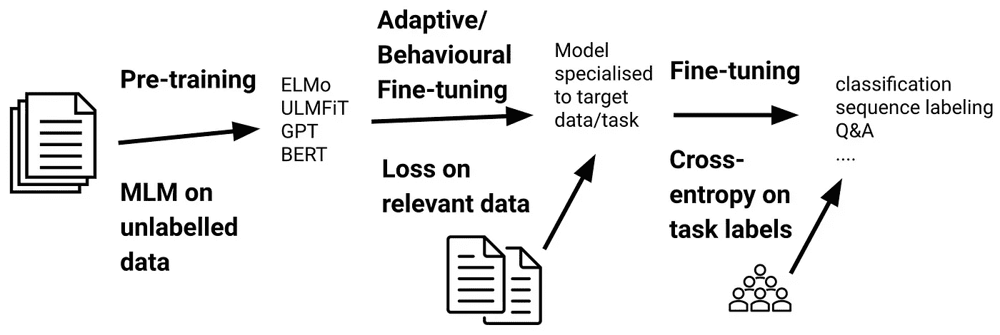

# BERT —预培训+微调

> 原文：<https://medium.com/analytics-vidhya/bert-pre-training-fine-tuning-eb574be614f6?source=collection_archive---------0----------------------->

来源—[https://ruder . io/content/images/2021/02/fine-tuning _ methods . png](https://ruder.io/content/images/2021/02/fine-tuning_methods.png)

Huggingface.co 通过他们的变形金刚 API 使得使用基于变形金刚的模型变得很方便。但是很多时候，仅仅微调是不起作用的。对未标记的数据进行预训练，然后进行微调，有助于模型达到预期的结果。Huggingface API 也提供了预训练功能。在这篇博文中，我将解释如何进行预训练，然后微调一个基于变形金刚的模型。为此，我将使用 BERT 作为参考模型。

# 数据格式编排

要执行预训练，数据必须采用特定的格式。它应该在一个文本文件(。txt 格式)每行一句。此文本文件的目的是首先使用 Word Piece tokenizer 对数据进行标记，然后对数据执行预训练。

# 预训练模型

## 在文本上训练分词器

将数据转换成所需的格式后，下一步是对输入数据训练标记器。这一步有助于创建数据的词汇表。下面的代码要点显示了如何使用单词片段标记器标记文本。要阅读更多关于单词片段分词器的内容，可以参考下面链接的第 4.1 节

> https://arxiv.org/pdf/1609.08144v2.pdf

## 训练伯特完成 MLM 任务

下一步将是为掩蔽语言建模任务预先训练 BERT。为此，我们将使用用于为此目的训练标记器的相同数据集。对于 MLM 任务，随机屏蔽 15%的记号，然后训练模型来预测这些记号。该功能存在于 Huggingface API 中，在下面的代码中给出

到目前为止，我们已经完成了预训练部分。让我们转到微调部分。

# 微调模型

## 数据准备

对于微调部分，数据的格式必须不同于我们在预训练部分使用的格式。伯特接受三个输入，即。—输入标识，注意掩码，令牌类型标识。我不会详细讨论它们是什么。你可以参考伯特论文中的内容。在这里，我将解释如何从 Huggingface API 计算它们。在这里，我将使用 BERT 模型进行分类。人们可以根据自己的方便对代码进行修改。

在上面的代码中，我使用了来自 **torch.utils** 的**数据集**类和 **BERT 的** **标记器**将数据转换成所需的格式。下一步，我将创建一个 DataLoader 类，用于培训和测试。

## 模型定义

出于微调的目的，现在让我们从模型构建部分开始。出于分类目的，我将在 BERT 的顶部添加两个线性层，其中 **dropout = 0。** 1 和 **ReLU** 作为激活功能。人们也可以尝试不同的配置。我已经定义了 PyTorch 类来构建下面代码中的模型

## 训练和验证功能

最后一步是定义训练和验证函数来执行微调。这将是 PyTorch 中每个人都会用到的一个常用函数。以下代码描述了这一点:-

瞧，现在你完成了实现目标所需的所有步骤。但是可以尝试如上所述的不同配置。此外，你可以尝试不同于上述分类的任务。如果你想完成代码，你可以访问下面的链接

 [## GitHub-dhavaltaunk 08/NLP _ scripts:包含与各种基于变压器的模型相关的笔记本…

### 此时您不能执行该操作。您已使用另一个标签页或窗口登录。您已在另一个选项卡中注销，或者…

github.com](https://github.com/DhavalTaunk08/NLP_scripts) 

这次都是我这边的。如果你想阅读更多关于 ML/DL 的内容，请访问下面的链接，如果你愿意，请鼓掌。

 [## Dhaval Taunk 培养基

### 阅读达瓦尔·陶克在媒介上的作品。数据科学家@ Yes Bank |前 ML 实习生@ Haptik |前实习生@ IIT…

medium.com](/@taunkdhaval08)