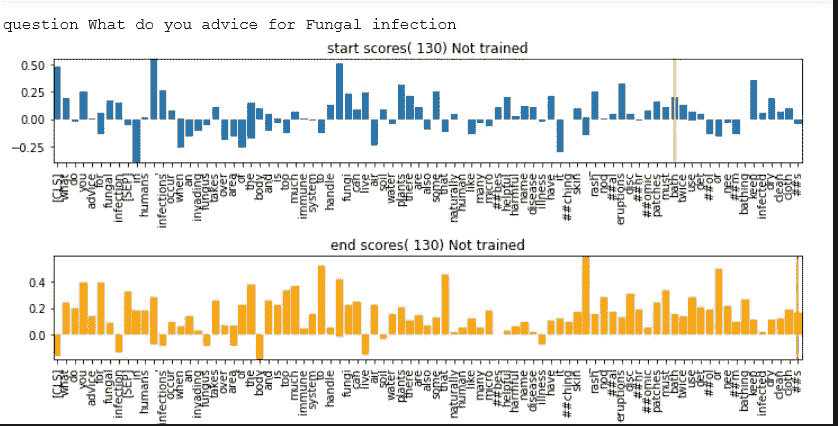
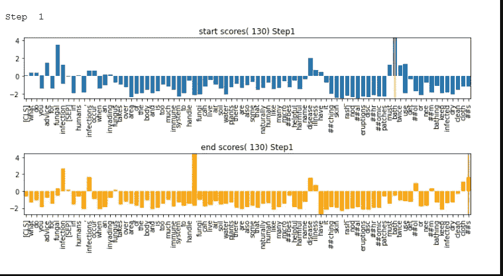
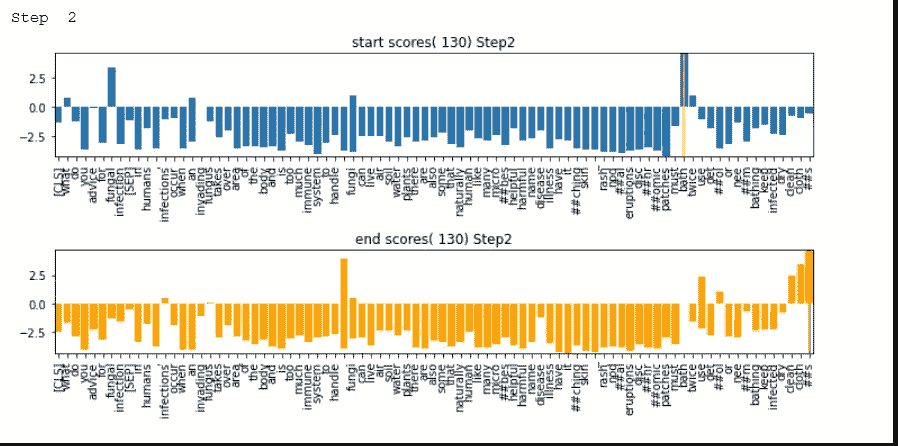
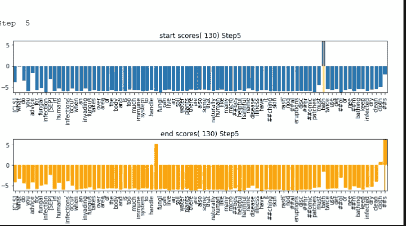
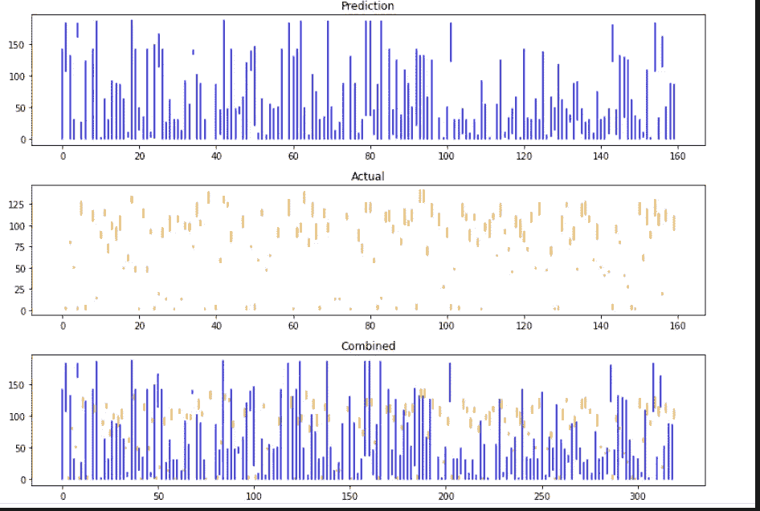
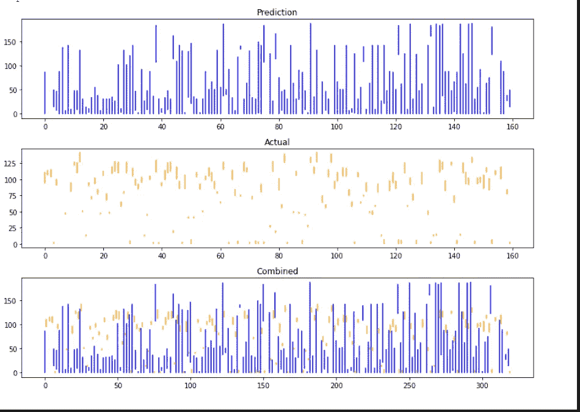
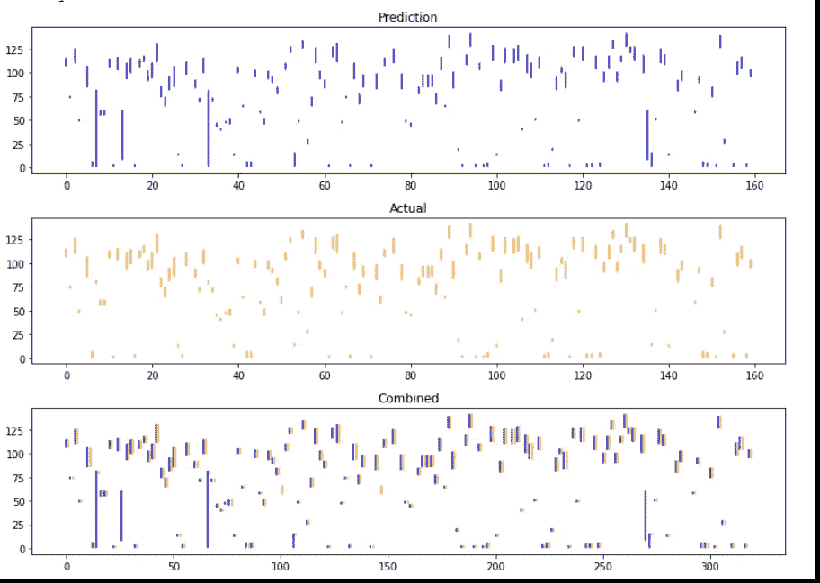

# 伯特问题回答微调可视化

> 原文：<https://medium.com/analytics-vidhya/bert-question-answering-finetune-visualization-f86198279c13?source=collection_archive---------12----------------------->

在这篇文章中，我将尝试展示 Bert 是如何通过训练学会回答我们的自定义问题的。我将尝试揭示中间步骤以及这些步骤中的变化。

代码在 github : [链接](https://github.com/mcelikkaya/medium_articles2/blob/main/bert_qa_tune.ipynb)
可以在 nbviewer 查看:[链接](https://nbviewer.jupyter.org/github/mcelikkaya/medium_articles2/blob/main/bert_qa_tune.ipynb)

我将试着展示什么样的模型在学习。在每个训练周期结束时(我正在 1 乘 1 地捕捉中间步骤，我尝试询问单个问题的答案，并记录返回的结果。下图是两个条形图。
**蓝色**:开始分数，(130)表示 130 令牌，训练循环前“未训练”。
垂直黄线是我们预期的输出位置。(我在这里做了一个欺骗，令牌索引和位置之间存在 xticks 宽度问题，所以我通过尝试找到了预期的位置，因为没有做 matplotlib 演算，您可以忽略这里，专注于逻辑。
**橙色**:结束分数，(130)表示 130 代币，训练周期前“未训练”。垂直红线是我们期望最终结果的地方。

我们来总结一下培训 Bert QA。我们给出一个有 130 个记号的上下文。我们问一个问题，并把问题的开始和结束给伯特。Bert QA 试图找到答案开始和结束。在猜测之后，我们计算损失并告诉 Bert QA 更新它的权重。通过这种方式，我们希望 Bert QA 通过培训使实际的开始和结束更加一致。因为我在训练中记录了中间步骤，所以我会显示所有步骤的分数。

正如你在上面看到的，最初一切都是随机的。很多代币都有很高的正分。训练后你会看到事情会有怎样的变化。

在上面你可以看到，在 1 个训练周期中，许多令牌得到了负分，只有少数项目得到了正分。同样，对于开始，请注意 3 个柱线靠近我们的开始黄色垂直线。

从上面你可以看到，在第二个训练周期后，模特几乎学会了我们的问题。(起点和终点的最高线条都接近预期的垂直线。)

从上图可以看出，在第五个训练周期后，模型对问题变得更加清楚，并学会了问题的开始和结束。

上图是一个**单项问答**的旅程。如何才能把**整个学习过程**可视化。为此，我选择了距离小于 100 的答案子集。(预测的开始索引和预测的结束索引)。然后我用横条表示真实距离，预测距离。起初，这些预测棒线是随机的。(见下图)。在合并部分，我将这两个图表合并成一个。

**未经任何培训**

在第一个训练周期后(如上图),你可以看到预测和实际并不一致。

**第一个列车周期后**

在最后一个训练周期后(下图)，你可以看到这些水平杆排列得更好了。通过最后的步骤，它们重叠太多了。通过这种方式，我们可以看到预测在训练中的累积变化。

**在最后一个训练周期后**

所以我用这两种类型的图表展示了训练的过程。

伯特 QA 已经用小队集合训练过了，所以你可能会问，为什么它没有从一开始就猜对。第一班是一个有点偏见的数据集。大多数答案和问题都有相同的词汇。我的数据集准备得有点差，试图回答糟糕的问题(我是故意这样做的，不是从一开始就得到正确的答案)

在下游任务中，最好用你的数据训练已经训练好的网络。已经训练的网络的类比可以是图像处理任务中的边缘检测器。在这种情况下，团队数据对我们来说可能是一个低级编码器，我们必须用我们的数据集来训练它，以符合我们的目标。

如果你检查初始(未训练)图片并训练 1 个周期，即使 1 个周期后网络学到了很多。我怀疑这是因为我的数据集非常同质，很容易捕捉到那里的意图。因此，玩玩视觉和代码，看看 Bert QA 如何解决您的问题。