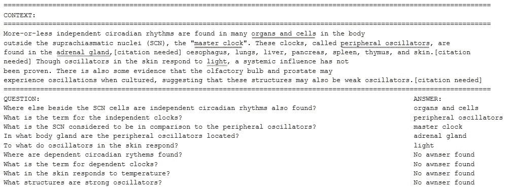
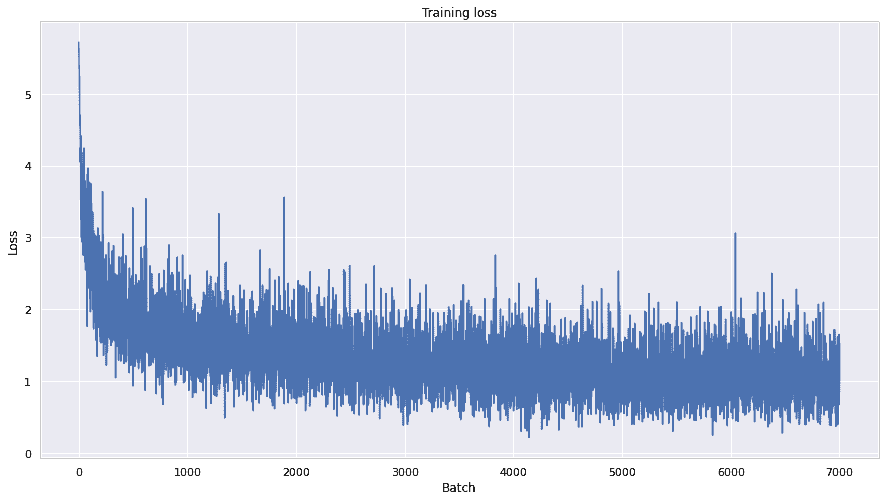
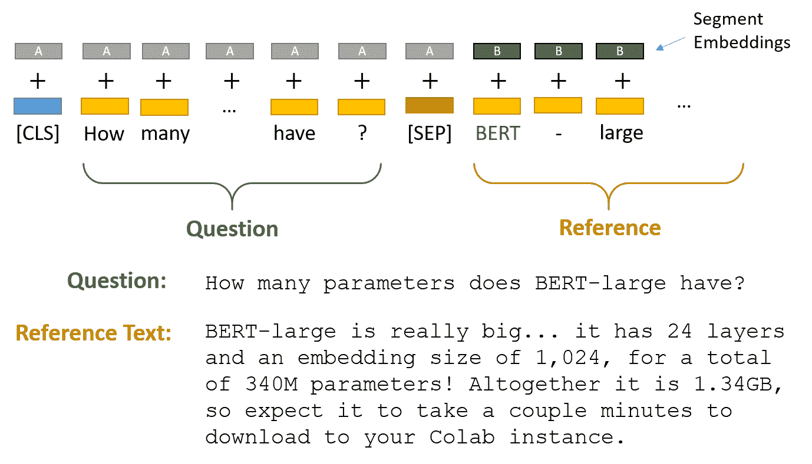
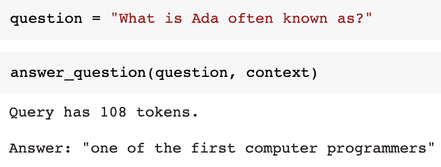
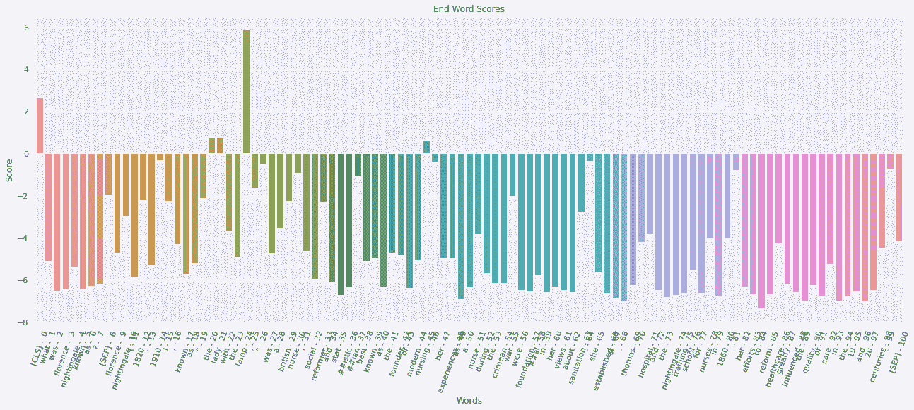
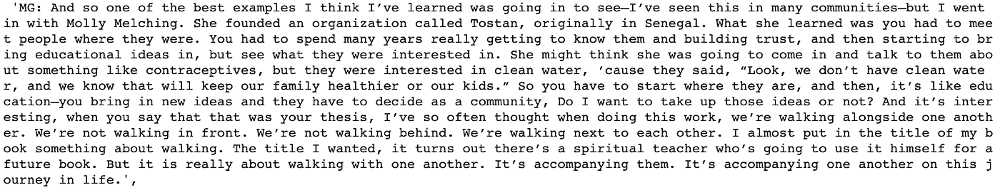
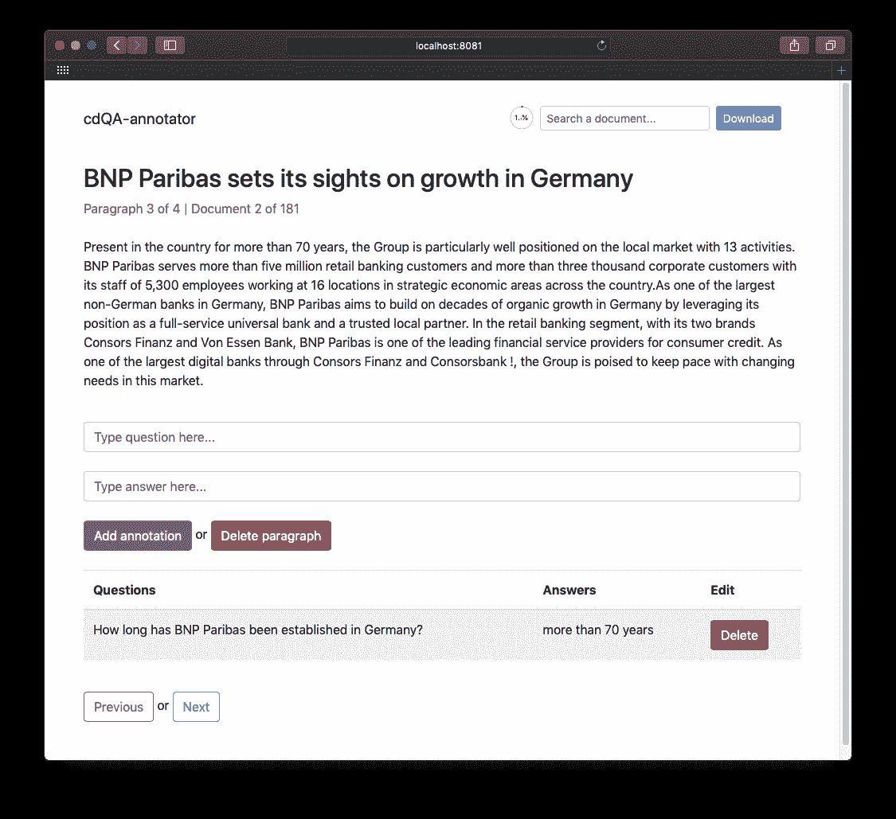
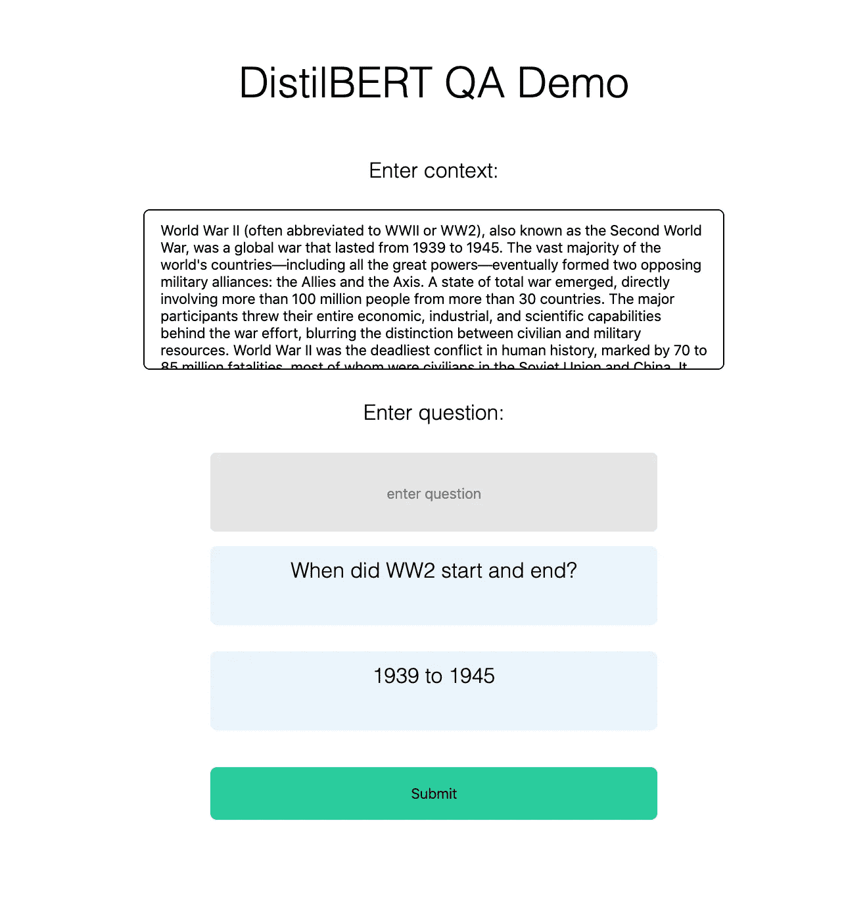

# BERT —敏感问题回答

> 原文：<https://medium.com/analytics-vidhya/bert-sensitive-question-answering-5aa5c74b4a3c?source=collection_archive---------18----------------------->

人工智能中的伦理问题如今风靡一时。应该如此。我希望应对这一挑战的聪明、善于言辞的人将把我们引向正确的方向。

但是对于我在熨斗学校的顶点项目，我想强调减少偏见的机会——使人类人性化。我们正处于对话破裂的时刻；我们已经失去了对敏感话题进行文明对话的艺术。从伊曼纽尔·阿乔、布伦·T2·布朗和爱子·贝瑟亚等思想领袖那里获得灵感，我开始为这些令人不安的大规模对话创建一个原型。输入 Ada.ai。

**开始原型** 第一步是决定对话模型的结构和内容。我曾尝试用 GPT 2 号创建一个聊天机器人，但是当我探索它的时候，我意识到这个机器人缺乏我想要的深度。虽然 GPT-3 很有前途，但它被限制在 API 的范围内(我不认为 Flatiron 会同意我以社工的身份提交我与 GPT-3 的聊天记录)。

当我探索像这样的产品如何在野外工作时，我意识到问答是最自然的方式。虽然我们都拥有在互联网上搜索任何东西的能力，但这种能力可能会让人感到乏味。我们的目标是创造一个易于交流的原型——一个促进脆弱性的原型。对于问答环节，伯特显然是赢家。

**BERT for Question-Answering** 选择 BERT 为获胜者后，就该使用[抱紧脸的库](https://huggingface.co/bert-base-uncased)来创建模型本身了。这个过程包括加载预训练的模型、标记和标注、设置参数以及启动 BERT 学习。我选择用斯坦福的 [SQuAD 2.0 数据集](https://rajpurkar.github.io/SQuAD-explorer/explore/v2.0/dev/)开始训练。这是基于维基文章并由人类编写的 150，000+问答的行业标准。尽管该数据集有局限性(非自然问题，偏向科学，基于文章)，但它对于教授模型问答格式是有用的。该数据包含上下文(512 个或更少的标记)，以及相应问题和答案的列表。因为 SQuAD 是标准，所以有一些脚本可以简化与 BERT 兼容的格式。

这是数据本身的峰值。

**训练** 我对 BERT 模型进行了两个时期的微调，每个时期都有 9000 步多一点。您可以看到损耗在稳步下降，计算方法是将预测矢量上的 Softmax 层的[对数损耗乘以层权重，得到< CLS >令牌。](https://www.machinecurve.com/index.php/question/what-is-the-bert-finetuning-loss-function-used/)

快速切线。这些标签<cls>和<sep>很重要，因为它们表示问题的开始和结束，上下文的开始和结束，然后是答案。我们还会看到它们对答案预测很重要。</sep></cls>

**问题解答** 说到答案，我们来看看。我们给模型一些包含答案的上下文，根据上下文问一个问题，然后让它离开计算。

下图有助于想象引擎盖下发生了什么。该模型正在为答案的开始评分最高的候选标记。这一过程一直持续到模型预测结束标记以结束答案。预测出的得分最高的人被连接起来并打印出来作为答案。相当整洁！

**超越小队** 在这一点上，我将这个模型称为阿达(以[阿达·洛芙莱斯](https://en.wikipedia.org/wiki/Ada_Lovelace)命名)。下面是创建一个健壮的问答系统的概要，它可以超越简单的问答模型。

以上是从网上搜集到的[布琳·布朗的](https://brenebrown.com/unlockingus/)播客的一些内容。使用这些数据，我们可以用 cdQA-Annotator 创建我们自己的特定于领域的数据集。下面是来自他们的 GitHub 的一个例子。

创建你自己的 QA 数据集是相当劳动密集型的，但是[实验](https://qa.fastforwardlabs.com/domain%20adaptation/transfer%20learning/specialized%20datasets/qa/medical%20qa/2020/07/22/QA-for-Specialized-Data.html#specialized-domains)已经表明一个 2000 个 QA 对的数据集足以提高各自领域的性能。额外的训练将在阵容调整后进行。

**文档检索** 现在，我已经通过对自己的数据进行额外的训练，对用于问答的 BERT 模型进行了微调。下一步是建立一个查询功能，用户提出问题→从索引中选择最上面的文档→为模型提供上下文→ Ada 找到正确的答案并返回给用户。

Haystack 为创建你自己的文档检索模型提供了一个易于实现的框架。为了在我的用例中实现这一点，我需要用经过审查的播客的文字记录填充一个数据集，或者让专家撰写针对常见敏感问题的文章。

一个文档检索系统将扩展我的原型来回答任何问题，只要适当的文章在我的图书馆里！开源填充文档有一个独特的机会。需要有一个提交的审查协议。人们可以想象一个类似的过程，通过为目前无法回答的问题寻找更多的文档来扩展 Ada 的能力。

这个原型的最后一部分是实现一个前端。当我努力让我的 Flask 应用程序工作时，Oliver 有一个很好的例子。下面是他创建的[应用](https://qa.oliverproud.com/)，这里是他的 [GitHub](https://github.com/oliverproud/distilbert-squad) 。

**展望未来** 我设想 Ada.ai 是一个非营利组织，可以利用专业策划的数据集解决我们大多数人都没有谈论的敏感问题。展望未来，我的目标是建立一个愉快的前端。此外，像这样的产品非常依赖文档检索的查询能力。最后一个想法是…

在人工智能中，我们担心偏见。我们应该。

但是当我们努力消除人工智能中的偏见时，我们忘记了人工智能如何减少人类的偏见。

用布琳·布朗的话说，“我们不是来做正确的事情的——我们是来做正确的事情的”。

Ada 大规模实现了这一目标。

*特别感谢和感谢微软的*[*Fast forward Labs*](https://qa.fastforwardlabs.com/domain%20adaptation/transfer%20learning/specialized%20datasets/qa/medical%20qa/2020/07/22/QA-for-Specialized-Data.html)*、Oliver Proud 和 Michel Kana & Prachur Bhargava。*