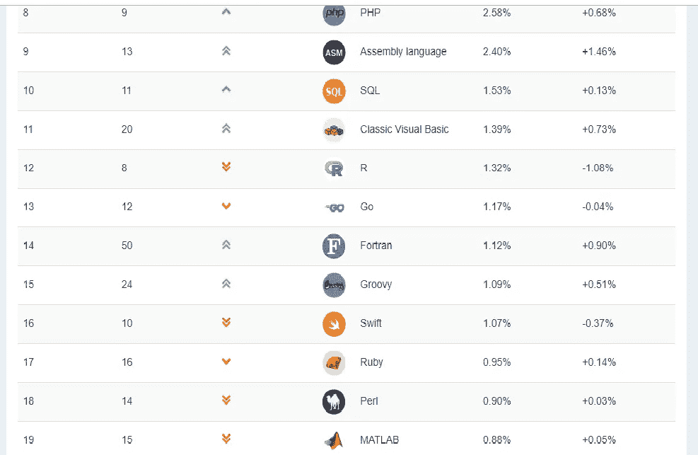

# 世界上最流行的编程语言……

> 原文：<https://medium.com/analytics-vidhya/best-and-most-popular-programming-languages-in-the-world-87f9cc483e32?source=collection_archive---------9----------------------->

照片由 [Unsplash](https://unsplash.com?utm_source=medium&utm_medium=referral) 上的 [Clément Hélardot](https://unsplash.com/@clemhlrdt?utm_source=medium&utm_medium=referral) 拍摄

在这个世界上，我们有很多语言可以相互交流(人与人之间)。仅在印度**有 22+1** 种主要语言(22 种母语为官方语言，1 种英语作为外国官方语言)。如果你是外国人，你会感到惊讶，但还有更多惊喜等着你..印度有 19，500 多种母语，其中许多已经灭绝。类似地，世界上有 50 多种编程语言，我们通过它们将我们的目的或信息连接或传达给计算机/机器。

根据 2021 年 7 月的 TIOBE 索引，现在前 3 种编程语言是 C、Java 和 Python。有趣的是，这三种语言比以往任何时候都更加接近。位置 1 和位置 3 的差别只有 0.67%。该索引可以用来检查您的编程技能是否仍然是最新的，或者在开始构建新的软件系统时，对应该采用什么编程语言做出战略性决策。Python 排名第三，但它最有机会成为第一，而且由于数据挖掘、机器学习、人工智能等领域的蓬勃发展，Python 语言与其他编程语言有很大差距。

图…[https://www.tiobe.com/tiobe-index/](https://www.tiobe.com/tiobe-index/)

如今，我们到处都在使用 python**探索数据以挖掘数据、网站建设/开发**、**人工智能、机器学习、操作系统、移动应用程序开发、视频游戏等等**，但也有其他更好地用于特定目的的编程语言。其他编程语言包括……..

图片…[https://www.tiobe.com/tiobe-index/](https://www.tiobe.com/tiobe-index/)

图片…[https://www.tiobe.com/tiobe-index/](https://www.tiobe.com/tiobe-index/)

上面列出了完整的前 50 种编程语言。也请查看他们监控的所有编程语言的[概述。](https://www.tiobe.com/tiobe-index/programming-languages-definition/#instances)

图片。[https://www.tiobe.com/tiobe-index/](https://www.tiobe.com/tiobe-index/)

# 接下来的 50 种编程语言

下面的语言列表表示#51 到#100。由于差异相对较小，所以只列出了编程语言(按字母顺序)。

ActionScript、Arc、Awk、BBC BASIC、BC、Bourne shell、C shell、CFML、CHILL、CIL、CLIPS、Clojure、Eiffel、Emacs Lisp、F#、Hack、Icon、Inform、Io、J、JADE、Korn shell、Lingo、LiveCode、Maple、MEL、ML、Modula-2、MQL4、MS-DOS batch、NATURAL、Nim、NXT-G、Occam、OpenEdge ABL、Oz、Pony、PowerShell、Pure Data、REXX、Ring、RPG、Simulink、Smalltalk、Snap！，SPARK，Tcl，Vala/Genie，VHDL，X10。

## **历史**

请注意:这些是 12 个月期间的*平均*头寸。

【https://www.tiobe.com/tiobe-index/ 

## **名人堂**

[https://www.tiobe.com/tiobe-index/](https://www.tiobe.com/tiobe-index/)

[https://www.tiobe.com/tiobe-index/](https://www.tiobe.com/tiobe-index/)

最后 Python 赢了。万岁。感谢您阅读……

如果你喜欢这个博客，请鼓掌并关注我们以获得更多简单有趣的文章。

**参考文献:**

 [## 软件质量公司

### TIOBE 指数本月庆祝其 20 周年。早在 2001 年，第一个 TIOBE 指数作为…

www.tiobe.com](https://www.tiobe.com/tiobe-index/) 

**其他博客链接:**

 [## 安装 OPENCV 的 5 个简单步骤

### 在这个有趣的教程中，我们将学习在 Ubuntu 系统中设置 OpenCV-Python。以下步骤针对 Ubuntu 16.04 进行了测试…

medium.com](/analytics-vidhya/installation-of-opencv-in-simple-and-easy-way-15556edca7a4)  [## 机器学习、深度学习、人工智能(免费)的顶级最好的内容

### 这篇中型文章特别为那些想在机器学习/深度学习领域开始职业生涯的初学者而写…

medium.com](/analytics-vidhya/the-top-and-best-content-of-machine-learning-deep-learning-artificial-intelligence-free-9e36186d4b2)  [## 从 JSON 文件中提取有用数据用于机器学习

### 如何从一个 JSON 文件中提取数据用于 Python 中的机器学习模型

medium.com](/analytics-vidhya/extract-the-useful-data-from-jason-file-for-data-sceince-34ed5ae0b350)