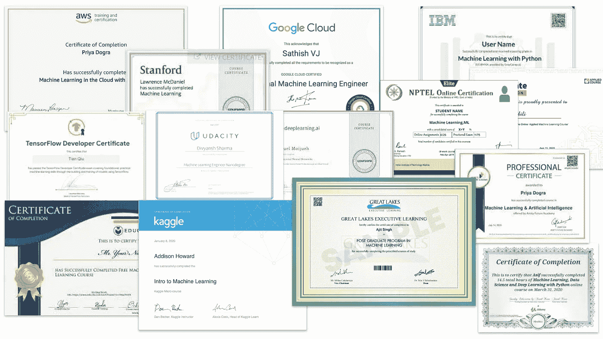

# AI/ML 的唯一 01 认证计划

> 原文：<https://medium.com/analytics-vidhya/best-certification-program-for-ai-ml-4ea464cc8d87?source=collection_archive---------6----------------------->

可供选择的太多了，什么对我最合适？

嗨，伙计们，我是塔潘。正如你从标题中已经知道的，我们将会看到什么样的认证最适合你。我会给我的建议伙计们，你将不得不最终确定你会选择什么。我想我们大多数人在某个时候都有同样的问题。

是的，有大量的认证。而且选错的风险很大，你不仅会付出时间精力还会血本无归。我有一些真实的例子，我的一些同事没有为他们选择最好的课程或证书，结果浪费了大量时间。

让我们从 3 个问题开始。

1.  *您为什么需要认证？*
2.  *什么认证最适合你？*
3.  你如何有效地完成这些认证，没有任何问题。

我通常把人分成三大块。

1.  正在读大学的，可能是最后一年，也可能是刚刚读完大学的。

2.那些目前正在做他们的工作，并想把他们的职业生涯转换到这个领域。

3.最后，在某个领域有将近 10 年经验的人想了解这个热门话题。

## 谁有更多的时间去刺杀大多数大学生

所以回答这些问题..第一个为什么。毫无疑问，它会给你的简历和个人资料增加一点分量。但是说到找工作，没有你的知识，任何认证都帮不了你。所以明智地选择你的证书，在那里你可以学到更多关于这个领域的知识。

Firmbee.com 在 [Unsplash](https://unsplash.com?utm_source=medium&utm_medium=referral) 上[拍照](https://unsplash.com/@firmbee?utm_source=medium&utm_medium=referral)

现在，你会选择什么认证？..人们在大学里有一些时间可以花，所有的方式去参加一个课程，在那里你将获得这个领域的大量知识，因为你们刚刚从学术背景中来，可以很容易地赶上后面的数学。

理解所有算法的数学是很重要的，尤其是当大部分数据脏活都找上门来的时候。所以你从地面上理解得越好..它会帮助你。因此，从市场认证来看，我不建议您从任何 AWS、Google 或任何高端公司认证开始，因为对于这些顶级认证，您需要 ML 和他们自己的云知识。因此，其他认证可能会有所帮助，如 AAIC，伊内隆可以帮助你你在寻找什么。

对于免费的课程内容，你可以随时查看 NPTEL 的精彩课程。

第三是如何..这对每个人来说，都需要大量的奉献和努力。一切都是值得的。

## 工人们

所以对于第一个问题，为什么？..认证让你的个人资料很好。当你想跳槽时，一份好的证书可以向招聘人员展示你对此有多了解。因为你可能会从以前的工作中获得一些其他的经验。

本·怀特在 [Unsplash](https://unsplash.com?utm_source=medium&utm_medium=referral) 上的照片

现在什么样的认证是好的..你们无法逃避数学和它背后的逻辑。所以越快理解越好。因此，为了理解这些概念，你可以从其他已经在从事这方面工作的同事那里获得简单的帮助，或者免费的课程可以在这里帮助你。因为你们最终可能会与团队领导密切合作，或者成为团队领导..所以这里只有 ML 知识不会有帮助。因此，一旦你理解了 ML，你应该开始关注任何大的云认证。比如 AWS，GCP，IBM 的认证可以在很大程度上帮助你。因此，正如我向大学生们建议的那样，首先有两件事可以完成你的理解，不管是付费还是免费，其次也可以获得任何云认证。

现在说..你将如何完成它。这又是一个费时的课程，所以利用这个锁定，做到最好。

## 有经验的家伙

你们在自己的领域最有经验，所以你们知道一个好的认证能帮到你们什么。

照片由[戴恩·迪安纳](https://unsplash.com/@danedeaner?utm_source=medium&utm_medium=referral)在 [Unsplash](https://unsplash.com?utm_source=medium&utm_medium=referral) 上拍摄

对于选择认证，你需要看看你是否从公司得到了任何特殊的帮助，我在这里说的是 PG 项目(如果你还没有考虑的话)。所以对我来说…考虑到你现在的职位和获得新职位后你将要处理的职位，你应该接受高等教育。我为什么这么确定？几乎我所有的学长和认识的人都这么做过。如果你现在还没有研究这些东西，那么最好的办法就是开始学习所有免费的课程来理解 ML，从 AWS、Google One 这样的顶尖公司那里获得所有云计算工作的认证。

有了所有这些，最好也选择你的规范，就像 NLP 或 CNN 或自动驾驶汽车或任何你喜欢的行业(根据你的经验选择)，并确保一开始就参与项目。如果你也对管理感兴趣，看看 ML 方面，比如 ML 的 BA、数据分析师和数据工程部分，以了解每个人的工作。

这些都是我的建议，伙计们，我从我的许多朋友和导师那里学到的，传递这些细节可能会帮助需要它的人。谢谢

# 现在怎么办？

下一次将分享更多的见解来准备 ML 的工作面试，以及我是如何做到的。

感谢阅读。

如果你喜欢这篇文章，请一定要鼓掌。请关注我的 Github 和我的 medium 个人资料上的更多项目和文章。

 [## tapanKumarPatro -概述

### 从 greensdata/成为数据科学家的 10 个步骤中获得的块或报告📢准备好学习或复习你的知识了吗…

github.com](https://github.com/tapanKumarPatro)  [## Tapan Kumar Patro -中等

### 写简历时要记住的关键事情。嘿，伙计们，现在我看到人们开始了他们的数据科学之旅…

tapanpatro.medium.com](https://tapanpatro.medium.com/) 

不要忘了用 Android 应用程序开发来检查深度学习项目的端到端部署。

 [## 基于深度学习的端到端 app。

### 聪明烹饪

medium.com](/analytics-vidhya/end-to-end-deep-learning-based-app-af67d4008550) 

谢了。如有任何疑问，请留言。