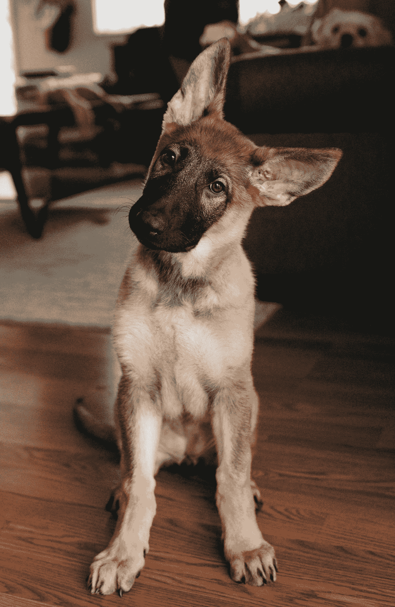

# 2021 年最佳机器学习“黑客”

> 原文：<https://medium.com/analytics-vidhya/best-linear-layer-hack-of-2021-9747014b490e?source=collection_archive---------3----------------------->

线性层(或致密层)对于深度学习就像火箭对于宇宙飞船一样:必不可少。迄今为止，我见过的大多数(如果不是全部)模型都以这样或那样的方式使用它们。但是谚语所说的轮子还能改进吗？在这篇文章中，我们将会看到一个简单的方法来给你的线状图层添加类固醇。

达米尔·斯班尼克在 [Unsplash](https://unsplash.com?utm_source=medium&utm_medium=referral) 上拍摄的照片

在线性层中，我们将所有数据视为一个矩阵(或张量),并与训练权重矩阵相乘，然后添加一个训练偏差向量。矩阵乘法的运算次数随规模呈指数增长。然而，如果我们将数据分割成更小的、平行的部分，然后通过一个更有深度的线性层运行，会发生什么呢？让我们在 CIFAR10 上测试一下。

我们将在这里修改 Pytorch 教程中的分类模型，这样我们就可以快速上手并运行:[https://py torch . org/tutorials/beginner/blitz/cifar 10 _ tutorial . html # sphx-glr-beginner-blitz-cifar 10-tutorial-py](https://pytorch.org/tutorials/beginner/blitz/cifar10_tutorial.html#sphx-glr-beginner-blitz-cifar10-tutorial-py)

Github 对所用脚本的链接在文章末尾。

对于 Keras/Tensorflow 用户来说，如果你能完成这个 Pytorch 例子，同样的好处可以通过[密集层](https://keras.io/api/layers/core_layers/dense/)在 Keras 中实现。密集层也允许任意数量的维度作为输入。

首先，我们将转换并加载我们的图像:

转换和数据加载器

接下来，我们将定义我们的模型:

控制模式

因此，我们有两个 Conv2d 层，后跟两个线性层。很简单。

最后，是训练和测试迭代。

培训和测试

运行这个命令，您应该会得到如下结果:

控制模型性能

性能指标是 56%的准确度和 2 个时期后的 1.184 最佳损失。

上面的模型获取了最终 Conv2D 层的输出，并将其转换为尺寸为 *(batch_size，out_features)* 的 ***二维*** 视图。对于我们的“黑客”，我们将把 Conv2D 输出的视图大小改变成一个三维张量。然后通过 fc1 运行数据。接下来，我们将在通过 fc3 之前，将 fc1 输出视图更改为二维张量。

现在让我们把这个视图做成一个有 10 个裂口的三维张量。模型中更改的行在中进行了注释。

试验模型

如果排除注释，我们只修改了 2 行代码，增加了 2 行代码。打印出来，我们可以看到这大大减少了 fc1 的大小。我们现在应该有这样的东西:

测试模型大小

这使得总参数从 62，186 → 8，618。让我们再添加一些参数，使大小回到 62k 左右，这样我们就可以比较苹果和苹果了。

我们可以将它们放入 Conv2D 层。但这并不能真正证明这种变化是否带来了好处，或者更大的 Conv2D 层是否更适合这种模型。因此，我们将只增加线性层。将 n3 从 120 更改为 120x31=3，720，得到的总参数大小为 61，178。

调整测试模型大小

所以只是比我们要对比的控制模型小了一根头发:62，186 → 61，178 参数。现在，让我们看看这是如何执行的。

测试模型性能

我们可以看到，仅在第一个时期之后，它已经具有与原始模型的最终结果几乎相同的精度。到了第二个纪元，它的表现超过了第一个模型！

最佳损失:1.184 → 1.090

准确率:56% → 62%

这到底是怎么回事？

德克斯·伊齐基尔在 [Unsplash](https://unsplash.com?utm_source=medium&utm_medium=referral) 上拍摄的照片

让我们试着想象一下，从第一层开始。

1.  **(conv1) Conv2D** —比如说，一只猫的图像进入 conv1，它通过 13 个经过训练的过滤器。
2.  **(pool) MaxPool2D** —然后我们使用 max pooling 图层，从所有 13 个过滤图像的每个 2x2 区域中提取最高值像素，将它们缩小到 1/4 大小。
3.  **(conv2) Conv2D** —然后，我们的猫的 13 个较小的图像通过 conv2，它有 18 个经过训练的过滤器。
4.  **(pool) MaxPool2D** —另一个池层。每次我们使用过滤器和池，我们的猫的图像尺寸变得更小。因此，最终的水池通过了 18 个较小的 5x5 图像，突出了我们毛茸茸的虎斑猫的不同特征。
5.  **x.view()** —在**原始**模型中，这些被展平并传递到我们总共有 450 个特征(5x5x18)的线性层。但是使用我们的**第二个**模型，那 450 个数据点被夹在 ***10 个特征集中，每个****45 宽。(批量大小、分割、内部特征)*
6.  **(fc1)线性** —然后这些集合中的每一个都被传递到 45 个特征宽的 fc1 层，3720 个权重深。因此，较小的 fc1 层被连续 10 次馈送 Conv2D 层的数据，而不是一次全部馈送。

类似于较大的批处理大小可以产生较好的结果，这迫使较小的 fc1 层输入更加一般化。这 10 个集合的梯度与每个图像一起累积，并在反向通过之前一起平均。因此，这种方法也有助于缓解过拟合问题，从而产生更高的精度。

理论上，假设总参数大小保持大致相等，这在大多数用例中应该可以改善线性图层。请随意在你的模型上试用，如果有帮助，我很乐意听听。留下评论让我知道！感谢您的阅读。

这里有一个包含控制和测试 Pytorch 脚本的存储库，如果您想使用它们的话:

 [## therealjj 77/线性层并行化

### 通过在 GitHub 上创建帐户，为 therealjj 77/线性层并行化开发做出贡献。

github.com](https://github.com/therealjjj77/Linear-Layer-Parallelization)