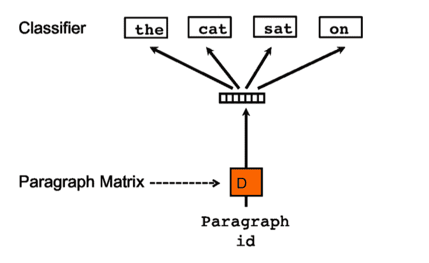

# 获取文档相似度的最佳自然语言处理算法

> 原文：<https://medium.com/analytics-vidhya/best-nlp-algorithms-to-get-document-similarity-a5559244b23b?source=collection_archive---------0----------------------->

在 [Unsplash](https://unsplash.com?utm_source=medium&utm_medium=referral) 上由 [Jaredd Craig](https://unsplash.com/@jaredd_craig?utm_source=medium&utm_medium=referral) 拍照

你有没有读过一本书，发现这本书和你以前读过的另一本书很相似？我已经做了。实际上，我读过的所有自助书籍都与拿破仑·希尔的书相似。

所以我想知道自然语言处理( [NLP](https://machinelearningmastery.com/natural-language-processing/) )是否可以模仿人类的这种能力，找到文档之间的相似之处。

# 相似性问题

要找到文本之间的相似性，首先需要定义两个方面:

1.  将用于计算嵌入之间相似性的相似性方法。
2.  将用于将文本转换为嵌入的算法，嵌入是在向量空间中表示文本的一种形式。

# 相似方法

## 余弦相似性

**余弦相似度**测量两个嵌入之间角度的余弦值。当嵌入指向相同方向时，它们之间的角度为零，因此它们的余弦相似度为 1。当嵌入正交时，它们之间的角度为 90 度，余弦相似度为 0。最后，当它们之间的角度为 180 度时，余弦相似度为-1。

-1 到 1 是余弦相似性可以变化的值的范围，其中嵌入越接近 1 越相似。

图片来自[https://data science-发烧级. com/DL/Operations _ on _ word _ vectors . html](https://datascience-enthusiast.com/DL/Operations_on_word_vectors.html)显示了余弦相似度为 1 的情况，因为法国和意大利相关，而其他情况下相似度为 0，因为 ball 与鳄鱼不相似

从数学上讲，您可以计算余弦相似性，方法是取嵌入之间的点积，然后除以嵌入范数的乘积，如下图所示。

余弦相似公式

在 python 中，可以使用 sklearn 包中的[余弦 _ 相似度](https://scikit-learn.org/stable/modules/generated/sklearn.metrics.pairwise.cosine_similarity.html)函数来计算相似度。

# 欧几里得距离

**欧几里德距离**可能是应用勾股定理计算两点间距离的最著名公式之一。要得到它，你只需要从向量中减去点，将它们提升到平方，将它们相加，然后取它们的平方根。看起来复杂吗？不要担心，在下图中会更容易理解。

欧几里德距离公式

在 python 中，你可以使用 sklearn 包中的[欧几里德距离](https://scikit-learn.org/stable/modules/generated/sklearn.metrics.pairwise.euclidean_distances.html)函数来计算它。

你也可以使用其他度量标准，比如 *Jaccard、Manhattan 和* Minkowski *distance，但在本文中不会讨论。*

# 预处理

在 NLP 问题中，通常让文本首先进入预处理管道。因此，对于所有用于将文本转换成嵌入的技术，首先使用以下步骤对文本进行预处理:

1.  规范化:将文本转换为小写，并删除所有特殊字符和标点符号。
2.  标记化:获取规范化的文本，并将其拆分成一个标记列表。
3.  删除停用词:停用词是一种语言中最常用的词，不会给文本增加太多意义。一些例子是单词‘the’，‘a’，‘will’，…
4.  词干化:这是获取单词词根的过程，有时这个词根不等于单词的词根，但词干化的目标是使相关单词映射到同一个词干。例子:分支和分支成为分支。
5.  词汇化:这是从一组词形变化的词中获取同一个词的过程，最简单的方法是用字典。例子:是，曾经是，正在成为。

这个管道的输出是一个带有格式化令牌的列表。

# 将文本转换成嵌入内容的算法

## 术语频率-逆文档频率(TF-IDF)

在谈论 TF-IDF 之前，我将谈论将单词转换成嵌入的最简单的形式，即**文档-术语矩阵**。在这种技术中，你只需要建立一个矩阵，其中每一行是一个短语，每一列是一个标记，单元的值是一个单词在短语中出现的次数。

**文档-术语矩阵示例**

之后，要获得两个短语之间的相似性，您只需要选择相似性方法，并将其应用于短语行。这种方法的主要问题是所有的单词在短语中被认为具有相同的重要性。

为了解决这个问题 **TF-IDF** 出现了一种数字统计，旨在反映一个单词对文档的重要性。

**TF-IDF** 通过获得术语的频率(TF)并将其乘以术语逆文档频率(IDF)来获得该重要性分数。 **TF-IDF** 得分越高，该术语在文档中就越罕见，其重要性就越高。

## 如何计算 TF-IDF？

术语频率是指一个术语在文档中出现的次数，例如:如果单词“stock”在一个 2000 单词的文档中出现 20 次，那么 stock 的 TF 就是 20/2000 = 0.01。

IDF 是文档总数除以包含该术语的文档总数的对数，例如:如果有 50.000 个文档，并且单词“stock”出现在 500 个文档中，则 IDF 是 log(50000/500) = 4.6。所以‘股票’的 TF-IDF 是 4.6 * 0.01 = 0.046。

# Word2Vec

在 **Word2Vec** 中，我们使用神经网络来获得语料库(文档集)中单词的嵌入表示。 **Word2Vec** 很可能很好地捕捉到单词的上下文含义。

要获得单词嵌入，可以使用两种方法:连续单词包(CBOW)或 Skip Gram。这两种方法都将单词的一键编码表示作为输入，要获得这种表示，您只需构建一个向量，其大小为语料库中唯一单词的数量，然后每个单词将在向量的特定位置表示为 1，在所有其他位置表示为 0。

例如，假设我们的语料库只有 3 个词:飞机、蜜蜂和猫。所以我们可以把它们表示为:

*   飞机:[1，0，0]
*   蜜蜂:[0，1，0]
*   猫:[0，0，1]

在 **Word2Vec** 中我们对模型的输出不感兴趣，但是对隐藏层的权重感兴趣。这些权重将是单词的嵌入。

## CBOW

CBOW 模型的目标是接收一组热编码单词，预测一个单词学习的上下文。因此，假设我们有短语“早上我喝咖啡”，CBOW 模型的输入和输出将是:

CBOW 输入和预期输出示例

因此，这是一个监督学习模型，神经网络使用一个称为反向传播的过程来学习隐藏层的权重。

## 跳跃图

Skip-Gram 类似于 CBOW 的反义词，这里一个目标单词作为输入被传递，模型试图预测相邻的单词。

跳格输入和预期输出的示例

左边是 CBOW 架构，右边是 Skip-Gram 架构

# Doc2Vect

在 **Word2Vec** 中，我们对每个单词进行一次嵌入。 **Word2Vect** 做单词之间的比较很有用，但是如果要比较文档呢？

您可以使用 Word2Vec 对文档中的单词进行一些向量平均，以获得文档的向量表示，或者您可以使用为文档构建的技术，如 **Doc2Vect** 。

**Gensim 中的 **Doc2Vect** 是 le 和 Mikolov 的文章****中句子和文档的分布式表示的实现。在这篇[文章](https://arxiv.org/pdf/1405.4053.pdf)中，作者提出了两种算法来获得文档的嵌入。段落向量的**分布式记忆模型** (PV-DM)和段落向量的**分布式单词包版本**(PV-DBOW)**

## 段落向量的分布式记忆模型

这个模型看起来像 **CBOW** ，但是现在作者为这个模型创建了一个新的输入，叫做段落 id。

> “段落标记可以被认为是另一个单词。它起到了记忆的作用，记住了当前上下文或者段落主题中缺少的内容。”

PV-DM 架构

## 段落向量分布式单词包版本(PV-DBOW)

**PV-DBOW** 方法类似于 **Skip-Gram** ，这里的输入是一个段落 id，模型试图预测从文档中随机抽样的单词。

PV-DBOW 架构

为了获得更健壮的文档表示，作者将由 **PV-DM** 生成的嵌入与由 **PV-DBOW** 生成的嵌入结合起来。

# 变形金刚(电影名)

**变形金刚**技术革新了 **NLP** 问题，并为 **BERT** 和 **RoBERTa** 型号设定了最先进的性能。因此在[Sentence-BERT:Sentence embedding using Siamese BERT-Networks](https://arxiv.org/pdf/1908.10084.pdf)中，Reimers 和 Gurevych 修改了 **BERT** 和 **RoBERTa** 的模型架构，使它们输出固定大小的句子嵌入。

为了实现这一点，他们向转换器的输出添加了一个池操作，尝试了一些策略，如计算所有输出向量的平均值和计算输出向量的最大时间。

句子嵌入 BERT 得到余弦相似度

在 python 中使用预先训练好的转换器很容易，你只需要使用来自 [SBERT](https://www.sbert.net/) 的 sentece _ transformes 包。在 SBERT 中，还可以使用在不同数据中训练的多种架构。

# 比较技术

使用的机器是 MacBook Pro，配有 2.6 GHz 双核英特尔酷睿 i5 和 8 GB 1600 MHz DDR3 内存。所用的数据来自沃伦·巴菲特每年写给伯克希尔·哈撒韦公司股东的信，巴菲特是这家公司的首席执行官。目标是得到与 2008 年字母相近的字母。

包含方法、相似性度量、目标年份、执行时间(秒)和最相似年份(按最相似到最不相似排序)的表

TF-IDF 是最慢的方法，需要 295 秒来运行，因为它的计算复杂度是 O(nL log nL)，其中 n 是语料库中句子的数量，L 是数据集中句子的平均长度。

一个奇怪的方面是，所有的技术在最相似的年份给出了不同的结果。因为数据是未标记的，我们不能肯定什么是最好的方法。在接下来的分析中，我将使用一个带标签的数据集来获得答案，敬请关注。

# 结束

我实现了上面所有的技术，你可以在这个 [GitHub](https://github.com/jairNeto/warren_buffet_letters) 仓库中找到代码。在那里，您可以选择将文档转换为嵌入的算法，并且可以在余弦相似度和欧几里德距离之间进行选择。

我使用的一套文本是沃伦·巴菲特每年从伯克希尔·哈撒韦公司写给股东的信，他是这家公司的首席执行官。

在本文中，我们探讨了 NLP 文档相似性任务。展示了将文本转换为嵌入内容的 4 种算法:TF-IDF、Word2Vec、Doc2Vect 和 Transformers，以及获取相似度的两种方法:余弦相似度和欧氏距离。

如果你对我的 [Linkedin](https://www.linkedin.com/in/jair-guedes-ferreira-neto/) 账户有任何意见，请随时联系我，感谢你阅读这篇文章。

如果你喜欢你所读的东西，一定要👏下面，分享给你的朋友，关注我，不要错过这一系列的帖子。