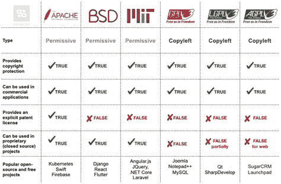

# 在 Python 应用程序中使用开源代码的最佳实践

> 原文：<https://medium.com/analytics-vidhya/best-practices-for-using-open-source-code-in-python-applications-6acc669ab5a6?source=collection_archive---------8----------------------->

开放源码软件(OSS)是在一个许可下发布的，作者授予用户使用、修改、构建软件功能以及向任何人和任何地方分发软件的许可。许可证规定了如何使用、修改和分发软件。

在开源倡议下有不同的许可。其中比较流行的有 MIT、BSD 3-Clause、Apache 2.0、GNU 通用公共许可证和 GNU Lesser General Public。值得注意的是，每个许可证在如何使用软件方面都有一定的自由度。

有许多开放源码软件项目非常受欢迎并被广泛使用:

*   [**TensorFlow**](https://www.tensorflow.org/) :这是一个机器学习的开源库。
*   [**Apache Spark**](https://spark.apache.org/) :这是一个开源的大数据分析框架。
*   [**Linux**](https://en.wikipedia.org/wiki/Linux) : Linux 是一个开源的类 unix 操作系统。

显然 OSS 很棒。那么，为什么在使用 OSS 构建我们的应用程序时遵循某些实践是重要的呢？

*   **安全性**:16 个 OSS 项目中就有一个包含安全漏洞，这会让你的整个应用程序处于危险之中。
*   **维护和支持**:OSS 的频繁更新需要开发者的不断维护和支持。未能解决这一问题会导致不寻常的行为，并在将来导致构建失败。
*   **灵活性**:有这么多不同的软件开发工具，检查 OSS 与现有工具的兼容性以及开源组件如何影响当前系统是至关重要的。

让我们深入研究一些在使用开源工具构建 Python 应用程序时可以考虑的最佳实践。

# 政策/法规

在构建企业应用程序之前，为开发者和系统架构师创建一个关于 OSS 使用的**政策**是至关重要的。如果开发者在不理解许可协议的情况下就开始使用 OSS，这可能会导致组织失去他们的知识产权，甚至损失金钱价值。

在开源倡议下有 1400 多个许可证，每个都有不同的限制和义务。因此，拥有一个所有开发人员都必须遵守的组织级策略是非常重要的。

[*来源*](https://moqod.com/blog/understanding-open-source-and-free-software-licensing/)

# 保持跟踪和更新

由于快速开发和创新的需要，开发人员越来越多地转向开源框架和库来加速软件开发生命周期(SDLCs)。一些流行的开源项目有成千上万的贡献者，并且经常更新新特性。

每个开发人员都知道跟踪这些更新是多么容易，尤其是当有许多开源组件的时候

根据我的个人经验，我知道手动更新组件有多麻烦。当我在做一个 OCR(光学字符识别)项目时，我尝试了多种开源 OCR 工具。我最终决定用 **Easyocr** 。

当我们最终确定项目的工具时，最新的版本是 1.2.2，也就是我们正在使用的版本。当我们完成围绕用例构建基础设施和测试框架时，自 1.2.2 版以来，至少已经发布了 6 个 OCR 的主要更新。正如您可以想象的那样，这导致了 OCR 的结果不一致，推理时间和模型大小在这些更新中大幅减少。

所以下一次，我们创建了一个管道来检查 OCR 更新以及它们如何影响应用程序的性能。

因此，我们吸取了教训:**跟踪应用程序中的开源组件**。

如果你不想努力创建一个管道，但想要一个类似的工具，可以检查更新和做更多的事情，那么有多种软件可以做到这一点。

让我们看看市场上的一些开源管理工具

1.  **白源翻新**

[white source renew](https://www.whitesourcesoftware.com/free-developer-tools/renovate/)是一款开源管理工具，为 OSS 更新提供实时跟踪。它跟踪每个更新的日志和提交，并使用更新的操作系统运行和验证测试套件。

renew 提供各种语言的广泛支持，包括 Python、Go、Javascript、Java 等。，并具有广泛的可配置性。它集成到系统中现有的工作流和调度器中，如 Docker、Git、GitLab 等。，没有任何麻烦。

2.**窝**

[Fossa](https://fossa.com/) 也是一款开源管理工具，确保开源代码的安全性、合规性和质量。它通过审计&消除系统中的潜在风险，对大规模系统上的开源依赖进行实时跟踪。

凭借持续的合规性，Fossa 通过自动化许可证扫描和合规性提高了开发人员的灵活性。像 renew 一样，它支持不同的语言和工作流集成工具，但以客户为代价。

3.**黑鸭子**

[Black Duck](https://www.synopsys.com/software-integrity/security-testing/software-composition-analysis.html) 是一款商业工具，用于管理因使用开源组件和第三方应用程序而产生的安全性、质量和许可证合规性风险。

除了关键功能，该工具还提供了分析模块，如开源组件的依赖性分析、用于检查专有代码和其他指标的片段分析。与其他工具类似，Black Duck 与现有的工作流管理工具集成得很好，但以牺牲客户为代价。

就像你有 MLOps 管道或 DevOps 管道一样，有一个单独的管道来跟踪环境中的 OSS 工具是至关重要的。

# 质量

在讨论开源工具的好处时，您不应该被工具的易用性或熟悉性冲昏头脑。您应该总是在您的开源组件中寻找高质量的标准。你应该检查一些细节，比如漏洞修复有多快，有多少贡献者，社区有多活跃等等。它反映了开源工具在当前市场中的相关性。

正如我们在 SDLC 中所看到的，当一个特性发布时，整个系统都要经过测试，以检查由于更新而导致的系统损坏。类似地，当一个开源代码被更新为一个新特性时，我们可以通过使用 Pytest 这样的工具来检查这些更新是如何影响开源项目的。当然，我们不能对所有的功能更新进行测试。不过，您应该跟踪受开源更新直接影响的特定于应用程序的指标。

当质量退居二线时会发生什么？当不积极追求质量时，就会引入漏洞。[例如，Heartbleed 漏洞](https://heartbleed.com/)是在 OpenSSL 中发现的一个严重漏洞，OpenSSL 是一个加密的开源软件库，在该漏洞被发现时，估计全球有三分之二的网络服务器在使用它。

# 对开源的自动化控制

确保开放源码软件使用安全的一个很好的方法是将开放源码组件作为常规软件嵌入 CI/CD 程序。当这些软件被开发和发布时，它们中存在大量的潜在漏洞。将 OSS 集成到自动化管道中会导致项目中所有的 OSS 依赖项被自动分析。

在自动构建过程中，将检测到与开源组件相关的潜在漏洞。这将有助于开发人员修复不稳定的构建以进行部署。无论如何，这个想法是为了改进识别系统中易受攻击组件的过程，并向开发人员提供即时反馈，使系统从头到尾都是安全的和功能性的。

# 结论

开源工具是每个软件开发系统的一部分，一个好的开源工具有一个大的用户社区和贡献者。尽管开源工具节省了组织的时间和资源，但应该注意的是，开源工具在安全漏洞、许可和维护方面有很大的不同。因此，在将任何开源工具整合到您的项目中之前，对其进行完整的评估变得非常重要。