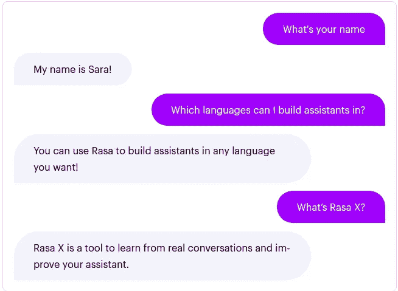
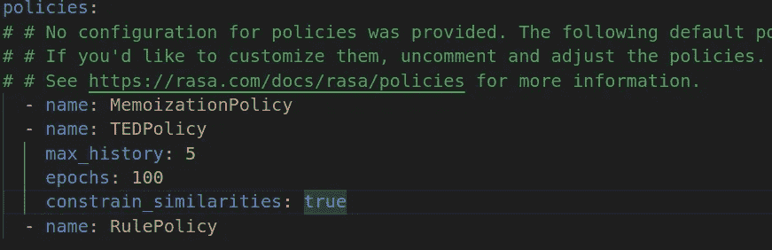
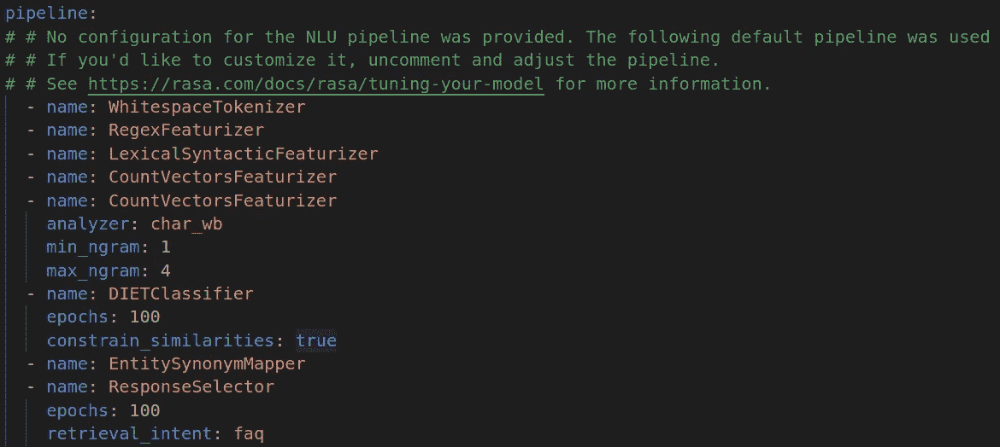
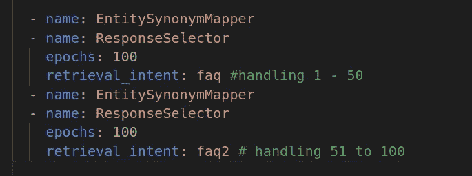
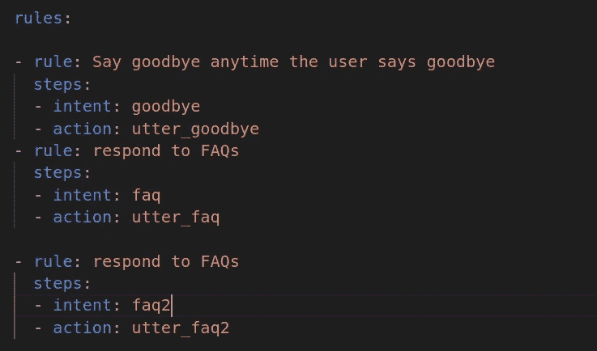
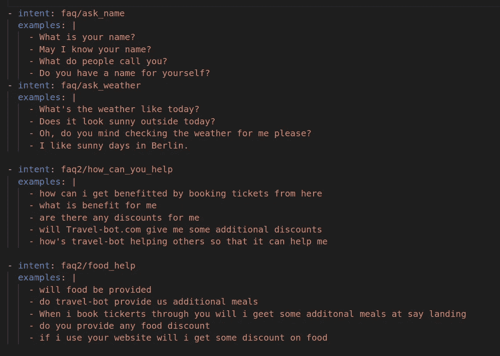
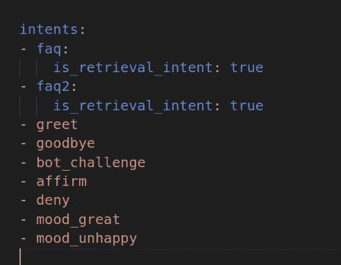
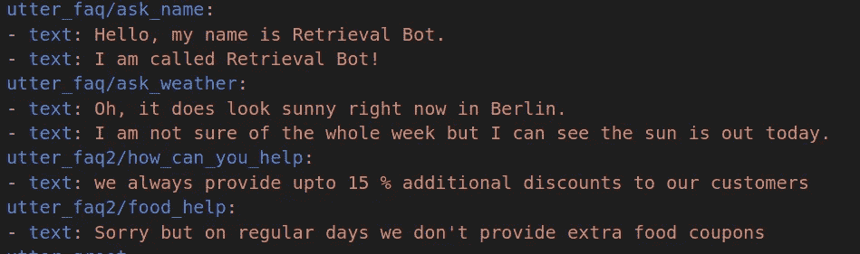

# 在 Rasa 支持的聊天机器人中处理常见问题和聊天的最佳实践

> 原文：<https://medium.com/analytics-vidhya/best-practices-to-handle-faqs-and-chitchat-in-a-chatbot-powered-by-rasa-68de54f55ac7?source=collection_archive---------6----------------------->

由[百合银行](https://unsplash.com/@lvnatikk?utm_source=medium&utm_medium=referral)在 [Unsplash](https://unsplash.com?utm_source=medium&utm_medium=referral) 拍摄的照片

在我制作量产级聊天机器人系列的第三件事。
今天，我们将讨论在处理
常见问题和闲聊(非正式问题)时要采用的**最佳实践**，如果你还没有看完前两部分，是的。也请看看它们。

1.你的第一个人工智能聊天机器人只有两行:[https://medium . com/analytics-vid hya/rasa-chat-bot-voyage-1-a 73 b 6 e 8 e 4947](/analytics-vidhya/rasa-chat-bot-voyage-1-a73b6e8e4947)

2.什么是 Rasa 以及它是如何工作的:[https://medium . com/analytics-vid hya/Rasa-chatbot-voyage-2-198 e 633 E8 c0e](/analytics-vidhya/rasa-chatbot-voyage-2-198e633e8c0e)

> 常见问题和聊天是聊天机器人生命周期中的特例。
> **你的助手会给出一组固定的回答。**
> 无论之前在对话中发生了什么
> 或
> 你都可以说
> **FAQ 和 Chitchats 是那些总是有固定答案的问题。**
> 如下例所示:-

# 如何在聊天机器人中定义常见问题和聊天的分步指南:-

## 1.更新配置文件

对于我们的常见问题，我们希望我们的聊天机器人用一组固定的答案来回答。所以为了处理这件事，Rasa 有一个叫做**的规则。**要使用规则，那么您需要将 [**RulePolicy**](https://rasa.com/docs/rasa/policies#rule-policy) 添加到您的配置文件中的策略:-

配置文件中的规则策略

接下来，将 NLU 管道中的 **ResponseSelector** 包含在配置文件中。ResponseSelector 需要一个特征和意图分类器(这里是 DIETClassifier)才能工作。因此，它应该位于管道中的这些组件之后，例如:

常见问题解答-检索意图

默认情况下，Rasa 只会做出一个检索意图。要分别检索 FAQ 和 chitchat 的响应，请使用多个 ResponseSelector 组件并指定`retrieval_intent`键:

检索意图

> 现在假设你的网站有 500 个不同的 FAQ 问题，而不是写 500 个意图。我们将把它们分成 50 个一组。
> 现在，为了处理前 50 个常见问题，我们将使用单动作，即 **utter_faq。**
> 
> 所以用一个单一的规则通过把它们分组在一个单一的 [**下检索意图**](https://rasa.com/docs/rasa/glossary#retrieval-intent) 称为例如 **faq** 我们的工作就完成了。继续这样下去，我们将不得不为 500 个常见问题编写 10 条规则。

## 2.定义规则

您只需要为每个检索意图编写一个规则。然后，在该检索意图下分组的所有意图将以相同的方式处理。动作名称以 **utter_** 开始，以检索意图的名称结束。写下回答常见问题的规则:

两种检索意图的规则

动作`utter_faq`和`utter_faq2`将使用 ResponseSelector 的预测来返回实际的响应消息。

## 3.对 NLU 数据进行更改

现在我们将为我们的检索目的添加 NLU 数据。
定义检索意图的语法:-
**<意图> / <检索意图>**

在上图中，我们已经为每个**检索意图定义了 **2 检索**。**

如果有检索意图，请务必以这种方式更新`domain.yml`

## 4.更新响应

在定义它们时，响应也遵循相同的约定。
T3。
下面我们定义了每个检索意图的 2 个检索的响应。

定义响应

现在输入`rasa train`来训练你的模型，并用`rasa shell`和它对话

## 完美你做了伟大的工作！

> 需要记住的要点

1.  每次检索不要超过 60-70 次，因为这会降低您的分类信心(个人经验)。
2.  总是在一个检索意图下定义多于或等于 2 个检索，否则您的响应选择器将不会训练
3.  确保你的配置文件中没有单独的规则策略，其他策略如`MemoizationPolicy`和`TEDPolicy`也包括在内。

代码链接:[https://github.com/sahibpreetsingh12/travel-bot](https://github.com/sahibpreetsingh12/travel-bot)

> 希望你会喜欢我的作品
> 
> 如果你鼓掌👏会很棒，但是
> 
> 鼓掌、关注和分享的结合将会令人惊讶地令人敬畏🔥 🔥 🔥