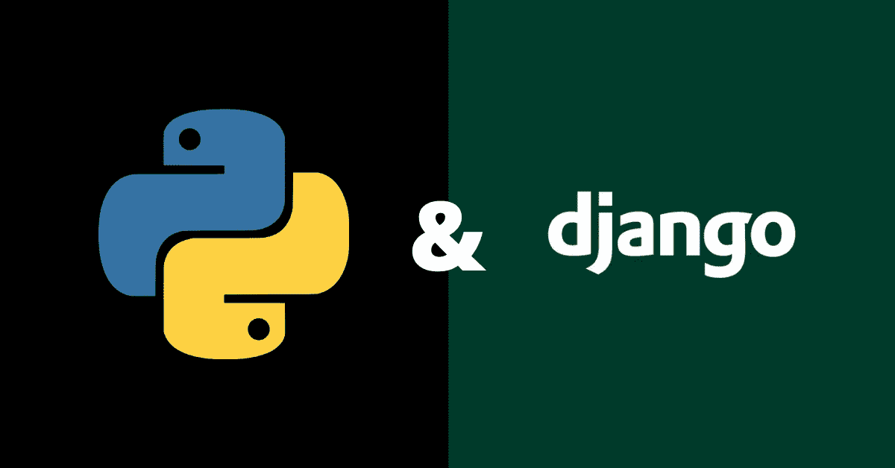
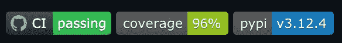

# 新 Python 和 Django 项目的最佳实践

> 原文：<https://medium.com/analytics-vidhya/best-practices-when-starting-a-new-python-django-project-9b2c92ecaff8?source=collection_archive---------5----------------------->

## 本指南将帮助您在开始项目时考虑几个问题。

Python & Django

# 目录

∘ [当你开始一个新的 Python / Django 项目时，你做的第一件事是什么？](#10a1)
∘ [文档](#cb7b)
∘ [包管理](#971d)
∘[docker](#62b2)
∘[林亭](#48e4)
∘ [安全检查](#31b7)
∘ [Git 挂钩](#5971)
∘ [持续集成(CI)](#418e)
∘ [记录您的 API](#4e9b)
∑[测试用例【关键词 gitignore /。∘](#6a64) [打包](#ed76)

## 当你开始一个新的 Python / Django 项目时，你首先要做什么？

*   你用*从头开始。/manage.py 启动项目*并直接开始编写您的需求？
*   你开始选择一些必要的库来帮助你的项目？

无论您决定以何种方式开始您的项目，记住这一点总是很好的，在未来您可能会或可能不会在那里维护代码和交付新的需求，您可能已经在一个新的项目或另一家公司工作了。没有人知道我们的未来会怎样。

有多少次你发现自己回到几个月前写的代码，对你所看到的感觉很糟糕(同时对你在那段时间的成长感觉良好)，那么多你现在可以用不同的方式做它，或者可能由于太多的原因很难跟上逻辑。

您可以做一些事情来提高您的整体代码质量和团队遵循的标准，我们将在这里讨论它们。

## 证明文件

每个人都曾被扔在一个正在进行的项目中，许多事情正在进行，资源短缺，可能错过了一个很好的项目文档，描述了项目的一些要点，我想说最起码的是:

1.  项目的标题
2.  项目的简短描述和回购旨在解决的问题
3.  “安装”一节描述了一步一步地获取项目在本地运行所需的所有库
4.  “用法”一节包含代码块的主要可用命令

有一天，在寻找一种带来更标准化的自述文件的方法时，发现了这个伟大的报告:[RichardLitt/standard-README](https://github.com/RichardLitt/standard-readme)

如果你有机会，我当然推荐阅读在`standard-readme`回购中可用的[规范](https://github.com/RichardLitt/standard-readme/blob/master/spec.md)，或者浏览[示例](https://github.com/RichardLitt/standard-readme/tree/master/example-readmes)，并开始在你的下一个项目中引入它。

## 包装管理

你和你的团队如何在你的项目中安装软件包？皮普。Pipenv？诗歌？康达？

您是否曾经在运行旧项目时遇到过问题，并且在安装库时遇到过阻碍？

有这么多的选择，你可以选择一个你和你的团队感觉更舒服的。

我建议使用一个工具，它会给已安装的包一个锁文件，并确保在安装依赖项时使用锁文件，以确保您有一个一致的构建，因为锁会考虑依赖树中的其他级别。

当您处于这样一种情况时，lockfile 将是一个很好的盟友:某个已经部署的项目已经有一段时间没有更新了，突然需要更改一些代码，而没有更新依赖项。如果您使用 Docker，并且构建映像的位置没有正在安装的依赖项的缓存层，如果您只是依赖于安装没有锁文件的包，任何依赖关系树中的更新都可能会给您带来一些意外的行为或崩溃。

我个人对使用 pipenv 很满意。

在我的 docker 构建过程中使用 pipenv sync -system，之后没有保持 pipenv 可用。

当在本地工作时，考虑使用 **pyenv** 为您的项目安装和选择 python 版本。随着新版本的发布，并且您正在维护其他项目，您可以用一种简单易行的方式来更改版本。

## 码头工人

Docker 是多么神奇的工具啊。通过几行代码，您可以让您的项目在一个构建好的映像中工作，该映像可以在任何地方分发和运行。

根据您的项目大小或任何存储限制，您可能需要修剪图像。

如果是这样的话，考虑使用-alpine 镜像，你的最终镜像会小得多，注意，软件包会用 apk 而不是 apt-get 来安装。

根据你的使用情况，你可能想要一个小图片，但是坚持基于 debian，尝试超薄图片。

**提示:**如果您在应用程序中使用*熊猫*，您可能希望只使用-slim 图像，而避免使用-alpine 的漫长构建过程。

无论如何，确保你有一个 other 文件或者你的项目的公开图像，让其他人使用你的项目或者为你的项目做贡献会容易得多。

下一步，如果你的项目需要一个数据库，一个队列，一个缓存服务，或者只是需要与其他服务通信，考虑提供一个 docker-compose.yml，这是另一个用几行代码变魔术的工具，易于编写，阅读和理解。

仔细考虑您提供的环境变量，在您的环境/项目中使用项目中的默认值显示环境变量是否有意义？

考虑使用. env 来覆盖您在项目中提供的一些关键变量。

根据您的项目大小，您可能还想将 docker 合成拆分成单独的文件，这样更简洁，更易于管理。如果是这种情况，可能是时候写下一些 shell 脚本来加速堆栈并跟踪正在运行的程序了。

请花些时间阅读使用 docker compose 处理环境变量的不同方法，如下所示:

 [## 合成中的环境变量

### Compose 有多个部分在某种意义上处理环境变量。本页应该有所帮助…

docs.docker.com](https://docs.docker.com/compose/environment-variables/) 

如果您有跨项目的依赖关系，请考虑在合成文件中利用外部网络的力量。

考虑你将与你的队友分享的开发者经验，关于构建时间、图像数量、你的团队成员在旋转堆栈时需要做的步骤。

请记住，如果您使用 Docker / Docker Compose，您的目标是节省时间和跨平台工作时固有的复杂性。

## 林挺

如果您在几个项目中工作，并且在这些项目中您已经注意到使用了不同的 linters，可能设置了关于代码应该看起来如何的不同规则，或者您已经在一些 PRs 中收到了关于您的编码风格的一些评论，可能只是比较了一些代码并感觉到每个代码中的好和坏…

代码质量是保持公司不同项目和团队之间代码一致性的一件重要事情。找出并纠正没有遵循编码风格的地方，并利用工具使这项工作变得更容易。

这是另一个有很多选择的话题，比如 pycodestyle，pyflakes，mccabe，pylint，pylama 等等。

我喜欢用 [**皮拉马**](https://pypi.org/project/pylama/)**[**黑**](https://pypi.org/project/black/) 和 [**isort**](https://pypi.org/project/isort/) 的组合。它将一系列工具结合在一起，易于使用和设置。**

**使用 black 来自动修复该工具能够修复的内容，然后使用 pylama 来验证是否应该修改其他内容，最后使用 isort 来保持导入的有序性。**

**确保检查黑色的[兼容配置](https://black.readthedocs.io/en/stable/compatible_configs.html)以使用工具正确设置您的项目。**

**多看几遍 PEP 8 也无妨，PEP 8 是 Python 代码的风格指南。**

**我还要说的是，只要你和你的团队选择用来完成这项工作的工具运行良好，你就要继续使用这个工具。**

## **安全检查**

**确保我们正在部署的项目尽可能安全，是我们的责任之一。除了在设计和实现项目时仔细规划之外，还有一些工具可以帮助您检查代码中可能存在的安全问题。**

**考虑将 [bandit](https://pypi.org/project/bandit/) 和 [safety](https://pypi.org/project/safety/) 结合起来进行静态应用安全测试(SAST)。**

**Bandit 可以帮助你发现代码中的安全问题，而 safety 会检查你的依赖关系。**

**没有理由就此止步。开放 Web 应用程序安全(OWASP)为动态应用程序安全测试(DAST)提供了以下漏洞扫描工具列表。**

** [## 漏洞扫描工具

### Web 应用程序漏洞扫描器是自动扫描 web 应用程序的工具，通常从外部扫描，以…

owasp.org](https://owasp.org/www-community/Vulnerability_Scanning_Tools) 

OWASP 社区甚至有他们自己的开源扫描器， [Zed 攻击代理(ZAP)](https://www.zaproxy.org/) 。

根据您的项目和公司，建议您让第三方对您的产品执行 pen 测试，以识别更多可能的威胁。

在您运行任何 DAST 检查之前，您可能想要检查您的[安全头](https://owasp.org/www-community/Security_Headers)(如果您喜欢在 OWASP 幻灯片中阅读更多信息，[请单击此处](https://owasp.org/www-chapter-ghana/assets/slides/HTTP_Header_Security.pdf))。

祝你安全部署:)** 

## **Git 挂钩**

**你正在愉快地编码产品的下一个特性，一点一点地编写你一直坚持的工作代码，你完成了一天的工作，然后把它推到回购上。**

**通过设置 git 挂钩，您可以让一些 git 动作触发某些脚本，比如 git 提交或 git 推送。**

**一个可以利用的好工具是[预提交](https://pre-commit.com/)。**

**易于安装和设置在您的项目中，考虑您希望在每次提交/推送时执行的命令，例如:**

*   **代码格式**
*   **伊索特**
*   **林挺**
*   **安全检查**
*   **单元测试**

**拥有 git 挂钩有助于您在开发过程的早期发现并修复问题。**

## **持续集成**

**你正试图发布你的产品，但是构建失败了…或者构建成功了，但是一些特性被破坏了…我们能做些什么来减少这种情况发生的次数吗？**

**还有很多帮助我们进行 CI 的工具，比如 Travis CI、Circle CI、Gitlab CI、Github Actions、Jenkis 等等。**

**确保至少您有相同的 git 钩子在您的主分支的打开的 PRs 上被执行。也许钩子并没有安装在每个人的机器上，或者钩子被绕过以获取一些东西。如果你和你的团队致力于代码质量，并且你们都同意关于代码的某些标准，这应该不是什么大事。**

**还有其他工具可以帮助您识别问题、漏洞、可能的重构等等。**

**考虑一下:**

*   **[SonarQube](https://www.sonarqube.org/)**
*   **[护栏](https://www.guardrails.io/)**
*   **[SonarCloud](https://sonarcloud.io/)**
*   **[GitGuardian](https://www.gitguardian.com/)**
*   **[工作服](https://coveralls.io/)**
*   **[Snyk](https://snyk.io/)**
*   **[气候代码](https://codeclimate.com/)**

**你的决定应该考虑对于你正在开发的项目，什么对团队和公司是重要的。**

**我在这里的建议，就像林挺一样，是团队对可用的工具做一些研究，选择一个或几个，如果工具成功地完成了它的工作，那就完美了！**

**您可能希望从商定的最小工具集开始，并在您认为合适的时候进行扩展，以减轻工具的依赖性。**

**考虑在这个过程中进行集成和端到端测试，这可以帮助您在开始发布过程之前发现问题。**

## **记录您的 API**

**你需要利用人们告诉你的存在于你的公司中的 API，但是没有关于它的文档，你需要弄清楚它，四处询问，并且在提供这个很酷的特性之前有许多来回。也许有人问你如何使用你不久前写的 API，而你和你的团队不停地转发或发送电子邮件。**

**如果你去过那里，你会知道这是不方便的，并且一致地记录你的 API 是多么重要。**

**一个好的 README.md 是不够的，重要的是在项目间以一致的方式记录你的端点。当我们谈到这一点时，我们的意图是了解什么是可用的端点、HTTP 动词和预期的响应结构…当使用 API 时，人们可能会遇到什么样的错误，因此它可能在消费者端得到处理。**

**阅读和考虑一种[消费者-驱动者契约](https://martinfowler.com/articles/consumerDrivenContracts.html)方法是很好的，它可以帮助并行化开发工作，并且您知道您的消费者期望什么**

**有两个很棒的工具可以帮助我们记录我们的端点， [API Blueprint](https://apiblueprint.org/) 和 [OpenAPI](https://www.openapis.org/) (最初称为 Swagger)。**

**OpenAPI 使用更广泛，API Blueprint 似乎更容易读写。他们都有一套很好的工具可以帮助你。**

**我建议给 API Blueprint 一个机会，使用 [dredd](https://dredd.org/en/latest/) 根据实际的端点来验证您的合同(在 CI 流程中使用这是一个好主意)，使用 [snowboard](https://github.com/bukalapak/snowboard) 或 [aglio](https://github.com/danielgtaylor/aglio) 来漂亮地呈现您的合同，使用 [drakov](https://github.com/Aconex/drakov) 来运行一个模拟服务器，甚至在编写端点代码之前测试您的合同。**

**尽管如此，我相信无论你在这里做什么选择都会得到很好的服务。**

## **测试案例**

**单元测试、集成测试和端到端测试…**

**我们将关注对您项目的单元测试和集成测试的建议。**

**首先，确保你已经建立了测试用例的结构。**

**一些常见的方法有:**

*   **filename.py 和测试用例在同一个目录下的 test_filename.py 或一个目录下的 tests.py 中**
*   **项目根目录下的测试文件夹，以及遵循项目结构的测试文件**

**我发现第二种方法随着项目的增长变得更具可扩展性，但仍然是可管理的。**

**考虑使用 [pytest](https://docs.pytest.org/en/latest/) 并检查[可用插件](https://docs.pytest.org/en/latest/reference/plugin_list.html#plugin-list)，如 [pytest-django](https://pytest-django.readthedocs.io/en/latest/index.html) 和 [pytest-cov](https://pypi.org/project/pytest-cov/) 。**

**使用 pytest-cov、 [coverage.py](https://coverage.readthedocs.io/en/coverage-5.5/) 或其他工具获得测试的覆盖率报告是很棒的，它让你对事情是如何被覆盖的一目了然，但是更重要的是以智能的方式测试你的代码，这将确保功能按预期工作，而不是仅仅看到覆盖率上升。**

**还有一些工具可能对您的测试有所帮助:**

*   **[模型面包房](https://pypi.org/project/model-bakery/)(可以帮你做夹具，测试你的测试数据)**
*   **[冷冻枪](https://github.com/spulec/freezegun)(如果你需要在测试中使用时间，这真的很方便)**

**另外，看看下面文章中的“测试金字塔”。**

** [## 拒绝更多的端到端测试

### 在你人生的某个时刻，你可能会想起一部你和你的朋友都想看的电影…

testing.googleblog.com](https://testing.googleblog.com/2015/04/just-say-no-to-more-end-to-end-tests.html) 

> 作为一个很好的初步猜测，Google 经常建议进行 70/20/10 的划分:70%的单元测试，20%的集成测试，以及 10%的端到端测试。每个团队具体组合会有所不同，但总的来说，它应该保持金字塔形状。** 

## **徽章**

**在您的 README.md 文件中添加一些徽章可以帮助贡献者轻松识别您项目的某些方面。**

****

**Github 存储库中的徽章**

**这在视觉上很吸引人，你可以在徽章上有相关信息，比如:**

*   **构建状态**
*   **代码覆盖率**
*   **最新发布版本**
*   **项目许可证**
*   **代码质量评级**
*   **漏洞数量**
*   **技术债务百分比**
*   **社交平台**
*   **依赖项/库状态**
*   **+更多**

**找到徽章的好地方是 https://shields.io/**

## **变更日志**

**确保也维护一个 CHANGELOG.md。这是一个简单的具有特定格式的 Markdown 文件，你可以在其中写下对项目所做的更改、新特性、修复、不推荐使用的东西等等。**

**遵循 SemVer +保持一个 changelog，并且知道什么和什么时候什么东西被引入到项目中是值得的，例如，想象一下如果你想要升级一个包的版本，你可能想要检查在版本之间发生了什么，验证是否有任何突破性的改变，并且有一个升级指南你需要浏览。有时候如果你看到补丁有变化(少校。MINOR.PATCH)时，您甚至可能不会感到麻烦，因为您正在使用的包很可能遵循语义版本控制，并且您知道没有什么主要的东西会让您对更新感到头疼。**

**任何人都会知道引入了什么，并能够利用这些变化。它有助于商业和开发者。这对每个人都有帮助。**

**在[https://keepachangelog.com/en/1.0.0/](https://keepachangelog.com/en/1.0.0/)查看格式并了解更多信息**

**也许值得看一看[语义发布](https://github.com/semantic-release/semantic-release)来进一步帮助你的项目。**

## **设置**

**我真诚地建议将所有设置保存在一个文件中，并使用环境变量来更改变量值。**

**有一个很棒的包叫做 [python-decouple](https://pypi.org/project/python-decouple/) ，你可以安装并利用一个. env 文件来设置你的环境变量，通过使用这个包你可以强制一些环境变量在没有默认值的环境中是必需的，解析端口号为整数或者使用 Csv 函数将逗号分隔的环境变量转换成列表。**

**万一你犯了你的。env 的缺省值，为了让团队更容易设置项目，我建议添加“.env"。dockerignore 文件并避免您的样本值出现在您的图像中。**

**清理已安装的应用程序和任何你不需要的中间件。**

**提示:如果你有样品。env 在你的项目中提交并且通常必须修改它并且不能推送更新的版本，确保检查以下命令:**

> **git 更新-索引-跳过-工作树<filename></filename>**
> 
> **git 更新-索引-不跳过-工作树<filename></filename>**

**通过运行第一个，您对文件所做的任何更改都不会显示出来，如果对文件进行了更改并且发生了冲突，您可以运行第二个来将它返回到索引并获得更改，修复冲突，然后再次运行第一个。**

**[阅读这篇好文章](https://compiledsuccessfully.dev/git-skip-worktree/)了解更多信息。**

## **。gitignore /。dockerignore**

**有没有克隆一个存储库并注意到许多不需要或不应该存在的文件？**

**通过创建这些文件并将其添加到. gitignore 文件中，避免将这些文件添加到您的 git 历史中。**

**我通常使用这个网站得到一个好的。git 启动项目时忽略:**

** [## gitignore.io

### 创造有用。git 从 521 操作系统、IDE 和编程语言中选择忽略项目文件…

www.toptal.com](https://www.toptal.com/developers/gitignore) 

通常打字:macOs，Vim，VisualStudioCode，Python，Django

取决于项目和团队。

现在我们来谈谈。我建议总是拥有它，并尽可能忽略。环境，。git，测试，构建和缓存容器中的文件。** 

## **包扎**

**我想感谢你阅读这篇文章，我希望你在这里读到的一些东西对你和你的团队有所帮助。**

**本文中的所有观点仅仅是我多年来使用该语言和框架的观点的陈述。**

**这是我的第一个帖子，所以如果你有任何建议，请告诉我。**

**我想特别感谢我的第一批雇主和导师，他们在我职业生涯的最初几年帮助并指导了我。如果没有你们给我的机会，我不会走到这一步。谢谢达维·奥利维拉·坎波斯和塞尔吉奥·奥利维拉·坎波斯。**

**你知道你可以在一篇文章中发送多达 50 个掌声吗？欢迎任何掌声:)**

**又一个很棒的阅读材料:[十二因素应用](https://12factor.net/)**