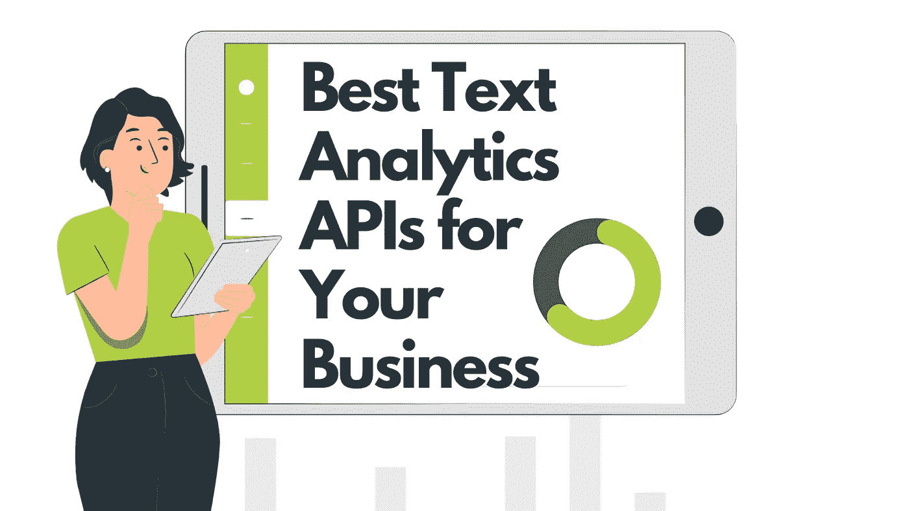

# 适合您业务的最佳文本分析 API

> 原文：<https://medium.com/analytics-vidhya/best-text-analytics-apis-for-your-business-f6ed9012860b?source=collection_archive---------9----------------------->

**文本分析 API** 是一个基于云的系统，包括内容分析、文本挖掘、关键词密度提取、语言检测和命名实体识别以及其他自然语言处理。

文本分析 API 允许您使用预先构建的工具，而不是从头开始创建软件。基于你的技能、预算和时间表，你可以使用开源软件或 T2 SaaS T3 软件。

虽然开源软件是免费的，适应性强，并提供了丰富的资源，但使用开源 API 将需要一个机器学习专家团队。另一方面，SaaS 工具为用户提供了高级文本挖掘解决方案，只需几行代码就可以快速轻松地实现，并且不需要预先了解应用程序开发或机器学习。

# 实现文本分析 API 的好处。

1.  它简化了您的业务流程。
2.  它使知识工作者能够充分利用他们的时间。
3.  它自动执行耗时的手动任务。
4.  它可以让你跟踪你公司的声誉。
5.  它为您确定新的收入来源，并使前瞻性危机管理成为可能。

首先，您可以使用各种文本挖掘 API。最适合您需求的方案将由您的项目范围、预算和您公司的核心竞争力来决定。

# 这里有一些你可以在你的公司使用的文本分析 API。

## **1。** [**字节视图**](https://www.bytesview.com/)

BytesView 的文本分析 API 使用简单，可以通过分析复杂的结构化或非结构化文本数据来准确评估用户信息。

使用他们的文本分析解决方案，您可以轻松地从多个来源收集文本数据，并使用它来集中改进您的客户支持服务、员工和客户响应解决方案等。

## **2。** [**IBM 沃森**](https://www.ibm.com/in-en/watson)

IBM Watson 是该公司的人工智能平台选择。沃森的自然语言理解 API 为开发者提供了创建深度学习文本分析模型的高级工具和功能。

沃森自然语言分类器(用于文本分类)、沃森声调分析器(用于情感分析)和沃森个性洞察都是在沃森环境中使用 API(用于客户细分)。

## **3。** [**玫瑰花结**](https://www.rosette.com/)

Rosette 的文本分析 API 可以对社交媒体数据进行情感分析和更精细的分析。客户的情绪，例如，当他们提到特定的产品、公司或人时。

如果你有全球数据，你可以训练 Rosette 的情绪分析工具识别多达 30 种语言。

## **4。** [**猴子学**](https://monkeylearn.com/)

MonkeyLearn 是一个以适应性著称的文本分析程序。只需创建标签，然后手动突出显示文本的不同部分，以显示哪些内容属于哪个标签。

随着时间的推移，该软件可以自行学习，并可以同时处理多个文件。它包含一组预先训练好的模型，可用于情感分析、关键词提取、紧急情况检测等任务

## **5。** [**谷歌云的自然语言 API**](https://cloud.google.com/natural-language)

使用谷歌的机器学习，谷歌云自然语言 API 可以帮助企业理解和推进文本中的信息。它本质上提供了两种类型的选项:一套用于分析情感、定位实体和分类内容的预训练模型，以及一套用于创建定制机器学习模型的 Cloud Auto ML。

创建自己的模型很简单，有许多指南可以帮助您浏览 API。

## **6。**

**Lexalytics 是一个文本分析解决方案，分析各种类型的文本。Lexalytics 可以分析社交媒体评论、调查和评论，以及任何其他类型的文本文档。除了情感分析，该工具还执行分类、主题提取和意图检测，允许用户看到完整的上下文。**

## ****7。**[**talk walker**](https://www.talkwalker.com/)**

**Talkwalker API 是另一个用于文本分析的伟大工具。它声称拥有可用的最佳情绪分析技术，允许它区分讽刺和其他模糊的贬义提及。**

**由于它可以准确地告诉你人们对你公司的社交媒体账户的看法，这个工具最好与你的社交渠道结合使用。**

**我希望这篇文章对你有用😀**