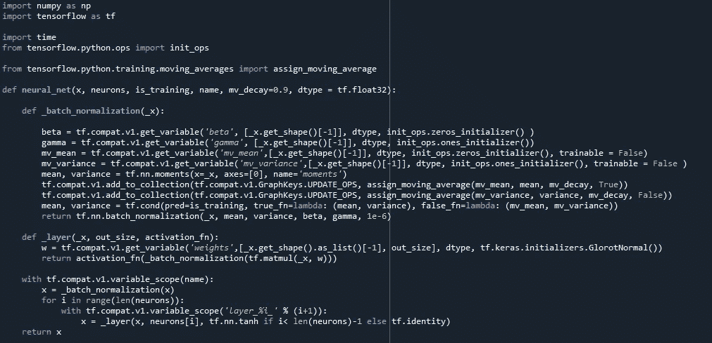
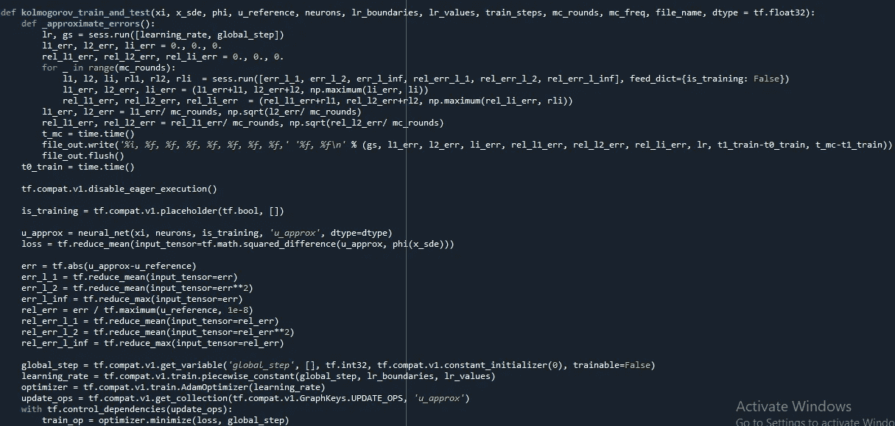
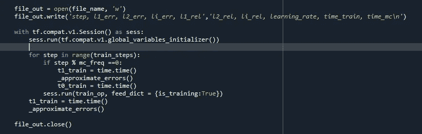
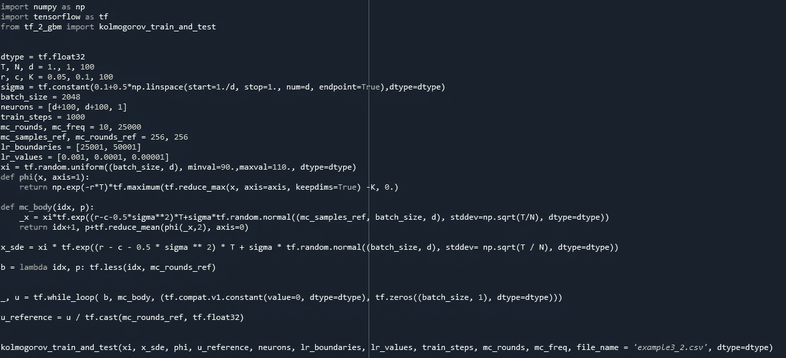

# 更好的几何布朗运动建模方法

> 原文：<https://medium.com/analytics-vidhya/better-way-to-model-geometric-brownian-motion-4c1b73aeec2e?source=collection_archive---------9----------------------->

在我的上一篇文章中，我介绍了几何布朗运动，并用著名的蒙特卡罗方法模拟了随机微分方程。由于我对这个模型不满意，正在寻找其他方法，我最终偶然发现了近似动态编程。

我们将在这些文章中使用近似动态规划(也称为强化学习)对随机微分方程进行建模(学习动态规划可以去 MIT-open 课件，[https://OCW . MIT . edu/courses/electrical-engineering-and-computer-science/6-231-dynamic-programming-and-random-control-fall-2015/index . htm](https://ocw.mit.edu/courses/electrical-engineering-and-computer-science/6-231-dynamic-programming-and-stochastic-control-fall-2015/index.htm))。我们的方法如下:

这种无限维随机优化问题在时间上借助于基础 SDE 的适当离散化来离散化，并且在空间上借助于全连接深度人工神经网络近似来离散化。然后通过随机梯度下降型优化算法(Adam Optimizer)来解决由此产生的无限维随机优化问题。(要理解完整的数学，【https://arxiv.org/abs/1806.00421】

我们使用 tensorflow 在 Python 上建模。首先，我们建立基本功能，即神经网络和 kolmogorov 训练和测试算法。在这些例子的每一个的情况下，我们在我们的实现中使用了具有一个输入层、两个隐藏层和一个一维输出层的全连接前馈神经网络。我们还在第一次线性变换之前、隐藏层前面的两个非线性激活函数之前以及最后一次线性变换之后使用批量归一化。

定义神经网络

定义优化器算法

我还附上了几何布朗运动的用例

这些算法可用于求解许多不同的随机微分方程。我相信你也会和我一样觉得它很有用。从结果来看，这些算法在时间效率和准确性上都明显优于蒙特卡罗方法。