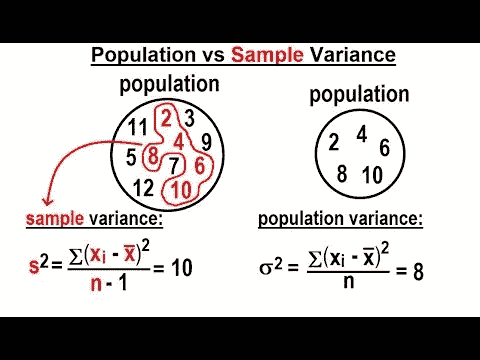

# 偏见

> 原文：<https://medium.com/analytics-vidhya/bias-1e64687e5c85?source=collection_archive---------15----------------------->

如果你对统计学或任何其他与统计学有相似之处的领域感兴趣，你必须至少听说过一次偏见。我听说这件事的时候是大学一年级。在统计学讲座中，我看到了许多不同的度量标准，如中位数，平均值等。其中一个引起我注意的指标是计算人口的方差。在计算这个指标时，您需要使用 N 作为群体中实例的数量。但是有时候有时候需要用 N-1 来代替 N。当我问教授使用 N-1 的原因时，她回答说这是为了降低偏倚的影响。

# 什么是偏见？

偏差是一个模型的行为，它做出有偏见的预测，导致错误。这是偏见的一句话的意思。当然，我们可以概括这种影响，并从不同领域找到与统计相关或无关的例子。甚至我们作为人类也有偏见。每当你讨论某事时，你倾向于围绕你的知识领域说话。你把关于这个话题的每条信息联系起来，从这些联系中进行推断，然后把结果传递给你旁边的人。

我可以说，任何统计模型都和我们没有太大区别。它倾向于围绕其知识空间进行预测。你可以像人类一样轻松地到达模型的知识空间。它是如此具体。excel 表格、数据库表格或任何其他来源中的数百、数千或数百万数据行。模型必须使用这个有限的数据湖(在 Hadoop 等一些生态系统中，它被称为*数据湖*),以便对任何特定主题做出假设。因此，数据源的限制在某种程度上或多或少地扼杀了泛化能力。但不仅仅是因为极限造成的。还有其他因素，如输入集的质量、目标类的分离(也参见 [*不平衡数据集*](https://www.analyticsvidhya.com/blog/2021/06/5-techniques-to-handle-imbalanced-data-for-a-classification-problem/) )、某些算法的模型训练部分中数据记录的顺序(等等。)可能会增加或减少模型的偏差。

# 偏差(预防措施)用在哪里？

在统计学中，有许多方法可以减少偏差的影响。一些方法旨在计算标度中的偏差，而一些方法进行假设，认为这降低了偏差的影响。我想再一次提到在方差计算中用 N-1 代替 N 的用法。在计算整个总体(一个聚类的所有可能成员)的方差时，需要使用 N. But N-1 来计算该总体中一个样本的方差。因为你没有使用整个实例，而是使用它的一部分，所以你开始围绕这些实例进行推断。你假设这个子群是最终的代表，你接受样本作为群体本身。因此，对于总体样本的每个不同行为，你的计算都会有误差。相应地，您需要知道您开始围绕样本进行计算，并且倾向于围绕样本计算指标。为了降低偏置的影响，使用 N-1。细节和不清楚的地方可以用这个[链接](https://stats.stackexchange.com/questions/17890/what-is-the-difference-between-n-and-n-1-in-calculating-population-variance)。

从 [YouTube 上米歇尔·范·比森的视频中检索](https://www.youtube.com/watch?v=3uA7ZdlphIo)

在回归模型中，存在最终模型的数学公式表示，并且模型被训练来调整该公式的参数。根据公式，特征值是从 excel 表格的列中检索的值，权重值对应于形成最终公式的每个特征值。在模型的训练部分，由于模型的预测误差，它可以增加或减少权重值。有趣的一点是，另一个参数被用来完成公式，这个参数被称为*‘偏差’。*它用于调整模型的输出，因为已知模型在预测时容易出错。也可以勾选这个[链接](https://www.analyticsvidhya.com/blog/2020/12/a-measure-of-bias-and-variance-an-experiment/)。