# 偏差和方差

> 原文：<https://medium.com/analytics-vidhya/bias-and-variance-613ff5c9ef5c?source=collection_archive---------4----------------------->

## 机器学习中的偏差和方差综述

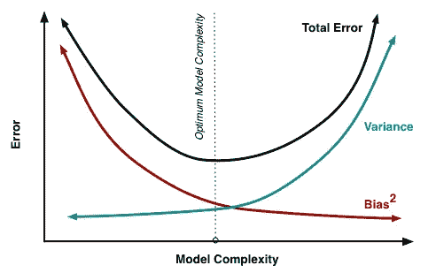

来源:http://scott.fortmann-roe.com/docs/BiasVariance.html

如果你熟悉机器学习，你可能听说过偏差和方差。但是如果没有，不要担心，我们将一步一步地用简单的方式解释它们。

让我们用一个相反的方法，我们将从一个实际的例子开始，逐步进行，直到我们得到最终的定义。

我们将使用来自Kaggle 的 [Longleys 经济回归](https://www.kaggle.com/ukveteran/longleys-economic-regression-data)数据集。这是一个非常简单的小数据集，适合理解我们今天的主题。

现在，让我们快速浏览一下数据集。

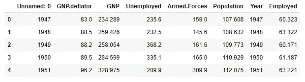

Longleys 经济回归数据集的前几行。

**注:**由于我们的目标是讨论偏差和方差的概念，而不是解决机器学习问题，我们将只考虑一个特征，即“群体”，并使用它来预测结果，即“就业百分比”。

这是我们绘制 **' *'就业* '** '与 ***'人口'时数据集的样子。***

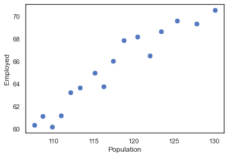

Longleys 经济回归数据集中的全部样本。

首先，我们应该将数据集分成训练和测试子集。

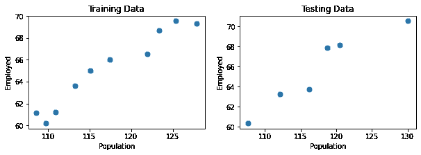

现在我们想弄清楚 ***【人口】*** 和 ***【就业】****之间的关系，换句话说，我们想建立一个回归模型来帮助我们预测给定人口的未来就业情况。*

*有两种可能的模型，线性和非线性模型。*

*让我们对它们都进行探索，看看结果如何。*

# *(1)假设线性关系*

## *1-简单线性回归*

*该模型的方程式为 **y = ax+b** ，其中:*

*   *y 是‘就业’。*
*   *x 是“人口”。*
*   *‘a’和‘b’分别是斜率和 y 轴截距。*
*   *“a”和“b”是需要调整以获得最佳结果的模型参数。*
*   *' a '和' b '可以取-inf 到+inf 之间的任何值。*

*在 x-y 平面上可以画出无限多条线，但让我们只看其中的三条。*

*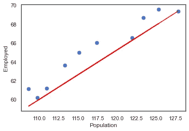*

*图(1)*

## *在图(1)中:*

*回归线(红线)不能正确拟合数据，如果我们在训练数据上计算这个模型的**平方和误差** **(SSE)** ，它将是 **22.73。***

> ***误差平方和(SSE)是真实值和预测值的平方差之和。***

*这里我们说模型有**高偏差**，因为它不能很好地处理训练数据。我们称之为**欠适**。*

*让我们将这个模型应用于测试数据:*

*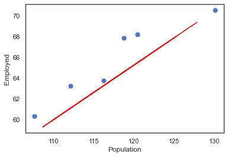*

*将模型应用于测试数据。*

*该模型表现很差，因为它不能正确预测任何一点，而**上证综指为** **25.32。**当一个模型不符合测试数据时，我们说这个模型有**高方差。***

***观察:**模型有**高偏倚和高方差。***

*让我们试试另一条线:*

*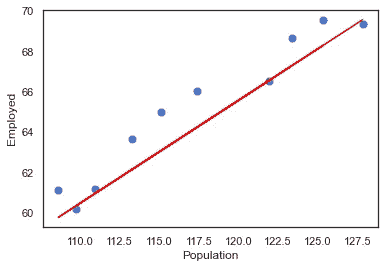*

*图(二)*

## *在图(2)中:*

*当再次计算平方和误差时，我们发现它是 **14.66***

*比上一个好多了，但是还是高。*

*再试一次:*

*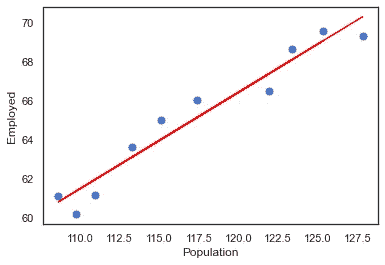*

*图(三)*

## *在图(3)中:*

*该线可以更好地拟合数据，并且 **SSE 为 6.43***

*这是线性模型的最佳直线，可用于对我们的数据进行建模，并给出最接近的预测。*

> *我使用了[**‘numpy . poly fit’**](https://numpy.org/doc/stable/reference/generated/numpy.polyfit.html)**函数来获得最符合数据的直线的斜率和 y 轴截距。***

***现在让我们来看看测试数据，看看我们的模型**‘第三个’**在新数据集下会有什么表现。***

***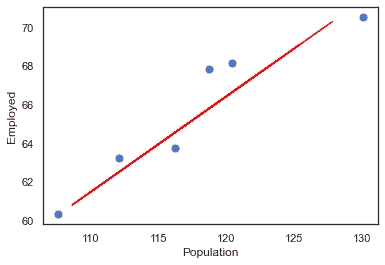***

***将第三线性模型应用于测试数据。***

***该模型表现不佳，因为它无法正确预测任何一点，上证综指**为 8.43。*****

## ***2-多项式回归***

***这个模型的方程是多项式，也可以包含一些其他数学函数，如正弦、余弦、正切、对数等。这可能相当复杂。虽然这个方程是多项式的，但它仍然是一个线性模型。***

***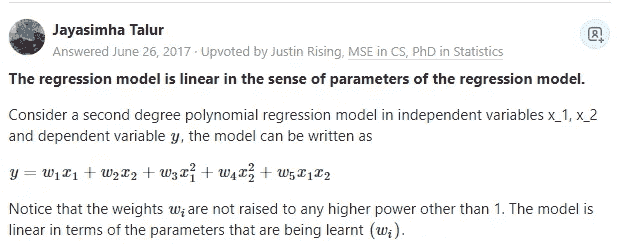***

***来自 Quora 的回答:[https://qr.ae/pNDyYf](https://qr.ae/pNDyYf)***

***同样，有无限多的回归线可以用来预测我们的结果。让我们试试其中的一些。***

## ***①弯弯曲曲的线条***

***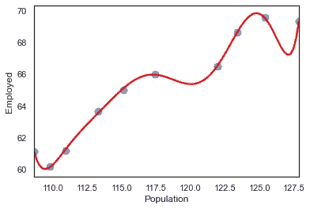***

***弯曲模型***

***在这里，我们看到模型完全符合我们的训练数据，并且 **SSE 为零**，因此它具有**低偏差**。***

***现在让我们看看这个模型在处理新数据(测试数据)时会如何。***

***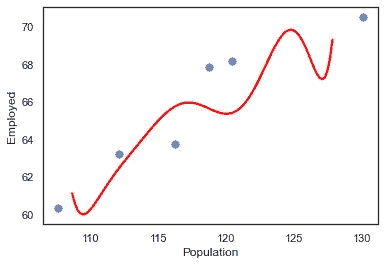***

***将曲线模型应用于测试数据。***

***您可以看到，性能是一场灾难，因为它无法符合数据，甚至无法给出可接受的预测。我们说模型有一个非常**高的方差**。模型**过度拟合**训练数据。***

*****观察:**模型有**低偏倚高方差。*****

## ***(2)二阶模型***

***这个模型的方程式是 **y=ax +c** 。***

***同样,“a”和“c”是需要调整以获得最佳结果的模型参数。它们可以取-inf 到+inf 之间的任何值。让我们挑一个看看结果:***

***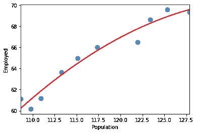***

***二阶模型。***

***我们看到，我们的模型在训练数据方面做得很好，虽然有一些误差，但这是可以接受的。***

***现在让我们将它应用于测试数据:***

***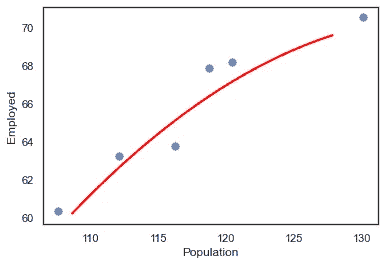***

***将 2n 阶模型应用于测试数据。***

***它也做得很好。***

*****观察:**模型具有**低偏倚和低方差。*****

## ***(3)高阶方程***

***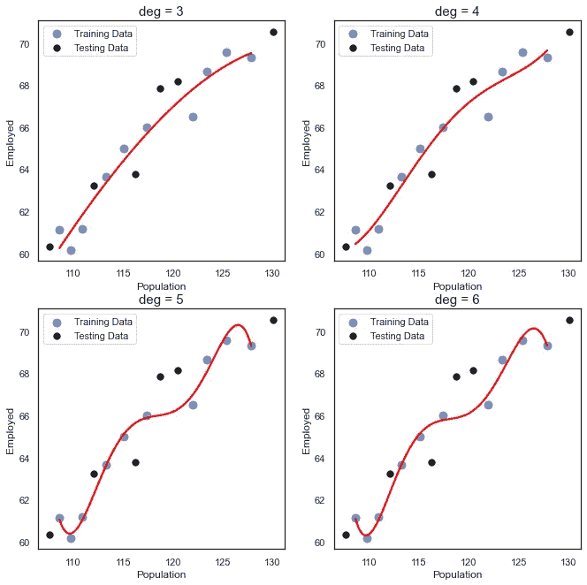***

***请注意，随着订单的增加，模型变得更加复杂，并且开始过度拟合数据。***

# ***(2)假设非线性模型***

***在这个模型中，被调整的参数(a，b，c，…)具有非线性关系。例如，该模型的等式可以是这样的:***

***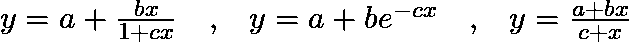***

***因为有无限多的方程式，让我们选择一个看看结果:***

***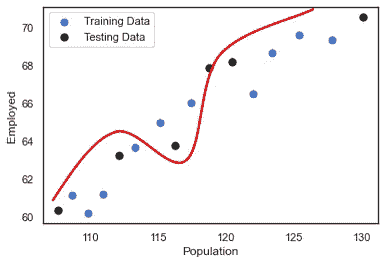***

***在这个模型中，你可以看到它对训练数据做得不好，但对测试数据做得很好。我们说这个模型有**高偏差低方差。*****

***模型在测试数据方面做得很好，而在训练数据方面做得很差，这似乎有点奇怪。根据我们数据的性质，以及当模型无法捕捉数据的潜在模式时，这可能会发生。***

*****注:**偏差误差和方差误差之间的平衡称为**偏差-方差权衡**。***

***在这个例子之后，我们现在对偏差和方差以及它们如何影响我们的模型性能有了一个清晰的认识。***

***现在让我们把东西放在一起，写下我们的结论和笔记。***

## ***什么是偏见？***

*   ***简单地说，偏差是预测值和预期/真实值之间的差异。***
*   ***该模型对数据做出某些假设，以使目标函数简单，但这些假设不一定总是正确的。***
*   ***偏差来自模型中的假设。例如，假设我们对具有三角关系的数据使用了线性模型。这个模型会有很大的偏差，因为我们对数据采用了**错误的假设**,而这个模型将使用这个错误的假设进行训练。***
*   ***高偏差模型对目标函数做出更多假设。***
*   ***高偏差会导致算法错过特征和目标输出之间的正确关系(欠拟合)。***
*   ***偏差误差是由于学习算法在训练期间做出错误/不准确的假设而导致的误差。***
*   ***零偏差听起来不错，因为模型完全符合训练数据，但这意味着模型从训练数据中学到了太多东西，这被称为**过度拟合**，模型将无法很好地处理新的/测试数据。***

## ***什么是方差？***

*   ***方差是指模型在训练过程中考虑了数据中的波动/噪声。我们所说的噪声是指由于人为错误或自然现象导致的任何微小波动，这些波动可能会导致一些错误/不准确的数据。***
*   ***方差是由于对数据集中微小波动的敏感性而产生的误差。***
*   ***高方差模型从数据中学习了太多，因为它仍然认为噪声是可以学习的东西，结果，它对任何小波动都变得非常敏感，并且它**过度拟合训练数据**。然后当它应用于新数据时，它无法正确预测结果。***
*   ***高方差会导致算法模拟训练数据中的随机噪声，而不是预期的结果。***

## *****偏差-方差权衡*****

*   ***增加偏差减少方差，增加方差减少偏差。***
*   ***表现出**低方差和高偏差的模型将低于**目标，而具有**高方差和低偏差的模型将高于**目标。***
*   ***我们的目标是达到一个低偏差和低方差的模型。***

***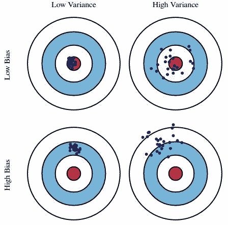***

***偏差和方差靶心图。***

***在上图中，中心即靶心是模型试图正确预测的目标。随着我们远离靶心，模型开始做出越来越多的错误预测。***

***具有低偏差和高方差的模型预测围绕中心但彼此远离的点。一个高偏差低方差的模型离靶心很远，但由于方差低，预测的点彼此更近。***

***挑战是在模型的偏差和方差之间找到正确的平衡。***

***我希望你喜欢这篇文章。下一次，我们将讨论如何使用正则化、交叉验证和许多其他方法来解决这个问题。***