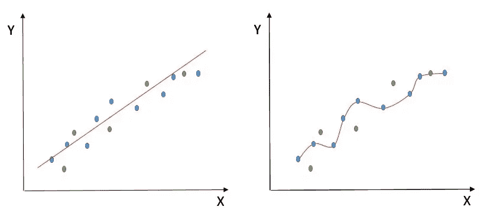

# 机器学习中的偏差和方差

> 原文：<https://medium.com/analytics-vidhya/bias-and-variance-in-machine-learning-b0436b00c092?source=collection_archive---------23----------------------->

机器学习中最重要的指标之一。

我搜索了一下如何解释什么是偏差和方差，发现了这个完美的视频。它解释这些术语既快又易懂。