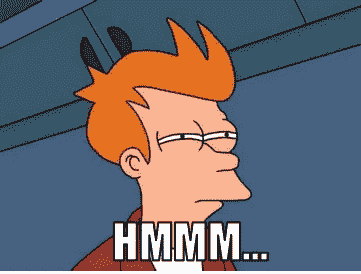
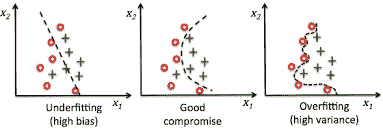
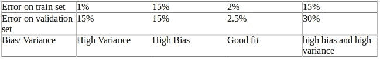

# 深度学习时代的偏差和变异

> 原文：<https://medium.com/analytics-vidhya/bias-and-variance-in-the-deep-learning-era-ff6a493dc4cf?source=collection_archive---------18----------------------->

机器学习中有一个很容易学习但很难掌握的概念就是偏差和方差。这就像新手的人工智能，他们谈论了很多，但不知道它内部是如何工作的(无意冒犯，伙计们)。

**理解偏差和方差**

每当我们训练我们的模型时，我们想要的是模型具有最小的损失，并且我们得到以高精度区分类别的决策边界。但这并不总是我们所得到的。

我们把一个数据集分成三部分:训练集、验证集和测试集。训练集是我们用来训练模型的，验证集用来验证我们的模型学习，测试集用来测试我们的模型对看不见的数据。在我们的例子中，我们将使用训练集和验证集来定义偏差和方差。

在一个理想化的世界中，我们希望我们的训练误差和验证误差为零，也就是说，我们的模型是完美的，但事实并非如此。

让我们用一个例子来理解偏差和方差。假设我们想对猫和狗进行分类，在下图中，绿色十字代表狗，红色圆点代表猫。因此，我们需要找到区分这两类的最佳拟合函数。

列车组的模型拟合

我们将理解这种偏见和差异，就像一个上学的孩子明天要参加数学考试一样。在这个类比中，我们的模型将是孩子，训练集是我们的教科书问题，试卷是我们的验证集。

**理解偏差**:假设孩子没有做好练习课本问题的准备，或者没有解决课本问题的心智能力，这将导致考试表现不佳。类似地，如果我们的模型不够好或者没有高质量的数据，它在训练集和验证集上的表现都会很差。这被称为偏差或欠拟合，因为我们的决策边界不太适合训练集。(参考上图)。

**理解差异:**根据儿童类比，假设我们给了孩子所有的准备资源，但孩子没有理解概念或概括它们，而是记住了答案。在这种情况下，孩子在课本问题上表现很好，但在考试中的新问题上表现不佳。类似地，如果我们的模型太大或太复杂，它会试图将训练误差减少到一个非常小的值，但在验证集(新示例)上，它将无法执行，因为它没有一般化模型。这被称为方差或过度拟合。

**在我们的模型中识别偏差和方差**

让我们看看下表中的训练集和验证集误差以及它们的确切含义。我们将认为这个数据集上的人为误差大约为零。

识别偏差和差异

**高方差**:当我们的模型具有低训练误差和高验证集误差时，这意味着它正遭受高方差。

## 处理高差异

以下方法可用于处理我们模型中的高方差。

*   使用正规化和辍学技术。
*   使用不同的模型架构
*   对更多种类和数量的数据进行培训(想想这会有什么帮助！)

**高偏倚:**当我们的模型同时存在训练集和验证集误差时，这意味着它正遭受高偏倚。

## **处理高偏差**

以下方法可用于处理我们模型中的高偏差。

*   使用不同的模型架构。
*   使用更大更深的神经网络。
*   增加纪元的数量。

**高偏差和高方差:**这是一个有点棘手的情况，其中训练误差很高，但验证误差甚至更高。当我们的模型以一种奇怪的方式运行，并且很好地学习了我们的一些训练数据(没有对其进行概括)但没有学习剩余的数据时，这可能会发生。

**处理高偏差和高方差**

首先，尝试使用上面提到的方法减少偏差，一旦你有一个低的训练误差，你就可以尝试减少方差。

**作业时间**

我已经说得够多了，现在是你努力的时候了。尝试绘制误差(训练和验证误差)和模型复杂性之间的图表，并尝试显示偏差和方差如何影响这些曲线的形状。