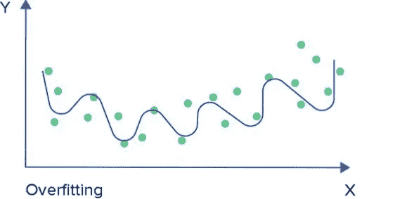
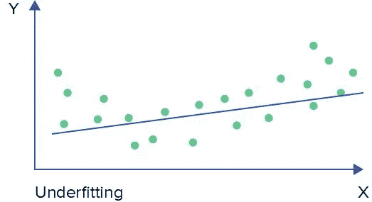
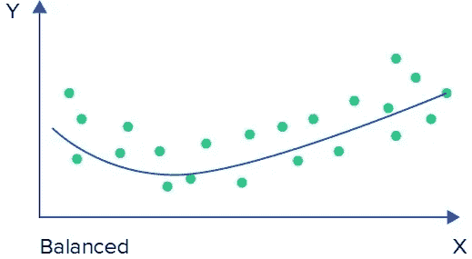

# 偏差、方差和欠拟合、过拟合

> 原文：<https://medium.com/analytics-vidhya/bias-variance-and-under-fitting-over-fitting-2325be96a3ed?source=collection_archive---------13----------------------->

因此，在本文中，我们将看到什么是偏差和方差，然后我们将使用这些概念来了解什么是欠拟合和过拟合。

**什么是偏见？**让我们看看维基百科是怎么说的。

**(偏向**是不相称的权重*偏向*或*反对*一个想法或事情)

或者在机器学习中，我们可以说偏向是一种不成比例的权重*偏向于*或者*反对*某个特征。我们在任何地方都能听到同样的事情。

**什么是方差？**

(**方差**衡量一组数字与其平均值相差多远)。同样的事情我们到处都能听到。

简单地说，**偏差对应于训练集误差**，而**方差对应于测试集误差。**

让我们看看什么是过度拟合和欠拟合。

什么是**过拟合模型**？

在训练集上表现非常好的模型，或者在训练集上具有高精确度，但在测试集上表现不佳的模型。正如我所说，偏差是训练集误差，方差是测试集误差。假设我们用新坐标画一个点。过度拟合的模型可能不会表现得更好。

在过拟合的情况下，我们的**训练集误差较小**，所以会有**低偏差**，我们的**测试集误差较大**，所以会有**高方差**。

**过拟合模型—低偏差和高方差**

决策很容易过度拟合。如果我们有一棵树特别深。解决这个问题的一个方法是修剪。但这里不讨论，我们只坚持给定的题目:)

什么是**欠配车型**？

在训练集和测试集上都表现不佳的模型。因此，它的训练误差以及测试误差都很高，所以它将具有高偏差和高方差。

在欠拟合的情况下，我们的**训练集误差为高**，因此它将具有**高偏差**，我们的**测试集误差也为高**，因此它将具有**高方差**。

所以，现在我们知道什么是欠拟合模型和过拟合模型。我们现在来看看什么是**平衡模型**。

什么是**平衡模型？**

**平衡模型**是在**训练和测试装置**上都表现良好的模型。在训练集上，这可能没有过拟合模型的精度高，但是平衡模型在测试集上也表现良好。

平衡模型将具有**低偏差和低方差**。

让我们举 3 个例子来理解过拟合、欠拟合和平衡模型。

1.  训练误差为 2%，测试误差为 20%的模型

*   更少的训练误差——低偏差
*   高测试误差—高方差
*   这是一个过度拟合的模型。

2.训练误差为 30%，测试误差为 30%的模型

*   高训练误差—高偏差
*   高测试误差—高方差
*   这是一个不足的模型。

3.训练误差为 4%，测试误差为 3%的模型

*   更少的训练误差——低偏差
*   测试误差更小——低方差
*   这是一个平衡的模型。

非常感谢你阅读这篇文章。我希望你喜欢这篇文章:)