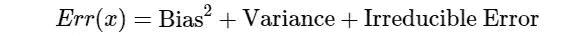

# 机器学习中的偏差和方差

> 原文：<https://medium.com/analytics-vidhya/bias-variance-in-machine-learning-1bfbefd4285d?source=collection_archive---------11----------------------->

在本文中，我们将研究偏差和方差的概念以及偏差-方差权衡。

**什么是偏见？**

偏差是平均模型预测和实际情况之间的误差。它告诉我们基础模型预测值的能力。
高偏差可能导致算法错过特征和目标输出之间的相关关系，并建立一个过度简化的模型，该模型可能无法捕捉数据中的重要规律(即欠拟合)。

**什么是方差？**

方差是给定数据集的模型预测的平均可变性。估计函数的方差告诉我们该函数能在多大程度上适应数据集的变化。
高方差会导致算法开始对训练数据中的噪声进行建模，并建立一个过于复杂的模型，该模型不能很好地对看不见的数据进行概括(即过度拟合)

偏差和方差的图示

偏差-方差分解是一种分析学习算法相对于特定问题的预期泛化误差的方法，它是偏差、方差和一个称为*不可约误差*的量这三项之和，这是由问题本身的噪声引起的，任何模型都无法从根本上减少这种噪声..

# **了解权衡**

偏差-方差权衡是试图同时最小化偏差和方差以避免数据欠拟合或过拟合的冲突。我们希望选择一个模型，既能准确捕捉其训练数据中的规律性，又能很好地推广到未知数据，即**低偏差和低方差**。

但实际上，偏差和方差成反比，也就是说偏差越大，方差越小，反之亦然。这种复杂性的权衡就是为什么在偏差和方差之间存在权衡。一个算法不能同时更复杂和更不复杂。

为了建立一个好的模型，我们需要在偏差和方差之间找到一个好的平衡，这样可以最小化总误差并提高预测性能。

因此，理解偏差和方差对于理解预测模型的行为至关重要。

喜欢就鼓掌吧！