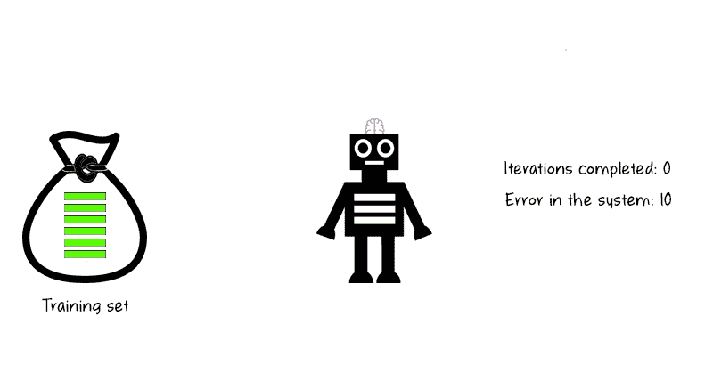
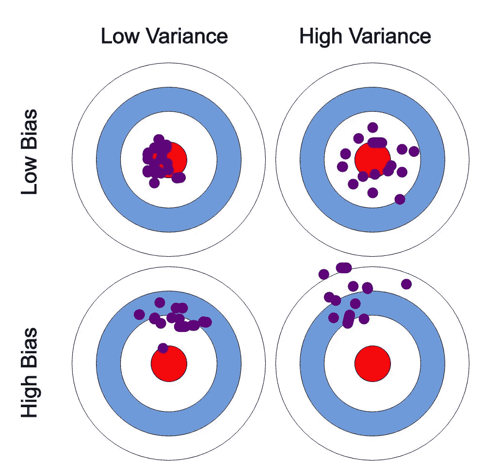
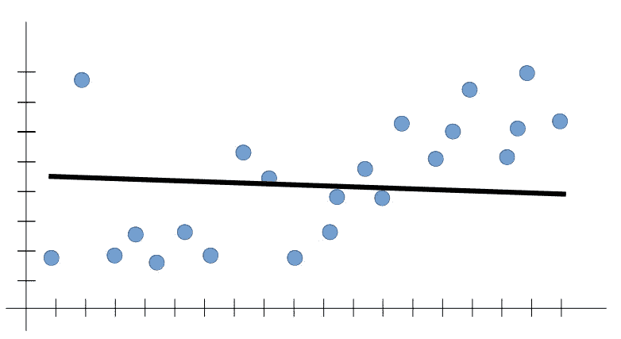
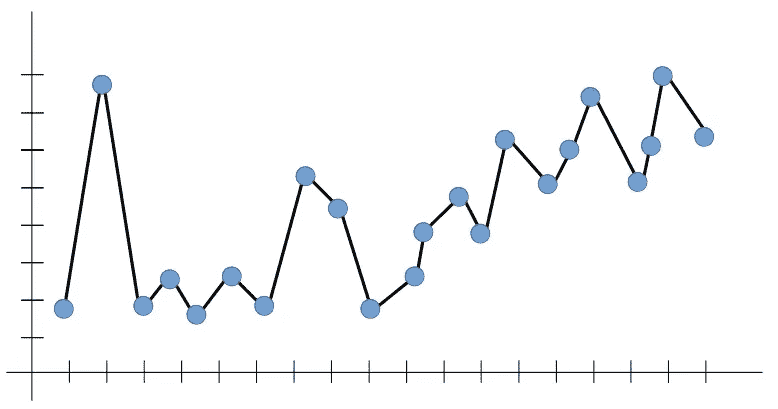
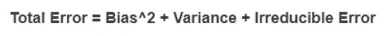

# 偏差和差异——最终的权衡

> 原文：<https://medium.com/analytics-vidhya/bias-variance-the-ultimate-trade-off-e604528bd30a?source=collection_archive---------21----------------------->

在每个监督机器学习算法中，我们的模型都从训练数据中学习。

该算法的目标是在给定输入数据(X)的情况下，最好地估计为输出变量(Y)映射的函数(f)。映射函数(f)通常也被称为目标函数，因为它是给定的监督机器学习算法旨在逼近的函数。

任何机器学习算法都可以解释为**偏差**、**方差**和不可约误差或**噪声**。

如上所述，噪声是一种不可减少的误差，无论使用何种算法都无法减少，而我们可以在模型最小化偏差和方差的能力之间进行权衡。

# 偏见

偏差可以定义为预测值和实际/预期值之间的差异。也可以用实际值和预测值之间的差距来解释。

# 差异

方差可以通过预测值相对于彼此的分散程度来定义。它基本上解释了如果使用不同的训练数据，目标函数的估计将改变的量。

# 偏差-方差权衡

偏差和方差之间的平衡通常被归类为**偏差-方差权衡**。这种权衡可以通过以下方式适当解释:

**使用靶心图的偏差和方差**

这里我们认为最中心的点(靶心)是我们想要的/实际的结果。

**低偏差:**这里预测值和实际值之间的差距几乎为零。

**高偏差:**这里的预测值与实际值相差甚远，因此，随着我们远离靶心，我们的模型开始做出越来越多的错误预测。

**低方差:**这里预测值相互接近，不太分散。

**高方差:**这种情况下的预测值彼此之间非常分散。

# 欠拟合

具有**高偏差**和**低方差**的模型被称为欠拟合机器学习模型。在这种情况下，我们的模型既不能对训练数据建模，也不能推广到新数据，即我们的模型不能捕捉数据的潜在模式。当我们只有很少的数据来建立一个精确的模型时，就会发生这种情况。

下面的例子可以更容易地解释这一点:

> 假设我们有一个分类问题，要对给定对象是否是球进行分类，并且我们只有一个特征来训练我们的模型:
> 
> **培训:**
> 
> 输入:**形状:**圆形
> 
> 输出:它是一个球
> 
> **测试:**
> 
> 输入:橙色
> 
> 输出:它是一个球

如上所述，由于只有一个属性/特征用于训练我们的模型，因此我们的模型将每个圆形物体视为一个球。

在这种情况下，机器学习模型的规则过于简单和灵活，无法应用于如此少量的数据，因此该模型可能会做出许多错误的预测。

**技巧**减少**欠贴合** :
1。增加模型复杂度。
2。增加特征数量，执行特征工程。
3。增加历元数或增加训练持续时间，以获得更好的效果。

# 过度拟合

具有**低偏差**和**高方差**的模型被称为过拟合机器学习模型。当我们让我们的模型过于复杂，并用如此多的数据训练它们时，就会发生这种情况，因此它开始从我们的数据集中的噪音和不准确的数据条目中学习。在这里，由于太多的细节，模型不能正确地对数据进行分类。

在这种情况下，我们的最佳拟合线试图覆盖所有点(包括数据中的噪声)，因此造成过度拥挤。

让我们继续前面的例子来更容易地解释这一点:

> 现在，让我们使用以下更多功能来训练我们的模型:
> 
> **培训:**
> 
> 输入:**形状:**圆形/球形，**可玩:**是，**可吃:**否，**半径:** 5cm
> 
> 输出:它是一个球
> 
> **测试:**
> 
> 输入:篮球(半径:10 厘米)
> 
> 输出:是**不是**一个球

**不是球**

如上所述，给定太多特征来训练我们的模型会使它更加复杂和混乱，从而降低我们模型的准确性。

**减少**过拟合的技术****:
1。增加训练数据。
2。独立的训练和测试数据集以及系统的交叉验证。
3。在训练阶段尽早停止(注意训练期间的损失，一旦损失开始增加就停止训练)。
4。适当的绩效指标。
5。调整有影响的参数。

# 最佳平衡

总之，如果我们的模型太简单，参数很少，那么它可能会有高偏差和低方差。另一方面，如果我们的模型有大量的参数，那么它将有高方差和低偏差。因此，我们需要在不过度拟合和欠拟合数据的情况下找到正确/良好的平衡。

为了构建一个好的模型，我们需要在偏差和方差之间找到一个好的平衡点，这样可以使总误差最小化:

因此，我们的模型越复杂，方差就越大，因此模型会**过拟合**，而我们训练模型的特征/数据越少，它就越容易出现高偏差，变得**欠拟合**。

任何有监督的机器学习算法的目标应该是实现低偏差和低方差，或者至少接近它。反过来，该算法应该实现良好的预测性能。

感谢阅读。