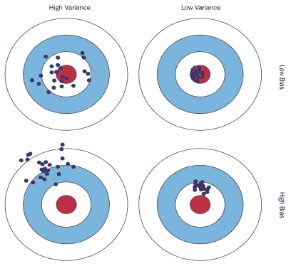

# 偏差-方差权衡

> 原文：<https://medium.com/analytics-vidhya/bias-variance-trade-off-4690abf349fd?source=collection_archive---------3----------------------->

## 理解机器学习中的偏差-方差权衡

构建有监督的机器学习模型的一般目标是开发一个模型，通过对一组数据进行训练来基于一些特征(x)估计目标(y ),这些数据正确地映射了特征和目标变量之间的关系。