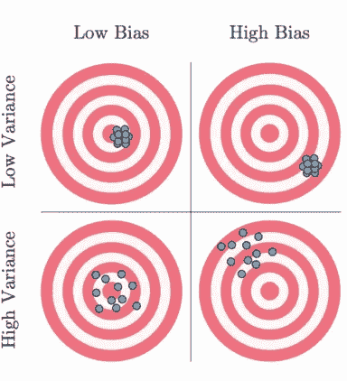

# 偏差-方差权衡和正则化

> 原文：<https://medium.com/analytics-vidhya/bias-variance-tradeoff-regularization-5543d2d1ad8a?source=collection_archive---------1----------------------->

# **什么是偏见？**

如果机器学习模型在一组数据上表现很差，因为它没有推广到所有的数据点，这就是你说你的模型有很高的偏差，这个模型被称为欠拟合。

*   平均模型预测和地面实况之间的误差
*   估计函数的偏差告诉我们基础模型预测值的能力

# 什么是方差？

如果机器学习模型试图成功地解释数据集中的所有或大部分所有点。如果它在其他测试数据集上运行时表现不佳，则被称为具有高方差，并且该模型被称为过拟合。

*   给定数据集的模型预测的平均可变性
*   估计函数的方差告诉您该函数可以根据数据集中的变化进行多大程度的调整

## 高偏差

*   过于简化的模型
*   装配不足
*   测试和训练数据的高误差

## 高方差

*   过于复杂的模型
*   过度合身
*   列车数据误差低
*   测试数据的高误差
*   开始模拟输入中的噪声

# 偏差方差权衡

*   增加偏差会减少方差，反之亦然
*   误差=偏差+方差+不可约误差
*   最好的模型是误差减少的地方。
*   偏差和方差之间的折衷。

# 正规化

用于处理高方差的回归方法称为正则化。

我们试图最小化误差(成本函数)，观察到成本函数依赖于系数

在这种情况下，首要目标是尽量减少误差。为了实现这一目标，对系数的大小没有限制。但在现实生活中，我们需要在一些限制条件下实现目标。

*   例如，我们需要最小化线性回归中的成本函数，但对系数值有一些限制。这是因为过高的系数值对于解释和预测都是不可靠的，因为它们会导致过度拟合。
*   因此，对于成本函数，我们添加了这些约束，即系数的平方值的和或系数的绝对值的和。如果总和更大，则成本函数值增加，因此这不是最优解。
*   最优解将是系数之和(或系数平方)最小的解。
*   这些方程可以定义为。

里脊回归

上面的方程被称为岭回归，如果我们有 m 的模数，而不是 m，那么它被称为套索回归

套索回归

实际上，因子λ决定了惩罚的程度。观察如果λ=0，那么没有正则化(和原来的损失函数一样)。

损失函数

## 损失函数:均方误差

损失函数

如果λ非常高，则系数的值很小，这是一个很大的不利因素。

在套索回归的情况下，变量的系数可以为 0，因此这可以用作特征选择模型。

在岭回归的情况下，系数可以接近零，但不能为零。

正则化的整体思想是减少过度拟合。据观察，高系数(通常没有正则化)值可能不会概括数据，并且可能导致过度拟合。

同时，太低的系数值(用高的λ值获得)可能不能给出完整的图像，因此该模型在训练和测试中可能表现不好。这是底料不足。

需要适当选择λ值，以减轻过拟合/欠拟合的问题。