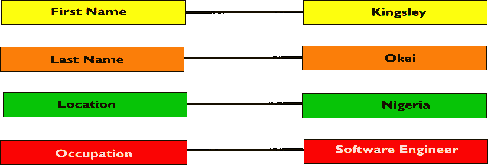
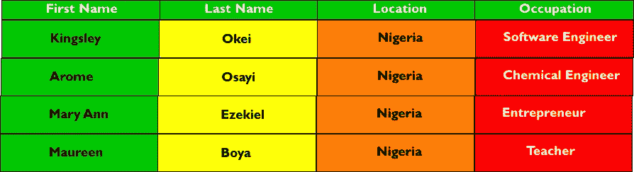
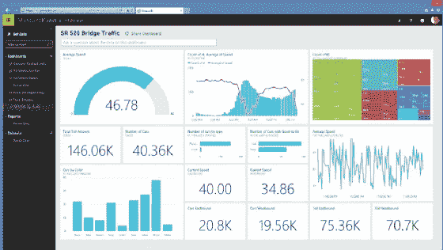

# 大数据分析解释——面向普通人

> 原文：<https://medium.com/analytics-vidhya/big-data-analytics-explained-for-mere-mortals-52491aee01c8?source=collection_archive---------15----------------------->

最近，我越来越渴望了解大数据，以及让数据工程师和软件工程师能够分析大数据并构建利用它们的软件解决方案的工具和技术。然后，就在几天前，他们(与亚马逊网络服务合作)突然给我发了一封电子邮件，让我申请全额奖学金，参加 **AWS 机器学习工程师基金会**课程。哇！

我申请了，当然，我也有机会上这门课。

所以，我要通过写这篇文章来报复，对 Udacity 和亚马逊的礼物表示感谢。换句话说，尽管这篇文章是为你写的，但它实际上是献给 Udacity 和 Amazon 的。别让我抓到你在笑！

好的，所以，我将尝试用简单的术语解释复合词**大数据分析**，这样当你把目光从这篇文章上移开时，你就能够直视任何人的眼睛，明智地讨论这个主题。

我处理这项任务的方法是软件工程师在构建解决业务问题的软件解决方案时使用的方法。通常，工程师会将一个复杂的业务问题拆分成更小的可管理的模块，称为 ***模块*** *。每个模块将由一名工程师或一组工程师负责。* 然后，在每个模块被分别实现和测试之后，它们将被组合成一个单独的软件单元，在交付给最终用户之前，依次对其进行测试以确保没有错误或至少有很少的错误(是的，有时这是允许的)。

因此，我将把复合词**大数据分析**分解为以下几个部分:

1.  ***数据***
2.  ***大数据***
3.  ***分析学***

然后，一旦我们解决了这些术语中的每一个，我们将把它们放在一起，并提出关于 ***大数据分析*** 到底是什么的问题的最终解决方案。

预备，集合，开始！！

**问题一—数据:**为了正确理解 ***数据*** 这个词，有必要提一下 ***数据*** 是 ***数据这个词的复数。*** 和 ***数据*** 是一个拉丁词，指尽可能小的信息位。换句话说， ***数据*** 是关于有生命或无生命的实体或事件的原始事实。如果我开始失去你，请坚持住，一切都会变得清晰。

既然一个 ***数据*** 是一个原始事实，那就意味着就其本身而言，它不是很有用。例如，请看下图:

我的意思是，我们只是看到: ***名字— — — —金斯利***

但这没有太大意义。照目前的情况来看，我们甚至无法通过这个 ***数据*** 来判断 ***金斯利*** 是人还是猫。但是等等，上面说 ***第一个名字*** 是 ***金斯利*** ，那意思是 ***金斯利*** 一定是人类；还是动物有名有姓？

***新闻快讯！！！***

确实如此。

如今，许多宠物使用主人的“姓氏”。有意思！

不管怎样，如果我们继续并引入关于上述实体 ***金斯利*** 的三(3)位信息，我们会得到如下图所示的东西:

啊哈！现在越来越有趣了。你现在可以看到，这个实体***【Kingsley】***实际上是一个人，他的姓是***【Okei】***，是一个目前居住在 ***【尼日利亚】*** 的*【软件工程师】* 。有趣的是，当我们把这些原始事实汇集在一起时，我们是如何能够迅速得出非常有用的信息的。这组或原始事实的集合就是我们所说的 ***数据*** 。

所以，简单来说， ***数据*** 是关于有生命或无生命的实体或事件的原始事实的集合。

因此， ***数据*** 是关于有生命或无生命的实体或事件的原始事实的集合。

我想我们可以放心地把这个留在这里，然后继续讨论下一个问题。

***一题下来。还有两个。***

**问题二——大数据:**

嗯。现在，我们知道了什么是数据。在世界各地，每天都在不断产生大量数据。让我给你出个主意:

*   **Twitter 上每天产生大约 5 亿条推文**
*   **Facebook 上每天产生大约 4pb 的数据**
*   **每天大约发送 2.94 亿封电子邮件**
*   **联网汽车每天产生大约 4tb 的数据**
*   **每天大约有 6500 万条信息在 WhatsApp 上发送**
*   **每天大约有 500 万次谷歌搜索**

那么，怎么样？有趣的是，由于这些数据来自不同的来源，它们通常采用不同的形式，如图像、文本、视频和音频。但是所有这些生成的数据可以归入两(2)个大标题下:

1.  **结构化数据**
2.  **非结构化数据**

**结构化数据**是可以很容易地以一系列行和列的形式呈现的数据。想想看，这意味着可以放入任何电子表格或类似电子表格的应用程序(如 MS Excel 和 MS Access)的数据可以称为结构化数据。

让我们看一个例子:

假设我们获取不同组的原始事实(数据)，如下图所示:

注意，我们有四(4)份数据，标记为 **A** 、 **B、C 和 D** 。

现在，如果我们决定将它们全部堆叠起来，如下图所示:

看看我们是如何将它们整齐地组合在一起，并按一系列行和列排列它们的。你可以在**关系数据库管理系统(** RDMS)中找到这些数据，比如 **MS Access** 、 **MySQL** 、 **SQLServer** 等。在关系数据库的说法中，标记为 **A** 、 **B** 、 **C** 和 **D** 的每条数据被称为**记录**，而组成记录的各个原始事实被称为**字段**。

**非结构化数据**与结构化数据相反，由于其本质，非结构化数据不能以一系列行和列的形式呈现。以一篇博客文章(由文本、照片，甚至视频组成)为例:你不能以一系列的行和列来容纳和呈现这种数据，就像上面显示的结构化数据一样，每一条数据及其组成部分都一目了然。另一个例子是 Instagram 帖子。这些类型的数据是非结构化的。

每天生成的大量结构化和非结构化数据就是我们所说的**大数据**。

同样，我认为我们可以放心地把这个问题留在这里，然后继续下一个问题。

***两个问题下来了。还有一个！***

**问题三——分析:**

要解释 ***分析*** 这个术语，我先来说说这个词， ***分析*** 。很多时候，我看到数据专业人员交替使用这些词，给人的感觉是一样的，但不一定是一样的。

***分析*** (在数据域)是一个**做词**。这是审查数据的实际过程，以便获得有助于决策的见解。

***分析*** 另一方面，更多的是一个模糊的术语，用来指 ***数据分析*** 过程中使用的一套工具、技术和程序。在下一节中，我将更多地讨论一些数据分析工具和程序。

好吧。有了三(3)个不同问题的解决方案，我们摆脱了母问题 ***大数据分析*** ，现在我们可以继续寻找问题的最终解决方案。

# 把所有的放在一起

总而言之，我们认为数据是关于一个实体(有生命的或无生命的)或事件的原始事实。此外，您现在已经知道，大数据是指从不同的数据源中不断生成的大量结构化和非结构化数据。最后，我们确定了这样一个事实，即分析是一个总括术语，用来表示在数据分析过程中使用的一组工具、技术和程序。

此时，您能否尝试定义一下**大数据分析？**

好吧，如果你说了类似这样的话:

**数据/大数据分析中一个非常常见的过程是 **ETL** 过程。 **ETL** 是英文缩写，代表***E****xtract*、***T****transform*和 ***L*** *oad。***

*****提取*** ，因为数据需要从一个或多个源拉入或提取，然后才能用于分析。**

*****转换*** 、因为从其来源提取的数据可能处于非常混乱或凌乱的状态。一个例子是一家电力配送公司的不同部门发送给你的大量 excel 文件(损坏严重，以至于你会发现**特殊字符**隐藏在最不可能的字段中，而**URL**写入了一些应该保存数字的字段中)。**

*****Load*** ，因为数据转换后，需要存放在某个位置；也许是一个可操作的数据库，如**数据仓库**，从那里可以执行进一步的操作，如**数据可视化**，用于报告目的。**

**大数据分析中使用了许多有趣的工具；这些工具的功能之间有一些重叠，但每个工具通常在某些领域比其他工具更出色。下面，我将快速介绍一些大数据分析工具:**

1.  ****阿帕奇火花****

****

**Apache Spark 是一个非常强大的开源大数据分析引擎。它使您能够从不同来源获取(拉入)数据，并提供查询和分析库(包括一个机器学习库)，使您能够最大限度地利用您的数据。**

**2.**阿帕奇卡夫卡****

****

****Apache Kafka** 是一个开源的分布式流媒体平台，最初由 LinkedIn 的一个团队开发。如果所有这些*、【分布式】、【流媒体】……*对你来说听起来很陌生，不要担心，我将在后面的文章中涉及其中的一些概念，因为这篇文章已经太长了。**

**我认为卡夫卡是火花的精简版。Kafka 为大型软件系统的各种组件提供解耦和缓冲。该工具在构建软件解决方案时采用微服务架构的工程团队中大放异彩。**

**3.**阿帕奇 Solr****

****

**Solr 是另一个开源的大数据分析工具。这是一个企业级的高性能搜索服务器，拥有自己的 REST 式 API。如果你想构建一个软件解决方案，提供对大量数据进行搜索的能力；类似于搜索引擎的东西，那么 Apache Solr 就可以派上用场，因为当您的应用程序需要执行这类操作时，传统的 RDMSs(如 MySQL)会变得相当缓慢。**

**4.**微软 Power BI****

****

****Microsoft Power BI** 是市场上最好的**数据可视化**工具之一，允许数据专业人员轻松创建令人惊叹的数据可视化表示，从而使业务决策变得更加容易。**

**虽然 Power BI 拥有不错的 **ETL** 功能，但在我看来，真正让它脱颖而出的是这个工具的可视化功能。**

****结论****

**唷！我真诚地希望我能够通过这篇文章给你一个方向感(就大数据分析而言)。如果我没有，我保证下次会更加努力。**

**我手里空闲时间多了就准备发表后续文章，不过在那之前，继续生活，继续学习，继续爱！**