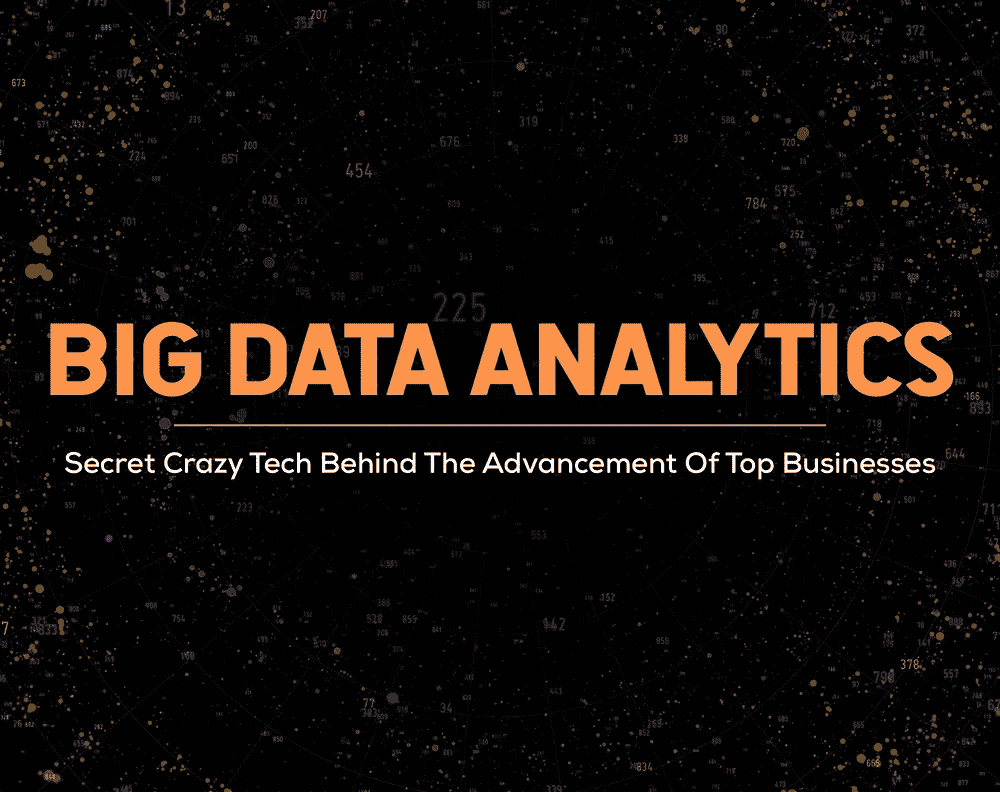

# 大数据分析:顶尖企业发展背后的秘密疯狂技术

> 原文：<https://medium.com/analytics-vidhya/big-data-analytics-secret-crazy-tech-behind-the-advancement-of-top-businesses-9d4f130eb542?source=collection_archive---------11----------------------->

让我们相信你和我刚刚一起开始创业。现在，我们业务的核心目的是什么！为我们的顾客服务，对吗？那么，我们将如何为你的顾客服务呢！显然是通过了解他们的一些具体事实。但关键是这些事实不会一直保持不变。大多数都是变量，它们的值会随着时间而变化，这很常见。因此，我们需要做的是，我们必须不时收集与这些事实相关的各种数据。当我们处理一些问题时，这似乎很容易。我们可以在网上寻求帮助，或者去现场收集我们需要的所有数据，现在听起来还不错。但是我们有一个庞大的查询列表，我们需要随时收集它们，这样如何？网上找或者去实地找都行不通了。那时事情会变得更加艰难。有时，我们收集的数据可能无法满足我们现在为业务做出明智决策的所有要求。我们需要更多数据来保持您的业务正常运行。不仅仅是我们，整个世界都面临着这场危机。这就是“大数据分析”的魅力在一个了不起的解决方案中发挥作用的地方。

# 大数据分析的定义

[**【BDA】**](https://www.ibm.com/analytics/hadoop/big-data-analytics)大数据分析是一个复杂的过程，它处理非常大的各种数据集，包括从各种来源收集的结构化、半结构化和非结构化数据，数据的大小可能从万亿字节到吉字节不等(一吉字节等于一万亿吉字节)。

[**大数据分析**](https://www.ngdata.com/what-is-big-data-analytics) 用于揭示隐藏的模式、未知的相关性、市场趋势、客户偏好以及其他有用的信息。大数据分析的数据集不同于各种业务组织中使用的普通数据库。这些数据集的类型和规模超出了我们传统的 [**关系数据库**](https://www.ibm.com/analytics/relational-database) 的能力。以低延迟捕获、管理和处理这些数据集的数据的能力也高得多。大数据分析可以按照一组指令，使用一系列出色的工具和技术，为我们提供业务所需的各种数据。物联网、传感器、信用卡、面部识别摄像头、社交媒体活动、热图、cookies、GPS 跟踪、信号跟踪器、店内 wifi 活动、游戏、卫星图像、雇主数据库、收件箱——所有这些都是大数据收集的主要信息来源。

# 大数据分析是如何产生的

自 20 世纪 90 年代初以来，人们就在使用“大数据”这个术语。虽然不清楚它是如何首次进入我们的生活，也不清楚是谁首次使用了这个术语，但最广为人知的事实是关于一个名叫约翰·r·马什的人，他当时在硅图形公司工作，他努力使这个术语流行起来。

不要认为大数据的整个概念是新的。几个世纪以来，人们一直试图使用适当的数据分析和分析来做出更好的决策。公元前 300 年左右，古埃及人试图收集所有现存的数据，并将其储存在亚历山大图书馆以备将来使用。此外，罗马帝国过去常常分析军事统计数据，以确定军队的最佳分布。历史肯定会给我们更多这样的例子。

是时候仔细看看了，数据生成速度和数量在过去二十年中发生了变化，并且已经超越了人类正确理解所有这些数据的限制。2013 年全球数据总量为 [**4.4 zettabytes**](https://www.bigdataframework.org/short-history-of-big-data/#:~:text=The%20total%20amount%20of%20data,to%20analyze%20all%20this%20data) 。但是在 2020 年，这个数字已经变成了 [**44 兆字节**](https://www.bigdataframework.org/short-history-of-big-data/#:~:text=The%20total%20amount%20of%20data,to%20analyze%20all%20this%20data) 。总之，这是一个明显的指数增长。我们的现代技术没有足够的能力来处理如此庞大的数据量，并为我们提供所需的解决方案。因此，为了正确使用这些海量数据，我们的传统数据分析打开了大数据分析的大门。

# 大数据的类型

大数据的整个庞大世界是三种数据类型[**的组合——结构化、半结构化和非结构化数据。让我们简单看一下这些。**](https://www.upgrad.com/blog/what-is-big-data-types-characteristics-benefits-and-examples/)

**1)结构化数据:**这些数据由固定格式、高度组织化、定义明确的结构组成。大多数时候，这些数据是由机器而不是人类来处理的。这类数据已经被业务组织管理在 SQL 数据库、 [**数据湖**](https://www.guru99.com/data-lake-architecture.html) 、 [**数据仓库**](https://www.tableau.com/learn/articles/data-warehousing) 中的数据库和电子表格中。

**2)非结构化数据:**这种数据不遵循任何指定的格式。非结构化数据(原始数据)很难在现有的数据库中进行分类，它有许多不同的格式。电子邮件、文本消息、文档、图像、视频、元数据是非结构化数据的常见示例。为了从这些数据 [**中检索有价值的信息，使用了 Hadoop**](https://hadoop.apache.org/) 如集群或 NoSQL 系统。

**3)半结构化数据:**包含语义标签和元素，不遵循关系数据库所附结构的数据称为半结构化数据。XML、JSON 文件是半结构化数据的常见例子。

# 大数据分析的工作原理

大数据分析的整个过程由四个连续的步骤完成——收集、处理、清理和分析。大型数据表需要经过这四个步骤**，以提取有助于企业进一步运营的质量数据。让我们看看这 4 个步骤是如何完成的。**

****1)数据收集:**在当今世界，每个业务组织的数据收集流程都各不相同。在当今技术的帮助下，商业组织收集结构化和非结构化数据，从云存储到移动应用程序，再到店内物联网传感器等等。这些数据是从大量资源中收集的。一些数据存储在数据仓库中，这使得 [**商业智能工具和解决方案(BI 平台)**](https://www.tableau.com/learn/articles/business-intelligence/choosing-bi-platforms) 能够高效地访问这些数据。由于其复杂性，非结构化数据存储在数据湖中。**

****2)数据处理:**为了从收集到的数据中得到所需的信息，数据处理是必须的。数据正以指数级的速度生成，因此正确组织这些数据现在已成为一项真正的挑战。在数据处理方面，我们有两种选择。第一个是批处理，这是处理在一段时间内收集的大量数据的有效方法。另一个选择是流处理，让用户在最短的时间内根据他们的查询得到他们需要的结果。请注意，流处理比批处理成本高得多。**

****3)数据清洗:**为了保证数据质量，获得更强的结果，数据清洗是必须的。在这个过程中，所有的数据得到适当的形成，无用的数据被剔除。然后，最终的数据会被用于更好的决策。**

****4)数据分析:**最后也是最后一步。现在，所有需要数据分析的事情都已完成，是时候将有价值的数据转化为有价值的见解了。大数据分析有很多方法，我在下面提到了其中一些**

*   ****数据挖掘:**这个过程分析海量的数据，从不同的角度发现隐藏的数据模式，对有用的信息进行归类。**
*   ****预测分析:**这是高级分析的一个分支，在 [**统计算法和机器学习**](https://www.dataversity.net/machine-learning-statistical-algorithms/#) 技术的帮助下使用数据，根据现在的数据对各种未知事件做出未来的预测。**
*   ****机器学习:**在这个系统中，大数据被它的算法用来定义传入的数据，并识别附属于它的模式。该系统将数据转化为有价值的见解，我们可以将其用于进一步的业务运营，并自动化一些决策流程。**
*   ****深度学习:**这是机器学习的一部分，模仿人类依靠 [**人工神经网络(ANN)**](https://www.forbes.com/sites/bernardmarr/2018/09/24/what-are-artificial-neural-networks-a-simple-explanation-for-absolutely-anyone/#22f6a08b1245) **的层层叠加来获取某种类型的知识和模式。****

# **大数据背后的 6v**

**我们可以用 [**6Vs**](https://www.business2community.com/big-data/big-data-what-is-it-and-how-does-it-work-02265540#Tools) 来恰当地描述大数据。大数据刚出现的时候，只有 3v。不要以为 6v 就完了，根据对大数据的需求，v 的数量永远在增加。让我们深入了解这些 6v。**

****1)量:**在“大数据”术语中，量指的是我们正在处理的巨量数据。这些数据可能具有未知的价值，如网站被访问的频率、网页或手机被点击的次数。Gigabyte 现在无法帮助我们测量这些数据的大小，我们需要 Zettabytes (ZB)甚至 Yottabytes (YB)在这一领域帮助我们自己。**

**速度:速度告诉我们数据接收或传输的速度有多快。当数据直接流入内存而不是写入磁盘时，速度会高得多，并且它可以在这种环境下提供实时数据。速度是最重要的 V，因为它与机器学习和人工智能相关联。**

****3)多样性:**多样性是指大型数据表中可用的数据类型。这些数据可以是结构化的，也可以是非结构化的。当数据本身快速变化时，处理这些数据是大数据分析的关键部分。**

****4)准确性:**准确性描述数据集的数据准确性水平。数据来自很多资源。我们每次都需要核实我们的数据，以避免任何混乱。未经验证的低质量数据会引导组织做出不相关的决策。**

****5)可变性:**一条数据可以有多种用途。因此，为了将数据用于多种目的，我们需要以多种方式格式化数据。这将节省大量的时间，因为整个过程太长了。可变性指的是将数据用于多种目的以在短时间内获得高效结果。**

****6) Value:** Value 是这些 6v 的最后一个 V。有价值的数据将从大量数据表中提取出来，有利于组织更好地做出决策。需要清除不相关的数据，以避免出于任何当前目的的任何类型的错误警报。**

# **大数据工具和技术**

**无论如何，我们需要大数据，但我们不能以任何方式阻止它的增长速度。为了处理如此大量的数据，我们需要更先进的技术。好消息是，我们用于大数据分析的工具和技术正在以更快的速度发展，以应对这种情况。不同的组织使用不同种类的工具和技术进行大数据分析。最有趣的部分是有很多工具，其中很大一部分是开源的。让我们深入了解该领域使用的 10 大开源 [**大数据工具**](https://bootcamp.learn.utoronto.ca/blog/top-10-open-source-big-data-tools/) 。**

****1)**[**MongoDB**](https://www.mongodb.com/what-is-mongodb)**:**MongoDB 是一个跨平台的面向文档的数据库程序，具有查询和索引所需的可伸缩性和灵活性。MongoDB 被归类为 NoSQL 和分布式数据库程序。在 MongoDB 中，我们不必担心数据结构，比如字段数量、字段类型或存储值。**

****2)**[**Pandas**](https://www.zymr.com/pandas-big-data-data-science-programmers/)**:**Pandas**是数据科学中最受欢迎的 Python 库之一，速度快、功能强大、灵活且易于开发人员或专业人员使用。这个开源平台广泛用于数据分析和操作。Pandas 有一个很棒的社区，内置的数据可视化，内置的对 CSV、SQL、HTML、JSON、pickle、excel、剪贴板等的支持，这使它成为最有效的工具之一。****

******3)**[**Hadoop**](https://hadoop.apache.org/)**:**Hadoop**或 Apache Hadoop 是一个基于 java 的开源软件框架，允许在商用硬件集群上存储和运行应用程序。Hadoop 存储巨大的非结构化数据，没有任何模式的规范。Hadoop 具有高可扩展性功能。我们可以通过增加节点数量来获得最高性能。对于想选择数据科学作为职业的人来说，学习 Hadoop 是必须的。******

********4)**[**Apache Spark**](https://spark.apache.org/)**:**大数据来的地方出现的另一个很酷的名字是 Apache Spark。Apache Spark，也被称为世界上关键的集群计算框架之一，是一个用于大规模数据处理的统一分析引擎。这个开源平台是一个分布式处理系统，可以快速运行复杂的算法，以实现更高的数据流性能。******

******5)**[**Apache Storm**](https://storm.apache.org/)**:**Apache Storm 是 Twitter 发布的分布式实时大数据处理框架。这个平台最出名的是它对无界数据流的可靠处理和实时数据处理。Spark 还可以提供有保证的数据处理和首次重放未成功处理的数据的能力。****

******6)**[**Cassandra**](https://cassandra.apache.org/)**:**另一个开源的大数据工具，由 Apache Software Foundation (ASF)开发，以其可扩展性而广受认可。Cassandra 每秒可以同时处理数 Pb 的数据和其他操作，具有连续可用性(零宕机)。这个平台在脸书、推特、网飞、思科和许多其他公司内部使用。Cassandra 在管理混合云和多云环境中的大型数据表时，为业务组织提供了巨大的帮助。****

******7)**[**rapid miner**](https://rapidminer.com/)**:**rapid miner**是一个基于 java 的开放、可扩展的数据科学平台，统一了数据准备、机器学习&预测模型部署。这是领先的跨平台工具之一，提供了一些有趣的关键功能，如实时评分、企业可伸缩性、图形用户界面、调度、一键式部署等。RapidMiner 官方网站的报告称，全球约有 40，000 多家商业机构使用该工具来确保其各种重大组织问题，如增加收入、降低成本和规避风险。******

********8)**[**HPCC**](https://hpccsystems.com/)**:**HPCC(High-Performance Computing Cluster)是用 C++编写的功能强大、用途广泛的端到端数据湖管理解决方案。它为开发人员提供了足够的功能来根据需要操作数据。该系统的主要优势是其轻量级核心架构。HPCC 系统可以确保更好的性能、接近实时的结果和全频谱操作规模，而不需要庞大的开发团队、不必要的附件或增加的处理成本。******

******9)**[**Neo4j**](https://neo4j.com/)**:**Neo4j 是**Neo4j 公司开发的开源 NoSQL 图形数据库管理系统。Neo4j 拥有庞大的客户群，包括 Adobe、易贝、微软、IBM、Telenor、思科、惠普等世界顶级商业组织。这个平台的核心优势是图技术。凭借强大的优化和简单的设计，它还附带了 [**许多出色的功能**](https://www.tutorialspoint.com/neo4j/neo4j_overview.htm) 如数据模型(灵活的模式)、ACID(原子性、一致性、隔离性和持久性)属性、可伸缩性和可靠性、密码查询语言、内置 web 应用程序、驱动程序和索引。******

******10)** [**R(编程工具)**](https://www.r-project.org/about.html) **:** R 是一种用于统计计算、数据分析、科学研究和图形的编程语言和免费软件，由 Ross Ihaka 和 Robert Gentleman 于 1993 年开发。r 运行在各种操作系统(Windows、Linux、macOS)上，它被委托给大量的商业组织，包括谷歌、微软、福特、Twitter、Airbnb 等等。这是解释语言，这意味着我们不需要编译器来将所有代码转换成机器可理解的语言。****

# ****大数据分析在商业中的应用****

****好了，核心部分来了。是时候让大数据成为我们最好的朋友了。企业对大数据的广泛使用超出了我们的想象。如果我们为大数据提供正确的数据，它可以为我们提供几乎所有类型的业务解决方案。现在我们来观察一下 [**大数据分析**](https://www.simplilearn.com/tutorials/big-data-tutorial/big-data-applications) 在商业中的十大应用。****

******1)银行和证券行业的大数据:**大数据正在帮助该行业分析金融市场活动。在网络分析和自然语言的帮助下，大数据分析正在打击金融市场中的非法交易活动。这种分析在欺诈检测、风险管理、预测分析、反洗钱、高频交易等方面发挥着至关重要的作用。****

******2)** **通信、媒体和娱乐领域的大数据:**商业组织正在使用客户数据及其行为数据进行内容创作、高需求内容识别、内容绩效衡量等。大数据正在帮助该部门收集与内容显示时间、订阅或取消订阅内容背后的原因、设定目标群体、新功能生成等相关的信息。****

******3)医疗保健提供商的大数据:**如今的医疗保健行业在很大程度上依赖大数据来快速决策和为正确的患者提供正确的治疗。大数据正在为该领域提供出色的解决方案，如患者数据监控、以适当的安全性和效率存储敏感记录、预测大规模爆发、分析患有不治之症的患者的状况以及拯救生命等。****

******4)大数据教育:**大数据通过不时分析学生的整体活动，为教育部门做出贡献。这项技术有能力通过创新一种新的数据驱动方法来更有效地教育学生，从而承担起确保优质教育的所有责任。大数据可以最大限度地安全存储、管理和分析学生的大型数据表记录，可以防止考试前泄露问题，可以跟踪学生的面部表情和动作等。****

******5)制造业和自然资源中的大数据:**大数据使用地理空间数据、图形数据、文本和时态数据进行预测建模。大数据可以分析生产力数据、功耗数据、与机器所需的水或空气量相关的数据，并为组织提供更好的决策所需的结果。在大数据的帮助下，像这样的组织可以确保制造改进、产品设计定制、供应链管理、更好的质量保证和潜在风险管理。****

******6)大数据与政府:**政府部门每天都在处理多种类型的国家和国际事务。大数据正在收集关于数百万人的海量信息，以在该领域做出有意义的改变。大数据分析的应用可以产生巨大的影响，以改善当前形势，确认公共需求，预测任何恐怖袭击，快速应急响应，分析劳动力效率。****

******7)大数据在保险中的应用:**大数据分析正在影响保险行业，它通过分析客户数据库来提取许多客户洞察的信息-他们的行为、选择、潜在问题和客户方法。它有助于组织进行欺诈检测、适当的调查、可靠的决策、提高利润率等等。该行业在很大程度上依赖大数据来改善工作流程和优化运营成本。****

******8)零售和批发贸易中的大数据:**利用自己的信息改善客户体验是该领域的首要关键事实。许多世界级的商业组织正在使用这些大量的信息来分析客户的消费模式、供求比率、建立商业策略、正确的时间决策、交易数据、在线信誉数据等。从新产品开发到营销活动，最后销售给客户，毫无疑问，大数据在任何地方都是领导者。****

******9)使用大数据的交通:**在当今世界，政府和非政府个人都在将大数据用于智能交通系统。交通控制、路线规划、货运、智能运输系统——所有这些都因为这项技术而变得比以前更加顺畅。组织正在利用这一优势来实现更好的收入管理、减少环境影响、改善用户体验、确定库存、提高安全性以及更多引人注目的事实。****

******10)能源和公用事业中的大数据:**大数据在智能电网的动态能源管理中发挥着战略性作用。智能电网在消费者和供应商之间提供了双向的数据和电力流动。来自智能电表的数据用于分析电力规划、能源优化和客户满意度。****

# ****大数据伴随着巨大的挑战****

****巨大的机遇伴随着巨大的挑战，大数据也是如此。如果不对原始数据进行适当的提取，大数据可能会给整个世界带来巨大的危险。让我们来看看 [**在这个领域面临的一些显著挑战**](https://www.analyticsinsight.net/big-data-challenges-faced-business-enterprises/) 。****

******1)多个数据源之间的数据同步困难:**从庞大的数据海洋中提取有价值的数据确实是一项相当偷偷摸摸的任务。数据同步是这一过程中保持数据一致性的重要部分。当数据来源点增加时，数据同步会带来一些大问题，主要是对于孤立和多样化的数据。尽管一些供应商正在提供高质量的工具，但是仍然有许多组织没有解决这个问题。****

******2)海量数据管理:**大数据无疑可以打开成就大事业的大门。但是在数据存储部分之后，数据管理部分仍然给我们带来一些值得注意的麻烦。随着大数据量的不断增加，管理上的缺失也日益清晰。解决这个问题的方法之一是实现混合关系数据库和 NoSQL 数据库。****

******3)数据隐私和安全问题:**我们可以毫无争议地轻松解决这个首要问题。大数据包含大量敏感信息，因此安全性需要非常高，以实现最大程度的保护。但是，我们在当今世界上看到的大数据安全模型还不够有效。用于这种分析的开源工具并没有考虑到安全问题，这导致了许多未知的威胁。****

******4)大数据管理的巨大成本:**大数据有一些显而易见的成本，比如数据存储基础设施成本、软件维护成本、雇佣专业人员成本、数据备份成本、联网数据成本。除此之外，还有各种部门产生的杂项费用。当组织需要更多业务数据时，所有这些成本都会相应增加。组织可以使用数据湖作为他们的数据存储，因为这是最便宜的方式，但其他成本需要注意适当的规划和策略。****

******5)寻找合适的大数据人才:**根据组织的需求找到真正的人太难了。如果没有熟练和经验丰富的专业人员，整个设置将彻底失败。为了解决这个问题，组织正在使用机器学习、人工智能(AI)和自动化来提取有意义的数据。****

# ****大数据的未来****

****久而久之，采用这种数据驱动技术的商业组织的数量正在增加。由于指数级增长，在物理设备上存储数据将不再可能。 [**希捷**](https://www.seagate.com/as/en/our-story/data-age-2025/#:~:text=The%20global%20datasphere%20will%20grow,will%20need%20real%2Dtime%20processing.&text=%22Today%2C%20more%20than%205%20billion,75%25%20of%20the%20world's%20population) 的一份报告显示，到 2025 年全球数据量将达到 175 zettabytes。为了处理这种情况，数据将存储在混合和多云环境中。为了提取出有价值的数据，对数据科学家和首席数据官(CDO)的需求将会增加。为了保持整个系统的安全，防止任何漏洞，将会出现更多的安全和隐私问题。人类会买更多的算法，而不是软件。人工智能和机器学习将主导这一领域，这将被用作一种合并技术。数据会更加精炼，会给我们带来比现在更多的果实。也许，我们将不再使用大数据这个术语，而是称之为智能数据。****