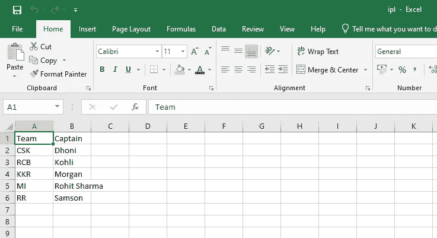

# 大数据洞察—第 1 部分

> 原文：<https://medium.com/analytics-vidhya/big-data-insights-part-1-1f2a172e56d9?source=collection_archive---------8----------------------->

CSV，JSON & XML 数据格式——它们看起来怎么样？

# 介绍

> 在这个 VUCA 世界，数据在国内增长的每个领域都扮演着至关重要的角色。在互联网上抓取、导入、导出或传输的数据可以是任何格式或类别。这些数据需要微调和处理，以收集一些发现。因此，在本教程中，我们将讨论各种数据交换格式。

第一项:“我看起来怎么样？”—数据

# **如何创建一个. csv 文件？**

> C SV 代表逗号分隔值，一个包含由逗号(，)分隔的数据的普通文件。它看起来类似于 excel 文件，用于导入或导出大量数据。(例如，客户数据、产品数据等。,).在本教程中，我们将创建一个简单的数据集，包括一个 IPL 板球队及其队长的详细信息。打开记事本文件。按照第 2 项所示进行输入…

第 2 项:创建 ipl.csv 文件-一个简短的视频

现在，如果您只是打开 ipl.csv 文件，该文件将类似于*项目 3 中所示屏幕截图打开。*

项目 3: ipl.csv 文件

# **如何创作。json 文件？**

> JavaScript 对象符号是另一种基于文本的数据交换格式，用于维护数据的结构。它遵循一些表示数据的语法，有时用作 XML 文件的替代。当您开发 web 应用程序时，它有助于将数据从服务器传输到客户端。打开一个记事本文件，如第 4 项所示键入。

第 4 项:ipl3.json 文件

**语法解释**:这里，“{”大括号表示 json 文件的开始。后跟(:)的“ipl”表示数据集的名称。接下来，符号“[”表示 ipl 包括以下字段和值。(场:队，队长)和价值观像 CSK，多尼…

**注意:**(，)用于分隔每对字段和值..它看起来也像 python 编程语言中使用的字典创建。

最后，再次关闭方括号(])，然后关闭花括号(})。

很简单，我们已经创建了。json 文件。但是，我们如何验证上面创建的 ipl3.json 文件呢？JSON 验证器用于检查为创建键&值对而定义的模式。要做到这一点，我们可以尝试一些免费的在线 json 验证程序，比如 https://www.freeformatter.com/json-validator.html

第 5 项:json 文件验证—一个简短的视频

因此，*第 5 项*显示了 JSON 文件是如何得到验证的。

# **如何创造。xml 文件？**

> 用于存储和传输数据的可扩展标记语言。它包括一组定义数据表示格式的规则。作为 json，它是在 web 应用程序中来回传输数据时使用的一种替代数据格式。语法类似于 html 标签。打开一个记事本文件，如第 6 项所示键入。

第 6 项:ipl.xml 文件

与 html 程序类似，开始和结束标记将在 XML 文件中使用。html 和 XML 的区别在于，html 中只有预定义的标签，如 HTML、head、title、body 标签，而 XML 支持程序员定义自己的标签，如 team、captain 等。，team 是一个属性，MI 在这里是一个值。

**注意:** ipl 是根/父标签，后跟 players 表示每个数据项。在这里，玩家标签是一个子节点。最后，关闭 ipl 标签。

很简单，我们已经创建了。xml 文件。但是，我们如何验证上面创建的 ipl.xml 文件呢？用于检查根元素、结束标记、正确引用的属性的 XML 验证器。它还区分大小写。为此，我们可以尝试一些免费的在线 XML 验证器，比如 https://www.liquid-technologies.com/online-xml-validator[的](https://www.liquid-technologies.com/online-xml-validator)

第 7 项:xml 文件验证—一个简短的视频

因此，*第 7 项*展示了 XML 文件是如何被验证的。

# 结论

在接下来的教程中，我们将进一步讨论如何将文件从一种格式转换成另一种格式。谢谢你，