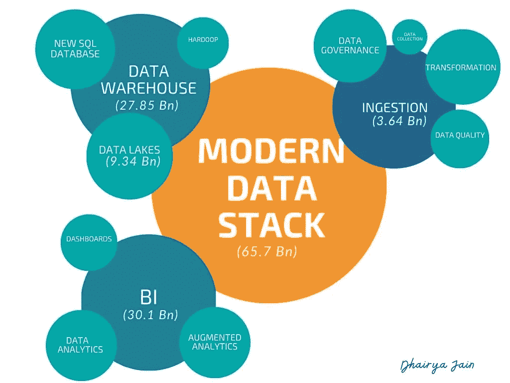

# 大数据到现代数据堆栈:演变和革命

> 原文：<https://medium.com/analytics-vidhya/big-data-to-modern-data-stack-evolution-and-revolution-e8052ff389cc?source=collection_archive---------8----------------------->

# 什么是现代数据堆栈(MDS)？

总的来说，MDS 是从需要持续维护和质量保证的陈旧过时系统(之前被称为大数据)到自动化、简化和加速公司获取数据和做出强有力商业决策的能力的现代数据系统的旧而脆弱的破碎流程工具的演变。

现代数据堆栈是不同组件的集合，包括接收、转换、数据存储和 BI 平台。每个组件本身都是一个完整的产品解决方案，并为数据处理中的特定问题提供解决方案。因此，MDS 的总范围是相当广泛的。例如，摄取工具为系统提供提取功能，从各种来源提取信息，转换工具帮助将所有数据转换为适当的格式。然后，所有收集到的数据都存储在存储仓库和数据湖中，并显示在 BI 工具中，向内部和外部用户呈现数据分析结果。

现代数据堆栈基础设施收集能够洞察性能的组件，并将数据聚集成用户可接受的形式。现代数据栈的起源与亚马逊红移的诞生有关，它引入了极少量的 MPP 格式的数据处理。从那时起，小得多的团队对数据工具的采用飞速增长，并导致了一系列新产品，促进了整个生态系统的增长。

现代数据堆栈公司的整体潜力越来越大，因为从中型到超大型跨国公司的更广泛的公司大量采用数据技术。由于 MDS 技术的实施越来越受欢迎，较小的公司也开始关注这种技术在其组织中的重要性。然而，面向大型企业的旧式大数据基础架构的演进非常缓慢，需要一段时间才能成熟并惠及 MDS 公司。**新冠肺炎的影响是积极的**，推动了数据基础设施的快速采用，即使对于大型企业也是如此。

截至 2020 年，MDS 公司目前的市场规模估计为 657 亿美元，年增长率为 19.4%

## MDS 的子类别

几个工具共同构成了现代数据堆栈。这些工具构成了处理数据的分支，共同构成了完整的系统。MDS 的分支是

1.  数据仓库
2.  摄取
3.  转换
4.  商业分析
5.  数据湖
6.  管理
7.  数据质量

MDS 地图

上面列出的前五个软件工具是在 MDS 上工作所需的最低限度的工具。另一种是相对较新的工具，可以帮助专业人员了解世系，并确保输入系统的数据质量。

**前五个子类别的市场规模上述列表构成了市场**的 90%,其余是近年来引入的相对较新的类别，仅占市场份额的 10%,因此具有相同比例的市场规模。

为了简化这篇论文，把它压缩成四页，我把注意力更多地集中在上面列出的讨论商业模型的四大工具上。

不同 MDS 工具的商业模式

# **MDS 的现状、挑战和机遇**

MDS 时间表

MDS 已经从最初的日子走过了漫长的道路，目前正处于发展的第二阶段。MDS 第二阶段包括

1.  云服务
2.  数据治理和质量工具
3.  简化的用户界面

新兴主题

但是仍然有一些摩擦点需要解决

1.  缺乏对运营工具的反馈
2.  缺乏用于统一数据交互的水平接口
3.  数据流功能
4.  不成熟的治理

MDS 现状的这些局限性为这个领域尚未开发的**机会**奠定了基础。除此之外，还有一些问题，如数据质量、ETL- > ELT 工具以及将数据仓库和 lake 融合到一个应用程序中的工具，一些年轻的初创公司解决了这些问题，但其他人仍有巨大的潜力来探索这个特定的领域。

重点领域

以下是在全球 MDS 领域大获成功的初创公司

1.  转换
2.  [Seekwell](https://www.seekwell.io/) (商务智能/分析)
3.  [Tray.io](https://tray.io/) (数据摄取/自动化)
4.  [Hevo 数据](https://hevodata.com/) *【印度】*(摄取和转换)
5.  [物化](https://materialize.com/)(摄取/数据流)
6.  [人口普查](https://www.getcensus.com/)(商业智能/分析)
7.  [Fivetran](https://fivetran.com/) (摄取/ETL)
8.  Infoworks.io (数据仓库)
9.  [火弩箭](https://www.firebolt.io/)(数据仓库)
10.  [Alation](https://www.alation.com/) (数据治理)
11.  [亚特兰](https://atlan.com/) *【印度】*(数据治理、接收、数据质量)

**延伸阅读资源** / **参考文献**

 [## 技术上:分析堆栈

### 没有多少人知道这一点，但在托尔斯泰于 1869 年完整出版《战争与和平》之前，他…

技术上.开发](https://technically.dev/posts/what-your-data-team-is-using)  [## 现代数据堆栈:过去、现在和未来

### 我最近在 Sisu 的未来数据会议上做了一个关于这个题目的演讲，因为我是用散文而不是幻灯片来思考的…

blog.getdbt.com](https://blog.getdbt.com/future-of-the-modern-data-stack/)  [## 现代数据基础设施的新兴架构

### 五年前，如果你在构建一个系统，它是你写的代码的结果。现在，它是围绕数据构建的…

a16z.com](https://a16z.com/2020/10/15/the-emerging-architectures-for-modern-data-infrastructure/)  [## 弹性和活力:2020 年的数据和人工智能前景

### 在近年来前所未有的一年里，数据生态系统不仅表现出非凡的弹性，而且令人振奋…

mattturck.com](https://mattturck.com/data2020/)