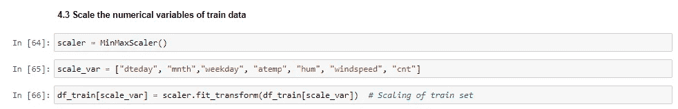
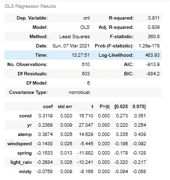

# 自行车共享提供商——这是一个促进你业务发展的指南。

> 原文：<https://medium.com/analytics-vidhya/bike-sharing-providers-heres-a-guide-to-boost-up-your-business-3372afc9a37e?source=collection_archive---------6----------------------->

在这篇文章中，我介绍了机器学习算法如何帮助自行车共享提供商提高他们的收入数字。

照片鸣谢——玛利亚·特内娃在 Unslpash

自行车共享系统在世界范围内越来越受欢迎，因为它们提供了租赁和归还自行车的灵活性。您可以从您方便的位置短期租用自行车共享提供商的自行车，并根据您方便的位置将其归还给该提供商的任何其他站点(也称为码头)。

这本质上是一种自助服务，在许多地方都有通过移动应用程序访问它的选项。这些服务通常是一次性使用的，但各种自行车共享提供商也提供会员选项。

分析包含基于各种气象调查和人们风格的信息的数据集以及我们如何使用这些信息来产生一些有用的见解是很有趣的。

因此，我们有一个数据集，其中包含一家美国自行车共享公司的所有上述信息，该公司希望了解:

*   预测共享自行车需求的重要变量。
*   这些变量在多大程度上描述了自行车需求。

我们将建立一个多元线性回归模型来预测对共享自行车的需求。

让我们开始吧…

我们从导入必要的库开始。

我们分析所需的库

我们将数据加载到数据框中，并将其称为“自行车”。从今以后，我们将使用这个数据框架进行分析。

对我们的数据框架的基本分析表明，该数据由 730 行和 15 列组成。此外，数据是干净的，这意味着没有丢失的值。也没有异常值。

前 5 行数据框自行车

列 **yr** 代表两年:0 代表 2018 年，1 代表 2019 年。我们从 **dteday** 列中提取日，因为月和年等其他信息已经存在。

像 **season** 和 **weathersit** (表示天气情况)这样的列具有范围从 1 到 4 的值，这些值具有与它们相关联的特定标签。对于季节，标签是(1:春天，2:夏天，3:秋天，4:冬天)。天气预报的标签是(1:晴，2:有雾，3:小雨，4:大雨)。这些标签是通过数据字典获取的。我们把这些名字分配给数字。

因此，经过这些修改后，我们的数据看起来像这样:

上述修改后的数据

# **探索性数据分析(EDA)**

我们执行自行车数据集的二元和多元分析。

atemp 与温度的关系

两个 **atemp** 和 **temp** 变量代表几乎相似的数据。

年度自行车需求分析

显然，与 2018 年相比，2019 年对自行车的需求更多。

自行车需求旺季

秋季和夏季显示出对自行车的高需求。

自行车的月度需求

从六月到九月，自行车的需求量很大。

根据天气情况对自行车的需求

天气晴朗时，自行车需求量很大。

# **建立多元线性回归模型**

现在让我们用热图来看看所有的变量是如何相互关联的。

变量关联热图

我们以 **cnt** 变量为目标变量建立多元线性回归模型，并选择那些能更好地解释该目标变量中方差的变量。

我们可以看到 **temp** 和 **atemp** 有很高的相关性。从双变量分析中，我们看到它们只是代表相似数据的两个变量。另外**注册**和 **cnt** 有很高的相关性。 **cnt** 列是 **casual** 和 **registered** 列的总和，是我们的目标变量。因此，我们从数据中删除了**临时**、**临时**和**注册**列，以便进一步分析。

**编码分类变量**

**季节**和**天气**似乎是没有任何内在顺序的名义变量。所以我们用 pd.get_dummies 对它们进行编码。

季节和天气变量的一个酒店编码

**dteday，mnth** 和 **weekday** 也是分类变量。但是这些列中的级数太高了。所以我们用 LabelEncoder 来编码它们。

标签编码

**分割数据**

现在，我们将数据集分为训练集和测试集，如下所示:

拆分数据

**缩放数据**

为了获得最佳的系数值和良好的模型拟合，我们需要将所有的值放在统一的范围内。这是通过缩放实现的。应用缩放的另一个原因是，我们用来最小化我们的底层成本函数的梯度下降方法，在缩放时比没有缩放时收敛得快得多。

列车数据的缩放

**使用 statsmodels.api 建立多元线性回归模型**

现在我们的数据已经准备好了，我们将使用 statsmodels.api 构建模型，因为我们可以获得所有统计参数的详细描述。

我们现在将目标变量从训练集中分离出来，称之为 **y.** 我们的自变量被命名为 **X.**

我们有 14 个变量，最初我们会考虑所有的变量。每次，我们给 **X** 添加一个常数项，因为默认情况下，statsmodels.api 会给我们一条穿过原点(0，0)的回归线。

第一个模型的统计

我们有了第一个模型，R 平方和调整后的 R 平方值都很好。但是如果我们看到系数，它们中的一些似乎并不重要，因为它们具有高 p 值。所以我们需要过滤参数。让我们也看看 VIF 值，以了解变量之间的多重共线性。

VIF 价值观

根据上述统计数据，我们决定删除 **dteday** 变量，因为它具有较高的 p 值— 0.703，并重新构建模型。

删除日期后的模型

VIF 价值观

R 平方值和调整后的 R 平方值接近且较高(分别为 0.826 和 0.822)，F 统计值是可接受的。但是某些变量的 p 值很高。还哼变有高 VIF 所以我们降哼列。

删除 hum 变量后的模型

VIF 价值观

R 平方值和调整后的 R 平方值接近且较高(分别为 0.822 和 0.818)，F 统计值是可接受的。但是某些变量的 p 值很高。同样 **mnth** 变量有高 VIF。我们丢弃第**个变量。**

删除 mnth 变量后的模型

VIF 价值观

R 平方值和调整后的 R 平方值接近且较高(分别为 0.822 和 0.818)，F 统计值是可接受的。但是某些变量的 p 值很高。 **weekday** 变量具有高 p 值(0.125)，因此我们将其删除。

删除工作日变量后的模型

VIF 价值观

虽然 VIF 数据在可接受的范围内，但夏季柱的 p 值较高。所以我们把**夏**列掉。

删除夏季变量后的模型

VIF 价值观

虽然 VIF 数据在可接受的范围内，但是**工作日**列具有高 p 值。所以我们删除**工作日**列。

删除工作日列后的模型

VIF 价值观

所有变量的 VIF 值都在可接受的范围内。同样，所有的变量在统计学上看起来都是显著的。R 平方、调整后的 R 平方值良好且接近(分别为 0.818 和 0.815)。我们的模型差不多准备好了。

**冬季**和**节假日**变量仍有 p 值 0.002。我进一步删除了第一个**冬季**和第二个**假日**变量，使模型更加紧凑，只保留 p 值为 0.000 的变量。(注意:在构建模型时，我们一次只删除一个变量。)

**最终型号**

有 6 个变量的最终模型

VIF 价值观

R 平方值 0.811 和调整后的 R 平方值 0.809。F 统计量的 p 值非常低，几乎接近于 0。所有变量都具有统计学意义。我们的模型准备好了！！

## 对测试数据进行预测

我们准备测试数据，将变量保存在训练数据中，并使用适合训练数据的**定标器**对其进行转换。注意，我们在测试数据上只使用了**转换**方法，而没有使用**拟合。转换**。

测试数据的预测 y 值被命名为 **y_test_pred** 。让我们相对于实际 y 值绘制这些值， **y_test** 。

y_test_pred 与 y_test

我们的模型已经很好地预测了 y 值。

误差项或残差只不过是 y 的预测值和实际值之间的差异。根据线性回归的假设，这些残差应遵循正态分布。

残差图

残差与 y_test_pred

残差与 y 检验

**推论:**
1。y_test 和 y_test_pred 散点图表明，我们的模型很好地预测了测试数据的值。
2。分布图显示测试数据的误差项遵循正态分布。
3。残差和 y_test_pred 的散点图显示，在误差方面没有模式。这证实了线性回归的同方差假设。
4。残差的线图显示它们是独立的，这意味着它们之间没有相关性，并且分布在平均值 0 附近。

## 计算 R 平方值

测试数据的 r 平方

我们可以看到，训练数据和测试数据的 R 平方值几乎相似，分别为 **0.811** 和 **0.793** 。

## 模型方程:

## CNT = 0.311914+(0.387364 x atemp)+(0.236879 x yr)——(268408 x light _ rain)——(0.153304 x spring)——(0.143759 x wind speed)——(0.075841 x misty)

那么我们的模型告诉我们什么呢？

1.  在这种持续的隔离状态结束后，人们对共享自行车的需求将会逐年增加。
2.  自行车需求量最大的最佳生意时期是夏季和初秋——每年的六月到九月。(这一点在 EDA 中显而易见，也因为 atemp 变量是我们模型中最重要的变量)。
3.  在天气晴朗的工作日，自行车需求量会很大。
4.  在春季，自行车需求可能会减少，但随着春末夏初，自行车需求将会增加。
5.  小雨可能会影响对自行车的需求。
6.  在风速高的日子里(通常这可能发生在三月和四月)，自行车需求将保持低迷。

这些是我们可以从分析中得出的一些见解。这些对于自行车共享提供商决定他们应该关注哪些因素以获得良好的业务非常有用。

这难道不是一个有用的练习吗！我相信你一定喜欢读这篇文章。请在评论中告诉我你对这篇文章的反馈。

***可以在领英上联系我:***[***https://www.linkedin.com/in/pathakpuja/***](https://www.linkedin.com/in/pathakpuja/)

***请访问我的 GitHub 简介获取 python 代码:***[***https://github.com/pujappathak***](https://github.com/pujappathak)