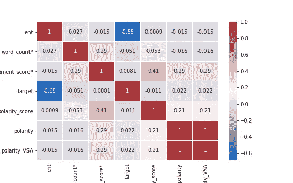
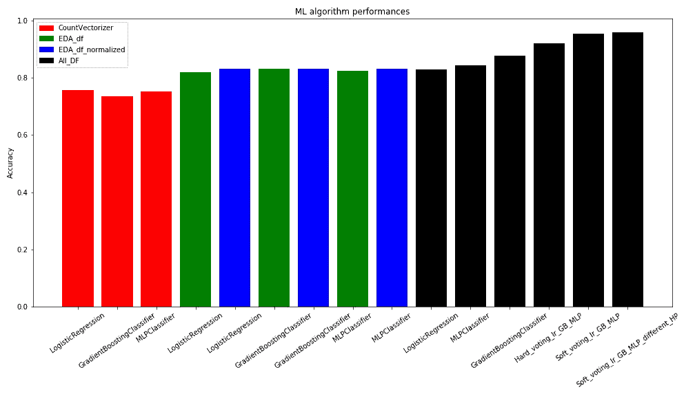
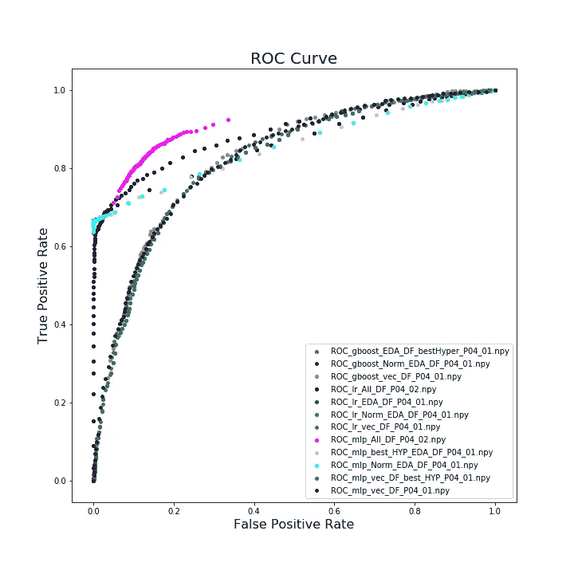

# 使用 NLP 对 Reddit 数据进行二元分类(NASA 和 Space)

> 原文：<https://medium.com/analytics-vidhya/binary-class-classification-nasa-and-space-on-reddit-data-using-nlp-a22a9da16b60?source=collection_archive---------3----------------------->

图像来源是[这里的](https://www.theguardian.com/technology/2021/may/07/reddit-aims-to-double-in-size-as-social-news-site-invests-for-growth)

检查下列句子。很难区分来自 NASA 和太空社区的句子。然而，人工智能确实很容易区分句子！在这个项目中，新功能工程数据将人工智能估计的准确性从 75%提高到 96%。人工智能惊人地完成如此复杂的任务。

> *一颗穿过土星光环的恒星。
> B)在线空间相关度。M1:令人难以置信的膨胀蟹状星云。因为我没有任何花哨的望远镜或其他东西，所以我用摄像机拍下了这张照片。圣诞节我去了 ksc，看看是什么让我对太空飞行感兴趣。我去了约翰·肯尼迪航天中心。*

A、C、E 和 F 句子来自 NASA 社区，B 和 D 来自太空社区。此处有项目[。](https://github.com/Atashnezhad/Natural_language_processing_Project)

太空一直是我的激情所在，我喜欢用双筒望远镜观察恒星、星系和太阳系。NASA 社区是为任何与国家航空和宇宙航行局相关的事物而设的；最新的新闻，事件，当前和未来的任务，等等。它于 2008 年 7 月 17 日创建，拥有 130 万会员，其中 282 人在太空中。[太空讨论](https://www.reddit.com/r/space/)是一个分享&的社区，讨论关于*天体物理学*宇宙学*太空探索*行星科学*天体生物学的信息内容。它于 2008 年 1 月 26 日创立，拥有 1720 万会员，5000 万在线用户。目标是开发一个二元类分类，能够从空间讨论中识别 Nasa 社区。选择这两个相近的类别是为了增加挑战，并看看使用 python 中的常见 ML 算法库，AI 可以接近到什么程度。

## 收集数据

使用 API 从 Reddit 网站接收两类数据。我使用了我的朋友 [Saied](https://github.com/saiedmighani/Global_warming_NLP_analysis/blob/master/assets/get_reddit_posts.py) 函数，做了一点修改，从 Reddit 接收数据。您可以在这里查看原始功能。数据以两种格式保存。csv 和. pkl。

## 清理数据

数据包括 10-15 列，其中一列以文本形式显示 Reddit 评论。NaN 值被过滤，并且使用一系列函数来清理文本，这些函数包括标记化、分裂、告密、移除停用词、词干等。

## 探索性数据分析

通过分析数据，我们发现这两个类别非常接近。太空中的“链接”、“丰富:视频”和“自我”的比例更高，而美国宇航局的“图像”数量更多。与标准偏差较小的太空相比，NASA 的平均字数更低。这两个子类别在字数上非常接近。不过空间类有一些 500 以上的长文。对于情感得分，观察到均值和标准差都非常接近。看起来太空论坛和 NASA 论坛都很接近。可以看出，对太空的负面情绪得分比 NASA 高一点。与参加太空讨论的人相比，参加 NASA 讨论的人态度更积极。

## 命名实体识别

腐蚀矩阵

命名实体识别是一种信息提取方法，其中文本中存在的实体被分类为预定义的实体类型，如“人”、“地点”、“组织”等。使用 NER，我们可以深入了解给定文本数据集中的实体类型。

观察到 ent 和目标值之间有很强的相关性。

准备了三组数据帧，包括计数矢量化文本、EDA 数据帧以及合并的计数矢量化文本和 EDA 数据。

# 建模-最大似然算法

应用逻辑回归、梯度推进分类器和 MLP 分类器。算法进行网格搜索，寻找最佳超参数，提高精度。投票系统包括三个最佳模型，并应用了超参数，其最大准确度为 96%。据观察，与 EDA 数据集相比，仅使用矢量化文本会导致较低的准确性。此外，使用合并数据集可以获得最高的准确性。

**上图可见建模精度的进步。**

# 结论

最好的模型是软投票模型，包括三个最好的 ML 算法，通过网格搜索实现。在这个项目中，提取了一组新的数据，稍后用于建模。分析表明，新的工程数据集(EDA)显示了更高的准确性，并促进了 ML 算法。合并矢量化文本和工程数据集(EDA)更有帮助，准确率提高了 80%以上。最后，集合模型的效果最好，准确率达到 96%。

以下是在本研究的第 4 部分开发的分类模型 ROC 曲线。这里不包括投票模型。可以看出，使用合并的数据框(EDA 和来自文本的矢量化数据)可以实现最佳模型。人工神经网络和逻辑回归具有最好的性能。此外，可以看到 EDA 数据框提高了模型预测。比较归一化 EDA 和 EDA，结果表明使用归一化 EDA 提高了模型的性能。

包括 xgboost(使用归一化 EDA 数据框架)和 ANN(调整超参数并使用 EDA/和归一化 EDA)在内的三个模型处于 3d 等级。

# 建议

可以研究一下 TFIDF 矢量器，看看是否有助于模型的准确性。在投票 ML 算法中，可以引入更多的模型，这肯定会有所帮助。