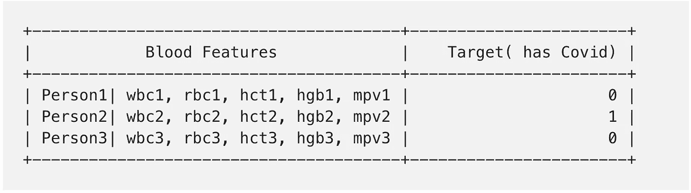
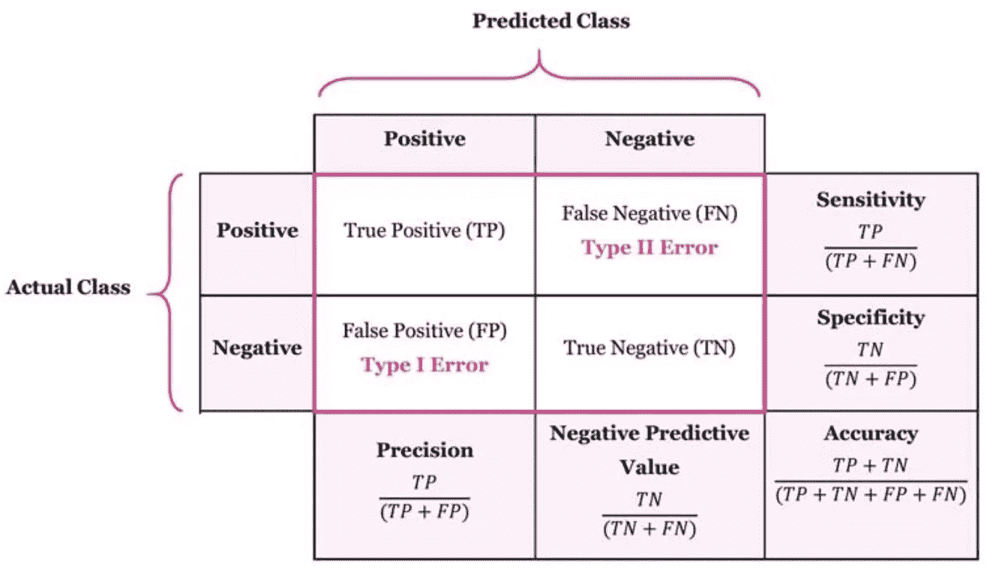
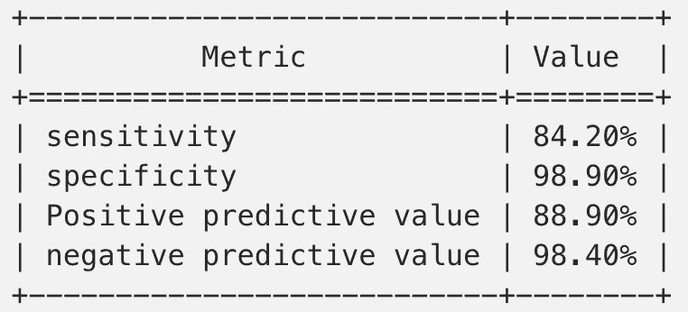
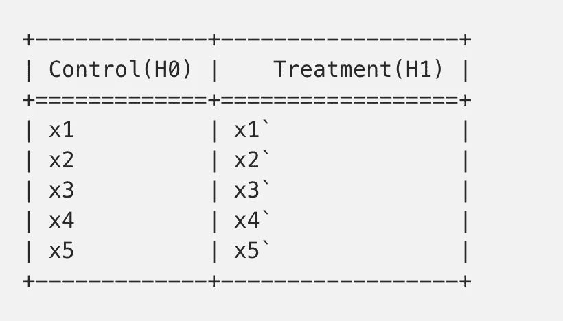
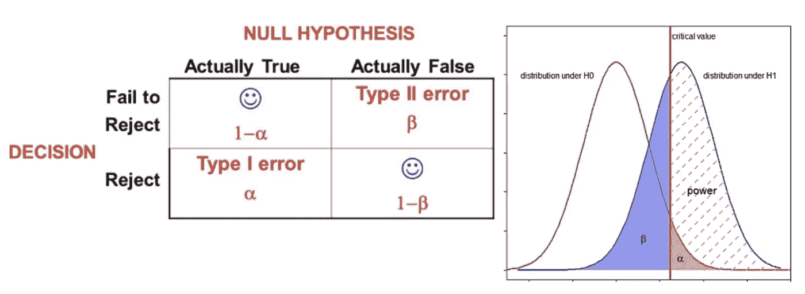
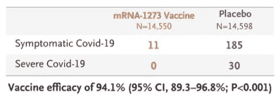
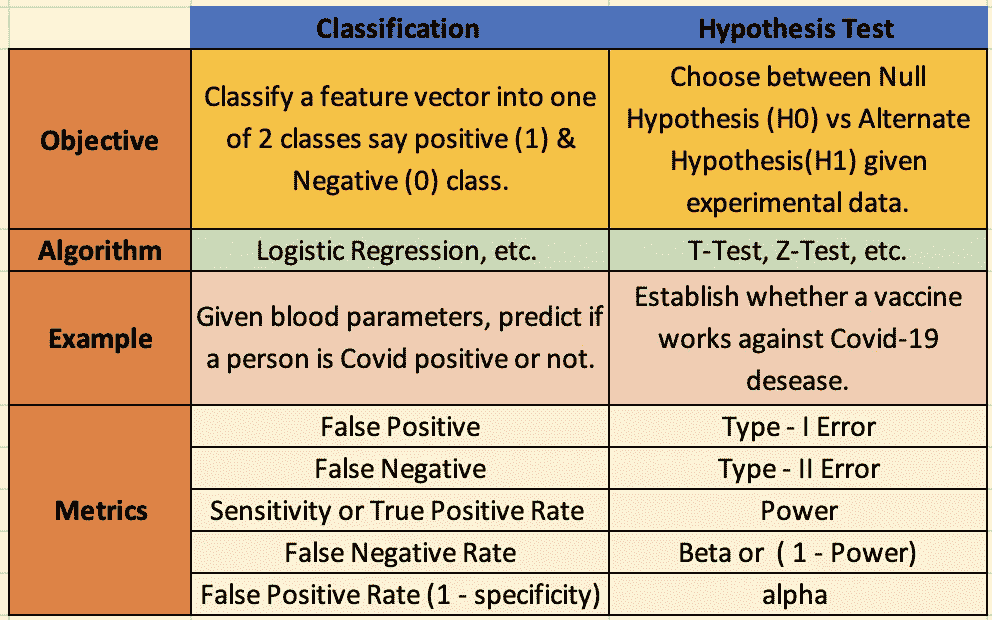

# 使用真实生活中的新冠肺炎用例解释二元分类与假设检验

> 原文：<https://medium.com/analytics-vidhya/binary-classification-vs-hypothesis-testing-explained-using-real-life-covid-19-use-cases-a017a728650d?source=collection_archive---------2----------------------->


做出二元选择的人。

二元分类通常用于机器学习中的预测任务，而假设检验在统计学中以执行推理任务而闻名。这两项任务都涉及到二元决策。但是它们被用来解决非常不同的问题。在每种情况下，输入数据和算法也有很大不同。然而，由于这两个任务最终都是关于做出二元决策，所以它们共享了相当多的评估指标，尽管它们的术语不同。在这篇博客中，我将使用最近与新冠肺炎相关的用例来解释这两种技术，并试图揭示这两种理论之间的异同。

> **二元分类**

**目标**:给定一个 **n** 维特征向量( ***x*** )，将其归入两类中的一类(C1 或 C2)。
**举例** —假设有人建立了一个模型，它可以接受用户的血液参数来预测一个人是否感染了 covid。这类似于实验室中流行的 RT-聚合酶链式反应测试。



**分类任务:**covid 19 预测的样本数据集

**模型建立**:有太多的选择可以用来建立这个模型，比如逻辑回归、决策树、神经网络等等。

**预测:**我们将一个人血液的特征 **(x)** 传递给模型( **f(x)** ，它生成输出 1 或 0。

**评估**:假设类“Covid 正”用整数 1 表示。并且类“Covid 负”由整数 0 表示。在预测过程中，我们的模型会产生两种误差—

a) **假阳性**:将一个人归类为 covid 阳性，但他不是。

b) **假阴性:**将一个人归类为 covid 阴性，但他实际上是阳性。



**二元分类:**混淆矩阵和一些重要的度量

c) **敏感度或召回率或真阳性率**:这是一种非常流行的方法，用来评估我们的模型在捕捉数据集中所有实际阳性方面有多好。

d) **特异性或真阴性率**:这是数据集中真阴性和实际阴性之间的比率。假阳性率为 1-特异性。

e) **精确度或预测阳性率:**这也是一个非常流行的指标，它是预测阳性中真实阳性的比例。

对于不平衡的数据集，一个单一的指标是不够好的。因此，通常使用(**精度&召回**或(**灵敏度&特异性**)的组合来描述分类模型的性能。

让我们来了解 RT-聚合酶链式反应测试的这些指标基础现实生活表现。根据[的论文](https://www.ncbi.nlm.nih.gov/pmc/articles/PMC7227531/)，下面是一辆 RT-聚合酶链式反应测试的性能:



**RT-PCR 测试性能指标**

这些指标可以被不同的人以不同的方式解读—

**个人**——如果我在 RT-聚合酶链式反应测试中检测为阳性，结果为**假阳性**的概率为**11.1%**(100%–88.90%)**。另一方面，如果我检测为阴性，那么我在现实中可能感染 **covid** 的概率只有**1.6%**(100%—98.4%)**。****

******政府** —在我所在地区的所有阳性病例中，RT-PCR 检测能够检测出 **84.2%** 的病例，但会漏掉 **15.8 %** (100% — 84.2%)的 covid 阳性病例。也可以做出类似的但不太有用的解释来检测阴性病例。****

****因此，我们可以看到每个指标都有自己的目的和解释。此外，还有其他指标，如准确性、ROC-AUC、F1 评分，我们在此不做讨论。****

> ******假设检验******

******目的:**粗略地说，给定两个假设，我们需要证明给定观察到的实验数据，哪个假设似乎更有可能。第一个假设被称为“零假设(H0)”，第二个被称为“替代假设(H1)”。这里，我们得到的不是人或物体层面的特征，而是每个假设下的一系列观察结果。****

********

******假设检验**:样本数据集，其中的值可以是布尔值，如 0/ 1 或连续浮点数。****

******示例** —如果我们正在评估 covid 疫苗在治疗新冠肺炎方面是否有效，那么 H0 意味着无效，H1 意味着有效。我们寻求拒绝无效假设。****

******算法**:假设检验的两种流行检验是 Z 检验(用于比例度量)和 T 检验(用于连续度量)。为了检验疫苗的有效性，我们可以使用两个样本的比例检验(Z-检验)。****

******推论:**如果得到的 z 值(或 p 值)小于临界值(或α值)，那么我们拒绝 H0，否则我们拒绝 H0 失败。不能拒绝 H0 并不意味着 H0 是真实的。可能发生的情况是，实验没有足够的力量(样本大小)来拒绝 H0。****

******评价:**我们在这里也可以犯两种错误。****

****a) **第一类错误**:如果我们最终拒绝了零假设(H0)，而事实上它是真的。这类似于分类中的假阳性。****

****b) **第二类错误**:如果我们最终没有拒绝零假设(H0)，而事实上它是假的。这类似于分类中的假阴性。****

********

****假设检验的性能度量****

****c) **Alpha** : Alpha 是我们错误拒绝 H0 的概率。上图中的橙色区域。1-α与分类中的“特异性”相同。通常，该值设置为 5%。****

****d)**β**:β是当 H0 为假时，我们没有拒绝它的概率。图中的紫色区域反映了β。****

****e) **功效:**定义为 1-β相当于分类中的灵敏度。它表示正确拒绝零假设的概率。白色条纹区域代表权力。通常我们选择样本大小，使功效至少为 80%。****

****让我们用 Moderna 的疫苗功效结果的**真实例子**来理解这些术语。****

********

****现代 mRNA -1273 疫苗的临床试验结果****

****根据这份[报告](https://www.nejm.org/doi/full/10.1056/NEJMoa2035389)，科学家们想要测量 mRNA -1273 疫苗的效力。为此，他们给 14550 人注射了两剂疫苗，给 14598 人注射了两剂安慰剂。几天后，他们观察有多少人感染了新冠肺炎病毒。上表包含了结果。****

```
**p_placebo    = (185+30) / 14598 = 0.014728045
p_mRNA-1273  = (11 +0)  / 14550 = 0.000756014Efficacy = delta% = (p_placebo - p_mRNA-1273)/p_placebo ~ 94 %Note: Confidence Interval and P-value computation for delta% is a bit involved procedure and hence not shown in this blog.** 
```

****上图的低 p 值(或假阳性率)表明 94%的疗效是显著的。换句话说，第一类错误的概率是< 0.001\. Interested reader can check out this stack overflow [链接](https://stats.stackexchange.com/questions/64652/calculating-standard-deviation-associated-with-percentage-change/64658#64658)来理解 delta %度量的 p 值和 CI 计算。****

> ******总结和结论******

********

****分类和假设检验的并列比较****

****上表提供了一个比较总结，可以帮助我们理解这两个非常流行的技术之间的关系。希望这篇文章能澄清一些在文献中分别阅读这两个主题时可能产生的疑问。****

******开放式问题【请将您的想法写在评论中】******

1.  ****假设检验中有没有类似于 ***准确度*** 的度量？****
2.  ****假设检验中有没有类似于 ***ROC-AUC*** 的度量？****

******参考文献** —****

1.  ****[https://www . science direct . com/science/article/pii/s 2666389920301562 #:~:text = In % 20 this % 20 aspect % 2C % 20 hypothesis % 20 testing，known % 20 binary % 20 answers % 20 In % 20 data](https://www.sciencedirect.com/science/article/pii/S2666389920301562#:~:text=In%20this%20aspect%2C%20hypothesis%20testing,known%20binary%20answers%20in%20data)。****
2.  ****[https://medium . com/swlh/how-to-remember-all-these-classification-concepts-forever-761 c 065 be 33](/swlh/how-to-remember-all-these-classification-concepts-forever-761c065be33)****