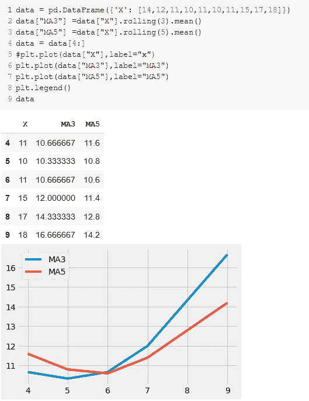
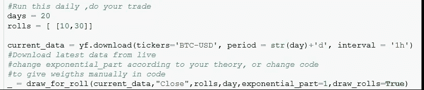

# 用移动平均线预测比特币，最简单的基本情况

> 原文：<https://medium.com/analytics-vidhya/bitcoin-prediction-with-moving-average-simplest-base-case-1bb4f9370c08?source=collection_archive---------1----------------------->

比特币价格查询/玩成了所有白领的世界性、早晨/全天活动。作为一名数据科学家，我认为真实的潜在比特币函数是白噪声(回报)、随机游走(价格)，完全真实的函数似乎非常复杂。在本帖中，我将尝试展示一些简单的比特币预测案例。在过去，我与时间序列，阿玛和 LSTM 做了很多项目。我不愿意把这些应用到比特币上。比特币看起来像是随机漫步，3 个月前、6 个月前、9 个月前的比特币……是完全不同的现象。
任何机器学习理论都是用代理近似函数来建模一个潜在的复杂函数。例如，认为比特币价格是数千个不同权重参数的函数。

**比特币价格** =(黄金价格)* w1+美元* w2 +日元* w3 …+
白银价格* w4 +各国当地参数(中产阶级、富人阶级如何/为什么把钱投入比特币)
未知的 10000 个参数… +
不可约误差

在过去的几年中，这个函数的建模需要数千个参数。我们能做的不是实现这个复杂的函数，而是，只检查这个函数的输出，price。试着做点什么。让我们实施基本策略。比较短期和长期趋势。如果短期平均价格高于长期平均价格，我们预计价格会加速上涨。所以我们买。在对面我们卖。

代码在 github: [链接](https://github.com/mcelikkaya/medium_articles2/blob/main/bitcoin_ma.ipynb)
你可以在 nbviewer 中查看:[链接](https://nbviewer.jupyter.org/github/mcelikkaya/medium_articles2/blob/main/bitcoin_ma.ipynb)

用移动平均线，我们正在检查市场方向。请按如下顺序思考:

我想我们平均 5 天和 3 天。在第 6 天(实际上是第 10 天，我没有显示前 4 天，因为没有 5 天平均值)，第 3 天平均值变得超过 5 天平均值。所以它显示了一个上加速度，所以你买。就这么简单。

使用移动平均线的诀窍是有一个理论。你将如何选择这些时间窗口。(上面的 3 和 5)。你一定有这样的口头理论:
在我的理论中，如果价格在短窗口(24 小时)内变化，上升到长窗口(72 小时)上方，这是市场上涨的信号。

但比特币市场是完全混乱和随机游走的。现在，我将尝试展示不同的窗口如何适用于不同的时间间隔。我会用移动平均线和加权移动平均线。

加权移动平均是，不取总和/计数作为平均值，只给以前的日期(或特殊日期)加权。可能对于市场专家来说，这一招就足够了，他们可以有足够好的算法来理解市场趋势。在很多文章中，你会看到指数移动平均线。在这里，我只是告诉你如何定义不同类型的平均或加权来检验你的理论。

**加权平均的影响**

第一个图形属于正常移动平均线，而第二个图形以 2 的幂加权。它把更多的重点放在了后面。对于长度为 6 的不同幂级数，我们将得到上述重量。

上述图表的推论是什么？例如，在 120 天图表中，exp=2 要好得多。这意味着，当我们关注最近的时间值时，我们更成功。这意味着，当我们最近看到一个模式时，我们可以很快依赖它。(因为市场波动过大)。想一个数列如下:
**sequence = [1，1，1，1，2，2，2，6，7，8]**
sum = 31
mean = sum(sequence)/len(sequence)= 3.1

如果我们如下定义一个权重矩阵，给最新的值更多的权重:
**ws = [0.05，0.05，0.05，0.05，0.05，0.1，0.2，0.2]**
sum([ a*b for a，b in zip(sequence，ws)]/len(sequence)
加权和= 0.48

所以我们得到的信号几乎是以前的 1.5 倍。但是要小心，快速反应指标在混乱的市场中是好的，在稳定的市场中是不好的。

**对于每个短/长组合，尝试所有历史数据**

在下面的图表中，第 1 行你可以看到标题为**表示[5，10] Exp : 2** ，
表示所有时段，当 **Exp** =2 时，如果 **short** = 5， **long** = 10，那么回报将会如何。Exp 2 创建了一个权重矩阵，对最近的时间段给予更大的权重。我们可以说，在最后的 80 天里，市场会对这一策略作出反应，并带来丰厚的利润。自己检查所有的图形和组合。

我们可以反过来试试。努力找到每个时期的最佳策略

解释第一张图表。对于最后 10 天，权重相等(Exp=1)，滚动策略将如何工作？你可以看到[5，15]和[5，35]似乎是有效的。我认为，这表明在这一时期价格波动如此之大，所以即使是 5 的短暂窗口，也足以理解加速。

现在，您已经尝试了多个时间跨度的多种模式。你有一个理论将如何用这些简单的东西来作出猜测。让我建立一个理论:

理论:我住在东京，所以当我醒来时，我看到了日本，几个小时后，我看到了韩国、中国和印度的市场。然后近 6 个小时后，我的国家醒来(土耳其)每个人都检查亚洲市场，在社交媒体上人们谈论市场的方向。如果他们看到一个趋势，他们会立即采取行动。将近 8 小时后，美国也是如此。因此，世界上人口密集的地区是 3 块，每 8 小时有一波(振荡),它引导市场。(这是我的弱理论，在社交媒体上看到的)

第一个亚洲玩家醒来，他们做一些操作，然后大约 6-7 小时后欧洲玩家醒来，他们检查亚洲并执行他们的操作，然后大约 6-7 小时后美国玩家醒来，检查亚洲和欧洲的效果并执行他们的操作。因此，我假设一个 24 小时模式，最高权重在 1、2、3、9、10、11、17、18，如下所示:

1，2，3+一些山区人口较少的地区+ 9，10，11+大西洋+ 17，18 +太平洋

因此，我认为比特币市场存在一个**地理放大效应**。(有一波的时候，在其中的 1 个，被后续的放大。)

让我们假设你的理论如上所述，并创建了权重矩阵。将它们放入代码中的公式，并在 1 天内多次运行下面的算法。当你看到所解释的模式时，就进行交易。
做空>做多=买入
做多>出手=卖出

只需更改下面的内容，并手动输入你的体重矩阵，你就可以让这个笔记本一整天都开着，并进行买卖。

**代码每小时检查一次**

每小时运行一次上面的代码:)检查结果，你的直觉，使用你的第六感。你可以看到有些警报是假的。(或者更好地说，市场将从那里回归，但你永远无法知道。更好的可能是计算斜率)

市场上有成千上万指标和成千上万的工具。你可以用这个简单的笔记本来定义你的度量标准(MA 或者你想要的任何值)和重量。因此，如果你觉得你了解市场的行为，你可以玩这个笔记本，并拥有自己的专用简单交易者。