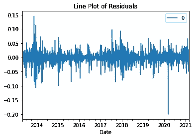
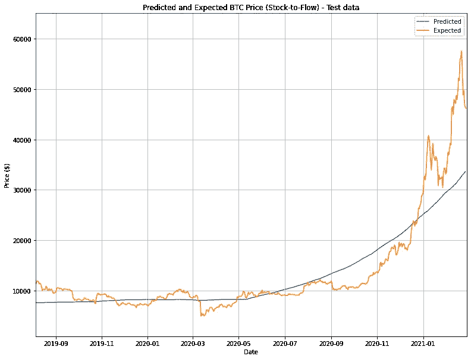

# 比特币:交易还是流向 HODL？

> 原文：<https://medium.com/analytics-vidhya/bitcoin-to-trade-or-to-hodl-e5f6dec40ccf?source=collection_archive---------13----------------------->

## 用 ARIMA、预言家和股票流量模型预测未来比特币价格，以找到最佳的买卖价格，以及根据其预测从交易中获得的利润是否超过霍德林

来源:海峡时报

在过去的两年里，加密货币已经进入了我的日常思维。随着比特币价格飙升至新高，我经常听到我周围的人抱怨他们已经关注比特币有一段时间了，应该早点买下它，但他们中的大多数人现在仍然拒绝购买，担心加密崩溃。

这让我想到:*我们是否可以通过用时间序列模型模拟比特币的运动来预测其每日收盘价？*如果是这样，通过我们开发的模型，*我们能在比特币下一次“减半”之前有效地确定其牛市趋势的顶峰吗？*

当我第一次接触加密货币领域时，我就应该交易还是 HODL 争论了很久。对于那些想知道 HODL 是什么的人来说:这个术语是加密货币世界的俚语，指的是通过加密的波动性购买并持有昂贵的生命。

随着越来越多的人开始接触加密货币，我也有兴趣找出:*根据之前推导的模型交易比特币是最优的还是只有 HODL？*

找出所有这些指导性问题的数据集是从 [Kaggle](https://www.kaggle.com/sudalairajkumar/cryptocurrencypricehistory?select=coin_Bitcoin.csv) 和 [Coinmetrics](https://community-api.coinmetrics.io/) 中提取的。所有代码和数据集的副本也可以在我的 [GitHub 库](https://github.com/maytanti/bitcoin-timeseries-forecast)中找到。

# ARIMA 模式

ARIMA 模型被认为是执行时间序列预测的最简单和最有效的机器学习算法之一，包括自回归和移动平均。

在我们可以对比特币价格实施 ARIMA 模型之前，我们必须首先找到参数 *p* 、 *d* 和 *q* 的合适值。

*   p :自回归项的个数
*   *d* : 非季节性差异数
*   *q* :移动平均项数

为此，我从探索比特币价格的趋势开始。

**图 1:**2013 年至 2021 年未加工比特币收盘价随时间变化图**(左)**。比特币价格数据的处理图，其中价格标度转换为对数标度。从 2014 年、2017 年和 2020 年开始，比特币价格出现了明显的飙升**(右)**。

**准备数据**

从*图 1(右)*，我注意到有一个积极的趋势，表明随着时间的推移，比特币价格大幅上涨。在 2014 年、2017 年和 2020 年期间，这一趋势出现了明显的大幅飙升，这是由比特币牛市引起的，随后比特币价格减半。为了使数据符合 ARIMA 模型，必须将数据处理成稳定状态。因此，必须消除所有基于时间的趋势(参见*图 3* )。这是通过根据以下公式将数据转换成时间序列来实现的:

*滚动差额=记录价格—记录价格的滚动平均值*

转换是通过从原始记录的数据中减去数据的滚动平均值来完成的，这使我们能够找到季节性的差异，并对平稳数据进行测试。滚动平均值定义为给定 7 天窗口内数据的平均值。

**图 2** :比特币价格 log 与 7 天滚动平均数据对比。请注意两条线是如何明显重叠的，但是边缘波动被曲率平滑了。**图 3:** 剔除所有时间趋势的滚动差异数据图。

既然时间序列是稳定的，我们可以继续寻找参数 *p* 、 *d* 和 *q* 。我用*偏相关函数* (PACF)确定了 *p* ，用*自相关函数* (ACF)确定了 *q* 。0 两侧的两条虚线代表置信区间，其中使用了 **95%置信区间**。这两个值都是在图表第一次穿过置信区间上限时确定的。

**图 4:** 滚动差数据的偏相关图。该线首先在 2 点穿过 95%置信区间。**图 5:** 滚动差数据自相关曲线图。该线首先在 18 处穿过 95%置信区间。

PACF 考虑了两个变量之间的直接相关性，忽略了所有其他情有可原的情况。该值与 *p* 一致，因为该值直接表示一个变量对另一个变量有直接影响的时间长度。

ACF 考虑了两个变量之间的所有相关性。这包括由受两个主要变量中的一个或两个影响的第三方变量引起的任何间接影响。由于很难捕捉影响这两个变量的所有间接因素，而不是试图量化所有影响，该模型显示了所有这些影响具有持久影响的时间段。该值与 *q* 一致，因为它表示我们在计算移动平均值时必须考虑的时间间隔。

*d* 等于 1，因为在计算滚动差的过程中对数据进行了一次差分，以消除趋势，使数据保持稳定。

**图 6:** 记录数据 ARIMA (2，1，18)模型残差的折线图。大多数误差在+/- 0.05 的范围内。**图 7:** 测井数据的密度图 ARIMA (2，1，18)模型残差。这些数据令人信服地符合高斯分布。

残差的线图表明，一些趋势可能仍然没有被模型捕捉到，特别是在 2014 年、2017 年和 2020 年的牛市中。然而，大多数误差在-0.05 到 0.05 之间。与此同时，残差值的密度图表明，集合误差非常接近理想的高斯数据结构。但是，平均值是 0.000011。残差的分布表明预测可能存在偏差。请记住，错误对应的是日志数据，而不是价格。

**造型**

为了预测未来的比特币价格，我必须首先训练和测试模型，看看它的精度。更详细地说，80%的数据用于训练模型，20%用于测试该模型的精度。这意味着该模型将预测从 2019 年 8 月**到 2021 年 2 月**的比特币每日价格。介绍了两种 ARIMA 模型。两个模型都以完全相同的方式准备，唯一的区别是使用的功能:*。预测()*或*。预测()*。为了使预测值和期望值更容易理解并与其他模型进行比较，我还将记录的价格转换回美元。

**图 8:**ARIMA 的剧情。预测()预测的和实际的 BTC 价格。两条曲线明显重叠，预期模型滞后于预测模型，如放大部分所示。

使用*。forecast()* 模型中，我们看到预测曲线与价格运动非常匹配，以至于如果我们缩小，两条线几乎相互重叠。然而，该模型只对预测一步样本外预测有用，这意味着该模型只能预测比特币未来一天的价格走势。虽然这种模式在理论上看起来很特别，但在现实中却很难实现。当我们试图估计明天比特币的价格时，这个模型可能是有用的，但是，它不能告诉我们比特币的价格运动在下周、下个月会是什么样子，甚至第二天的高点和低点会是什么样子，这使得我们几乎不可能确定我们交易的进场点和出场点。

**图 9:**ARIMA 的剧情。预测()预测的和实际的 BTC 价格。

这就是*所在。预测()*模型进来了。预测功能允许我们进行多步样本外预测，这意味着该模型可以估计比特币数周、数月甚至数年的价格走势。因此，预测对比特币的交易者来说更有价值，这就是为什么这个模型将与先知和股票到流量模型进行比较和评估。不出所料，预测价格和实际价格之间的差距扩大了。这是有意义的，因为由于我们用 2013 年至 2019 年年中的数据训练了模型，该模型不太可能预测 2020 年至 2021 年的爆炸性牛市，最终价格几乎是 2018 年峰值的三倍。

# 先知模型

由脸书核心数据科学团队发布的 Prophet 以擅长缺失数据、捕捉趋势变化和大量异常值而闻名。它也非常容易使用，并且不需要花费太多时间就可以得到合理的数据估计。

使用与 ARIMA 模型相同的训练和测试数据，我们可以看到 prophet 也未能识别比特币的 2020 年牛市。其趋势预测也显示出与 ARIMA 非常相似的模式(见*图 11* )。

**图 10:** 先知预测模型图，与训练数据重叠(用黑点表示)。浅蓝色阴影区域表示 prophet 预测模型的上限和下限。

**图 11:** 预言者预测(包括上限)和实际 BTC 价格的曲线图。

Prophet 预测的一个有趣的方面是它能够为数据提供上限和下限。不管怎样，如图*图 11* 所示，上限预测仍然无法解释比特币 2020 年的牛市。

## 基本时间序列模型的致命缺陷…

对于 ARIMA 和先知等基本时间序列模型，预测模型无法预测像比特币 2020 年牛市那样的真实世界的大幅波动。如果该模型在大幅波动后没有被重新训练，它也将不再能够准确预测未来的价格。接下来让我们看看一个方法略有不同的模型。

# **库存到流量模型**

[Plan B](/@100trillionUSD/modeling-bitcoins-value-with-scarcity-91fa0fc03e25) 的存量到流量模型已经成为预测比特币长期价格最广为人知的模型之一。为了克服基本时间序列模型的缺陷，股票-流量模型采用了一种不同的方法来确定比特币的价格。股票-流量模型没有试图将比特币价格确定为一个依赖于时间的变量，而是将比特币价格表达为两个容易量化的变量(股票和流量)之间关系的产物。

这种模式将比特币视为可与黄金、白银或铂金相媲美的稀有商品。由于相对稀缺，这些商品在很长一段时间内保持价值。为了理解这个模型是如何运作的，我们必须首先理解比特币供应的基本面。比特币现有的硬币数量有限，约为 1800 万枚。但与黄金不同的是，矿工每天仍能生产约 3000 吨黄金，比特币的供应量每四年就会减半。减半事件将每四年持续一次，直到比特币矿工的奖励最终为 0。在这一点上，挖掘新的硬币将不再可能。

比特币的存量-流量被定义为其产量和总存量之间的关系，给出公式 *sf =存量/流量*，它也告诉我们在当前生产率下需要多少年才能生产出当前存量中的东西。[B 计划的文章](/@100trillionUSD/modeling-bitcoins-value-with-scarcity-91fa0fc03e25)对这一主题进行了更深入的探讨。既然这个模型是社会公认的模型，就不需要训练了。我只是根据 B 计划的推导公式绘制了模型:

*模型价格(美元)= 0.18 * SF ^ 3.2*

这个公式被用来计算股票到现金流的价格估计，然后根据比特币的实际价格绘制。需要考虑的重要一点是，由于每天开采的硬币数量存在差异，我对比特币的产量使用了 **463 天移动平均线**。世界上所有硬件的处理能力并不总是稳定的，我们应该考虑到这一点。使用 463 是因为它是最符合比特币历史数据的值。

**图 12:** 对数价格标度上的历史库存-流量趋势线。请注意股票-流量模型如何能够预测比特币价格因其在 2014 年、2017 年和 2020 年前减半而大幅上涨。

**图 13:** 库存-流量预测和实际 BTC 价格图。为了在三个模型之间进行公平的比较，库存-流量模型的结果被缩小到与测试数据相同的时间段。y 轴上的价格也被转换回美元。

与过去的两个模型相反，股票到流量模型的预测相当好地预测了比特币 2020 年的牛市。随着比特币价格的上涨，预测线也跟着整体趋势上升。在这三个模型中，这是唯一一个能够提前两年预测比特币牛市的模型。

# 那么……哪种模式效果最好呢？

为了评估提出的三个模型，我使用了*均方根误差* (RMSE)和*平均绝对误差* (MAE)作为评估标准。具有最低 RMSE 和 MAE 的模型将被认为是理想的。

**表 1:**ARIMA 的 RMSE 和梅，预言家，库存到流量模型。

而胜出的模式是… **股转流**！库存-流动模型的 RMSE 和平均平均成本分别为 **4，472.82** 和 **2，613.34** 低得多。使用这个模型，我将运行一个交易模拟，在 2 年的样本中，我在每个月的最低点买入，在最高点卖出，并将其累计利润与霍德林进行比较，以确定哪种方法更有效。

# **使用股票-流量模型预测，是按月交易比特币更好，还是只交易 HODL 更好？**

为了比较库存-流量模型预测与一次性购买和霍德林预测的盈利能力，进行了某些假设:

1.  我们仅使用 2019 年 8 月至 2021 年 2 月的测试数据来比较这两种方法。注意，2020 年期间，出现了比特币牛市。
2.  在这两年中，数据被分解为 30 天的时间段，在这些时间段内只发生一次交易(买入和卖出)。
3.  对于每种方法，我们将投资 10，000 美元；HODL:1 万美元只买一次；股票转流量:每 30 天投资 10，000 美元，月底获利。利润不会被再投资。
4.  在每 30 天的时间内，我们会在库存-流量模型预测的最低价格买入，在预测的最高价格卖出。买入日期必须在卖出日期之前:不涉及“做空”。
5.  在预测价格点，我们会以*实际*价格买卖比特币，而不管它实际上是当月的最低价还是最高价点。

**表 2:** 库存-流量对比 HODL 模拟结果。数据包括月度净利润和累计利润。注负数表示亏损。

在最近两年里，库存-流量模型的表现比霍德林差，但差不了太多。从*表 2，*看起来，如果我们根据股票-流量模型预测进行交易，我们在未来几年的累计利润将是**18，441.34 美元**。反过来，霍德林会奖励我们 32102.99 美元的利润，几乎是 T21 的两倍！

**图 14:** 按月库存-流量对比 HODL 累计利润预测。请注意，由于亏本经营，一些值为负值。

**图 15:** 库存-流量对比 HODL 每月净利润。请注意，由于亏本经营，一些值为负值。

从*图 14 & 15、*我们看到两条曲线的运动非常相似。这进一步表明，股票-流量模型能够相对较好地预测比特币价格的月度波动。

与霍德林相比，按月交易的库存到流量模型的主要区别发生在 2020 年 9 月前后。因为我们每个月都在买入和卖出，所以我们经常错过在牛市顶峰时等待和获利的机会。相反，我们最终不得不在下个月以更高的价格再次购买比特币。尽管与去年相比，我们的月度净利润出现飙升，但其增速远低于霍德林。

现在让我们重新考虑这个场景，想象比特币现在是熊市。除了能够预测比特币何时减半之外，股票-流量模型的一个优势是，它可以保护我们免受大幅亏损的影响，因为我们每月都在不同的价格点上不断买入和卖出(导致加权平均价格)，并在此过程中获利。虽然我们最终可能还是会累积亏损，但这种亏损会比在 peak 和 HODLing 附近买入少得多。

作为一个额外的说明，从*图 15* 中，我们看到，在一个横向市场中(即当比特币在一个区间内交易时)，*纯粹的*根据股票-流量模型按月交易，平均净利润接近 0。考虑到我们必须为每笔交易支付的佣金，简单的 HODL 并等待下一次运行可能是更好的选择。

# 判决

事实上，当我们决定交易或 HODL 时，还有许多其他因素在起作用。尽管与霍德林相比，股票-流量模型可能会失败，但当与其他指标和分析工具一起使用时，它仍然是交易者非常有效和可靠的策略。

就我个人而言，我既是霍德勒，也是交易者。在比特币牛市期间，我喜欢坐下来，让 HODL 做自己的事情。在横盘期间，我经常喜欢使用多种交易策略对未来几周或几个月的价格进行预测，其中之一就是股票-流量模型。

在一天结束的时候，

> "在牛市中，每个人都是天才."
> 
> —马克·库班

因此，我的座右铭是负责任地 HODL，并确保在前进的道路上获得一些利润，即使这意味着不得不牺牲另一条腿的边际利润。